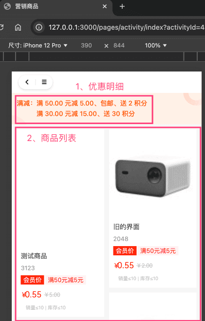

# 【营销】满减送活动

满减送活动，主要由 `yudao-module-promotion` 后端模块的 `reward` 实现，支持减金额、减运费、送积分、送优惠券等等。
## # 1. 表结构
省略 creator/create_time/updater/update_time/deleted/tenant_id 等通用字段
CREATE TABLE `promotion_reward_activity` (
`id` bigint NOT NULL AUTO_INCREMENT COMMENT '活动编号',
`name` varchar(50) CHARACTER SET utf8mb4 COLLATE utf8mb4_general_ci NOT NULL DEFAULT '' COMMENT '活动标题',
`start_time` datetime NOT NULL COMMENT '开始时间',
`end_time` datetime NOT NULL COMMENT '结束时间',
`remark` varchar(255) CHARACTER SET utf8mb4 COLLATE utf8mb4_general_ci DEFAULT '' COMMENT '备注',
`status` tinyint NOT NULL DEFAULT '-1' COMMENT '活动状态',
`product_scope` tinyint NOT NULL COMMENT '商品范围',
`product_scope_values` varchar(1024) CHARACTER SET utf8mb4 COLLATE utf8mb4_general_ci DEFAULT NULL COMMENT '商品范围编号的数组',
`condition_type` tinyint NOT NULL DEFAULT '-1' COMMENT '条件类型',
`rules` varchar(2000) CHARACTER SET utf8mb4 COLLATE utf8mb4_general_ci DEFAULT NULL COMMENT '优惠规则的数组',
PRIMARY KEY (`id`) USING BTREE
) ENGINE=InnoDB AUTO_INCREMENT=5 DEFAULT CHARSET=utf8mb4 COLLATE=utf8mb4_general_ci COMMENT='满减送活动';
① `status` 字段：活动状态，由 CommonStatusEnum 枚举，只有开启、禁用两个状态。禁用时，无法参与满减送活动。
② `product_scope` 字段：商品范围，商品范围，由 PromotionProductScopeEnum 枚举，分成 3 种情况：
- 1、通用券：全部商品
- 2、商品券：指定商品，由 `product_scope_values` 字段指定商品编号的数组
- 3、品类券：指定品类，由 `product_scope_values` 字段指定品类编号的数组
③ `condition_type` 字段：条件类型，由 PromotionConditionTypeEnum 枚举，分成 2 种情况：满 N 元、满 N 件。
`rules` 字段：优惠规则的数组，支持多层级，可配置优惠金额、包邮、赠送积分、优惠劵。
## # 2. 管理后台
对应 [商城系统 -> 营销中心 -> 优惠活动 -> 满减送] 菜单，对应 `yudao-ui-admin-vue3` 项目的 `src/views/mall/promotion/rewardActivity` 目录。如下图所示：
 
## # 3. 移动端
### # 3.1 商品详情
① 在 uni-app 商品列表页，会展示该商品参与的满减送活动的 1 条优惠信息。如下图所示：
 具体的前端逻辑，可见 `yudao-mall-uniapp` 的 `sheep/components/s-goods-column/s-goods-column.vue` 文件，搜 `rewardActivity` 关键字。
② 在 uni-app 商品详情页，会展示该商品参与的满减送活动的至多 3 条优惠信息。点击后，会弹出满减送的所有优惠明细，如下图所示：
 弹窗由 `yudao-mall-uniapp` 的 `sheep/components/s-activity-pop/s-activity-pop.vue` 组件实现。
### # 3.2 活动详情
继续点击上图的满减送活动，会进入活动详情页，并展示参与该活动的商品列表，对应 `yudao-mall-uniapp` 的 `yudao-mall-uniapp/pages/activity/index.vue` 文件。如下图所示：
 
### # 3.3 价格计算
下单时，满减送的价格计算，后端由 TradeRewardActivityPriceCalculator 类实现。效果如下图所示：
 弹窗由 `yudao-mall-uniapp` 的 `/sheep/components/s-discount-list/s-discount-list.vue` 组件实现。
.pageB img{width:80px!important;}
.wwads-horizontal .wwads-text, .wwads-content .wwads-text{line-height:1;}
[【营销】砍价活动](/mall/promotion-bargain/) [【营销】限时折扣](/mall/promotion-discount/) 
←
[【营销】砍价活动](/mall/promotion-bargain/) [【营销】限时折扣](/mall/promotion-discount/)→
 
Theme by
[Vdoing](https://github.com/xugaoyi/vuepress-theme-vdoing) 
| Copyright © 2019-2026
芋道源码 | MIT License   
- 跟随系统
- 浅色模式
- 深色模式
- 阅读模式
× 
.windowRB{ padding: 0;}
.windowRB .wwads-img{margin-top: 10px;}
.windowRB .wwads-content{margin: 0 10px 10px 10px;}
.custom-html-window-rb .close-but{
display: none;
}