# 【交易】分销返佣

分销返佣，是指商城中，用户通过分享商品链接，或者通过分享二维码，帮助商家推广商品，当有用户通过分享的链接或者二维码购买商品时，分享者可以获得一定的佣金。
它可以分成三部分：分销用户、分销记录、分销提现。最终存储表结构如下：
 
## # 1. 分销用户
由 `yudao-module-trade` 后端模块的 `brokerage` 包的 BrokerageUserService 实现。
### # 1.1 表结构
省略 creator/create_time/updater/update_time/deleted/tenant_id 等通用字段
CREATE TABLE `trade_brokerage_user` (
`id` bigint NOT NULL AUTO_INCREMENT COMMENT '用户编号',
`brokerage_enabled` bit(1) NOT NULL DEFAULT b'1' COMMENT '是否成为推广员',
`brokerage_time` datetime DEFAULT NULL COMMENT '成为分销员时间',
`bind_user_id` bigint DEFAULT NULL COMMENT '推广员编号',
`bind_user_time` datetime DEFAULT NULL COMMENT '推广员绑定时间',
`brokerage_price` int NOT NULL DEFAULT '0' COMMENT '可用佣金',
`frozen_price` int NOT NULL DEFAULT '0' COMMENT '冻结佣金',
PRIMARY KEY (`id`) USING BTREE
) ENGINE=InnoDB AUTO_INCREMENT=249 DEFAULT CHARSET=utf8mb4 COLLATE=utf8mb4_unicode_ci COMMENT='分销用户';
① 【自身】`id` 字段：用户编号，对应会员用户（买家）表的 `id` 字段。因为要存储分佣的绑定关系，所以每个用户都会在这个表有个记录。
`brokerage_enabled` 字段：是否成为分销用户。只有为 `true` 的用户才能进行分销。
② 【上级】`bind_user_id` 字段：推广员编号，自己对应的上级，或者说是由哪个用户分销用户推广来的，后续订单佣金算他的。
③ 【佣金】`brokerage_price`、`frozen_price` 字段：可用佣金、冻结佣金。
常见问题？
问题 ①：为什么新用户注册时，并没有自动往 `trade_brokerage_user` 表插入数据？
回答 ①：在“分销模式”为“人人分销”时，新用户首次在 uni-app 打开【分销】中心时，才会往 `trade_brokerage_user` 表插入数据。
### # 1.2 管理后台
对应 [商城系统 -> 订单中心 -> 分销管理 -> 分销用户] 菜单，对应 `yudao-ui-admin-vue3` 项目的 `views/mall/trade/brokerage/user` 目录。如下图所示：
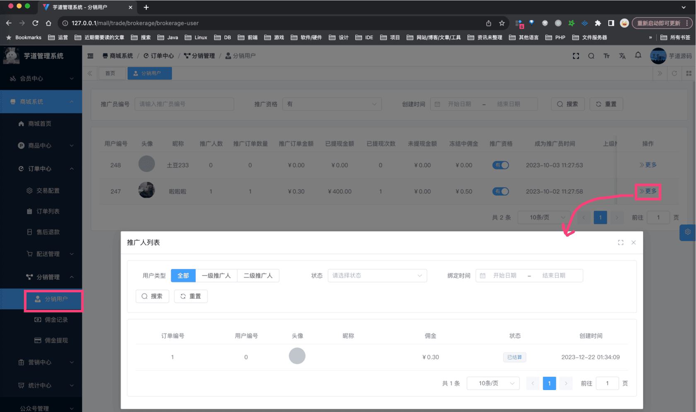 可以查看分销用户的推广人、推广订单，也可以修改它的上级推广人。
### # 1.3 移动端
对应 uni-app [我的 -> 分销中心] 菜单，对应 `yudao-mall-unipp` 项目的 `yudao-mall-uniapp/pages/commission` 目录。如下图所示：
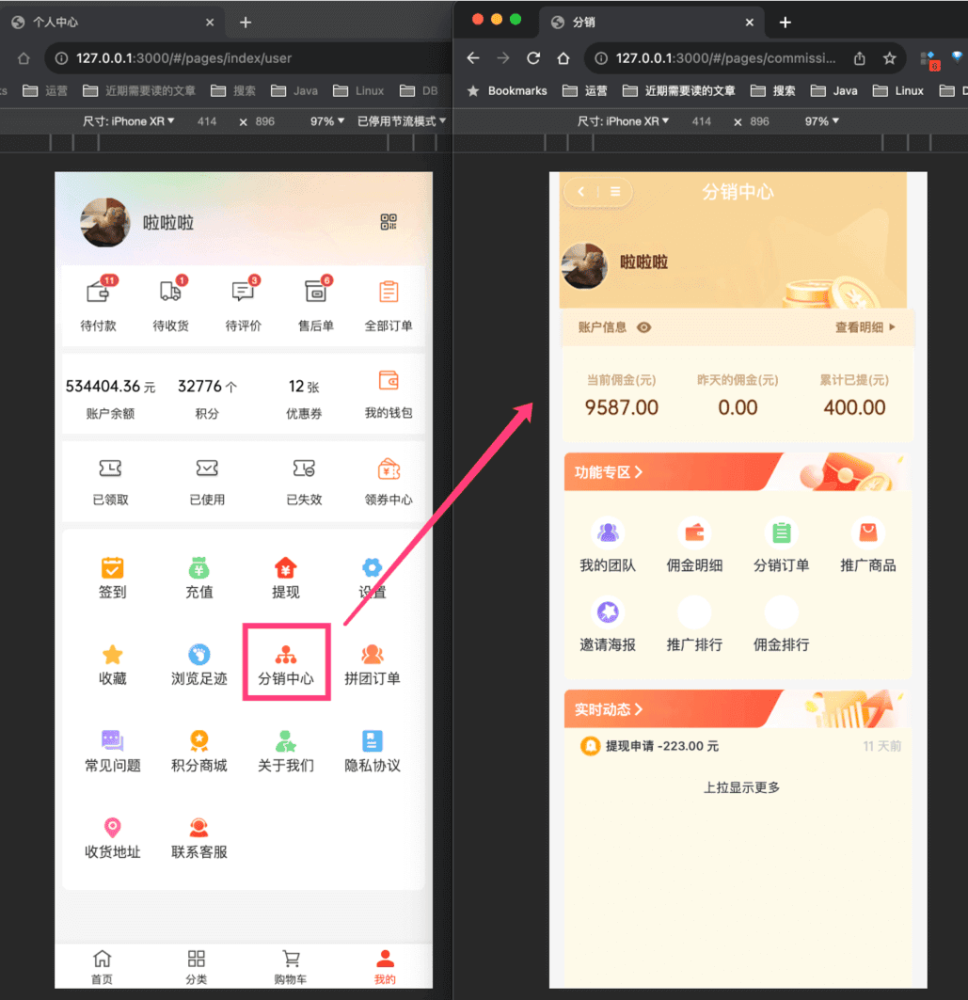 在 [我的团队] 中，可以查看自己的下级分销用户，以及下级分销用户的推广订单，对应 `pages/commission/team.vue` 文件。如下图所示：
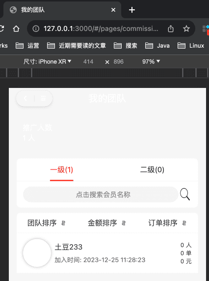 
### # 1.4 怎么成为分销用户？
① 方式一：在“分销模式”为“人人分销”时，新用户通过邀请链接注册，则注册完成后会往 `trade_brokerage_user` 表插入数据，从而成为分销员。
1、老用户，在【分销中心】界面，点击【邀请海报】，复制邀请链接，分享给新用户。如下图所示：
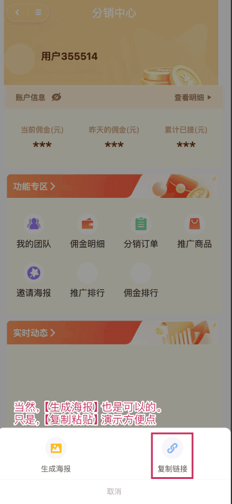 友情提示：
在微信小程序里，可以使用小程序码，具体可以后面看看 [《微信小程序码》](/member/weixin-lite-qrcode/) 文档。
2、新用户，点击该链接，注册新用户。
3、老用户，在【分销中心】界面，点击【我的团队】，可以查看到该新用户。如下图所示：
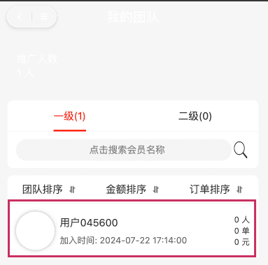 ② 方式二：在“分销模式”为“指定分销”时，并且用户不是通过邀请，而是通过管理员在后台进行新增，会往 `trade_brokerage_user` 表插入数据，从而成为分销员。如下图所示：
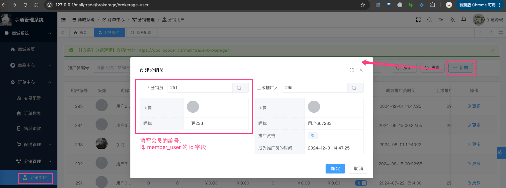 
## # 2. 分销记录
由 `yudao-module-trade` 后端模块的 `brokerage` 包的 BrokerageRecordService 实现。
### # 2.1 表结构
省略 creator/create_time/updater/update_time/deleted/tenant_id 等通用字段
CREATE TABLE `trade_brokerage_record` (
`id` int NOT NULL AUTO_INCREMENT COMMENT '编号',
`user_id` bigint NOT NULL COMMENT '用户编号',
`source_user_id` bigint NOT NULL DEFAULT '0' COMMENT '来源用户编号',
`source_user_level` int NOT NULL DEFAULT '0' COMMENT '来源用户等级',
`biz_id` varchar(64) CHARACTER SET utf8mb4 COLLATE utf8mb4_unicode_ci NOT NULL DEFAULT '' COMMENT '业务编号',
`biz_type` tinyint NOT NULL DEFAULT '0' COMMENT '业务类型：1-订单，2-提现',
`title` varchar(64) CHARACTER SET utf8mb4 COLLATE utf8mb4_unicode_ci NOT NULL DEFAULT '' COMMENT '标题',
`description` varchar(500) CHARACTER SET utf8mb4 COLLATE utf8mb4_unicode_ci NOT NULL DEFAULT '' COMMENT '说明',
`price` int NOT NULL DEFAULT '0' COMMENT '金额',
`total_price` int NOT NULL DEFAULT '0' COMMENT '当前总佣金',
`status` tinyint NOT NULL DEFAULT '0' COMMENT '状态：0-待结算，1-已结算，2-已取消',
`frozen_days` int NOT NULL DEFAULT '0' COMMENT '冻结时间（天）',
`unfreeze_time` datetime DEFAULT NULL COMMENT '解冻时间',
PRIMARY KEY (`id`) USING BTREE,
KEY `idx_user_id` (`user_id`) USING BTREE COMMENT '用户编号',
KEY `idx_biz` (`biz_type`,`biz_id`) USING BTREE COMMENT '业务',
KEY `idx_status` (`status`) USING BTREE COMMENT '状态'
) ENGINE=InnoDB AUTO_INCREMENT=8 DEFAULT CHARSET=utf8mb4 COLLATE=utf8mb4_unicode_ci COMMENT='佣金记录';
① `id` 字段：编号，自增主键。目前佣金每次发生变化时，都会生成一条记录，例如说订单分佣、佣金提现等等。
② 【分销关系】`user_id` 字段：用户编号，对应分销用户表的 `id` 字段。
`source_user_id` 字段：来源用户编号，例如说，订单分佣时，就是订单的买家编号。`source_user_level` 字段：来源用户等级，例如说，一级分佣、二级分佣。如下图所示：
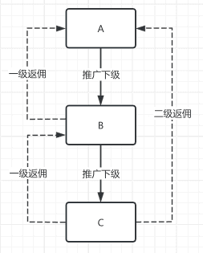 
- 上下级关系：A 推广 B，B 推广了 C
- A 购买商品：自己没有返佣
- B 购买商品：A 获得一级返佣
- C 购买商品：B 获得一级返佣，A 获得二级返佣
③ 【业务】`biz_id`、`biz_type` 字段：业务编号、业务类型（由 BrokerageRecordBizTypeEnum 枚举）。`title`、`description` 字段：标题、说明，主要用于展示。
例如说，订单分佣时，`biz_type` 为 1，`biz_id` 为订单编号。具体 TradeBrokerageOrderHandler 处理器，订单被支付时，会生成分佣记录。
疑问：B 已经是 A 的下级了，为什么下单支付后，没有分销记录？
有一种可能性，计算的分佣金额为 0，所以没有生成分销记录。例如说：[https://t.zsxq.com/e4aSR (opens new window)](https://t.zsxq.com/e4aSR)
④ 【佣金】`price`、`total_price` 字段：分佣金额、当前总佣金。每个商品的佣金，可以全局设置，也可以自定设置，如下图所示：
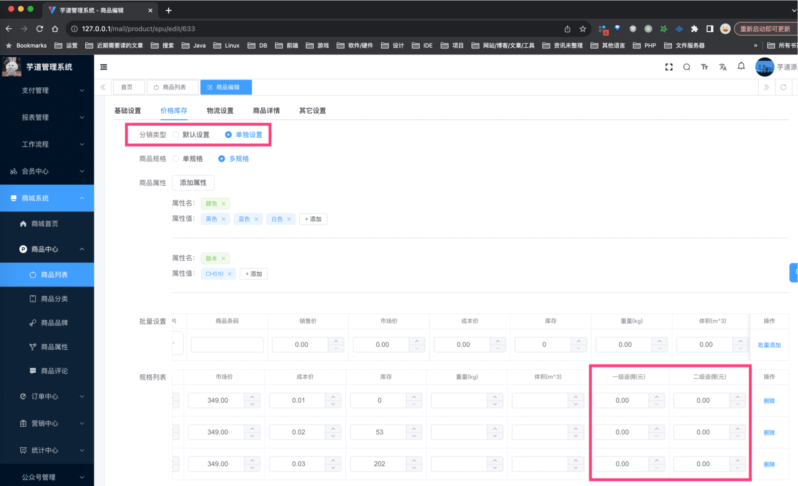 友情提示：分销商品，后续会从商品管理中解耦出来，单独管理，单独表存储。
⑤ 【状态】`status` 字段：状态，由 BrokerageRecordStatusEnum 枚举，目前就待结算（冻结）、已结算（生效）、已取消（失效）三种状态。
`frozen_days` 字段：冻结时间（天），例如说，订单分佣时，可以设置冻结时间，冻结时间内，佣金不可提现。解冻通过 BrokerageRecordUnfreezeJob 定时任务实现。
### # 2.2 管理后台
对应 [商城系统 -> 订单中心 -> 分销管理 -> 佣金记录] 菜单，对应 `yudao-ui-admin-vue3` 项目的 `views/mall/trade/brokerage/recrod` 目录。如下图所示：
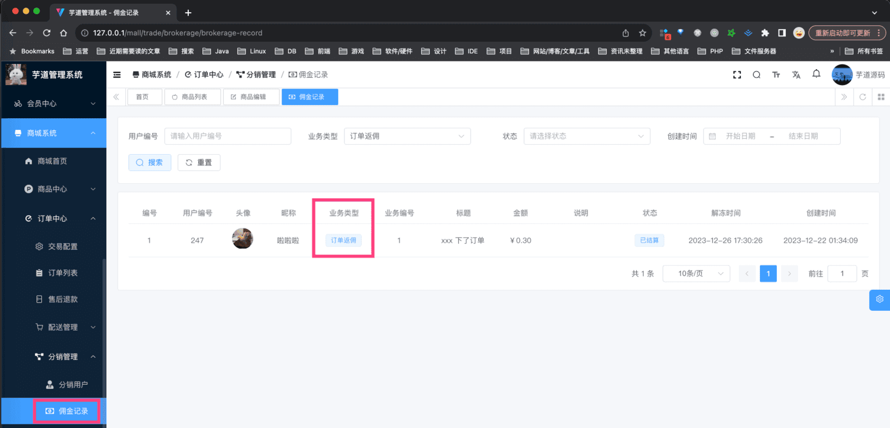 
### # 2.3 移动端
在 [分销订单] 中，可以查看自己的分销订单，对应 `pages/commission/order.vue` 文件。如下图所示：
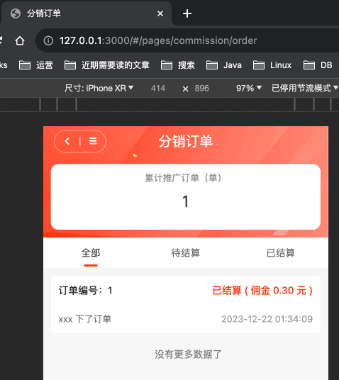 
## # 3. 分销提现
由 `yudao-module-trade` 后端模块的 `brokerage` 包的 BrokerageWithdrawService 实现。
### # 3.1 表结构
CREATE TABLE `trade_brokerage_withdraw` (
`id` bigint NOT NULL AUTO_INCREMENT COMMENT '编号',
`user_id` bigint NOT NULL COMMENT '用户编号',
`price` int NOT NULL DEFAULT '0' COMMENT '提现金额',
`fee_price` int NOT NULL DEFAULT '0' COMMENT '提现手续费',
`total_price` int NOT NULL DEFAULT '0' COMMENT '当前总佣金',
`type` tinyint NOT NULL DEFAULT '0' COMMENT '提现类型：1-钱包；2-银行卡；3-微信；4-支付宝',
`user_account` varchar(64) CHARACTER SET utf8mb4 COLLATE utf8mb4_unicode_ci DEFAULT NULL COMMENT '账号',
`account_no` varchar(64) CHARACTER SET utf8mb4 COLLATE utf8mb4_unicode_ci DEFAULT NULL COMMENT '账号',
`bank_name` varchar(100) CHARACTER SET utf8mb4 COLLATE utf8mb4_unicode_ci DEFAULT NULL COMMENT '银行名称',
`bank_address` varchar(200) CHARACTER SET utf8mb4 COLLATE utf8mb4_unicode_ci DEFAULT NULL COMMENT '开户地址',
`qr_code_url` varchar(512) CHARACTER SET utf8mb4 COLLATE utf8mb4_unicode_ci DEFAULT NULL COMMENT '收款码',
`status` tinyint NOT NULL DEFAULT '0' COMMENT '状态：0-审核中，10-审核通过 20-审核不通过；11 - 提现成功；21-提现失败',
`audit_reason` varchar(128) CHARACTER SET utf8mb4 COLLATE utf8mb4_unicode_ci DEFAULT NULL COMMENT '审核驳回原因',
`audit_time` datetime DEFAULT NULL COMMENT '审核时间',
`pay_transfer_id` bigint DEFAULT NULL COMMENT '转账订单编号',
`transfer_channel_code` varchar(16) CHARACTER SET utf8mb4 COLLATE utf8mb4_unicode_ci DEFAULT NULL COMMENT '转账渠道',
`transfer_time` datetime DEFAULT NULL COMMENT '转账支付时间',
`transfer_error_msg` varchar(4096) CHARACTER SET utf8mb4 COLLATE utf8mb4_bin DEFAULT '' COMMENT '转账错误提示',
PRIMARY KEY (`id`) USING BTREE,
KEY `idx_user_id` (`user_id`) USING BTREE COMMENT '用户编号',
KEY `idx_audit_status` (`status`) USING BTREE COMMENT '状态'
) ENGINE=InnoDB AUTO_INCREMENT=11 DEFAULT CHARSET=utf8mb4 COLLATE=utf8mb4_unicode_ci COMMENT='佣金提现';
字段虽然比较多，但是都比较简单，就不一一介绍了，只挑选部分重点的。
① `type` 字段，提现类型，由 BrokerageWithdrawTypeEnum 枚举，目前分成两类：
- 手动打款：银行卡、微信收款码、支付宝收款码
- 自动打款：钱包、支付宝余额、微信零钱
疑问：什么是自动打款？
对接 pay 支付中心，通过 API 调用对应支付渠道（平台），实现转账的功能。
- [《支付手册 —— 支付宝转账接入》](/pay/alipay-transfer-demo)
- [《支付手册 —— 微信转账接入》](/pay/wx-transfer-demo)
具体需要填写哪些字段，可见 AppBrokerageWithdrawCreateReqVO 类的注释。
② `status` 字段，提现状态，由 BrokerageWithdrawStatusEnum 枚举，可以分成三个阶段：分佣用户申请、管理员审核（通过、不通过）、管理员打款（成功、失败）。
疑问：为什么提现成功、失败是“预留”？
由于【支付中心】的“转账”功能还没开发完成，所以暂时不支持线上的该操作，仅仅预留，你可以先自己实现~
- 手动打款：审核中 -> 提现成功 or 审核不通过
- 自动打款：审核中 -> 审核通过 -> 提现成功 or 提现失败
③ `pay_transfer_id`、`transfer_channel_code`、`transfer_time`、`transfer_error_msg` 字段：只有“自动打款”情况下，对接【支付中心】才会有。
### # 3.2 管理后台
对应 [商城系统 -> 订单中心 -> 分销管理 -> 佣金提现] 菜单，对应 `yudao-ui-admin-vue3` 项目的 `views/mall/trade/brokerage/withdraw` 目录。如下图所示：
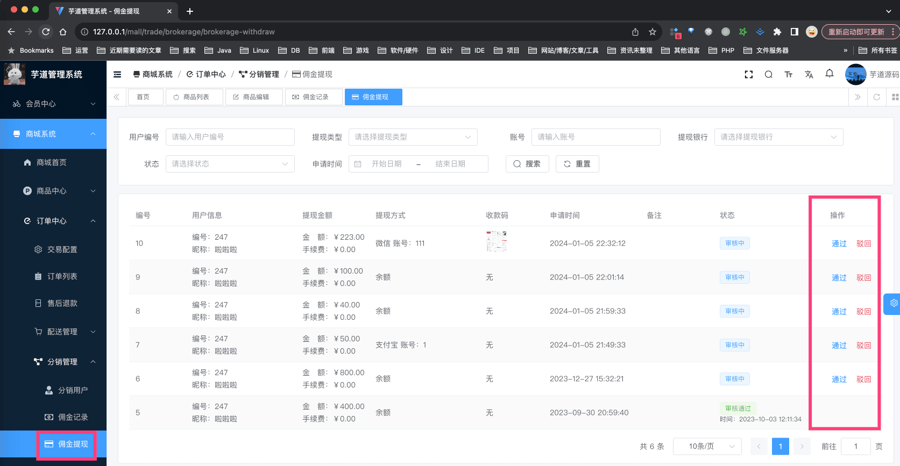 
### # 3.2 移动端
① 在 [佣金明细] 中，可以查看自己的提现记录，对应 `pages/commission/wallet.vue` 文件。如下图所示：
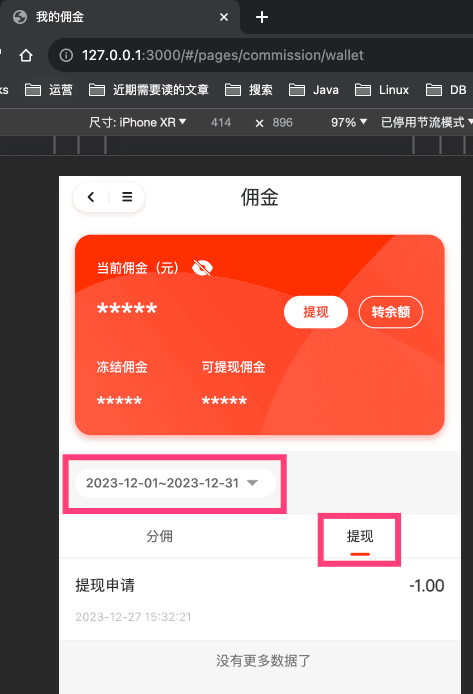 ② 点击「提现」按钮，可以申请提现，对应 `pages/commission/withdraw.vue` 文件。如下图所示：
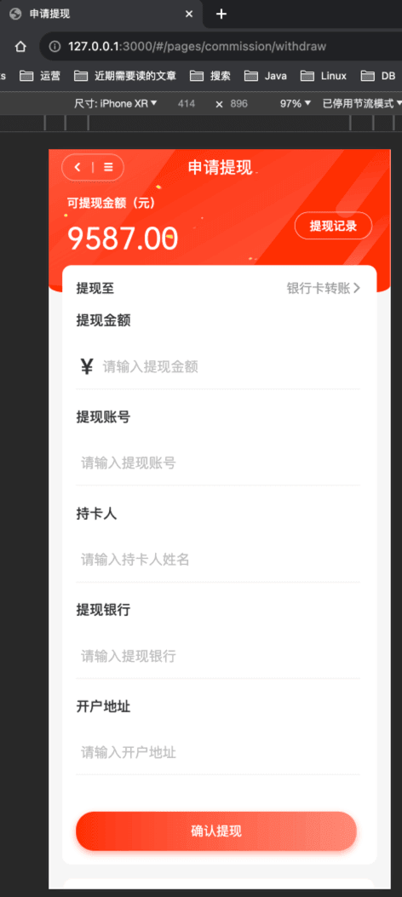 
## # 4. 分佣配置
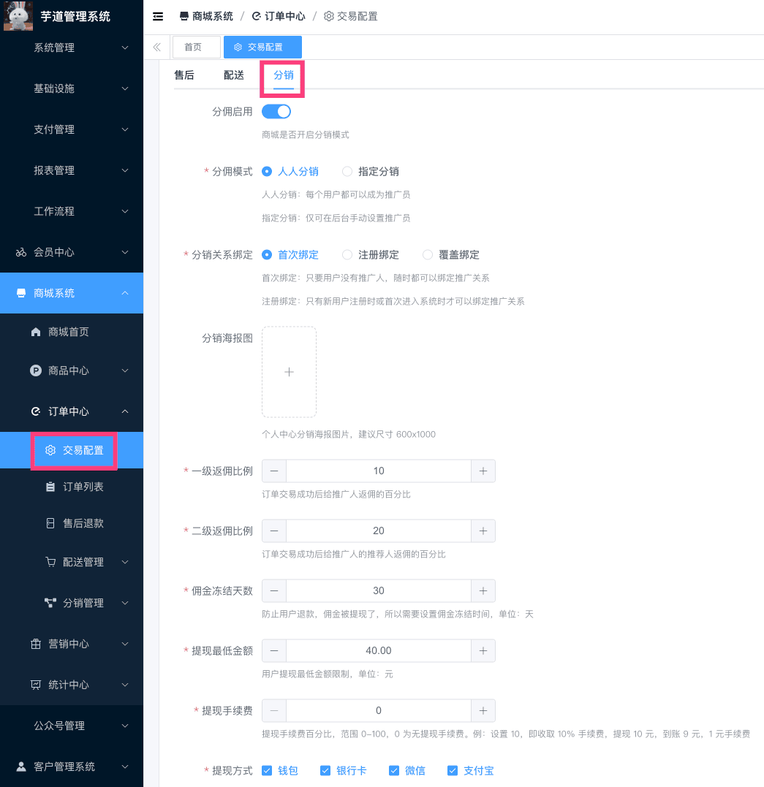 
- SQL 对应 `trade_config` 表的 `brokerage_` 开头的字段。
- 前端对应 `yudao-ui-admin-vue3` 项目的 `views/mall/trade/config/index.vue` 目录
- 后端对应 `yudao-module-trade` 项目的 TradeConfigController 类
.pageB img{width:80px!important;}
.wwads-horizontal .wwads-text, .wwads-content .wwads-text{line-height:1;}
[【交易】门店自提](/mall/trade-delivery-pickup/) [【营销】优惠劵](/mall/promotion-coupon/) 
←
[【交易】门店自提](/mall/trade-delivery-pickup/) [【营销】优惠劵](/mall/promotion-coupon/)→
 
Theme by
[Vdoing](https://github.com/xugaoyi/vuepress-theme-vdoing) 
| Copyright © 2019-2026
芋道源码 | MIT License   
- 跟随系统
- 浅色模式
- 深色模式
- 阅读模式
× 
.windowRB{ padding: 0;}
.windowRB .wwads-img{margin-top: 10px;}
.windowRB .wwads-content{margin: 0 10px 10px 10px;}
.custom-html-window-rb .close-but{
display: none;
}