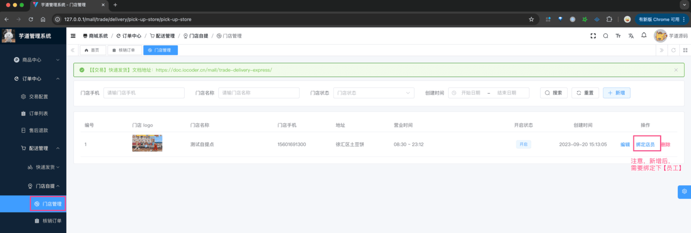
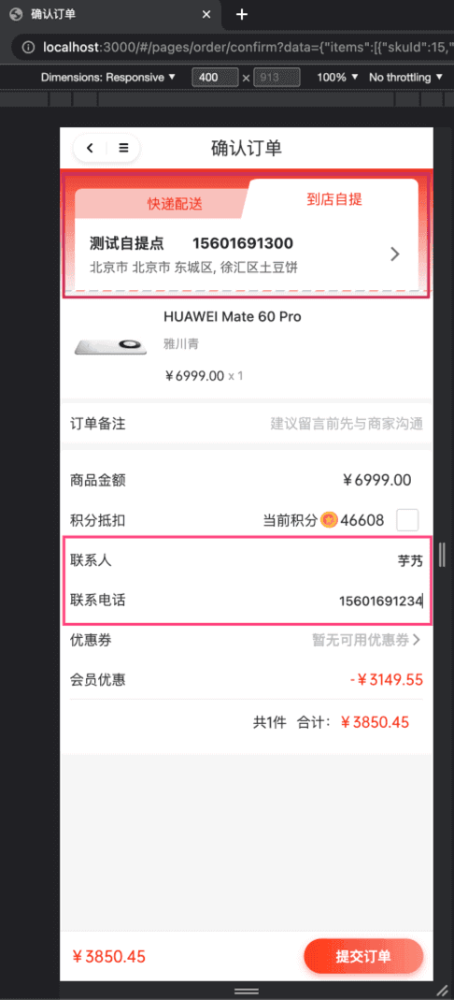
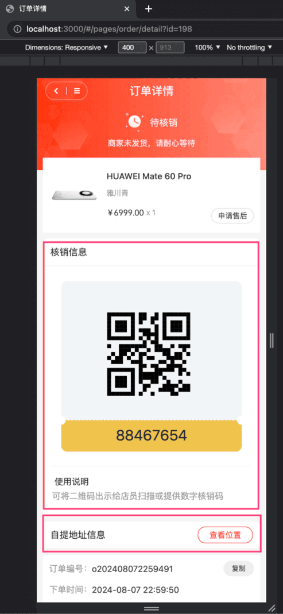
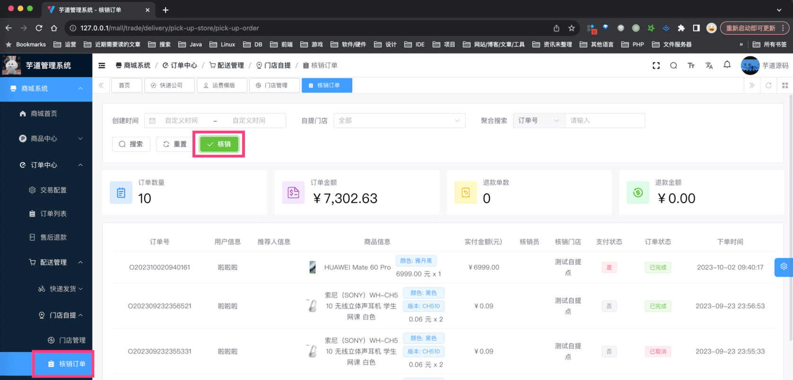
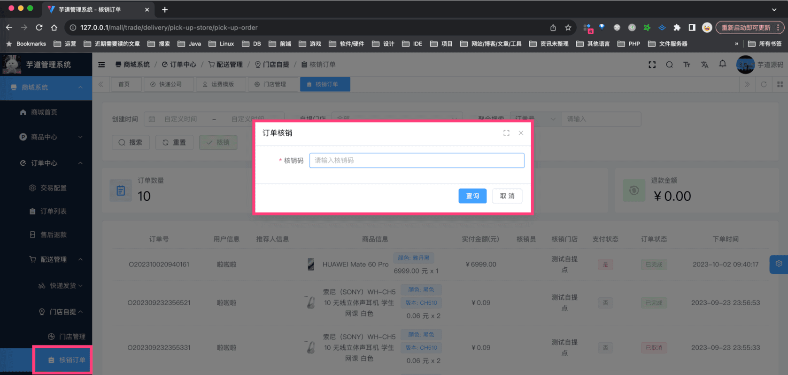
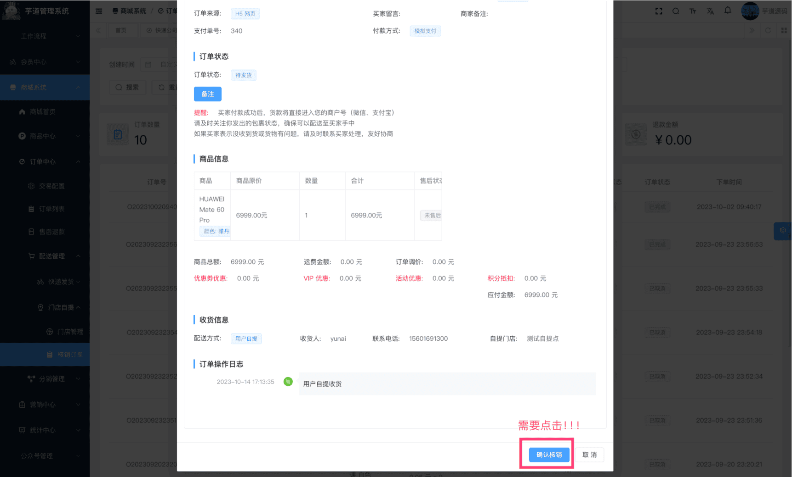
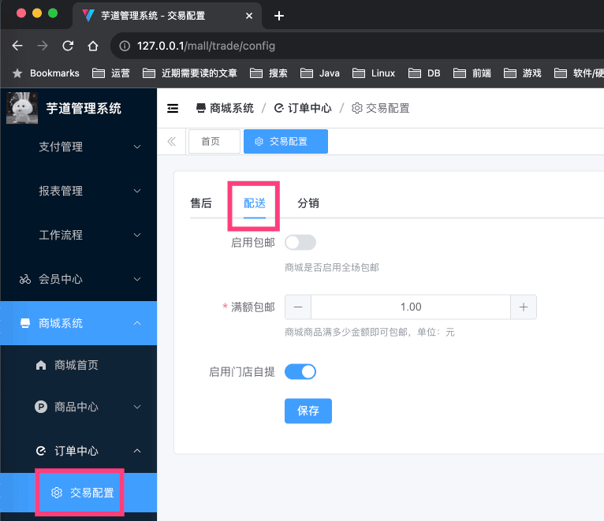

# 【交易】门店自提

门店自提，是指用户在下单时，选择自提，然后到指定的门店进行自提（核销）。
## # 1. 门店信息
门店自提时，需要使用门店信息，由 `yudao-module-trade` 后端模块的 `delivery` 包的 DeliveryPickUpStoreService 实现。
### # 1.1 表结构
省略 creator/create_time/updater/update_time/deleted/tenant_id 等通用字段
CREATE TABLE `trade_delivery_pick_up_store` (
`id` bigint NOT NULL AUTO_INCREMENT COMMENT '编号',
`name` varchar(64) CHARACTER SET utf8mb4 COLLATE utf8mb4_unicode_ci NOT NULL COMMENT '门店名称',
`introduction` varchar(256) CHARACTER SET utf8mb4 COLLATE utf8mb4_unicode_ci DEFAULT NULL COMMENT '门店简介',
`phone` varchar(16) CHARACTER SET utf8mb4 COLLATE utf8mb4_unicode_ci NOT NULL COMMENT '门店手机',
`area_id` int NOT NULL COMMENT '区域编号',
`detail_address` varchar(256) CHARACTER SET utf8mb4 COLLATE utf8mb4_unicode_ci NOT NULL COMMENT '门店详细地址',
`logo` varchar(256) CHARACTER SET utf8mb4 COLLATE utf8mb4_unicode_ci NOT NULL COMMENT '门店 logo',
`opening_time` time NOT NULL COMMENT '营业开始时间',
`closing_time` time NOT NULL COMMENT '营业结束时间',
`latitude` double NOT NULL COMMENT '纬度',
`longitude` double NOT NULL COMMENT '经度',
`status` tinyint NOT NULL DEFAULT '0' COMMENT '门店状态',
`verify_user_ids` varchar(256) CHARACTER SET utf8mb4 COLLATE utf8mb4_unicode_ci DEFAULT NULL COMMENT '核销用户编号数组',
PRIMARY KEY (`id`) USING BTREE
) ENGINE=InnoDB AUTO_INCREMENT=2 DEFAULT CHARSET=utf8mb4 COLLATE=utf8mb4_unicode_ci COMMENT='自提门店';
主要是，存储下门店的基本信息。
比较重要特殊的字段，是 `verify_user_ids` 字段，存储该门店可核销的管理员用户编号数组，关联的是 `system_admin_users` 的 `id` 字段。就是说，下单在该门店的订单，只有这些管理员才能核销。
### # 1.2 管理后台
对应 [商城系统 -> 订单中心 -> 配送管理 -> 门店自提 -> 门店管理] 菜单，对应 `yudao-ui-admin-vue3` 项目的 `views/mall/trade/delivery/express` 目录。如下图所示：
 
## # 2. 自提流程
### # 2.1 下单【买家】
① 买家在 uni-app 订单结算页时，选择自提，然后选择自提门店。如下图所示：
 注意：商品的配送方式需要支持自提，才会显示自提的选项！！！如果没设置，去“商品管理”里，编辑下相关的商品。
② 下单并支付完成后，买家在 uni-app 订单详情页时，可以看到自提门店的信息，也包括核销码、核销二维码。如下图所示：
 
### # 2.2 核销【卖家】
① 核销订单列表，对应 [商城系统 -> 订单中心 -> 配送管理 -> 门店自提 -> 核销订单] 菜单，对应 `yudao-ui-admin-vue3` 项目的 `views/mall/trade/delivery/pickUpOrder` 目录。如下图所示：
 注意！只展示当前登录的管理员用户可核销的订单。关注下“自提门店”这个筛选项！！！
② 点击「核销」按钮，输入核销码，查询核销订单的信息。如下图所示：
 后端对应 AppTradeOrderController 的 `#getByPickUpVerifyCode(...)` 提供的“查询核销码对应的订单”接口，基于 `trade_order` 表的 `pick_up_verify_code` 字段查询。
③ 点击「确认核销」按钮后，即可核销成功。如下图所示：
 后端对应 AppTradeOrderController 的 `#pickUpOrderByVerifyCode(...)` 提供的“订单核销”接口。
## # 3. 配送配置
 
- SQL 对应 `trade_config` 表的 `delivery_` 开头的字段。
- 前端对应 `yudao-ui-admin-vue3` 项目的 `views/mall/trade/config/index.vue` 目录
- 后端对应 `yudao-module-trade` 项目的 TradeConfigController 类
.pageB img{width:80px!important;}
.wwads-horizontal .wwads-text, .wwads-content .wwads-text{line-height:1;}
[【交易】快递发货](/mall/trade-delivery-express/) [【交易】分销返佣](/mall/trade-brokerage/) 
←
[【交易】快递发货](/mall/trade-delivery-express/) [【交易】分销返佣](/mall/trade-brokerage/)→
 
Theme by
[Vdoing](https://github.com/xugaoyi/vuepress-theme-vdoing) 
| Copyright © 2019-2026
芋道源码 | MIT License   
- 跟随系统
- 浅色模式
- 深色模式
- 阅读模式
× 
.windowRB{ padding: 0;}
.windowRB .wwads-img{margin-top: 10px;}
.windowRB .wwads-content{margin: 0 10px 10px 10px;}
.custom-html-window-rb .close-but{
display: none;
}