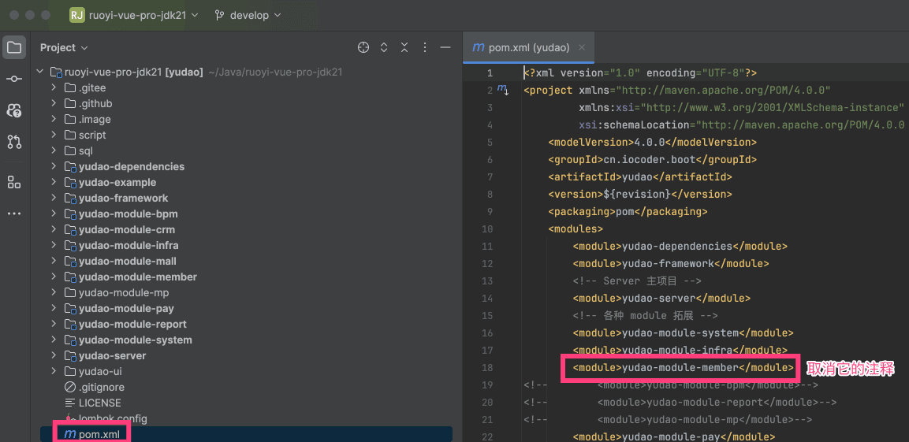
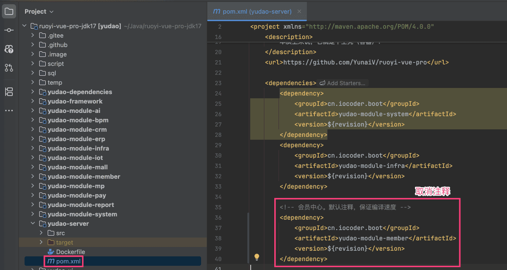
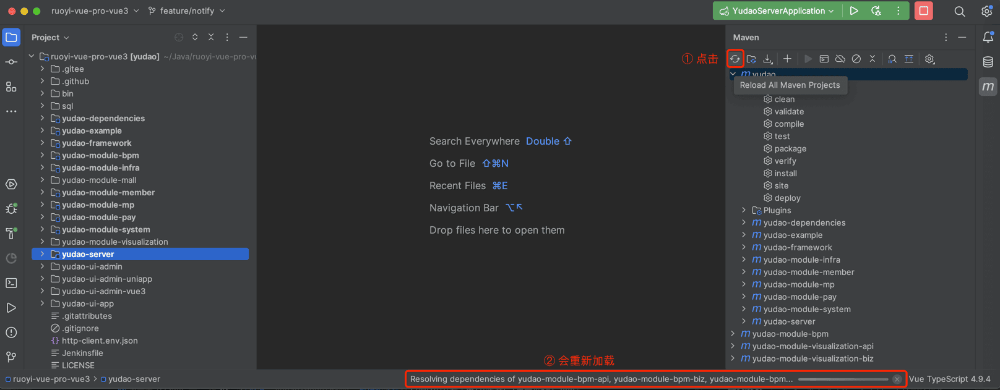
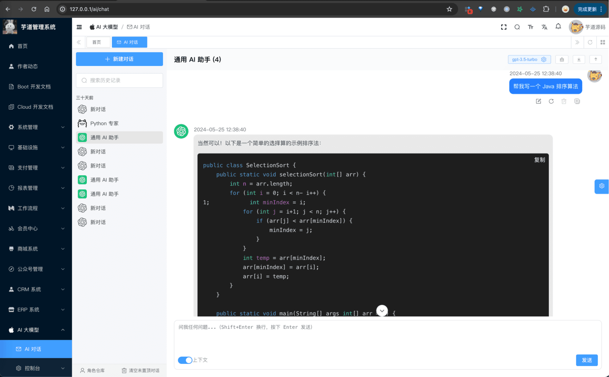

# 功能开启

## # 1. 概述
会员中心，围绕“会员”建设，包括会员用户、VIP 等级、经验、积分、签到等一系列的功能。
疑问：什么是会员？
对于管理系统来说，管理员是它的用户，也就是项目中的 `system_users` 表
而对于商城、论坛、博客等前台系统来说，会员是它的用户，也就是会员中心的 `member_user` 表。
## # 2. 后端启动
考虑到编译速度，默认 `yudao-module-member` 模块是关闭的，需要手动开启。步骤如下：
- 第一步，开启 `yudao-module-member` 模块
- 第二步，导入会员的 SQL 数据库脚本
- 第三步，重启后端项目，确认功能是否生效
### # 2.1 开启模块
① 修改根目录的 [`pom.xml`](https://github.com/YunaiV/ruoyi-vue-pro/blob/master/pom.xml) 文件，取消 `yudao-module-member` 模块的注释。如下图所示：
 ② 修改 `yudao-server` 目录的 [`pom.xml`](https://github.com/YunaiV/ruoyi-vue-pro/blob/master/yudao-server/pom.xml) 文件，引入 `yudao-module-member` 模块。如下图所示：
 ③ 点击 IDEA 右上角的【Reload All Maven Projects】，刷新 Maven 依赖。如下图所示：
 
### # 2.2 第二步，导入 SQL
点击 [`member-2024-01-18.sql.zip`](https://t.zsxq.com/16XkmImMO) 下载附件，解压出 SQL 文件，然后导入到数据库中。
友情提示：↑↑↑ member.sql 是可以点击下载的！ ↑↑↑
重要说明：该 SQL 仅芋道星球成员可使用和商用，否则视为侵权（索赔 100 万，永久追溯）【下载即视为同意】。
### # 2.3 第三步，重启项目
重启后端项目，然后访问前端的会员菜单，确认功能是否生效。如下图所示：
 至此，我们就成功开启了会员中心的功能 🙂
## # 3. 前端（商城）启动
可阅读 [《商城 - 功能开启》](/mall/build/) 文档，目前商城 uni-app 接入会员中心进行购物。
.pageB img{width:80px!important;}
.wwads-horizontal .wwads-text, .wwads-content .wwads-text{line-height:1;}
[模拟支付、退款](/pay/mock/) [微信公众号登录](/member/weixin-mp-login/) 
←
[模拟支付、退款](/pay/mock/) [微信公众号登录](/member/weixin-mp-login/)→
 
Theme by
[Vdoing](https://github.com/xugaoyi/vuepress-theme-vdoing) 
| Copyright © 2019-2026
芋道源码 | MIT License   
- 跟随系统
- 浅色模式
- 深色模式
- 阅读模式
× 
.windowRB{ padding: 0;}
.windowRB .wwads-img{margin-top: 10px;}
.windowRB .wwads-content{margin: 0 10px 10px 10px;}
.custom-html-window-rb .close-but{
display: none;
}