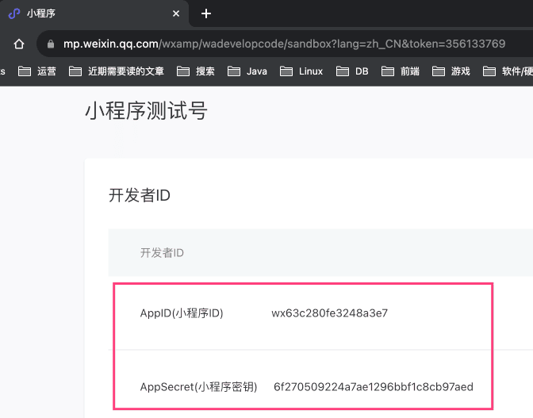
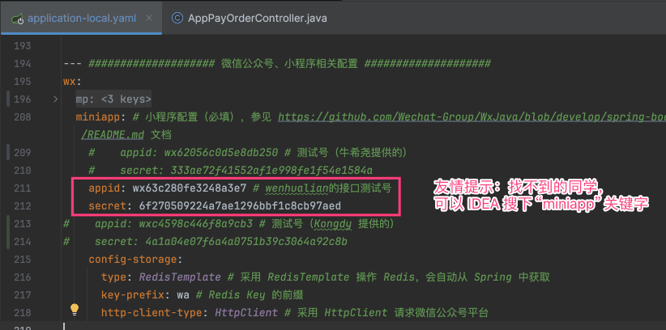
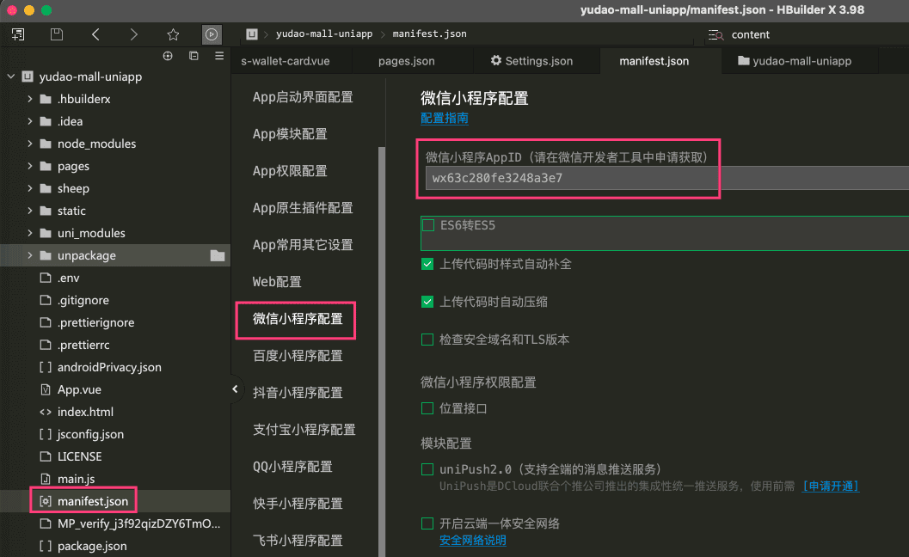
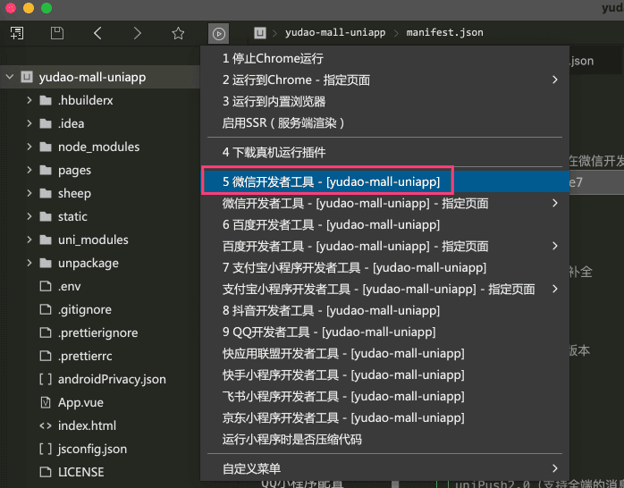
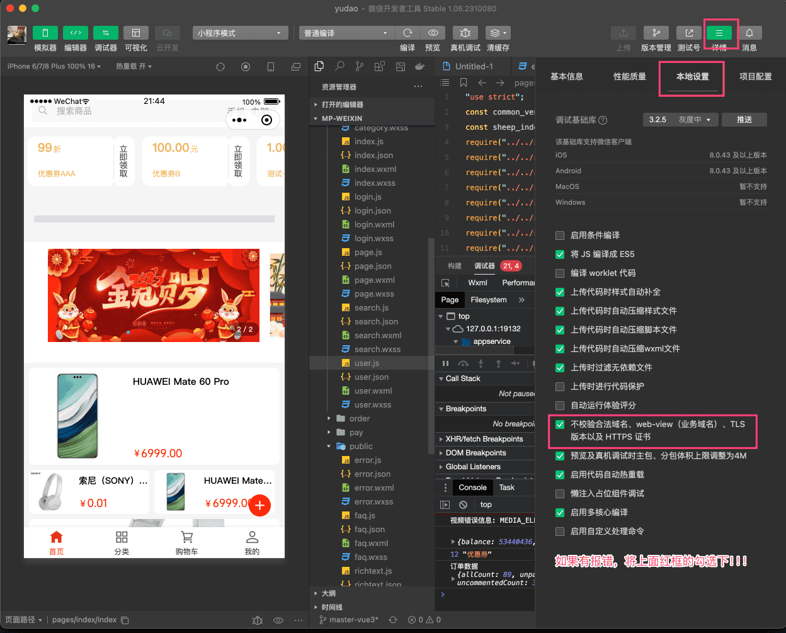
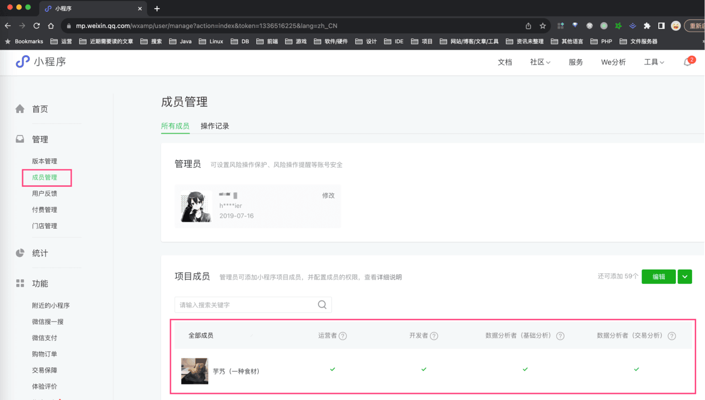
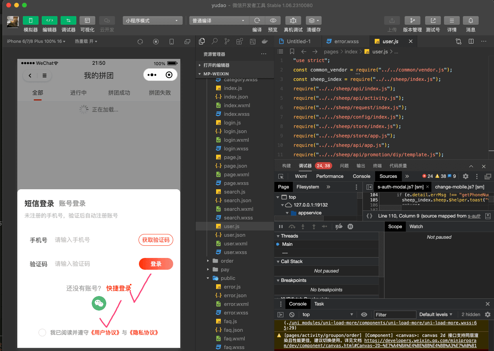
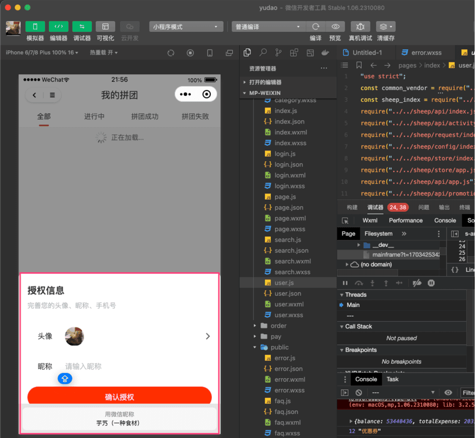

# 微信小程序登录

前置阅读文章：
- [《用户体系》](/user-center/)
- [《三方登录》](/social-user/)
本文是 [《三方登录》](/social-user/) 的延伸，讲解 [`yudao-mall-uniapp`](https://github.com/yudaocode/yudao-mall-uniapp) 商城小程序如何实现微信 **小程序** 登录的功能。
## # 1. 小程序准备
友情提示：
本文，我们以“测试小程序”举例子，方便大家操作，认证一个小程序太难了！！！
① 参考 [微信小程序测试号申请](https://developers.weixin.qq.com/miniprogram/dev/devtools/sandbox.html) 链接，申请一个测试小程序。
② 将 `AppID` 和 `AppSecret` 配置，设置到后端项目 `application-local.yaml` 的 `wx.miniapp` 配置项中。如下图所示：
  ③ 使用 HBuilder 打开 `yudao-mall-uniapp` 项目根目录的 `manifest.json` 文件，将微信小程序配置的 AppID 改成你自己的。如下图所示：
 
## # 2. 代码实现
### # 2.1 项目启动
① 下载 [微信开发者工具](https://developers.weixin.qq.com/miniprogram/dev/devtools/download.html)，并进行安装。
② 参考 [《快速启动【前端】》](/quick-start-front/) 文档的「2. uni-app 商城移动端」小节，将 `yudao-mall-uniapp` 商城项目跑起来。
不过要注意，HBuilder 运行时，选择「微信开发者工具」。如下图所示：
 ③ 运行成功后，可以在微信开发者工具中，看到如下界面：
 如果请求报错，注意勾选下“不校验合法域名、web-view（业务域名）”选项。
补充说明：如果你是正式的小程序，需要额外看下这部分的内容：
① 在小程序的 [管理 -> 成员管理] 菜单，添加自己微信号为开发者。如下图所示：
 否则，使用 HBuilder 运行时，会报“[微信小程序开发者工具] [error] Error: Fail to open IDE”！
### # 2.2 登录流程
① 点击「我的」菜单，再随便点个子菜单，例如说“拼团订单”，触发弹出“登录窗口”，对应前端 `sheep/components/s-auth-modal/s-auth-modal.vue` 组件。如下图所示：
 有两种登录方式：[微信小程序登录](https://developers.weixin.qq.com/miniprogram/dev/framework/open-ability/login.html)、[手机快速验证登录](https://developers.weixin.qq.com/miniprogram/dev/framework/open-ability/getPhoneNumber.html)
② 方式一：【微信小程序登录】点击「微信登录」图标，触发微信小程序登录。前端核心实现都在 `sheep/platform/provider/wechat/miniProgram.js` 的 `#login(...)` 方法中。
此时，前端调用微信小程序获得“临时” `code` 授权码参数，之后调用后端的 AppAuthController 的 `#socialLogin(...)` 方法，进行登录逻辑。注意：
- 情况一：如果该微信用户已经绑定会员用户，则直接进行登录
- 情况二：如果该微信用户没有绑定会员用户，则会自动创建一个会员用户，并进行登录。下次重新登录时，就走【情况一】的逻辑。
之后，会弹出“授权信息”窗口，对应 `sheep/components/s-auth-modal/components/mp-authorization.vue` 组件。如下图所示：
 
- 注意：该弹窗仅仅用于微信小程序的昵称、头像的获取，用户实际已经登录成功了。
③ 方式二：【手机快速验证登录】点击「快捷登录」按钮，触发一键登录。前端核心实现都在 `sheep/platform/provider/wechat/miniProgram.js` 的 `#mobileLogin(...)` 方法中。
此时，前端调用用微信小程序获得“临时” `code` 授权参数 + “手机” `code` 授权参数，之后调用后端的 AppAuthController 的 `#weixinMiniAppLogin(...)` 方法，进行登录逻辑。注意：
- 情况一：如果该手机已经注册用户，则直接进行登录
- 情况二：如果该手机没有注册用户，则会自动创建一个会员用户，并进行登录。下次重新登录时，就走【情况一】的逻辑。
为什么此时要获得“临时” `code` 授权参数呢？主要想把微信小程序的 `openid` 和用户绑定起来，毕竟方式二【手机快速验证登录】是需要收费的！！！
.pageB img{width:80px!important;}
.wwads-horizontal .wwads-text, .wwads-content .wwads-text{line-height:1;}
[微信公众号登录](/member/weixin-mp-login/) [微信小程序订阅消息](/member/weixin-lite-subscribe-message/) 
←
[微信公众号登录](/member/weixin-mp-login/) [微信小程序订阅消息](/member/weixin-lite-subscribe-message/)→
 
Theme by
[Vdoing](https://github.com/xugaoyi/vuepress-theme-vdoing) 
| Copyright © 2019-2026
芋道源码 | MIT License   
- 跟随系统
- 浅色模式
- 深色模式
- 阅读模式
× 
.windowRB{ padding: 0;}
.windowRB .wwads-img{margin-top: 10px;}
.windowRB .wwads-content{margin: 0 10px 10px 10px;}
.custom-html-window-rb .close-but{
display: none;
}