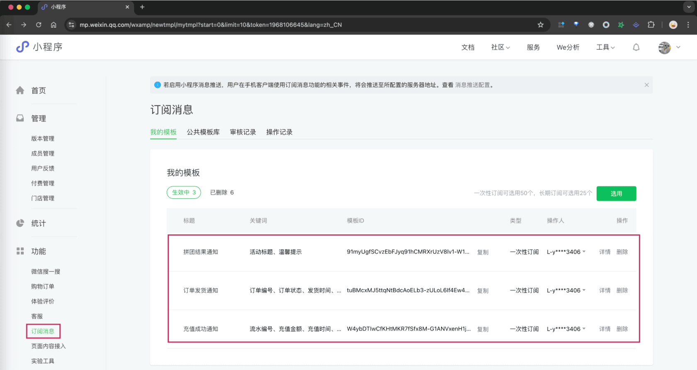
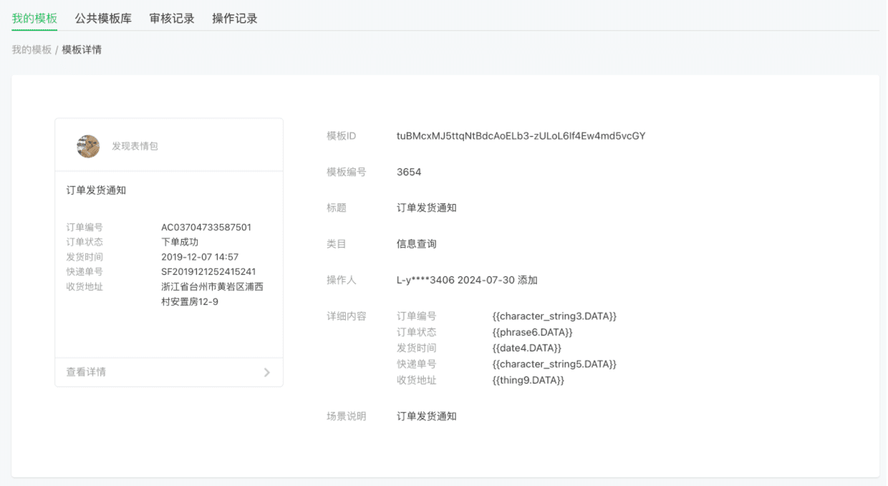
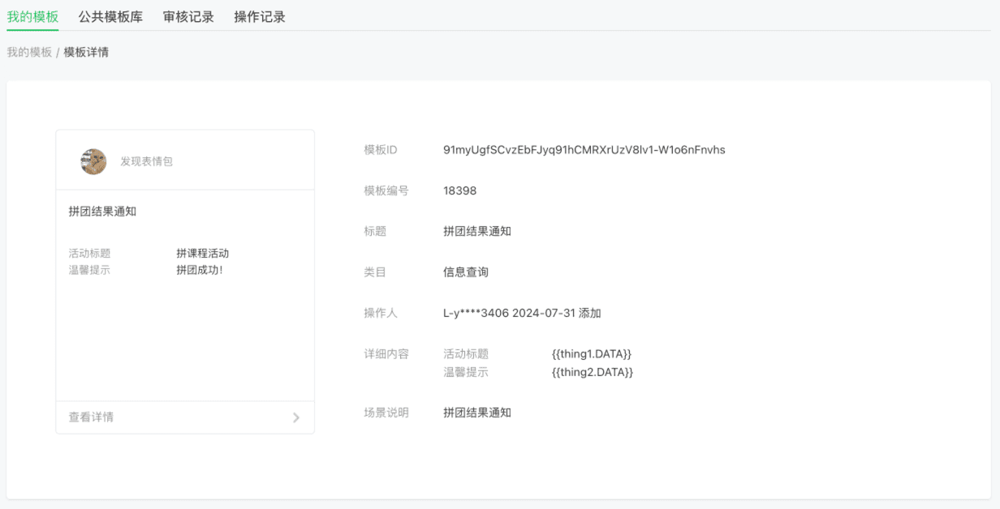
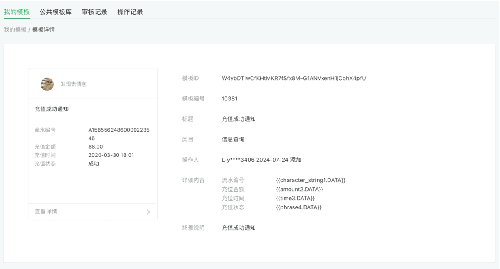
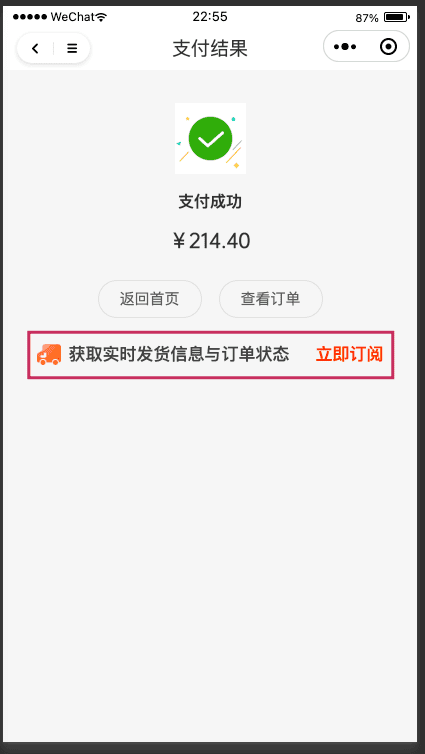
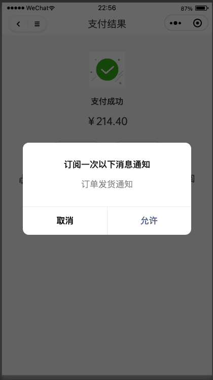
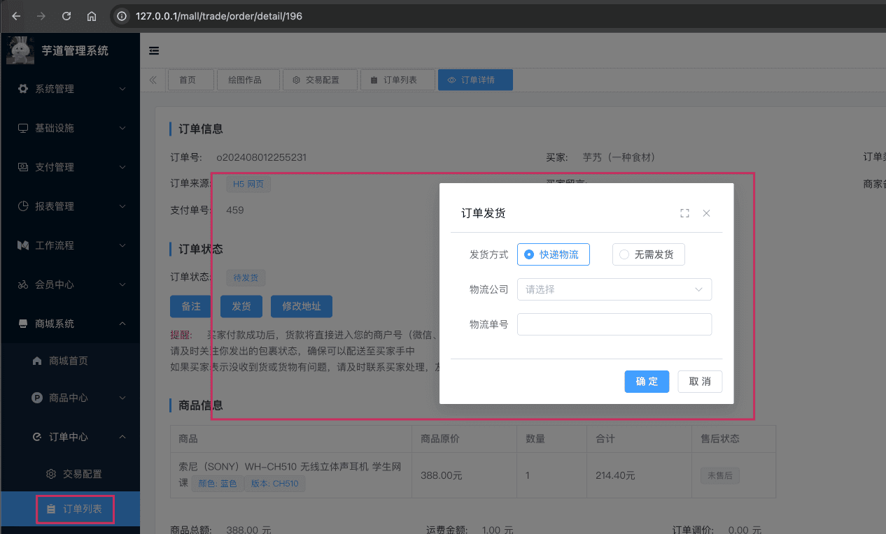
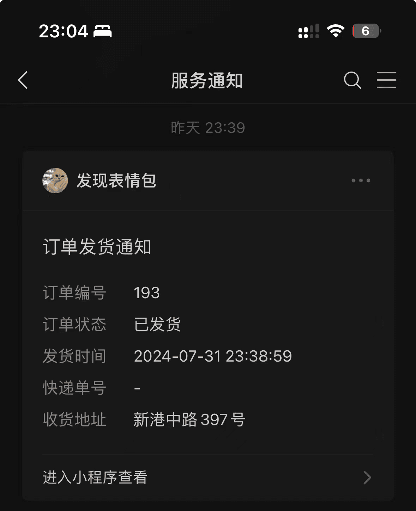

# 微信小程序订阅消息

前置阅读文章：
- [《用户体系》](/user-center/)
- [《三方登录》](/social-user/)
本文是 [《三方登录》](/social-user/) 的延伸，讲解 [`yudao-mall-uniapp`](https://github.com/yudaocode/yudao-mall-uniapp) 商城小程序如何实现微信 **小程序** 订阅消息的功能。对应的官方文档如下：
- [《【开发指南】订阅消息》](https://developers.weixin.qq.com/miniprogram/dev/framework/open-ability/subscribe-message-overview.html)
- [《【前端】订阅消息》](https://developers.weixin.qq.com/miniprogram/dev/api/open-api/subscribe-message/wx.requestSubscribeMessage.html)
- [《【服务端】订阅消息》](https://developers.weixin.qq.com/miniprogram/dev/OpenApiDoc/mp-message-management/subscribe-message/deleteMessageTemplate.html)
## # 1. 小程序准备
### # 1.1 模版申请
目前订阅消息，无法使用之前的“测试小程序”，必须进行正式小程序的申请！
申请后，可以在 [微信小程序 -> 功能 -> 订阅消息] 菜单，申请对应的订阅消息模版。如下图所示：
 上图可以看到三个模版，是目前项目已经接入的订阅消息：
- 【商城】订单发货通知：管理员在后台发货后，通知用户  【商城】拼团结果通知：用户拼团成功后，通知用户  【支付】充值成功通知：用户充值成功后，通知用户  而这些模版，我们是无法编辑，而是在【公共模板库】选用后，进入【我的模版】。 ### # 1.2 后端配置 在后端 [发送订阅消息](https://developers.weixin.qq.com/miniprogram/dev/OpenApiDoc/mp-message-management/subscribe-message/sendMessage.html) 时，需要传递 `miniprogram_state` 参数，用于区分跳转小程序类型： `developer` 为开发版
- `trial` 为体验版
- `formal` 为正式版
因此，在 `application-${profile}.yaml` 配置文件中，有对应的 `yudao.wxa-subscribe-message.miniprogram-state` 配置项，如下图所示：
 一般情况下，如果是开发测试，不用修改，直接使用默认的 `developer` 即可。
## # 2. 功能演示 & 代码实现
本小节，我们以【商城】订单发货通知为例，演示如何实现订阅消息的功能。在开始之前，你需要做如下事情：
- 参考 [《快速启动【前端】》](/quick-start-front) 文档，把 `yudao-uniapp-mall` 商城项目跑起来，并使用 HBuilderX + 微信开发者工具进行调试
- 参考 [《商城功能开启》](/mall/build) 文档，开启商城功能
- 在 [微信小程序 -> 功能 -> 订阅消息] 菜单，配置好“订单发货通知”模版
### # 2.1 uni-app 获取订阅模版列表
在 uni-app 打开时，会调用后端的 AppSocialUserController 的 `#getSubscribeTemplateList()` 方法，获取订阅消息模版列表。
目的是，uni-app 在调用 [`wx.requestSubscribeMessage(Object object)`](https://developers.weixin.qq.com/miniprogram/dev/api/open-api/subscribe-message/wx.requestSubscribeMessage.html) 发起订阅消息时，需要传递 `tmplIds` 消息模版的编号。
友情提示：
由于暂时没做微信小程序的订阅消息的模版管理，所以暂时通过它的模版名称来匹配的。算是约定大于配置吧~
不过因为小程序的订阅消息模版是只能 **选用**，标题是固定的，所以这个约定是可行的。
### # 2.2 uni-app 发起订阅消息
第一步，在 uni-app 中，下单并完成支付，然后会进入支付成功页。如下图所示：
 第二步，点击【立即订阅】按钮，发起对“订单发货通知”的订阅消息。如下图所示：
 它的实现，通过调用项目的 `sheep/platform/provider/wechat/miniProgram.js` 的 `#subscribeMessage(...)` 方法，从而调用微信的 `wx.requestSubscribeMessage(Object object)` 方法，发起订阅消息的请求。
### # 2.3 后端发送订阅消息
第一步，在管理后台，点击 [商城系统 -> 订单中心 -> 订单列表] 菜单，找到对应的订单，点击【发货】按钮，发起对订单的发货操作。如下图所示：
 它的内部，通过调用项目的 SocialClientApi 的 `#sendWxaSubscribeMessage(...)` 方法，从而调用微信的 [发送订阅消息](https://developers.weixin.qq.com/miniprogram/dev/OpenApiDoc/mp-message-management/subscribe-message/sendMessage.html) 接口，发送订阅消息的请求。
第二步，拿出手机微信（PC 电脑上看不到），在【服务通知】中，可以看到对应的订阅消息。如下图所示：
 如果没有收到订阅消息，可以在 IDEA 控制台，搜 `[sendSubscribeMessage]` 关键字，查看是否有异常日志输出。
## # 3. 其它业务如何接入？
参考上述小节的内容：
- 第一步，在 uni-app 项目中，需要调用项目的 `sheep/platform/provider/wechat/miniProgram.js` 的 `#subscribeMessage(...)` 方法，发起订阅
- 第二步，在后端项目中，需要调用 SocialClientApi 的 `#sendWxaSubscribeMessage(...)` 方法，发送订阅消息
当然，肯定需要在微信小程序那，配置对应的订阅消息模版。
.pageB img{width:80px!important;}
.wwads-horizontal .wwads-text, .wwads-content .wwads-text{line-height:1;}
[微信小程序登录](/member/weixin-lite-login/) [微信小程序码](/member/weixin-lite-qrcode/) 
←
[微信小程序登录](/member/weixin-lite-login/) [微信小程序码](/member/weixin-lite-qrcode/)→
 
Theme by
[Vdoing](https://github.com/xugaoyi/vuepress-theme-vdoing) 
| Copyright © 2019-2026
芋道源码 | MIT License   
- 跟随系统
- 浅色模式
- 深色模式
- 阅读模式
× 
.windowRB{ padding: 0;}
.windowRB .wwads-img{margin-top: 10px;}
.windowRB .wwads-content{margin: 0 10px 10px 10px;}
.custom-html-window-rb .close-but{
display: none;
}