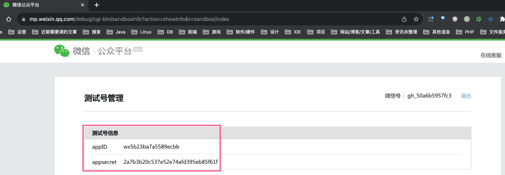
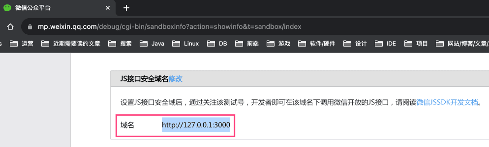
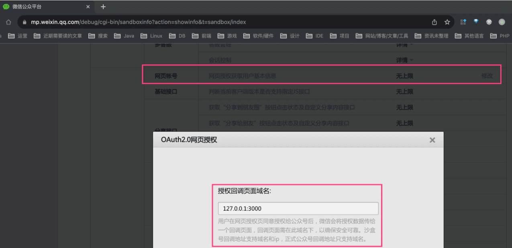
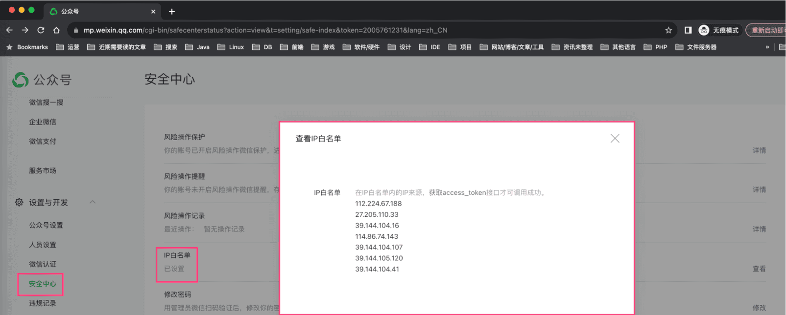
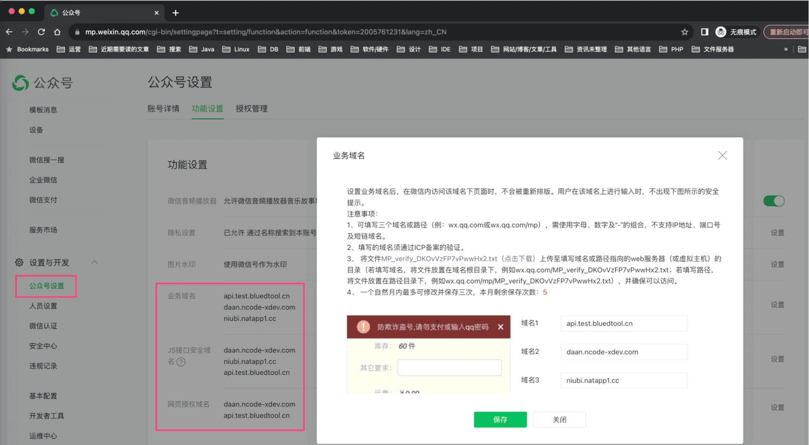
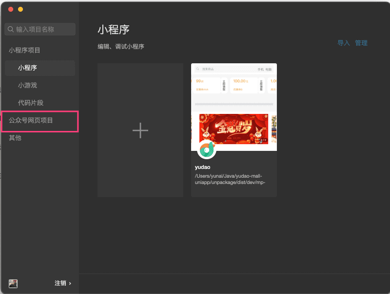
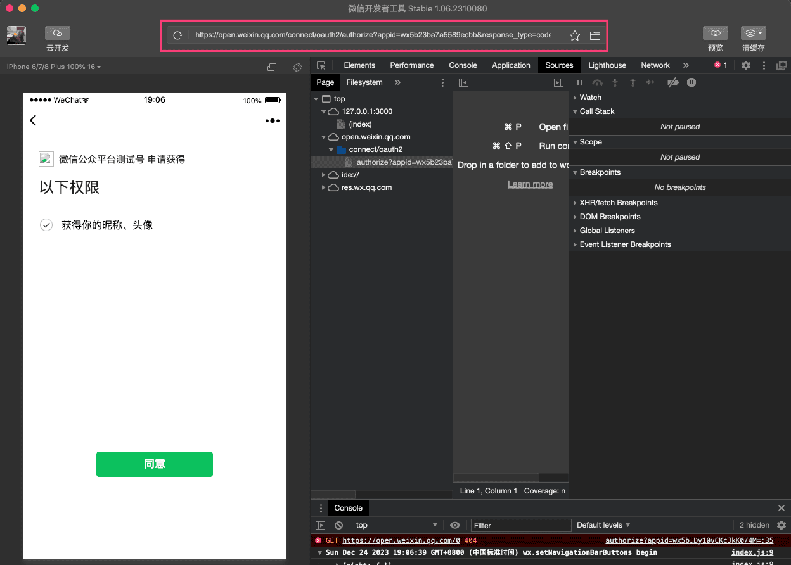

# 微信公众号登录

前置阅读文章：
- [《用户体系》](/user-center/)
- [《三方登录》](/social-user/)
本文是 [《三方登录》](/social-user/) 的延伸，讲解 [`yudao-mall-uniapp`](https://github.com/yudaocode/yudao-mall-uniapp) 商城小程序如何实现微信 **公众号** 登录的功能。
## # 1. 公众号准备
友情提示：
本文，我们以“测试公众号”举例子，方便大家操作，认证一个公众号太难了！！！
① 参考 [微信公众平台接口测试帐号申请](https://mp.weixin.qq.com/debug/cgi-bin/sandbox?t=sandbox/login) 链接，申请一个测试公众号。
② 将 `appID` 和 `appSecret` 配置，设置到后端项目 `application-local.yaml` 的 `wx.mp` 配置项中。如下图所示：
  ③ 修改“JS接口安全域名”，设置为前端的访问地址。例如说，现在本地是 `http://127.0.0.1:3000`。如下图所示：
 注意：自己需要关注下自己的测试公众号！！！
④ 修改“网页授权获取用户基本信息”，设置为前端的访问地址。例如说，现在本地是 `http://127.0.0.1:3000`。如下图所示：
 补充说明：如果你是正式的公众号，需要额外看下这部分的内容：
① 设置“IP白名单”，在公众号的 [设置与开发 - 安全中心] 菜单，如下图所示：
 ② 在公众号的 [设置与开发 - 公众号设置] 菜单，设置“业务域名”、“JS接口安全域名”、“网页授权域名”，如下图所示：
 
- 设置时，需要外网可访问，可以需要使用 [natapp](/natapp/) 进行内网穿透
- 上图的 `MP_verify_XXXXXXXXXXXXXXXX.txt` 文件，可以直接放在 `yudao-mall-uniapp` 商城项目的根目录
## # 2. 代码实现
### # 2.1 项目启动
① 参考 [《快速启动【前端】》](/quick-start-front/) 文档的「2. uni-app 商城移动端」小节，将 `yudao-mall-uniapp` 商城项目跑起来。
② 下载 [微信开发者工具](https://developers.weixin.qq.com/miniprogram/dev/devtools/download.html)，并进行安装。安装后，选择「公众号网页项目」。如下图所示：
 
### # 2.2 微信 JSSDK
访问 `http://127.0.0.1:3000/` 地址（其它地址也可以），它会触发 [微信 JSSDK](https://developers.weixin.qq.com/doc/offiaccount/OA_Web_Apps/JS-SDK.html) 初始化的逻辑，对应前端 `sheep/libs/sdk-h5-weixin.js` 文件的 `#init(...)` 方法中。
微信 JSSDK 所需要的签名，由后端的 AppAuthController 的 `#createWeixinMpJsapiSignature(...)` 方法所提供。
友情提示：为什么出现微信 JSSDK 初始化失败：`{errMsg: "config:fail,invalid signature"}`？
可能是 `jsApiList` 里的部分权限你没有，可以尝试先全部移除，只保留 `chooseWXPay` 一个，确保初始化成功。
然后，再逐个添加 `jsApiList` 里的权限，找到所有权限都可以正常使用的 `jsApiList` 列表。
友情提示：为什么微信公众号 H5 在手机上分享功能不生效？
### # 2.3 登录流程
友情提示：
可以简单阅读下 [《微信官方文档 —— 网页授权》](https://developers.weixin.qq.com/doc/offiaccount/OA_Web_Apps/Wechat_webpage_authorization.html) 文章。
① 访问 `http://127.0.0.1:3000/#/pages/user/info` 地址，触发弹出“登录窗口”，对应前端 `sheep/components/s-auth-modal/s-auth-modal.vue` 组件。如下图所示：
 ② 点击「微信登录」图标，触发微信公众号登录。前端核心实现都在 `sheep/platform/provider/wechat/officialAccount.js` 的 `#login(...)` 方法中。它一共包含 2 个步骤。
③ 【第一步】前端调用后端的 AppAuthController 的 `#socialAuthRedirect(...)` 方法，获得微信公众号的登录地址，并进行跳转。效果如下图：
 ps：为了在微信登录成功后，可以回到登陆前的 URL 地址，会将该 URL 存储到 `uni.setStorageSync('returnUrl', location.href)` 中。
④ 【第二步】点击「同意」按钮，跳转回前端的 `pages/index/login.vue` 页面，进行 **真正的** 微信登录逻辑。
此时，前端从 URL 中解析到微信回调提供的 `code` 授权码参数，调用后端的 AppAuthController 的 `#socialLogin(...)` 方法，进行登录逻辑。注意：
- 情况一：如果该微信用户已经绑定会员用户，则直接进行登录
- 情况二：如果该微信用户没有绑定会员用户，则会自动创建一个会员用户，并进行登录。下次重新登录时，就走【情况一】的逻辑。
ps：登录成功后，通过 `uni.getStorageSync('returnUrl')` 获得登录前的 URL 地址，进行跳转。
.pageB img{width:80px!important;}
.wwads-horizontal .wwads-text, .wwads-content .wwads-text{line-height:1;}
[功能开启](/member/build/) [微信小程序登录](/member/weixin-lite-login/) 
←
[功能开启](/member/build/) [微信小程序登录](/member/weixin-lite-login/)→
 
Theme by
[Vdoing](https://github.com/xugaoyi/vuepress-theme-vdoing) 
| Copyright © 2019-2026
芋道源码 | MIT License   
- 跟随系统
- 浅色模式
- 深色模式
- 阅读模式
× 
.windowRB{ padding: 0;}
.windowRB .wwads-img{margin-top: 10px;}
.windowRB .wwads-content{margin: 0 10px 10px 10px;}
.custom-html-window-rb .close-but{
display: none;
}