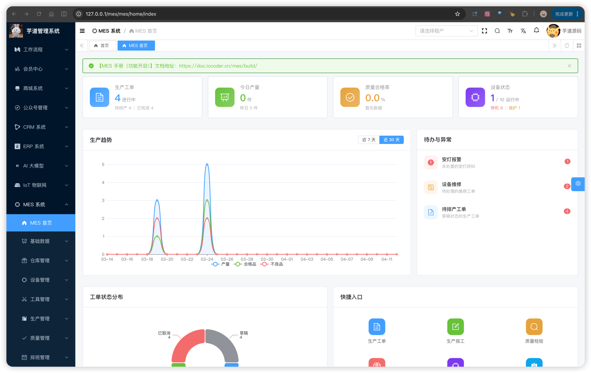

# 功能开启

进度说明：
- 管理后台，请使用 [https://gitee.com/yudaocode/yudao-ui-admin-vue3](https://gitee.com/yudaocode/yudao-ui-admin-vue3) 仓库的 `master` 分支
- 后端项目，请使用 [https://gitee.com/zhijiantianya/ruoyi-vue-pro](https://gitee.com/zhijiantianya/ruoyi-vue-pro) 仓库的 `master`（JDK8） 或 `master-jdk17`（JDK17/21） 分支
MES 系统，后端由 `yudao-module-mes` 模块实现，前端由 `yudao-ui-admin-vue3` 的 `mes` 目录实现。
考虑到编译速度，默认 `yudao-module-mes` 模块是关闭的，需要手动开启。步骤如下：
- 第一步，开启 `yudao-module-mes` 模块
- 第二步，导入 MES 系统的 SQL 数据库脚本
- 第三步，重启后端项目，确认功能是否生效
## # 1. 第一步，开启模块
① 修改根目录的 [`pom.xml`](https://github.com/YunaiV/ruoyi-vue-pro/blob/master/pom.xml) 文件，取消 `yudao-module-mes` 模块的注释。如下图所示：
 ② 修改 `yudao-server` 目录的 [`pom.xml`](https://github.com/YunaiV/ruoyi-vue-pro/blob/master/yudao-server/pom.xml) 文件，引入 `yudao-module-mes` 模块。如下图所示：
 ③ 点击 IDEA 右上角的【Reload All Maven Projects】，刷新 Maven 依赖。如下图所示：
 
## # 2. 第二步，导入 SQL
点击 [`mes.sql.zip`](https://t.zsxq.com/PT3cs) 下载附件，解压出 SQL 文件，然后导入到数据库中。如下图所示：
友情提示：↑↑↑ mes.sql 是可以点击下载的！ ↑↑↑
重要说明：该 SQL 仅芋道星球成员可使用和商用，否则视为侵权（索赔 100 万，永久追溯）【下载即视为同意】。
 以 `mes_` 作为前缀的表，就是 MES 模块的表，一共 **133** 张，按业务模块分为：
| 表前缀 | 模块 | 表数量 |
| --- | --- | --- |
| `mes_md_` | 基础数据 | 17 |
| `mes_pro_` | 生产管理 | 17 |
| `mes_wm_` | 仓库管理 | 62 |
| `mes_qc_` | 质量管理 | 16 |
| `mes_dv_` | 设备管理 | 12 |
| `mes_tm_` | 工具管理 | 2 |
| `mes_cal_` | 排班管理 | 7 |
## # 3. 第三步，重启项目
重启后端项目，然后访问前端的 MES 菜单，确认功能是否生效。如下图所示：
 至此，我们就成功开启了 MES 的功能 🙂
## # 4. 全局说明
① MES 各业务表中的 `code` 编码字段（如物料编码、工单编码等），均由编码规则模块自动生成，详见 [《【基础】编码规则》](/mes/md/autocode/) 文档。
② MES 中存在大量一对多（主子表）关系的业务单据（如生产工单与 BOM 子表、采购入库与入库明细等）。通常的操作方式是：先新增主表记录，保存后在编辑弹窗中切换到对应的 Tab 页，再新增子表明细行。
③ MES 仓库管理模块的出入库单据统一采用**两阶段处理流程**：第一阶段为「单据起草」，负责创建业务单据并可配合审批流程；第二阶段为「执行入库/出库」，审批通过后执行库存操作，此时系统才会通过库存事务引擎生成事务流水并更新库存台账。系统还内置了一个**虚拟线边库**（编码 `WIP_VIRTUAL_WAREHOUSE`），用于统计在制物资的库存情况，详见 [《【仓库】仓库与库区库位、条码赋码、SN码》](/mes/wm/warehouse-setup/)。
.pageB img{width:80px!important;}
.wwads-horizontal .wwads-text, .wwads-content .wwads-text{line-height:1;}
[MES 演示](/mes-preview/) [【基础】物料产品、分类、计量单位](/mes/md/product/) 
←
[MES 演示](/mes-preview/) [【基础】物料产品、分类、计量单位](/mes/md/product/)→
 
Theme by
[Vdoing](https://github.com/xugaoyi/vuepress-theme-vdoing) 
| Copyright © 2019-2026
芋道源码 | MIT License   
- 跟随系统
- 浅色模式
- 深色模式
- 阅读模式
× 
.windowRB{ padding: 0;}
.windowRB .wwads-img{margin-top: 10px;}
.windowRB .wwads-content{margin: 0 10px 10px 10px;}
.custom-html-window-rb .close-but{
display: none;
}