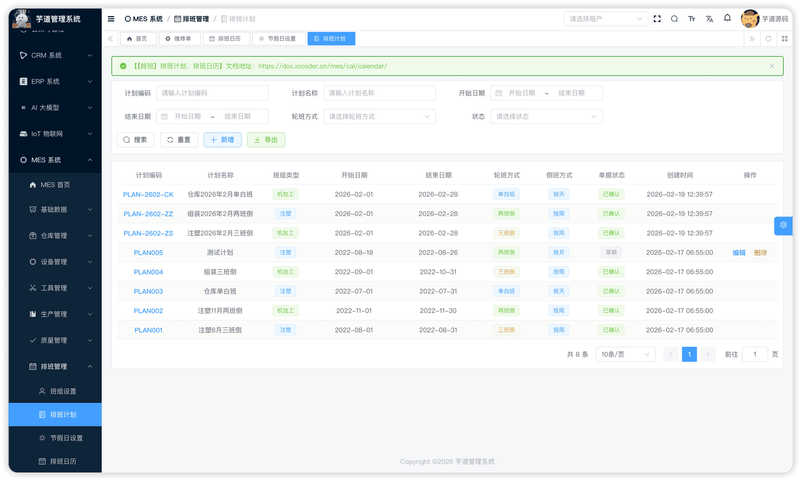
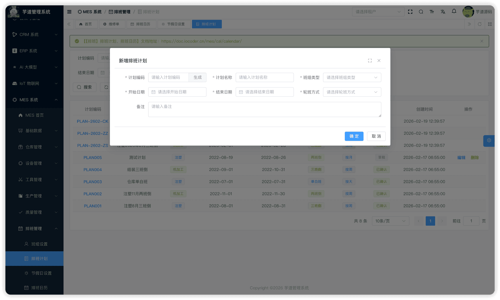
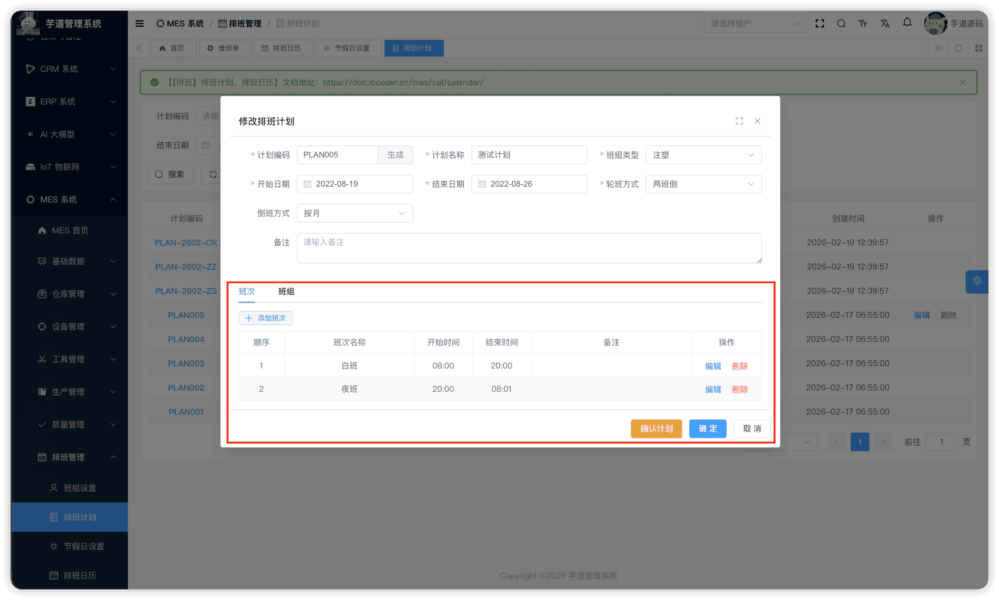
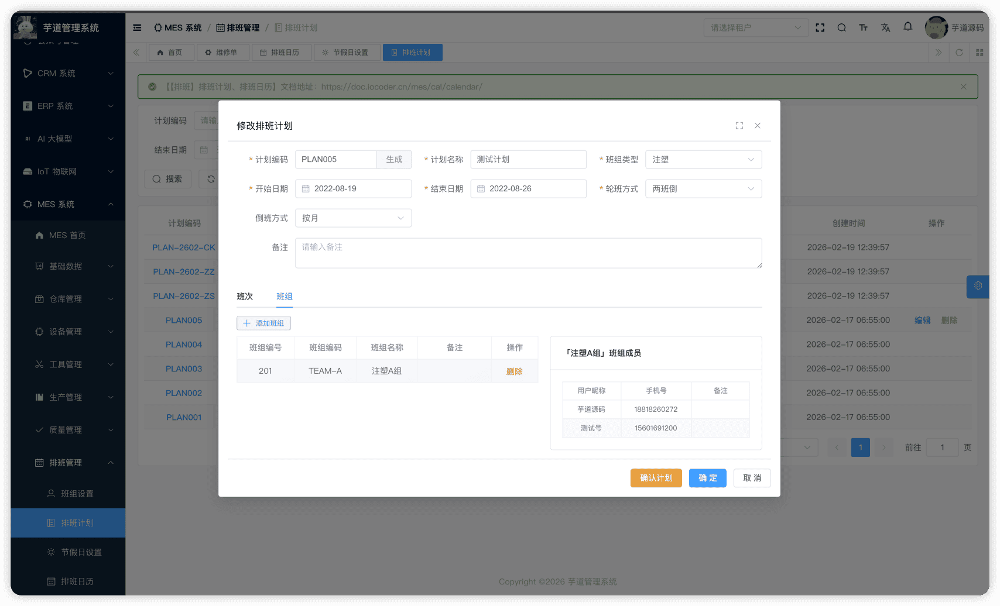
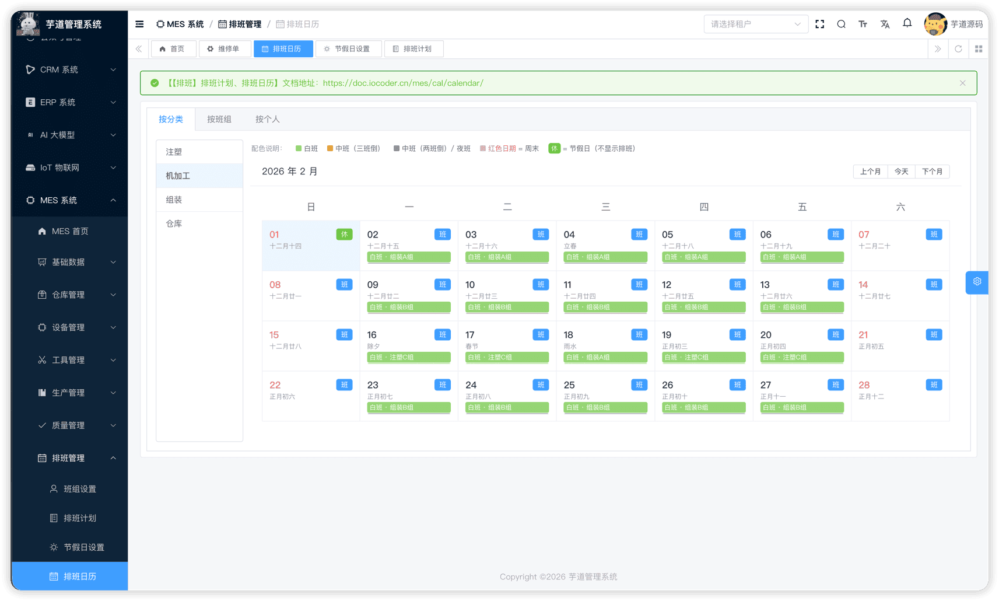

# 【排班】排班计划、排班日历

排班执行模块由 `yudao-module-mes` 后端模块的 `cal.plan`、`cal.calendar` 包实现。基于班组和节假日配置，编排具体的排班计划和工厂日历。
本文涉及两个子模块：
- **排班计划**：用户需要设置每个班组类型的排班方式，包括计划时间范围、轮班方式（单白班/两班倒/三班倒）、倒班周期、每个班次的开始和结束时间、参与的班组。确认后自动生成排班日历。
- **排班日历**：系统根据排班计划自动生成**班组级**的排班记录（`mes_cal_team_shift`），并以日历方式展示。页面提供「按分类」「按班组」「按个人」三种查询视图，其中"按个人"视图是根据用户所属班组投影查询该班组的排班记录，并非生成独立的个人排班表。节假日设置独立维护，当前不参与排班日历生成逻辑，仅影响查询展示时的过滤。
本文涉及表如下图所示：
 
## # 1. 排班计划
排班计划，由 MesCalPlanController 提供接口。
### # 1.1 表结构
省略 creator/create_time/updater/update_time/deleted/tenant_id 等通用字段
CREATE TABLE `mes_cal_plan` (
`id` bigint NOT NULL AUTO_INCREMENT COMMENT '编号',
`code` varchar(64) NOT NULL COMMENT '计划编码',
`name` varchar(255) DEFAULT NULL COMMENT '计划名称',
`calendar_type` tinyint DEFAULT NULL COMMENT '日历类型',
`start_date` datetime DEFAULT NULL COMMENT '开始日期',
`end_date` datetime DEFAULT NULL COMMENT '结束日期',
`shift_type` tinyint DEFAULT NULL COMMENT '轮班方式',
`shift_method` tinyint DEFAULT NULL COMMENT '倒班方式',
`shift_count` int DEFAULT NULL COMMENT '班次数量',
`status` tinyint NOT NULL DEFAULT '0' COMMENT '状态',
`remark` varchar(500) DEFAULT NULL COMMENT '备注',
PRIMARY KEY (`id`)
) ENGINE=InnoDB COMMENT='MES 排班计划';
① `calendar_type` 为班组类型（**管理后台必填**），用于标识该排班计划所属的班组分类。后端 `MesCalPlanSaveReqVO` 通过 `@NotNull` 校验必填，分页查询 `MesCalPlanMapper` 支持按此字段筛选，前端列表和新增/编辑表单均使用此字段。
② `start_date`、`end_date` 定义排班的生效时间范围。
③ `shift_type` 为轮班方式，枚举 MesCalShiftTypeEnum：
| 枚举值 | 名称 | 默认班次 |
| --- | --- | --- |
| 1 | 单白班 | 白班 08:00-18:00 |
| 2 | 两班倒 | 白班 08:00-20:00、夜班 20:00-08:00 |
| 3 | 三班倒 | 白班 08:00-16:00、中班 16:00-00:00、夜班 00:00-08:00 |
创建计划时，选择轮班方式后系统会自动生成默认班次设置，用户可在此基础上修改。
④ `shift_method` 为倒班方式，枚举 MesCalShiftMethodEnum（1=按季度，2=按月，3=按周，4=按天）。`shift_count` 为按天倒班时的倒班天数（如值为 2 表示每 2 天轮换一次班次）。
⑤ `status` 为计划状态，枚举 MesCalPlanStatusEnum（0=草稿，1=已确认）。确认后自动生成排班日历。
该表包含两个子表：
- `mes_cal_plan_shift`（班次设置）：定义每个班次的名称和时间段。
- `mes_cal_plan_team`（参与班组）：定义参与该排班计划的班组。
### # 1.2 管理后台
对应 [MES 系统 -> 排班管理 -> 排班计划] 菜单，对应 `yudao-ui-admin-vue3` 项目的 `@/views/mes/cal/plan` 目录。
#### # 列表
支持按计划编码、名称、状态等条件搜索。
 
#### # 新增
点击【新增】按钮，弹出排班计划表单。用户需要设置"计划编码"、"计划名称"、"班组类型"、"计划的开始/结束日期"、"轮班方式"、"倒班周期"。**新增时表单中不显示班次和班组 Tab**（需要先保存主表获得 `planId` 后才可见）。填写完成后点击【确定】保存主表。
 
#### # 修改
保存成功后，在列表中点击编码链接查看详情，或点击【编辑】按钮进入修改态。修改弹窗下方通过 `el-tabs` 展示**班次**和**班组**两个 Tab 页，用户在此维护班次设置和参与班组：
 ★ **班次设置**（编辑弹窗下方）：由 `mes_cal_plan_shift` 表存储，定义每个班次的具体时间。由 MesCalPlanShiftController 提供接口。
mes_cal_plan_shift 表结构 CREATE TABLE `mes_cal_plan_shift` (
`id` bigint NOT NULL AUTO_INCREMENT COMMENT '编号',
`plan_id` bigint NOT NULL COMMENT '计划ID',
`sort` int DEFAULT NULL COMMENT '排序',
`name` varchar(64) DEFAULT NULL COMMENT '班次名称',
`start_time` varchar(10) DEFAULT NULL COMMENT '开始时间',
`end_time` varchar(10) DEFAULT NULL COMMENT '结束时间',
`remark` varchar(500) DEFAULT NULL COMMENT '备注',
PRIMARY KEY (`id`)
) ENGINE=InnoDB COMMENT='MES 班次设置';
① `plan_id` 关联主表 `mes_cal_plan` 的 `id` 字段。
② `name` 为班次名称（如白班、夜班、中班）。`start_time`、`end_time` 为时间字符串（如 "08:00"、"18:00"）。
 ★ **参与班组**（编辑弹窗下方）：由 `mes_cal_plan_team` 表存储，定义哪些班组参与该计划。由 MesCalPlanTeamController 提供接口。
mes_cal_plan_team 表结构 CREATE TABLE `mes_cal_plan_team` (
`id` bigint NOT NULL AUTO_INCREMENT COMMENT '编号',
`plan_id` bigint NOT NULL COMMENT '计划ID',
`team_id` bigint NOT NULL COMMENT '班组ID',
`remark` varchar(500) DEFAULT NULL COMMENT '备注',
PRIMARY KEY (`id`)
) ENGINE=InnoDB COMMENT='MES 排班参与班组';
① `plan_id` 关联主表 `mes_cal_plan` 的 `id` 字段。
② `team_id` 关联 `mes_cal_team` 表的 `id` 字段（详见 [《【排班】班组设置、节假日设置》](/mes/cal/team/)）。
#### # 确认
在修改弹窗中，草稿状态的排班计划会显示【确认计划】按钮。点击后，前端会**先自动保存当前主表**（调用 `updatePlan`），再弹出二次确认框；用户确认后调用后端 `confirmPlan` 接口，该接口校验班组数量与轮班方式是否匹配（如两班倒至少需要 2 个班组），校验通过后更新状态为「已确认」，并调用 `generateTeamShiftRecords` **自动生成排班日历**（`mes_cal_team_shift`）——根据时间范围逐日循环，按倒班周期分配班组与班次的对应关系。
## # 2. 排班日历
排班日历，由 MesCalCalendarController 提供接口。由排班计划确认后自动生成，展示每天、每个班组对应的班次安排。
### # 2.1 表结构
CREATE TABLE `mes_cal_team_shift` (
`id` bigint NOT NULL AUTO_INCREMENT COMMENT '编号',
`plan_id` bigint NOT NULL COMMENT '计划ID',
`team_id` bigint NOT NULL COMMENT '班组ID',
`shift_id` bigint NOT NULL COMMENT '班次ID',
`day` datetime NOT NULL COMMENT '日期',
`sort` int DEFAULT NULL COMMENT '排序',
`remark` varchar(500) DEFAULT NULL COMMENT '备注',
PRIMARY KEY (`id`)
) ENGINE=InnoDB COMMENT='MES 排班日历';
① `plan_id` 关联排班计划，`team_id` 关联班组，`shift_id` 关联班次设置。
② `day` 为具体日期。一条记录表示"某一天某个班组执行某个班次"。
### # 2.2 管理后台
对应 [MES 系统 -> 排班管理 -> 排班日历] 菜单，对应 `yudao-ui-admin-vue3` 项目的 `@/views/mes/cal/calendar` 目录。
页面通过「按分类」「按班组」「按个人」三个 Tab 展示排班结果，以日历视图呈现每天的班次安排。其中"按个人"视图是根据用户所属班组查询该班组的排班记录，底层数据仍为班组级 `mes_cal_team_shift`。
 
.pageB img{width:80px!important;}
.wwads-horizontal .wwads-text, .wwads-content .wwads-text{line-height:1;}
[【排班】班组设置、节假日设置](/mes/cal/team/) [WMS 演示](/wms-preview/) 
←
[【排班】班组设置、节假日设置](/mes/cal/team/) [WMS 演示](/wms-preview/)→
 
Theme by
[Vdoing](https://github.com/xugaoyi/vuepress-theme-vdoing) 
| Copyright © 2019-2026
芋道源码 | MIT License   
- 跟随系统
- 浅色模式
- 深色模式
- 阅读模式
× 
.windowRB{ padding: 0;}
.windowRB .wwads-img{margin-top: 10px;}
.windowRB .wwads-content{margin: 0 10px 10px 10px;}
.custom-html-window-rb .close-but{
display: none;
}