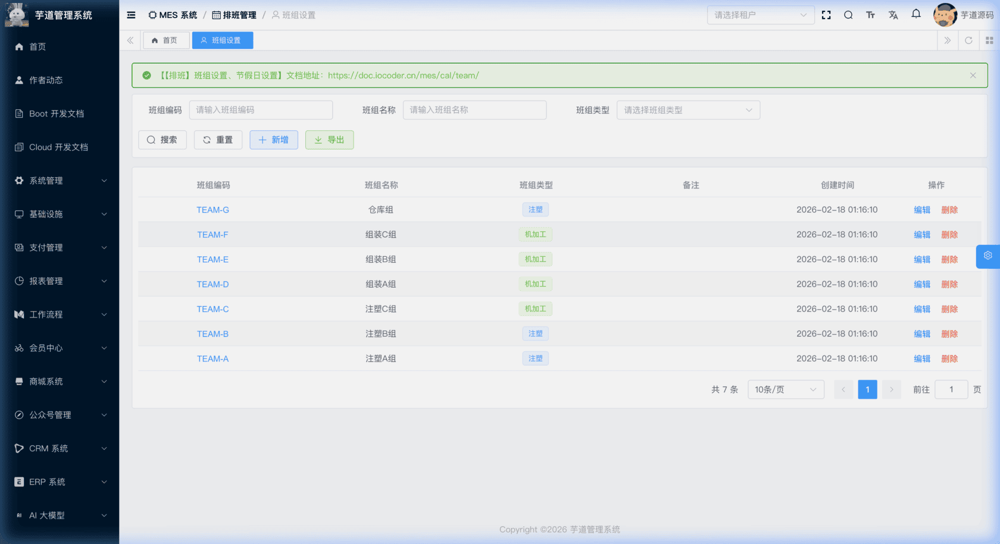
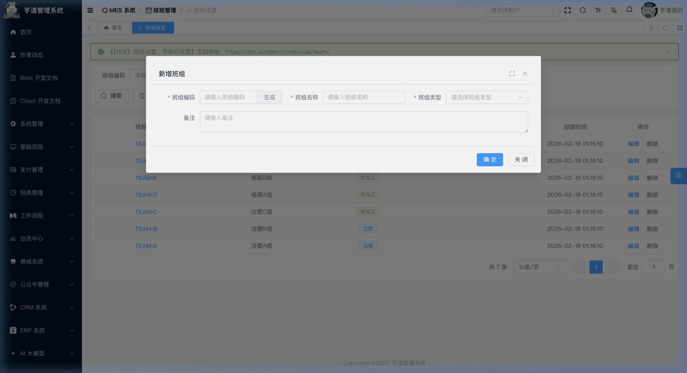
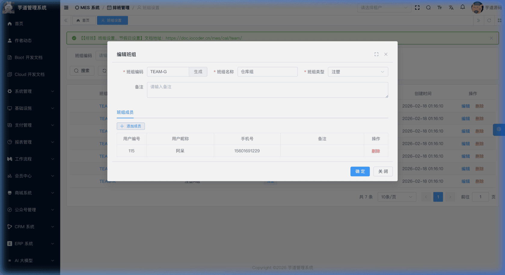
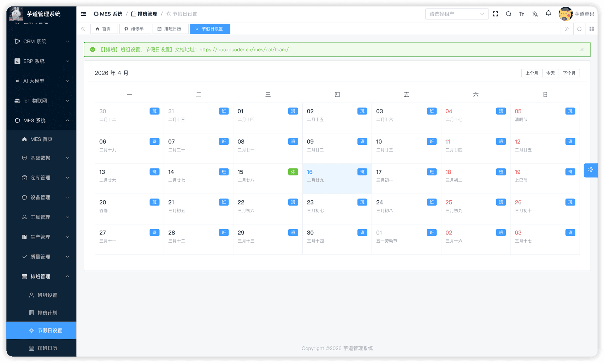
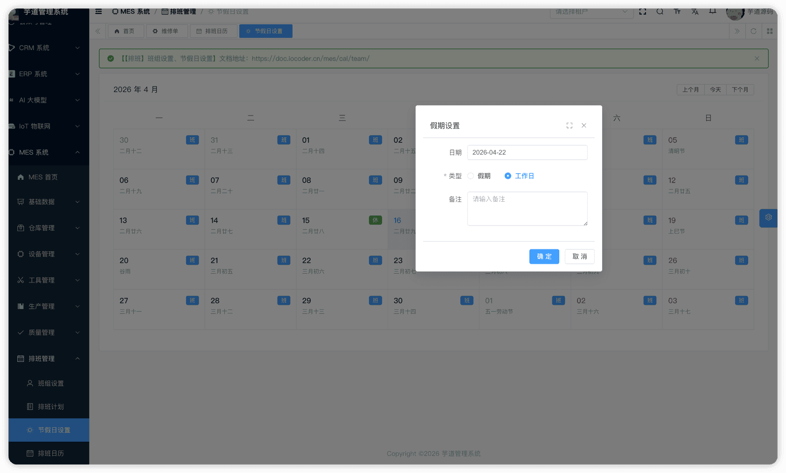

# 【排班】班组设置、节假日设置

排班管理主要用于工厂人员的工作任务计划安排。排班基础数据模块由 `yudao-module-mes` 后端模块的 `cal.team`、`cal.holiday` 包实现，主要内容为班组人员的配置和节假日设置。
本文涉及两个子模块：
- **班组设置**：班组是具有相同岗位、工作性质和工作内容的一组人的集合，是排班计划的最小排班单位。
- **节假日设置**：用户可根据工厂的实际节假日安排设置对应年月的“上班”和“休假”状态。
本文涉及表如下图所示：
 
## # 1. 班组设置
班组设置，由 MesCalTeamController 提供接口。
### # 1.1 表结构
省略 creator/create_time/updater/update_time/deleted/tenant_id 等通用字段
CREATE TABLE `mes_cal_team` (
`id` bigint NOT NULL AUTO_INCREMENT COMMENT '编号',
`code` varchar(64) NOT NULL COMMENT '班组编码',
`name` varchar(255) NOT NULL COMMENT '班组名称',
`calendar_type` tinyint NOT NULL COMMENT '班组类型',
`remark` varchar(500) DEFAULT '' COMMENT '备注',
PRIMARY KEY (`id`)
) ENGINE=InnoDB COMMENT='MES 班组';
① `calendar_type` 为班组类型，字典 `mes_cal_calendar_type`，用于区分不同的排班场景。
用户可在系统的数据字典中自定义配置班组类型，然后根据实际人员情况配置每个班组的人员清单。
该表包含一个子表：
- `mes_cal_team_member`（班组成员）：记录班组包含的人员。
### # 1.2 管理后台
对应 [MES 系统 -> 排班管理 -> 班组设置] 菜单，对应 `yudao-ui-admin-vue3` 项目的 `@/views/mes/cal/team` 目录。
#### # 列表
支持按班组编码、名称等条件搜索。
 
#### # 新增
点击【新增】按钮，弹出新增弹窗，仅维护班组基础信息（编码、名称、班组类型、备注），不显示班组成员 Tab。
 
#### # 修改与详情
点击列表中的【编辑】按钮，弹出编辑弹窗（可修改）；点击编码链接，弹出详情弹窗（只读）。编辑/详情弹窗中，表单下方通过 `el-tabs` 展示**班组成员** Tab：
 ★ **班组成员**（编辑/详情弹窗下方）：由 `mes_cal_team_member` 表存储。由 MesCalTeamMemberController 提供接口。
mes_cal_team_member 表结构 CREATE TABLE `mes_cal_team_member` (
`id` bigint NOT NULL AUTO_INCREMENT COMMENT '编号',
`team_id` bigint NOT NULL COMMENT '班组ID',
`user_id` bigint NOT NULL COMMENT '用户ID',
`remark` varchar(500) DEFAULT '' COMMENT '备注',
PRIMARY KEY (`id`)
) ENGINE=InnoDB COMMENT='MES 班组成员';
① `team_id` 关联主表 `mes_cal_team` 的 `id` 字段。
② `user_id` 关联系统用户表（AdminUserDO）。
## # 2. 节假日设置
节假日设置，由 MesCalHolidayController 提供接口。
### # 2.1 表结构
省略 creator/create_time/updater/update_time/deleted/tenant_id 等通用字段
CREATE TABLE `mes_cal_holiday` (
`id` bigint NOT NULL AUTO_INCREMENT COMMENT '编号',
`day` datetime NOT NULL COMMENT '日期',
`type` tinyint NOT NULL COMMENT '类型',
`remark` varchar(500) DEFAULT '' COMMENT '备注',
PRIMARY KEY (`id`)
) ENGINE=InnoDB COMMENT='MES 节假日';
① `day` 为特殊日期，用于标记需要特殊处理的日期（如法定节假日、调休工作日）。排班日历生成时会结合此设置进行调整。
② `type` 为日期类型，枚举 MesCalHolidayTypeEnum（1=工作日，2=节假日）。用于标记法定节假日和调休工作日。
### # 2.2 管理后台
对应 [MES 系统 -> 排班管理 -> 节假日设置] 菜单，对应 `yudao-ui-admin-vue3` 项目的 `@/views/mes/cal/holiday` 目录。
以日历视图（`el-calendar`）展示当前月份的日期，每个日期右上角标注"班"（工作日）或"休"（假期）状态。
 点击当前月份的某个日期，弹出"假期设置"弹窗，可选择该日的类型（假期 / 工作日）并填写备注。系统通过 `save` 接口（upsert 语义）保存或更新当天的类型。
 
.pageB img{width:80px!important;}
.wwads-horizontal .wwads-text, .wwads-content .wwads-text{line-height:1;}
[【工具】工具类型、工装夹具台账](/mes/tm/tool/) [【排班】排班计划、排班日历](/mes/cal/calendar/) 
←
[【工具】工具类型、工装夹具台账](/mes/tm/tool/) [【排班】排班计划、排班日历](/mes/cal/calendar/)→
 
Theme by
[Vdoing](https://github.com/xugaoyi/vuepress-theme-vdoing) 
| Copyright © 2019-2026
芋道源码 | MIT License   
- 跟随系统
- 浅色模式
- 深色模式
- 阅读模式
× 
.windowRB{ padding: 0;}
.windowRB .wwads-img{margin-top: 10px;}
.windowRB .wwads-content{margin: 0 10px 10px 10px;}
.custom-html-window-rb .close-but{
display: none;
}