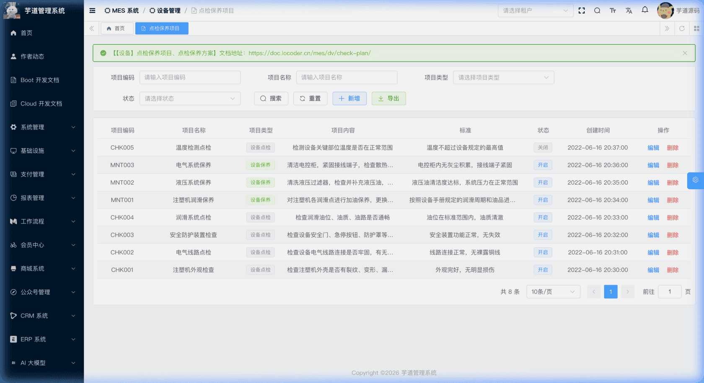
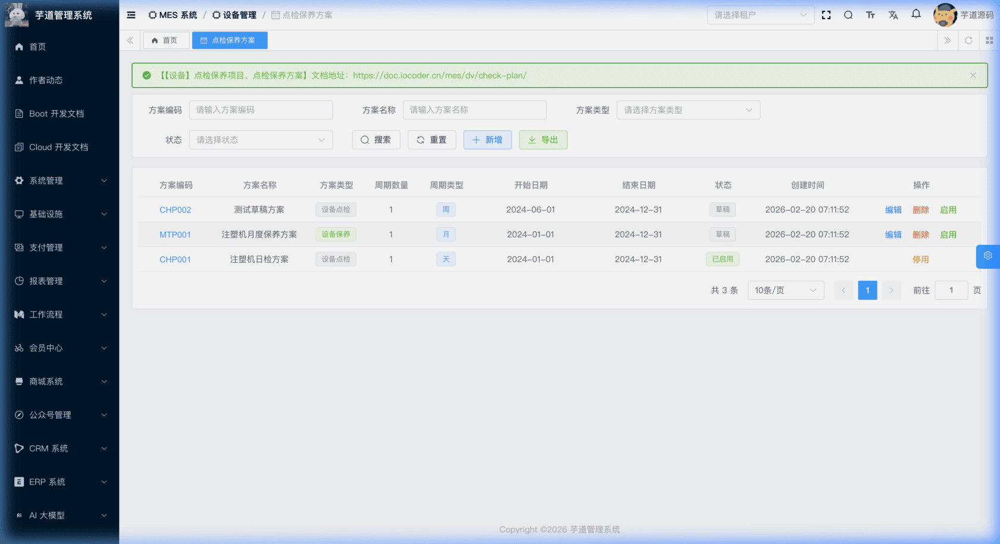
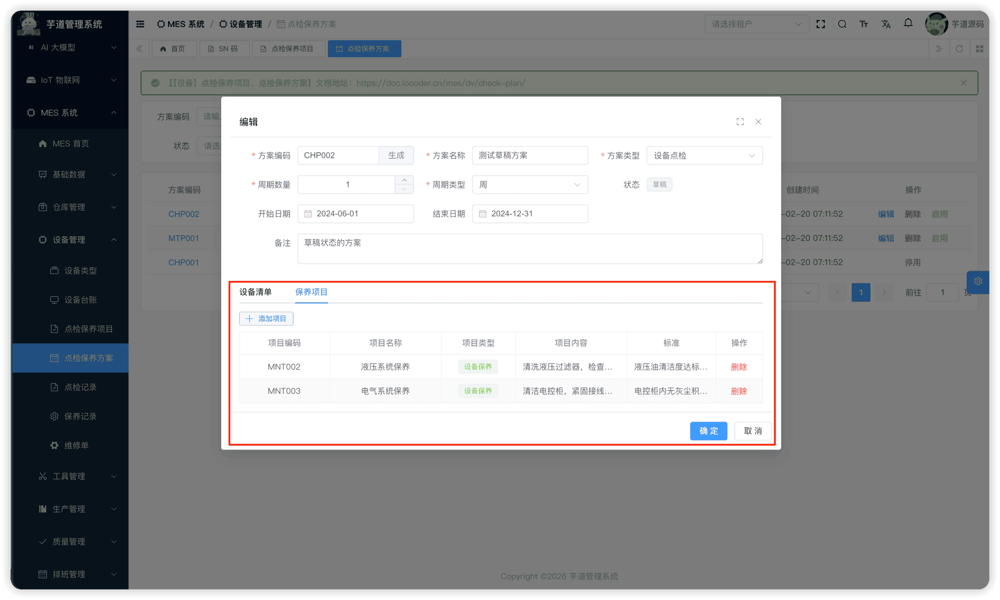

# 【设备】点检保养项目、点检保养方案

设备点检及保养一般都是周期性的任务，区别在于点检的项目内容和保养的项目内容不同。点检保养配置模块由 `yudao-module-mes` 后端模块的 `dv.subject`、`dv.checkplan` 包实现，通过「项目 → 方案 → 记录」三层结构，实现设备点检和保养任务的标准化管理。
本文涉及两个子模块：
- **点检保养项目**：对具体的检查内容进行统一维护（如温度检测、润滑检查、紧固检测等），是方案的最小执行单元。
- **点检保养方案**：主要为用户提供一个模板功能，用于设置指定设备在指定周期内的点检保养项目。
本文涉及表如下图所示：
 
## # 1. 点检保养项目
点检保养项目，由 MesDvSubjectController 提供接口。
### # 1.1 表结构
省略 creator/create_time/updater/update_time/deleted/tenant_id 等通用字段
CREATE TABLE `mes_dv_subject` (
`id` bigint NOT NULL AUTO_INCREMENT COMMENT '编号',
`code` varchar(64) NOT NULL COMMENT '项目编码',
`name` varchar(255) DEFAULT NULL COMMENT '项目名称',
`type` tinyint NOT NULL COMMENT '项目类型',
`content` varchar(500) NOT NULL COMMENT '项目内容',
`standard` varchar(255) DEFAULT NULL COMMENT '标准',
`status` tinyint NOT NULL DEFAULT '0' COMMENT '状态',
`remark` varchar(500) DEFAULT '' COMMENT '备注',
PRIMARY KEY (`id`)
) ENGINE=InnoDB COMMENT='MES 点检保养项目';
① `type` 为项目类型，字典 `mes_dv_subject_type`（点检项目/保养项目）。同一个项目只能属于一种类型。
② `content` 为项目的具体检查内容说明，`standard` 为判定标准（如"温度 ≤ 80℃"）。均为**说明性字段**，后端不参与业务逻辑判定，供点检/保养人员在前端参考。
③ `status` 为通用启用/禁用状态，枚举 CommonStatusEnum（0=开启，1=关闭）。
### # 1.2 管理后台
对应 [MES 系统 -> 设备管理 -> 点检保养项目] 菜单，对应 `yudao-ui-admin-vue3` 项目的 `@/views/mes/dv/subject` 目录。
支持按项目编码、名称、类型等条件搜索，以及新增、修改、删除操作。
**删除限制**：如果该项目已被某个点检保养方案引用（即 `mes_dv_check_plan_subject` 中存在关联记录），则不允许删除，后端会抛出 `DV_SUBJECT_USED_BY_CHECK_PLAN` 异常。需先从方案中移除该项目，再执行删除。
 
## # 2. 点检保养方案
点检保养方案，由 MesDvCheckPlanController 提供接口。
### # 2.1 表结构
省略 creator/create_time/updater/update_time/deleted/tenant_id 等通用字段
CREATE TABLE `mes_dv_check_plan` (
`id` bigint NOT NULL AUTO_INCREMENT COMMENT '编号',
`code` varchar(64) NOT NULL COMMENT '方案编码',
`name` varchar(255) NOT NULL COMMENT '方案名称',
`type` tinyint NOT NULL COMMENT '方案类型',
`start_date` datetime DEFAULT NULL COMMENT '开始日期',
`end_date` datetime DEFAULT NULL COMMENT '结束日期',
`cycle_type` tinyint NOT NULL COMMENT '频次类型',
`cycle_count` int NOT NULL DEFAULT '1' COMMENT '频次',
`status` tinyint NOT NULL DEFAULT '0' COMMENT '状态',
`remark` varchar(500) DEFAULT '' COMMENT '备注',
PRIMARY KEY (`id`)
) ENGINE=InnoDB COMMENT='MES 点检保养方案';
① `type` 为方案类型，枚举 MesDvCheckPlanTypeEnum（1=点检，2=保养）。
② `start_date`、`end_date` 定义方案的生效时间范围。`cycle_type` 为执行频次类型，`cycle_count` 为频次数值（默认值为 1）。均为**说明性字段**，后端不基于这些字段自动触发任务，供用户规划参考。
③ `status` 为方案状态，枚举 MesDvCheckPlanStatusEnum（0=草稿，1=已启用）。
该表包含两个子表：
- `mes_dv_check_plan_machinery`（方案关联设备）：定义该方案适用于哪些设备。
- `mes_dv_check_plan_subject`（方案关联项目）：定义该方案包含哪些点检/保养项目。
### # 2.2 管理后台
对应 [MES 系统 -> 设备管理 -> 点检保养方案] 菜单，对应 `yudao-ui-admin-vue3` 项目的 `@/views/mes/dv/checkplan` 目录。
#### # 列表
支持按方案编码、名称、类型、状态等条件搜索。
 
#### # 新增
点击【新增】按钮，弹出方案新增表单。用户需要填写方案编码、名称、类型、周期数量、周期类型等主表字段，还可以选填开始/结束日期和备注。
新增保存后**直接关闭弹窗**并刷新列表，方案初始状态为"草稿"。此时尚不能维护关联设备和关联项目，需先保存方案后再通过【编辑】进入方案详情来维护子表。
#### # 修改
点击编码链接可查看方案详情；点击【编辑】按钮可进入修改表单。**仅草稿状态的方案可以编辑**，已启用的方案不允许修改。
编辑表单上方为主表字段，下方通过 `el-tabs` 展示**设备清单**和**保养项目**两个 Tab 页（仅方案已保存后才显示）：
 ★ **设备清单**（编辑弹窗 Tab）：由 `mes_dv_check_plan_machinery` 表存储，定义适用设备。由 MesDvCheckPlanMachineryController 提供接口。
mes_dv_check_plan_machinery 表结构 CREATE TABLE `mes_dv_check_plan_machinery` (
`id` bigint NOT NULL AUTO_INCREMENT COMMENT '编号',
`plan_id` bigint NOT NULL COMMENT '方案ID',
`machinery_id` bigint NOT NULL COMMENT '设备ID',
`remark` varchar(500) DEFAULT '' COMMENT '备注',
PRIMARY KEY (`id`)
) ENGINE=InnoDB COMMENT='MES 方案关联设备';
① `plan_id` 关联主表 `mes_dv_check_plan` 的 `id` 字段。
② `machinery_id` 关联 `mes_dv_machinery` 表的 `id` 字段（详见 [《【设备】设备类型、设备台账》](/mes/dv/device/)）。系统在添加时会做两层唯一性校验：**同一方案内设备不可重复**；**同一设备不可同时归属多个同类型方案**（例如不能把同一台设备加入两个点检方案）。
 ★ **保养项目**（编辑弹窗 Tab）：由 `mes_dv_check_plan_subject` 表存储，定义包含的点检/保养项目。由 MesDvCheckPlanSubjectController 提供接口。
mes_dv_check_plan_subject 表结构 CREATE TABLE `mes_dv_check_plan_subject` (
`id` bigint NOT NULL AUTO_INCREMENT COMMENT '编号',
`plan_id` bigint NOT NULL COMMENT '方案ID',
`subject_id` bigint NOT NULL COMMENT '项目ID',
`remark` varchar(500) DEFAULT '' COMMENT '备注',
PRIMARY KEY (`id`)
) ENGINE=InnoDB COMMENT='MES 方案关联项目';
① `plan_id` 关联主表 `mes_dv_check_plan` 的 `id` 字段。
② `subject_id` 关联 `mes_dv_subject` 表的 `id` 字段。添加时后端会校验：项目必须存在且状态为已启用；同一方案内项目不可重复。
**注意**：设备清单和保养项目的添加/删除操作，同样要求方案处于**草稿**状态。已启用的方案不允许增删关联设备和项目。
#### # 启用/停用/删除限制
方案采用"草稿 → 已启用"两阶段状态管理，各操作的前置条件如下：
| 操作 | 前置条件 | 说明 |
| --- | --- | --- |
| **编辑** | 状态 = 草稿 | 已启用的方案不可修改主表字段 |
| **删除** | 状态 = 草稿 | 已启用的方案不可删除；删除时级联清除关联设备和项目 |
| **启用** | 状态 = 草稿 + 至少关联 1 台设备 + 至少关联 1 个项目 | 启用后方案开始生效，可用于生成点检/保养记录 |
| **停用** | 状态 = 已启用 | 停用后方案回到草稿状态，可重新编辑 |
| **增删关联设备/项目** | 状态 = 草稿 | 在编辑弹窗的 Tab 中操作，已启用的方案不允许变更 |
.pageB img{width:80px!important;}
.wwads-horizontal .wwads-text, .wwads-content .wwads-text{line-height:1;}
[【设备】设备类型、设备台账](/mes/dv/device/) [【设备】点检记录、保养记录、维修单](/mes/dv/check-record/) 
←
[【设备】设备类型、设备台账](/mes/dv/device/) [【设备】点检记录、保养记录、维修单](/mes/dv/check-record/)→
 
Theme by
[Vdoing](https://github.com/xugaoyi/vuepress-theme-vdoing) 
| Copyright © 2019-2026
芋道源码 | MIT License   
- 跟随系统
- 浅色模式
- 深色模式
- 阅读模式
× 
.windowRB{ padding: 0;}
.windowRB .wwads-img{margin-top: 10px;}
.windowRB .wwads-content{margin: 0 10px 10px 10px;}
.custom-html-window-rb .close-but{
display: none;
}