# 【设备】点检记录、保养记录、维修单

设备执行记录模块，由 `yudao-module-mes` 后端模块的 `dv.checkrecord`、`dv.maintenrecord`、`dv.repair` 包实现。基于点检保养方案，记录每次设备点检、保养的执行结果；同时提供独立的维修工单管理。
本文涉及三个子模块：
- **点检记录**：记录某台设备的一次点检执行结果，相关人员可直接填写实际执行的结果，以及登记在点检过程中发现的缺陷异常信息。
- **保养记录**：记录某台设备的一次保养执行结果，包含各保养项目的逐项结果。
- **维修单**：当设备需要维修时，可直接起草维修单。内容主要包括维修项目及故障描述，维修完成后由验收人填写维修结果。
本文涉及表如下图所示：
 
## # 1. 点检记录
点检记录，由 MesDvCheckRecordController 提供接口。
### # 1.1 表结构
省略 creator/create_time/updater/update_time/deleted/tenant_id 等通用字段
CREATE TABLE `mes_dv_check_record` (
`id` bigint NOT NULL AUTO_INCREMENT COMMENT '编号',
`plan_id` bigint DEFAULT NULL COMMENT '方案ID',
`machinery_id` bigint NOT NULL COMMENT '设备ID',
`check_time` datetime NOT NULL COMMENT '点检时间',
`user_id` bigint DEFAULT NULL COMMENT '点检人',
`status` tinyint NOT NULL DEFAULT '10' COMMENT '状态',
`remark` varchar(500) DEFAULT '' COMMENT '备注',
PRIMARY KEY (`id`)
) ENGINE=InnoDB COMMENT='MES 点检记录';
① `plan_id` 关联 `mes_dv_check_plan` 表的 `id` 字段（详见 [《【设备】点检保养项目、点检保养方案》](/mes/dv/check-plan/)）。选填，若指定了方案，创建时系统会根据方案自动生成点检项目明细行。
② `machinery_id` 关联 `mes_dv_machinery` 表的 `id` 字段（详见 [《【设备】设备类型、设备台账》](/mes/dv/device/)），必填。
③ `check_time` 为点检时间，必填。`user_id` 关联系统用户（AdminUserDO），为执行点检的人员，选填。
④ `status` 为记录状态。当前页面字典显示为（10=待点检，20=已完成），后端枚举名为 MesDvCheckRecordStatusEnum（DRAFT / FINISHED）。
该表包含一个子表：
- `mes_dv_check_record_line`（点检记录行）：每个检查项目的逐项结果。
### # 1.2 管理后台
对应 [MES 系统 -> 设备管理 -> 点检记录] 菜单，对应 `yudao-ui-admin-vue3` 项目的 `@/views/mes/dv/checkrecord` 目录。
#### # 列表
支持按点检计划、设备、点检人、状态、点检时间等条件搜索。
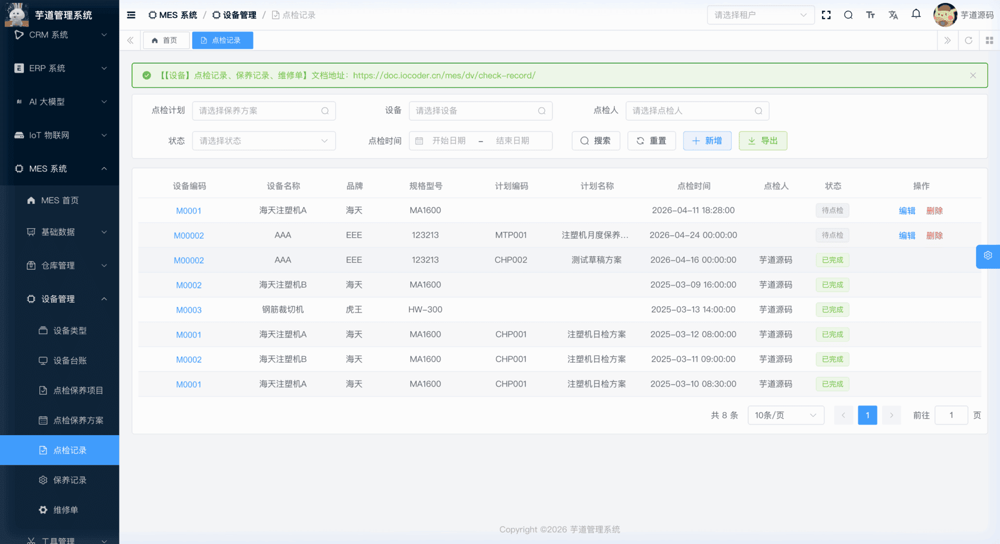 
#### # 新增
点击【新增】按钮，弹出点检记录表单。填写设备、点检计划（选填）、点检人、点检时间等主单信息后，点击【保存】。保存成功后，弹窗自动切换为编辑态，下方出现**点检项目明细**区域；如果已选择点检方案，系统会根据方案自动生成点检项目明细行。
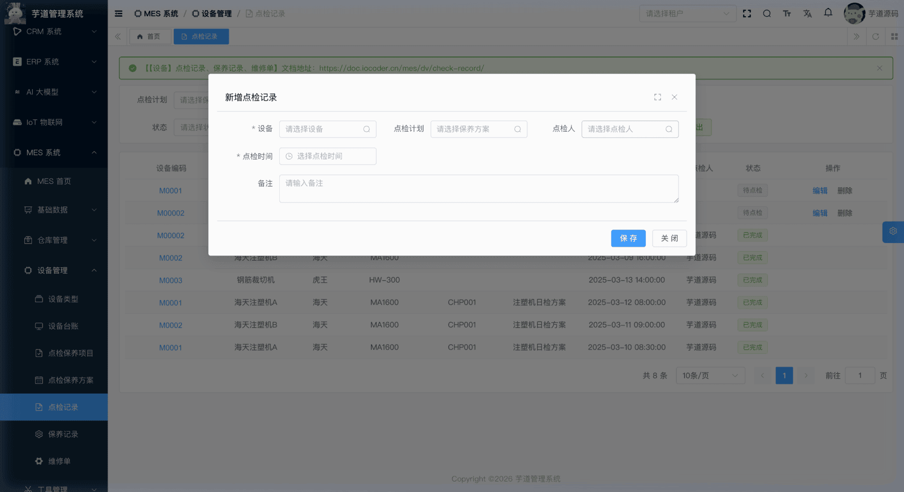 
#### # 修改
待点检状态下点击【编辑】按钮，弹出修改表单；点击设备编码链接可查看详情。修改表单下方通过 `el-divider` 分隔展示**点检项目明细**列表。若变更了点检方案，旧明细会被删除并按新方案重新生成。
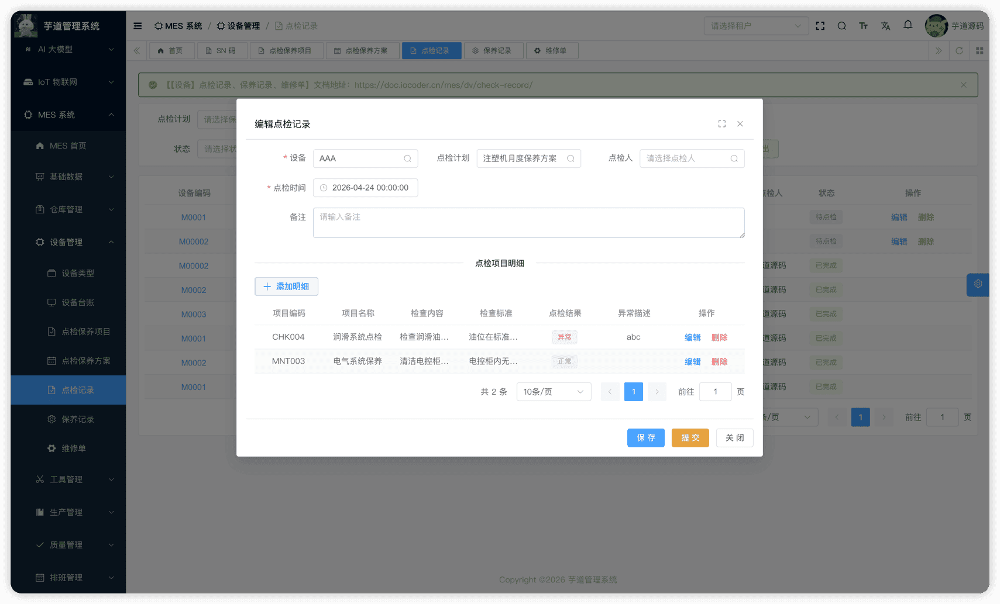 ★ **检查项目行**（编辑弹窗下方）：由 `mes_dv_check_record_line` 表存储。由 MesDvCheckRecordLineController 提供接口。
mes_dv_check_record_line 表结构 CREATE TABLE `mes_dv_check_record_line` (
`id` bigint NOT NULL AUTO_INCREMENT COMMENT '编号',
`record_id` bigint NOT NULL COMMENT '记录ID',
`subject_id` bigint NOT NULL COMMENT '项目ID',
`check_status` tinyint NOT NULL DEFAULT '1' COMMENT '检查结果',
`check_result` varchar(500) DEFAULT NULL COMMENT '异常描述',
`remark` varchar(500) DEFAULT '' COMMENT '备注',
PRIMARY KEY (`id`)
) ENGINE=InnoDB COMMENT='MES 点检记录行';
① `record_id` 关联主表 `mes_dv_check_record` 的 `id` 字段。
② `subject_id` 关联 `mes_dv_subject` 表的 `id` 字段（详见 [《【设备】点检保养项目、点检保养方案》](/mes/dv/check-plan/)）。
③ `check_status` 为检查结果，枚举 MesDvCheckResultEnum（1=正常，2=异常），自动生成时默认为"正常"。`check_result` 为异常描述，仅当检查结果为"异常"时填写。
#### # 提交
点检完毕后点击【提交】（`submitCheckRecord`），状态变为「已完成」。仅待点检状态可提交，且必须至少存在一条点检项目明细。
## # 2. 保养记录
保养记录，由 MesDvMaintenRecordController 提供接口。用于记录每次设备保养的执行结果。
### # 2.1 表结构
省略 creator/create_time/updater/update_time/deleted/tenant_id 等通用字段
CREATE TABLE `mes_dv_mainten_record` (
`id` bigint NOT NULL AUTO_INCREMENT COMMENT '编号',
`plan_id` bigint DEFAULT NULL COMMENT '方案ID',
`machinery_id` bigint NOT NULL COMMENT '设备ID',
`mainten_time` datetime NOT NULL COMMENT '保养时间',
`user_id` bigint DEFAULT NULL COMMENT '保养人',
`status` tinyint NOT NULL DEFAULT '0' COMMENT '状态',
`remark` varchar(500) DEFAULT '' COMMENT '备注',
PRIMARY KEY (`id`)
) ENGINE=InnoDB COMMENT='MES 保养记录';
① `plan_id` 关联 `mes_dv_check_plan` 表的 `id` 字段（详见 [《【设备】点检保养项目、点检保养方案》](/mes/dv/check-plan/)），选填。
② `machinery_id` 关联 `mes_dv_machinery` 表的 `id` 字段（详见 [《【设备】设备类型、设备台账》](/mes/dv/device/)），必填。
③ `mainten_time` 为保养时间，必填。`user_id` 关联系统用户（AdminUserDO），为保养人，选填（新增时默认填充当前登录用户）。
④ `status` 为记录状态，枚举 MesDvMaintenRecordStatusEnum（引用 MesOrderStatusConstants 常量）。当前页面字典显示为（0=待保养，4=已完成）。
该表包含一个子表：
- `mes_dv_mainten_record_line`（保养记录行）：每个保养项目的逐项结果。
### # 2.2 管理后台
对应 [MES 系统 -> 设备管理 -> 保养记录] 菜单，对应 `yudao-ui-admin-vue3` 项目的 `@/views/mes/dv/maintenrecord` 目录。
#### # 列表
支持按保养计划、设备、保养人、保养时间等条件搜索。
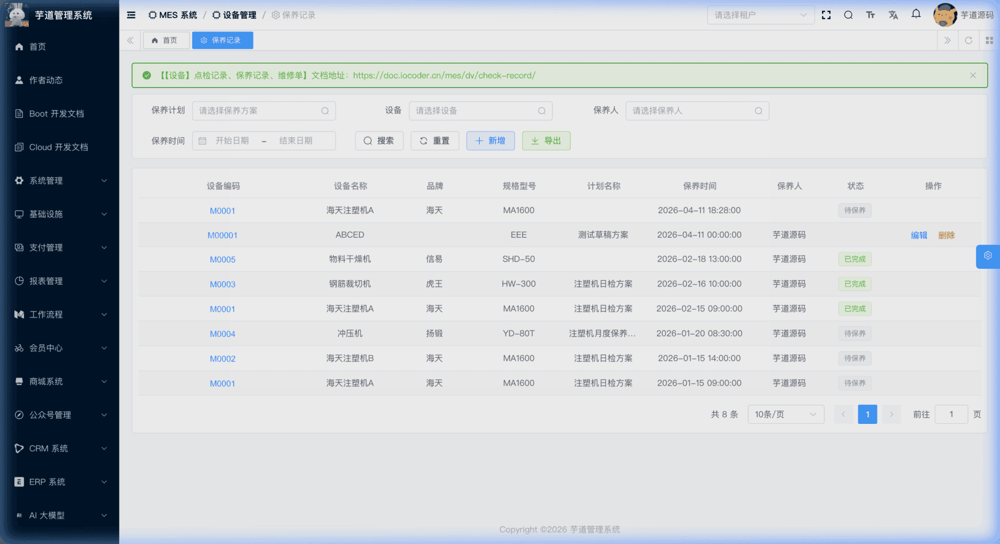 
#### # 新增
点击【新增】按钮，弹出保养记录表单。填写设备、保养计划（选填）、保养人、保养时间等主单信息后，点击【保存】。保存成功后，弹窗自动切换为编辑态，下方出现**保养项目明细**区域。
注意：当前实现不会根据保养方案自动生成明细行，需在编辑态手工添加保养项目明细。
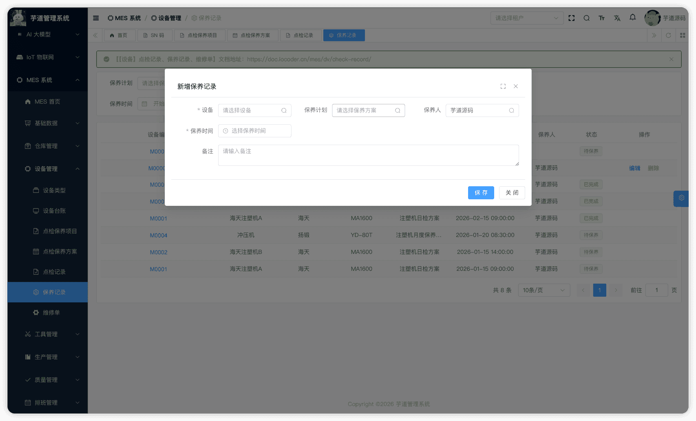 
#### # 修改
点击设备编码链接可查看详情；待保养状态下点击【编辑】按钮进入修改表单。下图展示详情弹窗，表单下方通过 `el-divider` 分隔展示**保养项目**列表：
111
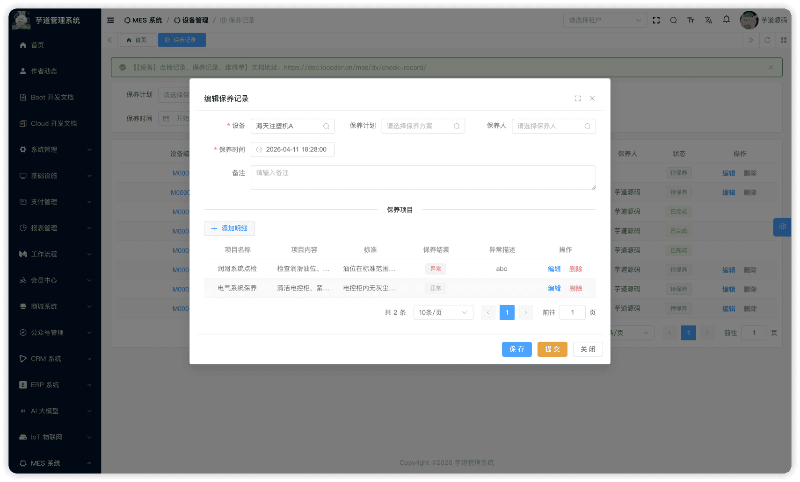 ★ **保养项目行**（编辑弹窗下方）：由 `mes_dv_mainten_record_line` 表存储。由 MesDvMaintenRecordLineController 提供接口。
mes_dv_mainten_record_line 表结构 CREATE TABLE `mes_dv_mainten_record_line` (
`id` bigint NOT NULL AUTO_INCREMENT COMMENT '编号',
`record_id` bigint NOT NULL COMMENT '记录ID',
`subject_id` bigint NOT NULL COMMENT '项目ID',
`status` tinyint NOT NULL COMMENT '保养结果',
`result` varchar(500) DEFAULT NULL COMMENT '异常描述',
`remark` varchar(500) DEFAULT '' COMMENT '备注',
PRIMARY KEY (`id`)
) ENGINE=InnoDB COMMENT='MES 保养记录行';
① `record_id` 关联主表 `mes_dv_mainten_record` 的 `id` 字段。
② `subject_id` 关联 `mes_dv_subject` 表的 `id` 字段（详见 [《【设备】点检保养项目、点检保养方案》](/mes/dv/check-plan/)）。
③ `status` 为保养结果。当前页面字典显示为（0=异常，1=正常）。`result` 为异常描述，仅当结果为"异常"时填写。
#### # 提交
保养完毕后点击【提交】（`submitMaintenRecord`），状态变为「已完成」。仅待保养状态可提交，且必须至少存在一条保养项目明细。
## # 3. 维修单
维修单，由 MesDvRepairController 提供接口。用于设备故障时创建维修工单，记录故障描述、维修过程和验收结果。维修人员填写维修描述与完成日期；验收人完成验收并写入维修结果。
### # 3.1 表结构
省略 creator/create_time/updater/update_time/deleted/tenant_id 等通用字段
CREATE TABLE `mes_dv_repair` (
`id` bigint NOT NULL AUTO_INCREMENT COMMENT '编号',
`code` varchar(64) NOT NULL COMMENT '维修工单编码',
`name` varchar(255) DEFAULT NULL COMMENT '维修工单名称',
`machinery_id` bigint NOT NULL COMMENT '设备ID',
`require_date` datetime DEFAULT NULL COMMENT '报修日期',
`finish_date` datetime DEFAULT NULL COMMENT '维修完成日期',
`confirm_date` datetime DEFAULT NULL COMMENT '验收日期',
`result` tinyint DEFAULT NULL COMMENT '维修结果',
`accepted_user_id` bigint DEFAULT NULL COMMENT '维修人',
`confirm_user_id` bigint DEFAULT NULL COMMENT '验收人',
`source_doc_type` tinyint DEFAULT NULL COMMENT '来源单据类型',
`source_doc_id` bigint DEFAULT NULL COMMENT '来源单据ID',
`source_doc_code` varchar(64) DEFAULT NULL COMMENT '来源单据编码',
`status` tinyint NOT NULL DEFAULT '0' COMMENT '状态',
`remark` varchar(500) DEFAULT '' COMMENT '备注',
PRIMARY KEY (`id`)
) ENGINE=InnoDB COMMENT='MES 维修工单';
① `machinery_id` 关联 `mes_dv_machinery` 表的 `id` 字段（详见 [《【设备】设备类型、设备台账》](/mes/dv/device/)），必填。
② `result` 为维修结果。当前页面字典显示为（1=修复成功，2=报废），由验收人在验收阶段（`finishRepair`）写入；创建和维修阶段该字段为空。
③ `accepted_user_id` 为维修人，提交时由系统自动写入当前操作人。`confirm_user_id` 为验收人，验收时由系统自动写入当前操作人。
④ `source_doc_type`、`source_doc_id`、`source_doc_code` 为来源单据预留字段，暂未使用。
⑤ `status` 为维修单状态，枚举 MesDvRepairStatusEnum（引用 MesOrderStatusConstants 常量）：
| 状态值 | 枚举名 | 说明 | 可执行操作 |
| --- | --- | --- | --- |
| 0 | PREPARE | 草稿 | 提交 |
| 1 | CONFIRMED | 维修中 | 完成维修 |
| 2 | APPROVING | 待验收 | 验收通过 / 报废 |
| 4 | FINISHED | 已确认 | — |
状态流转说明
创建 ──→ 草稿(0) ──提交──→ 维修中(1) ──完成维修──→ 待验收(2) ──验收──→ 已确认(4)
- **创建**（`createRepair`）：填写维修单编码、名称、设备、报修日期等，创建草稿。
- **提交**（`submitRepair`）：当前操作人自动写入 `accepted_user_id` 作为维修人，状态变为"维修中"。
- **完成维修**（`confirmRepair`）：维修人填写维修完成日期（`finish_date`），状态变为"待验收"。
- **验收**（`finishRepair`）：验收人选择维修结果（修复成功/报废），系统自动写入验收人（`confirm_user_id`）和验收日期（`confirm_date`），状态变为"已确认"。
该表包含一个子表：
- `mes_dv_repair_line`（维修行）：记录具体的故障项。
### # 3.2 管理后台
对应 [MES 系统 -> 设备管理 -> 维修工单] 菜单，对应 `yudao-ui-admin-vue3` 项目的 `@/views/mes/dv/repair` 目录。
#### # 列表
支持按维修单编码、名称、设备、维修结果、状态等条件搜索。
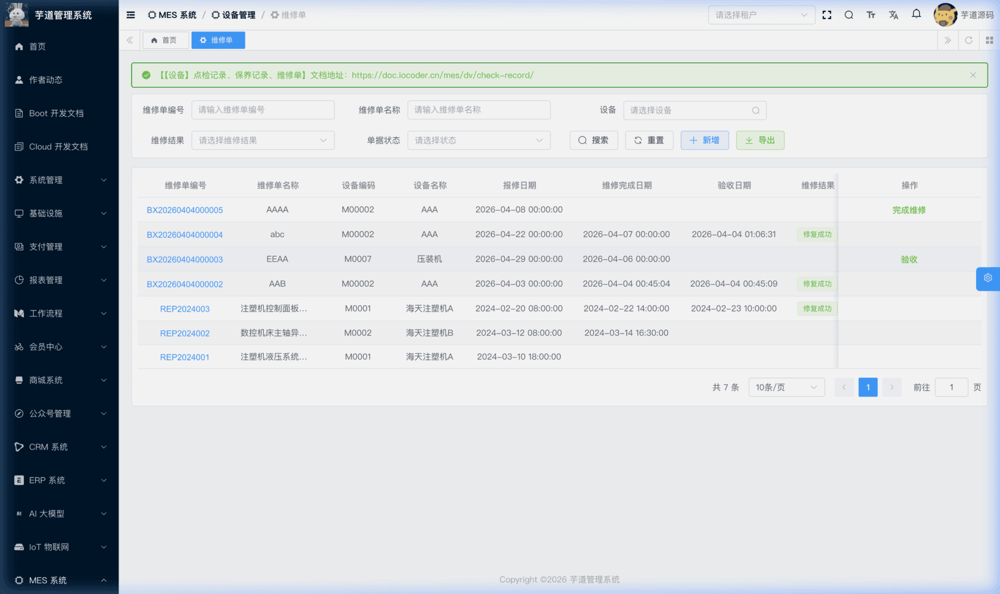 
#### # 新增
点击【新增】按钮，弹出维修单表单。填写维修单编码（可点击"生成"自动生成）、名称、设备、报修日期等主单信息后，点击【保存】。保存成功后，弹窗自动切换为编辑态，下方出现**维修项目明细**区域，可添加维修项目、故障描述等明细。
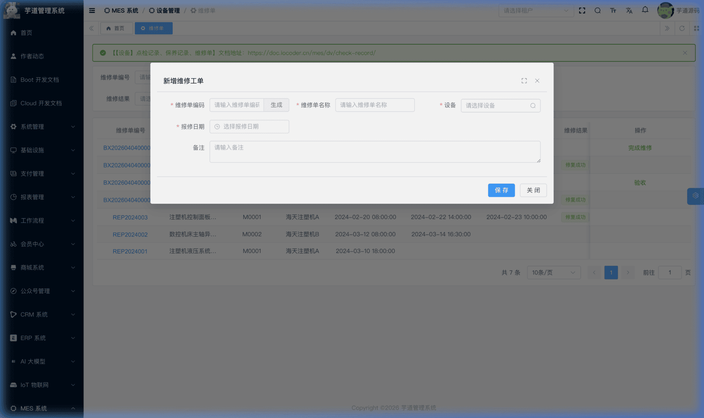 
#### # 修改
点击维修单编码链接可查看详情；草稿状态下点击【编辑】按钮进入修改表单。下图展示编辑表单，表单下方通过 `el-divider` 分隔展示**维修项目明细**列表：
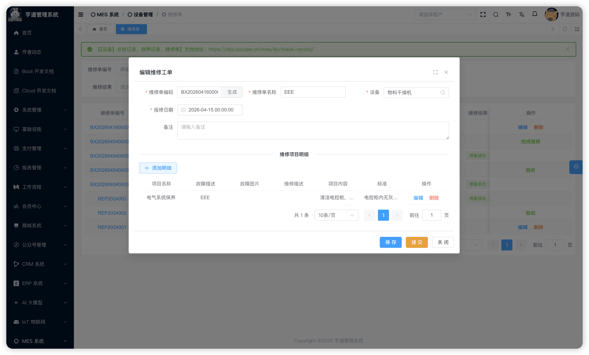 ★ **故障行**（编辑弹窗下方）：由 `mes_dv_repair_line` 表存储。由 MesDvRepairLineController 提供接口。
mes_dv_repair_line 表结构 CREATE TABLE `mes_dv_repair_line` (
`id` bigint NOT NULL AUTO_INCREMENT COMMENT '编号',
`repair_id` bigint NOT NULL COMMENT '维修单ID',
`subject_id` bigint DEFAULT NULL COMMENT '项目ID',
`malfunction` varchar(500) NOT NULL COMMENT '故障描述',
`malfunction_url` varchar(1000) DEFAULT NULL COMMENT '故障图片URL',
`description` varchar(500) DEFAULT NULL COMMENT '维修说明',
`remark` varchar(500) DEFAULT '' COMMENT '备注',
PRIMARY KEY (`id`)
) ENGINE=InnoDB COMMENT='MES 维修行';
① `repair_id` 关联主表 `mes_dv_repair` 的 `id` 字段。
② `subject_id` 关联 `mes_dv_subject` 表的 `id` 字段（选填，可关联具体的点检/保养项目，详见 [《【设备】点检保养项目、点检保养方案》](/mes/dv/check-plan/)）。
③ `malfunction` 为故障现象描述，`malfunction_url` 为故障照片。`description` 为维修说明。均为**说明性字段**，后端不参与业务逻辑判定。
#### # 提交
草稿状态下，点击列表中的【提交】按钮（或编辑弹窗内的【提交】），调用 `submitRepair`。系统自动将当前操作人写入 `accepted_user_id`（维修人），状态变为「维修中」。
#### # 完成维修
维修中状态下，列表操作列出现【完成维修】按钮。点击后弹出表单，维修人填写**维修完成日期**（`finish_date`），调用 `confirmRepair`，状态变为「待验收」。
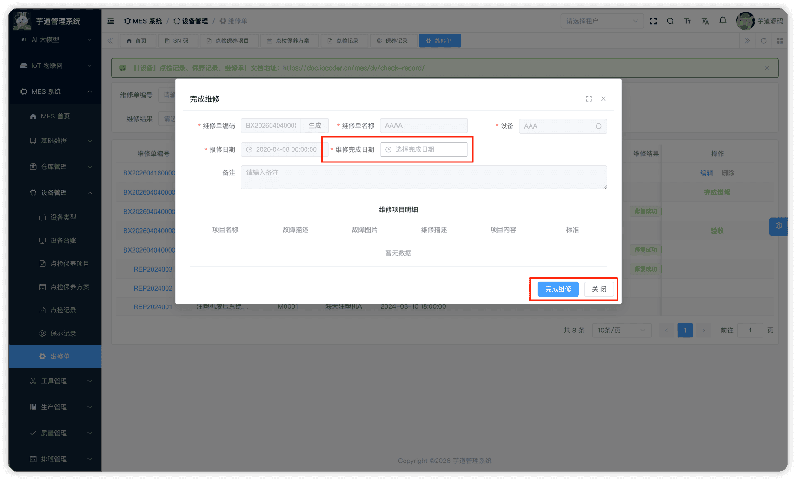 
#### # 验收
待验收状态下，列表操作列出现【验收】按钮。点击后弹出表单，验收人选择**维修结果**（修复成功 / 报废），调用 `finishRepair`。系统自动写入验收人（`confirm_user_id`）和验收日期（`confirm_date`），状态变为「已确认」。
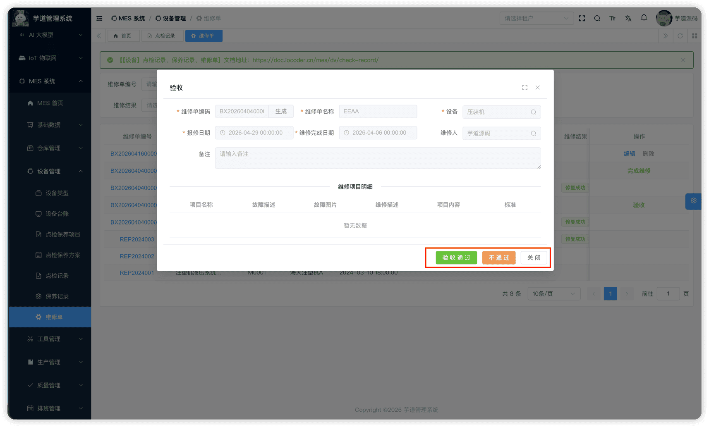 
.pageB img{width:80px!important;}
.wwads-horizontal .wwads-text, .wwads-content .wwads-text{line-height:1;}
[【设备】点检保养项目、点检保养方案](/mes/dv/check-plan/) [【工具】工具类型、工装夹具台账](/mes/tm/tool/) 
←
[【设备】点检保养项目、点检保养方案](/mes/dv/check-plan/) [【工具】工具类型、工装夹具台账](/mes/tm/tool/)→
 
Theme by
[Vdoing](https://github.com/xugaoyi/vuepress-theme-vdoing) 
| Copyright © 2019-2026
芋道源码 | MIT License   
- 跟随系统
- 浅色模式
- 深色模式
- 阅读模式
× 
.windowRB{ padding: 0;}
.windowRB .wwads-img{margin-top: 10px;}
.windowRB .wwads-content{margin: 0 10px 10px 10px;}
.custom-html-window-rb .close-but{
display: none;
}