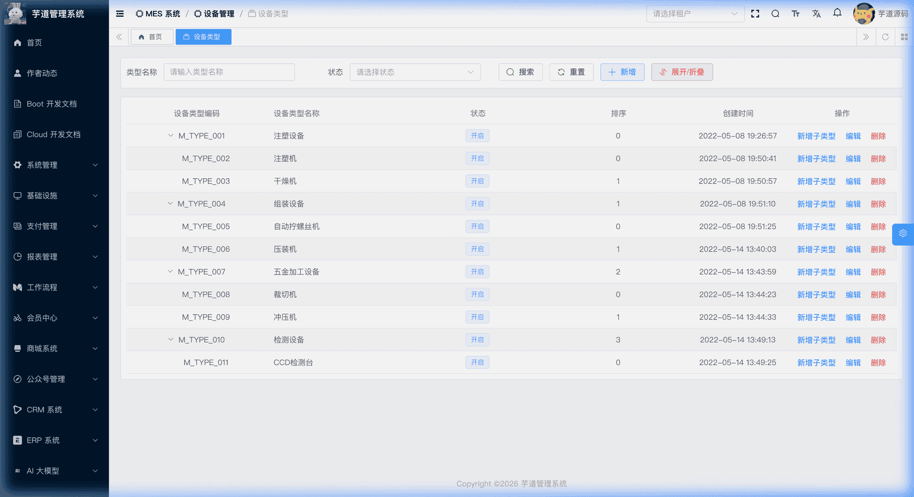
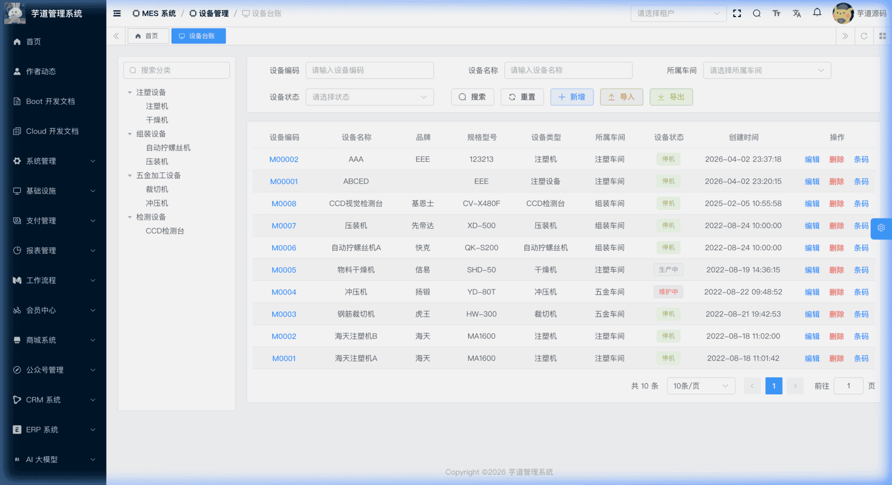
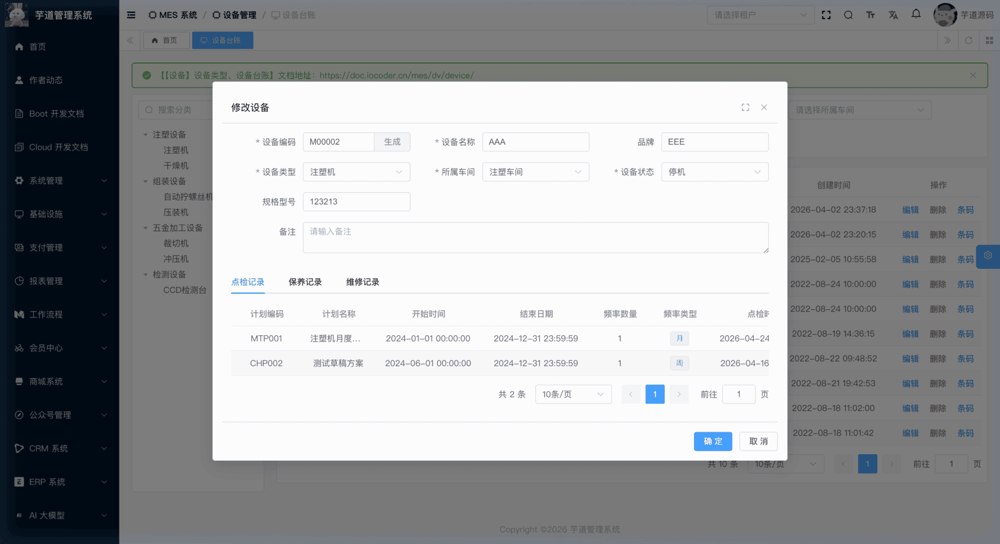

# 【设备】设备类型、设备台账

设备是工厂重要的生产要素，保证设备安全、稳定、高效持续运行是工厂运营的必要条件。设备管理模块由 `yudao-module-mes` 后端模块的 `dv` 包实现，从设备台账、设备保养、设备点检、设备维修几方面实现设备管理的信息化。其中，本文涉及的设备类型和设备台账位于 `dv.machinery` 子包。
本文涉及两个子模块：
- **设备类型**：以树形结构维护设备的分类，用户可根据工厂实际情况自定义配置。
- **设备台账**：记录每台设备的基本信息（编号、名称、品牌、规格型号）、所属车间、运行状态、最近点检/保养时间等。
本文涉及表如下图所示：
 
## # 1. 设备类型
设备类型，由 MesDvMachineryTypeController 提供接口。
### # 1.1 表结构
省略 creator/create_time/updater/update_time/deleted/tenant_id 等通用字段
CREATE TABLE `mes_dv_machinery_type` (
`id` bigint NOT NULL AUTO_INCREMENT COMMENT '编号',
`code` varchar(64) NOT NULL COMMENT '类型编码',
`name` varchar(255) NOT NULL COMMENT '类型名称',
`parent_id` bigint NOT NULL DEFAULT 0 COMMENT '父类型编号',
`status` tinyint NOT NULL DEFAULT '0' COMMENT '状态',
`sort` int NOT NULL DEFAULT 0 COMMENT '显示排序',
`remark` varchar(500) DEFAULT '' COMMENT '备注',
PRIMARY KEY (`id`)
) ENGINE=InnoDB COMMENT='MES 设备类型';
① `parent_id` 为父级类型 ID，关联自身 `id` 字段，支持树形层级结构。根节点的 `parent_id` 为 0。
② `status` 为通用启用/禁用状态，枚举 CommonStatusEnum（0=开启，1=关闭）。
### # 1.2 管理后台
对应 [MES 系统 -> 设备管理 -> 设备类型] 菜单，对应 `yudao-ui-admin-vue3` 项目的 `@/views/mes/dv/machinery/type` 目录。
设备类型提供**独立的树形管理页面**（`index.vue`），支持搜索、树表展示、展开折叠、新增子类型、编辑、删除等完整管理能力。同时，设备台账页面左侧通过 `MachineryTypeTree.vue` 组件复用设备类型树作为筛选条件。
以树形列表展示设备类型层级关系，用户可根据工厂实际情况自定义配置。支持新增、修改、删除操作。
 **删除限制**：删除设备类型前，系统会校验该类型下无子类型且无关联设备，否则禁止删除。
此外，修改父类型时，系统会校验父类型不能指向自身或自身的子孙节点，以防止形成环路。 
## # 2. 设备台账
设备台账，由 MesDvMachineryController 提供接口。
### # 2.1 表结构
省略 creator/create_time/updater/update_time/deleted/tenant_id 等通用字段
CREATE TABLE `mes_dv_machinery` (
`id` bigint NOT NULL AUTO_INCREMENT COMMENT '编号',
`code` varchar(64) NOT NULL COMMENT '设备编码',
`name` varchar(255) NOT NULL COMMENT '设备名称',
`brand` varchar(255) DEFAULT NULL COMMENT '品牌',
`specification` varchar(255) DEFAULT NULL COMMENT '规格型号',
`machinery_type_id` bigint NOT NULL COMMENT '设备类型ID',
`workshop_id` bigint NOT NULL COMMENT '所属车间ID',
`status` tinyint NOT NULL DEFAULT '1' COMMENT '设备状态',
`last_mainten_time` datetime DEFAULT NULL COMMENT '最近保养时间',
`last_check_time` datetime DEFAULT NULL COMMENT '最近点检时间',
`remark` varchar(500) DEFAULT NULL COMMENT '备注',
PRIMARY KEY (`id`)
) ENGINE=InnoDB COMMENT='MES 设备台账';
① `machinery_type_id` 关联 `mes_dv_machinery_type` 表的 `id` 字段。
② `workshop_id` 关联所属车间（详见 [《【基础】车间设置、工作站设置》](/mes/md/workshop/)）。
③ `status` 为设备运行状态，枚举 MesDvMachineryStatusEnum（1=停机，2=生产中，3=维护中）。
④ `last_mainten_time` 和 `last_check_time` 记录设备最近一次保养/点检时间，当前页面仅在详情模式下只读展示。
### # 2.2 管理后台
对应 [MES 系统 -> 设备管理 -> 设备台账] 菜单，对应 `yudao-ui-admin-vue3` 项目的 `@/views/mes/dv/machinery` 目录。
#### # 列表
支持按设备编码、名称、所属车间、设备状态等条件搜索，同时通过左侧设备类型树过滤。点击设备编码链接可进入“查看设备”详情模式（只读），操作列还提供“条码”按钮可查看该设备的条码信息（设备创建时自动生成）。
 
#### # 新增
点击【新增】按钮，弹出设备信息表单。主要填写设备编码（可自动生成）、设备名称、品牌、规格型号、设备类型、所属车间、设备状态。
#### # 修改
点击【编辑】按钮，弹出设备信息表单，字段与新增相同。非新增模式下，底部额外展示“点检记录”、“保养记录”、“维修记录（对应维修单列表）”三个关联列表 Tab，可快速查看该设备的历史记录（详见 [《【设备】点检记录、保养记录、维修单》](/mes/dv/check-record/)）。详情模式下，弹窗底部还提供“查看条码”按钮。
 **删除限制**：删除设备前，系统会校验该设备无关联的点检方案、点检记录、保养记录、维修记录，否则禁止删除。
.pageB img{width:80px!important;}
.wwads-horizontal .wwads-text, .wwads-content .wwads-text{line-height:1;}
[【质量】待检任务、检验结果、缺陷记录](/mes/qc/pending-inspect/) [【设备】点检保养项目、点检保养方案](/mes/dv/check-plan/) 
←
[【质量】待检任务、检验结果、缺陷记录](/mes/qc/pending-inspect/) [【设备】点检保养项目、点检保养方案](/mes/dv/check-plan/)→
 
Theme by
[Vdoing](https://github.com/xugaoyi/vuepress-theme-vdoing) 
| Copyright © 2019-2026
芋道源码 | MIT License   
- 跟随系统
- 浅色模式
- 深色模式
- 阅读模式
× 
.windowRB{ padding: 0;}
.windowRB .wwads-img{margin-top: 10px;}
.windowRB .wwads-content{margin: 0 10px 10px 10px;}
.custom-html-window-rb .close-but{
display: none;
}