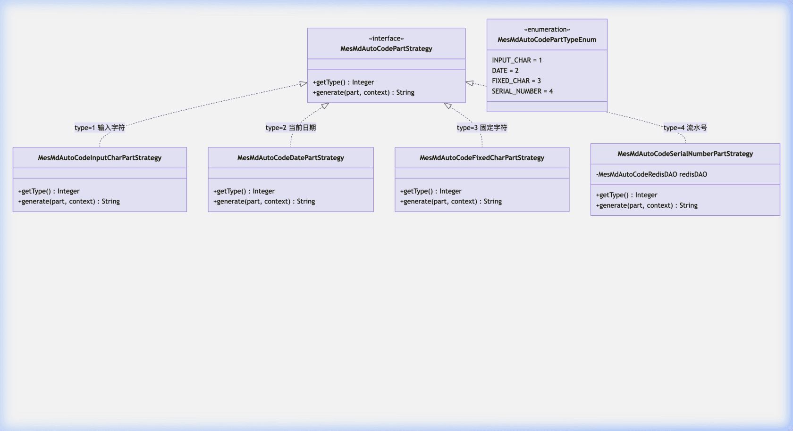
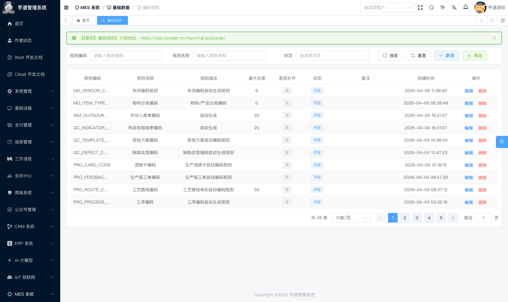
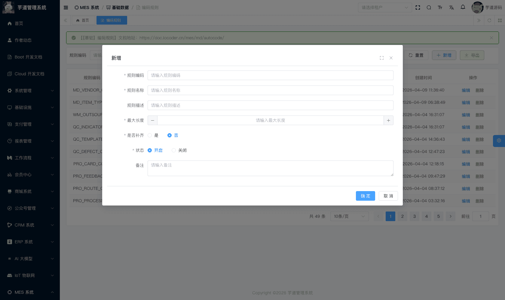
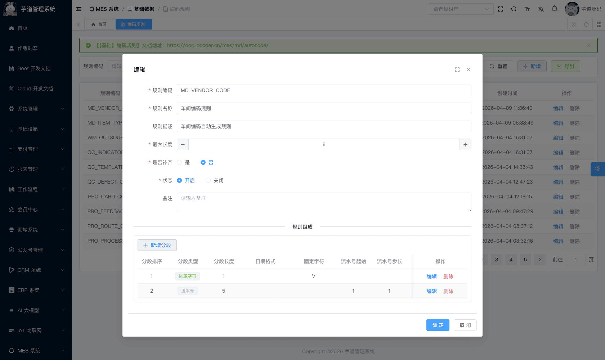
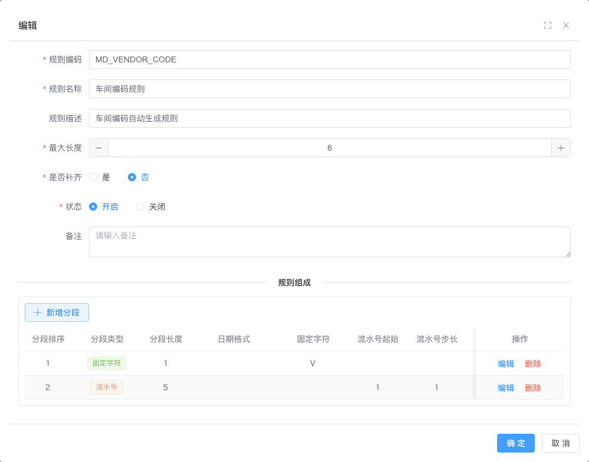
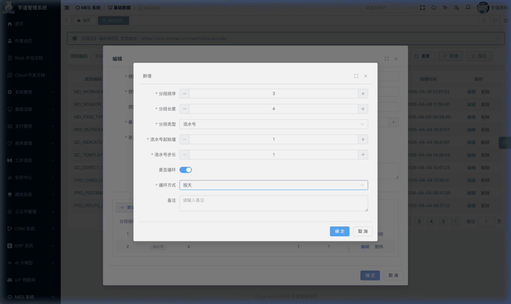

# 【基础】编码规则

编码规则模块，由 `yudao-module-mes` 后端模块的 `md.autocode` 包实现，提供**可配置的自动编码生成**能力。
- **编码规则**：用户可预先定义编码规则，为各个业务模块自动生成规范编码（如物料编码、工单编码、入库单编码等），免去手动输入并保证编码规范性。生成后系统会做重复检查，发现重复则抛出异常。
- **规则组成**：每条编码规则由若干「分段」组成，用户可按实际需要自由组合以下四种分段类型（**注意：每条规则最多只能配置一个流水号分段**，由后端 `validateSerialNumberPartUnique` 校验）： 输入字符：调用方在生成编码时动态传入的字符串。
- 当前日期：根据编码生成时刻自动获取的日期时间片段，支持 `yyyy`、`yyyyMM`、`yyyyMMdd`、`yyyyMMddHH`、`yyyyMMddHHmm` 等格式。
- 固定字符：由用户预先指定的固定文本串（如业务前缀 `WO`、`IQC` 等）。
- 流水号：自增序号，可设置起始值、步长，并支持按年/月/天/小时/分钟/传入字符等维度自动循环归零。
**生成记录**：每次生成编码后都会保存记录，用于重复检查和历史追溯。 
系统已为物料编码、客户编码、各类出入库单据编码、质检单编码、设备编码等 **30+ 种业务场景**内置了编码规则代码（详见 MesMdAutoCodeRuleCodeEnum 枚举）。业务新增流程可通过两种方式调用编码生成能力：前端表单通过 MesMdAutoCodeRecordController 的 `generateAutoCode` 接口，或后端服务直接调用 MesMdAutoCodeRecordService 的 `generateAutoCode` 方法。
生成接口入参说明
MesMdAutoCodeRecordController 的 `generateAutoCode` 方法：接收 `MesMdAutoCodeGenerateReqVO` 请求对象，至少需要传入 `ruleCode`（规则编码，必填）。
若该规则包含「输入字符」分段（`INPUT_CHAR`），则还需同时传入 `inputChar` 参数，否则该分段将输出空值。
本文涉及表如下图所示：
 
## # 1. 表结构
### # 1.1 编码规则表
编码规则，由 MesMdAutoCodeRuleController 提供接口。
省略 creator/create_time/updater/update_time/deleted/tenant_id 等通用字段
CREATE TABLE `mes_md_auto_code_rule` (
`id` bigint NOT NULL AUTO_INCREMENT COMMENT '规则 ID',
`code` varchar(64) NOT NULL COMMENT '规则编码',
`name` varchar(255) NOT NULL COMMENT '规则名称',
`description` varchar(500) DEFAULT NULL COMMENT '描述',
`remark` varchar(500) DEFAULT NULL COMMENT '备注',
`max_length` int DEFAULT NULL COMMENT '最大长度',
`padded` bit(1) NOT NULL DEFAULT b'0' COMMENT '是否补齐',
`padded_char` varchar(20) DEFAULT NULL COMMENT '补齐字符',
`padded_method` tinyint DEFAULT 1 COMMENT '补齐方式（1=左补齐 2=右补齐）',
`status` tinyint NOT NULL DEFAULT 0 COMMENT '状态（0=启用 1=禁用）',
PRIMARY KEY (`id`),
UNIQUE KEY `uk_code` (`code`, `deleted`, `tenant_id`) COMMENT '规则编码唯一索引'
) ENGINE=InnoDB COMMENT='MES 编码规则表';
① `code` 为规则编码，是业务模块调用编码生成接口时的唯一标识。系统通过 MesMdAutoCodeRuleCodeEnum 枚举维护了所有内置规则编码，如 `MD_ITEM_CODE`（物料编码）、`PRO_WORK_ORDER_CODE`（生产工单编码）、`QC_IQC_CODE`（来料检验单编码）等。
② `max_length` 为编码最大长度。当启用补齐（`padded = true`）时，生成的编码若不足此长度，会自动填充至该长度；若超出则截断。
③ `padded` 为补齐开关，与 `padded_char`（补齐字符）、`padded_method`（补齐方式）配合使用。`padded_method` 对应 MesMdAutoCodePaddedMethodEnum 枚举（1=左补齐，2=右补齐），默认为左补齐。例如：最大长度 10、补齐字符 `0`、左补齐，生成编码 `WO001` → 最终输出 `00000WO001`。
④ `status` 为规则状态，对应 CommonStatusEnum 枚举。当前生成编码时仅校验规则是否存在，不校验状态字段。
### # 1.2 规则组成（分段）
规则组成用于定义编码的拼接结构。每条编码规则可包含多个分段，按 `sort` 字段排序后依次拼接，最终组合为一个完整编码。由 MesMdAutoCodePartController 提供接口。
省略 creator/create_time/updater/update_time/deleted/tenant_id 等通用字段
CREATE TABLE `mes_md_auto_code_part` (
`id` bigint NOT NULL AUTO_INCREMENT COMMENT '分段 ID',
`rule_id` bigint NOT NULL COMMENT '规则 ID',
`sort` int NOT NULL COMMENT '分段序号',
`type` tinyint NOT NULL COMMENT '分段类型（1=输入字符 2=当前日期 3=固定字符 4=流水号）',
`length` int NOT NULL COMMENT '分段长度',
`date_format` varchar(20) DEFAULT NULL COMMENT '日期格式（当 type=2 时使用）',
`fix_character` varchar(64) DEFAULT NULL COMMENT '固定字符（当 type=3 时使用）',
`serial_start_no` int DEFAULT NULL COMMENT '流水号起始值（当 type=4 时使用）',
`serial_step` int DEFAULT NULL COMMENT '流水号步长（当 type=4 时使用）',
`cycle_flag` bit(1) DEFAULT b'0' COMMENT '流水号是否循环（当 type=4 时使用）',
`cycle_method` tinyint DEFAULT NULL COMMENT '循环方式（1=按年 2=按月 3=按天 4=按小时 5=按分钟 10=按传入字符）',
`remark` varchar(500) DEFAULT NULL COMMENT '备注',
PRIMARY KEY (`id`),
KEY `idx_rule_id` (`rule_id`) COMMENT '规则 ID 索引'
) ENGINE=InnoDB COMMENT='MES 编码规则组成表';
① `rule_id` 为规则编号，关联 `mes_md_auto_code_rule` 表的 `id` 字段。
② `sort` 为分段序号，决定各分段在最终编码中的拼接顺序（从小到大排列）。
③ `length` 为分段长度。生成的片段若超过此长度会被截取，若不足则保留原值（流水号分段会自动补零至指定长度）。
④ `type` 为分段类型，对应 MesMdAutoCodePartTypeEnum 枚举，共四种类型。**每条规则最多只能配置一个流水号分段**，由后端 `validateSerialNumberPartUnique` 校验，违反时抛出 `AUTO_CODE_PART_SERIAL_NUMBER_DUPLICATE`。
 类型值 枚举 说明 策略实现类 需要填写的字段 1 `INPUT_CHAR` 输入字符 `MesMdAutoCodeInputCharPartStrategy` 由调用方传入 `inputChar` 参数 2 `DATE` 当前日期 `MesMdAutoCodeDatePartStrategy` `date_format`（日期格式） 3 `FIXED_CHAR` 固定字符 `MesMdAutoCodeFixedCharPartStrategy` `fix_character`（固定字符值） 4 `SERIAL_NUMBER` 流水号 `MesMdAutoCodeSerialNumberPartStrategy` `serial_start_no`、`serial_step`、`cycle_flag`、`cycle_method` ⑤ 当 `type = 3`（固定字符）时，`fix_character` 为用户预先设定的固定文本，如 `WO`、`IQC`、`PO` 等业务前缀。
⑥ 当 `type = 2`（当前日期）时，`date_format` 为 Java 日期格式字符串。系统前端提供以下预设选项：`yyyy`、`yyyyMM`、`yyyyMMdd`、`yyyyMMddHH`、`yyyyMMddHHmm`。例如设置 `yyyyMMdd` 且当前日期为 2026-04-06，则该分段输出 `20260406`。
⑦ 当 `type = 4`（流水号）时，通过 Redis 原子递增生成序号，相关字段如下：
- `serial_start_no`：流水号起始值，默认为 1。
- `serial_step`：每次自增的步长，默认为 1。
- `cycle_flag`：是否启用循环归零。启用后流水号会在指定周期结束时自动重置为起始值。
- `cycle_method`：循环方式，对应 MesMdAutoCodeCycleMethodEnum 枚举，支持按年（`YEAR`）、按月（`MONTH`）、按天（`DAY`）、按小时（`HOUR`）、按分钟（`MINUTE`）循环，以及按传入字符（`INPUT_CHAR`）各自独立计数。
流水号并发安全
流水号的**计数值**通过 **Redis 原子递增**实现（见 `MesMdAutoCodeRedisDAO`），可保证计数值在高并发场景下不重复。但请注意：生成后系统会按 `length` 截取分段字符串（`StrUtil.sub`），若流水号数值的位数超过配置的 `length`，截断后的显示字符串仍可能重复。因此应确保 `length` 足够容纳预期的最大流水号位数。
Redis Key 前缀为 `mes:md:auto_code:`，实际格式根据是否循环有所不同：
- **非循环**（`cycleFlag = false`）：Key 为 `mes:md:auto_code:{ruleId}`，不带周期后缀，无过期时间；
- **启用循环**：Key 扩展为 `mes:md:auto_code:{ruleId}:{cycleKey}`，其中 `cycleKey` 根据循环方式生成（如按天为 `yyyyMMdd`、按传入字符为 `inputChar` 值）； 按年/月/天/小时/分钟循环的 Key 会设置对应的 TTL 自动过期（如按天循环 TTL 为 2 天）；
- 按传入字符（`INPUT_CHAR`）循环的 Key **默认不过期**（`getExpireDuration` 返回 `null`），需要时须手动清理。
### # 1.3 生成记录表
生成记录表用于存储每次编码生成的结果，由 MesMdAutoCodeRecordController 提供接口（仅暴露 `generate` 接口）。
省略 creator/create_time/updater/update_time/deleted/tenant_id 等通用字段
CREATE TABLE `mes_md_auto_code_record` (
`id` bigint NOT NULL AUTO_INCREMENT COMMENT '记录 ID',
`rule_id` bigint NOT NULL COMMENT '规则 ID',
`result` varchar(64) DEFAULT NULL COMMENT '生成的编码',
`serial_no` bigint DEFAULT NULL COMMENT '生成的流水号（当规则组成中包含流水号分段时记录）',
`input_char` varchar(64) DEFAULT NULL COMMENT '传入的参数',
PRIMARY KEY (`id`),
KEY `idx_rule_id` (`rule_id`) COMMENT '规则 ID 索引'
) ENGINE=InnoDB COMMENT='MES 编码生成记录表';
① `rule_id` 关联 `mes_md_auto_code_rule` 表的 `id` 字段，标识该编码是由哪条规则生成的。
② `result` 为最终输出的完整编码字符串。系统在生成后会查询该字段做**重复检查**（`select` + `insert`，非原子操作），若发现重复则抛出异常。
③ `input_char` 为调用方传入的参数值，供日后追溯查阅。
④ `serial_no` 为当次生成时的流水号数值（如 1、2、3...），当规则组成中包含流水号分段时记录，方便调试和定位问题。
### # 1.4 编码生成流程
编码生成的核心逻辑在 `MesMdAutoCodeRecordServiceImpl#generateAutoCode` 方法中，采用**策略模式**按分段类型（`type`）分发到对应的策略实现类（见 [1.2 规则组成](#_1-2-%E8%A7%84%E5%88%99%E7%BB%84%E6%88%90-%E5%88%86%E6%AE%B5) 的 `type` 枚举表），整体流程分为三步：
**① 生成编码**
1. 根据传入的 `ruleCode` 查询 `mes_md_auto_code_rule` 规则记录，校验规则是否存在（当前未校验 `status` 状态字段）。
1. 查询该规则下的 `mes_md_auto_code_part` 分段列表，按 `sort` 升序排列。
1. 构建 `MesMdAutoCodeContext` 上下文（包含规则信息、分段列表、调用方传入的 `inputChar`）。
1. 【重要】按顺序遍历每个分段，根据 `type` 匹配策略实现类（`INPUT_CHAR` → `InputCharPartStrategy`，`DATE` → `DatePartStrategy`，`FIXED_CHAR` → `FixedCharPartStrategy`，`SERIAL_NUMBER` → `SerialNumberPartStrategy`），生成各分段的编码片段并截取至 `length` 指定长度。
1. 将所有分段拼接为完整字符串。若规则启用了补齐（`padded = true`），则按 `padded_char` 和 `padded_method` 填充至 `max_length`。
**② 重复检查**
查询 `mes_md_auto_code_record` 表的 `result` 字段做重复检查（`select` + `insert`，非原子操作），若发现重复则抛出异常。
**③ 保存记录**
将生成结果写入 `mes_md_auto_code_record` 表，记录 `rule_id`、`result`（最终编码）、`input_char`（传入参数）、`serial_no`（流水号数值），最终返回编码字符串。
### # 1.5 编码生成示例
假设已创建如下编码规则（规则编码 `PRO_WORK_ORDER_CODE`，最大长度 20，左补齐，补齐字符 `0`）：
| 分段序号 | 分段类型 | 配置 | 分段长度 |
| --- | --- | --- | --- |
| 1 | 固定字符 | `WO` | 2 |
| 2 | 当前日期 | `yyyyMMdd` | 8 |
| 3 | 流水号 | 起始值=1，步长=1，按天循环 | 4 |
则 2026-04-06 当天第 1 次调用时生成编码：`WO` + `20260406` + `0001` = **`WO202604060001`**（长度 14，左补齐至 20 位后为 `000000WO202604060001`）。次日流水号自动归零，重新从 `0001` 开始。
## # 2. 管理后台
对应 [MES 系统 -> 基础数据 -> 编码规则] 菜单，对应 `yudao-ui-admin-vue3` 项目的 `@/views/mes/md/autocode` 目录。
### # 2.1 编码规则
#### # 列表
支持按规则编码、规则名称、状态等条件搜索。列表展示规则编码、名称、描述、最大长度、是否补齐、状态等信息。点击【删除】按钮会**级联删除**该规则下的所有分段配置（`partMapper.deleteByRuleId`），此操作不可逆。
 
#### # 新增
点击【新增】按钮，弹出编码规则新增表单。主要填写规则编码、规则名称、描述、最大长度、是否补齐等信息。若选择「补齐」，需进一步设置补齐字符和补齐方式（左补齐/右补齐）。
**注意**：新建规则时弹窗中**不会展示**规则组成分段列表（仅编辑模式下展示）。因此新建完成后，需再次点击【编辑】进入修改弹窗，维护至少一个分段配置，否则该规则无法用于生成编码（`generateAutoCode` 在分段列表为空时会抛出 `AUTO_CODE_GENERATE_FAILED`）。
 
#### # 修改
点击【编辑】按钮，弹出编码规则修改表单（宽 1000px 弹窗），底部包含该规则的**规则组成分段列表**。用户可在修改弹窗中同时维护规则的基本信息和分段配置。
 ★ **规则组成**（编码规则修改弹窗底部）：由 `mes_md_auto_code_part` 表存储，记录该规则的编码分段配置。对应 `AutoCodePartList.vue` 和 `AutoCodePartForm.vue` 组件，嵌套展示在编码规则的修改弹窗中。由 MesMdAutoCodePartController 提供接口。表结构和字段说明详见 [1.2 规则组成（分段）](#_1-2-%E8%A7%84%E5%88%99%E7%BB%84%E6%88%90-%E5%88%86%E6%AE%B5)。
#### # 分段列表
在编码规则修改弹窗底部展示该规则的所有分段，包含分段排序、分段类型、分段长度、日期格式、固定字符、流水号起始值、步长、是否循环、循环方式等列。
 
#### # 新增分段
点击分段列表上方【新增分段】按钮，弹出分段新增表单。主要选择分段类型，系统根据所选类型**动态展示**对应的配置字段（**每条规则最多只能配置一个流水号分段**）：
- 选择「当前日期」→ 显示日期格式下拉选择
- 选择「固定字符」→ 显示固定字符输入框
- 选择「流水号」→ 显示流水号起始值、步长、是否循环；启用循环后再显示循环方式
下图展示选中「流水号」类型后的动态字段：
 提示
当前编码生成记录表没有独立的管理界面，仅在后端通过数据库可查询历史生成记录。如需追溯某条编码的生成来源，可直接查询 `mes_md_auto_code_record` 表。
.pageB img{width:80px!important;}
.wwads-horizontal .wwads-text, .wwads-content .wwads-text{line-height:1;}
[【基础】车间设置、工作站设置](/mes/md/workshop/) [【生产】工序设置、工艺流程](/mes/pro/process-route/) 
←
[【基础】车间设置、工作站设置](/mes/md/workshop/) [【生产】工序设置、工艺流程](/mes/pro/process-route/)→
 
Theme by
[Vdoing](https://github.com/xugaoyi/vuepress-theme-vdoing) 
| Copyright © 2019-2026
芋道源码 | MIT License   
- 跟随系统
- 浅色模式
- 深色模式
- 阅读模式
× 
.windowRB{ padding: 0;}
.windowRB .wwads-img{margin-top: 10px;}
.windowRB .wwads-content{margin: 0 10px 10px 10px;}
.custom-html-window-rb .close-but{
display: none;
}