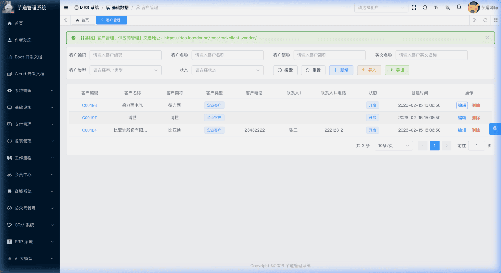
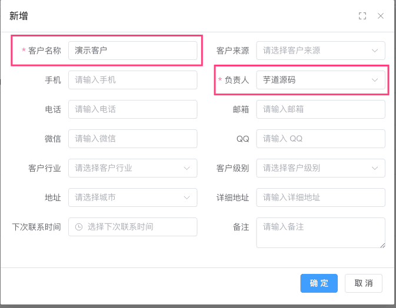
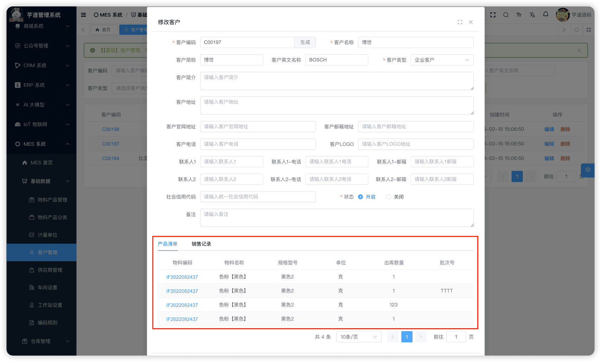
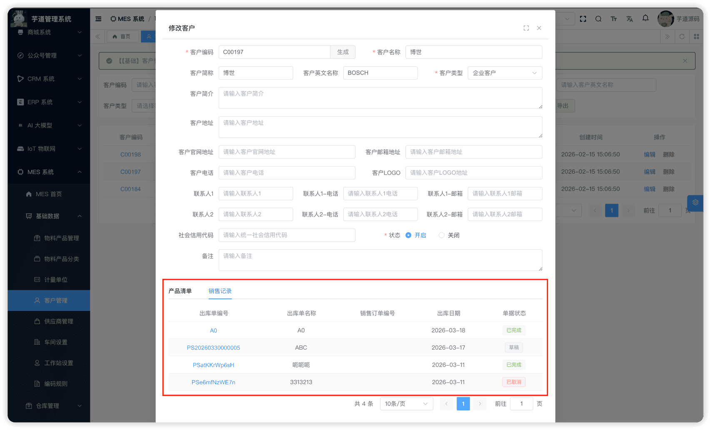
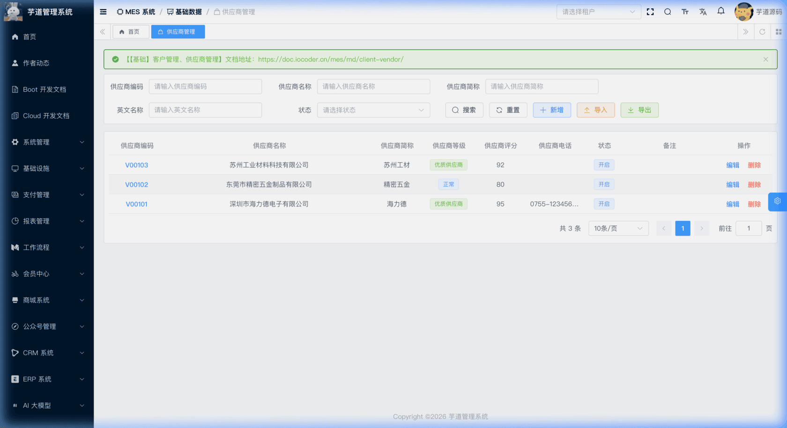
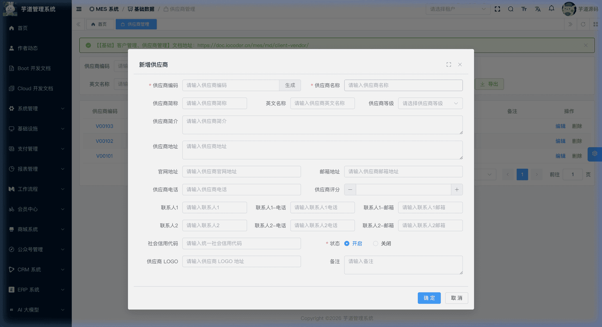
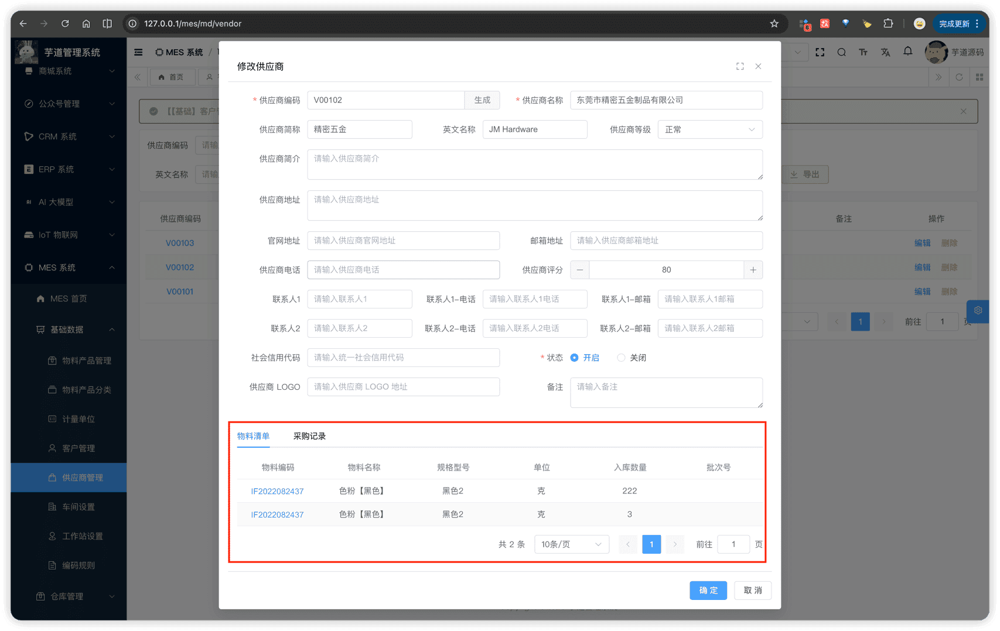
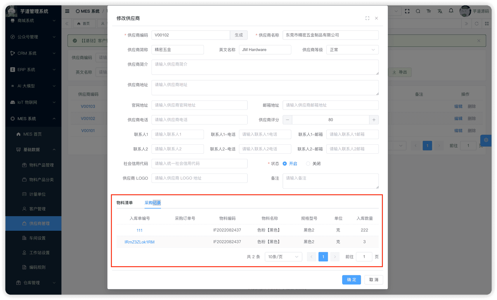

# 【基础】客户管理、供应商管理

客户与供应商模块，由 `yudao-module-mes` 后端模块的 `md` 包实现，主要有客户管理、供应商管理等功能。
- **客户**：销售出库、发货通知、出货检验等业务的必要关联数据。
- **供应商**：采购入库、到货通知、来料检验等业务的必要关联数据。
本文涉及表如下图所示：
 
## # 1. 客户管理
客户管理，由 MesMdClientController 提供接口。
### # 1.1 表结构
省略 creator/create_time/updater/update_time/deleted/tenant_id 等通用字段
CREATE TABLE `mes_md_client` (
`id` bigint NOT NULL AUTO_INCREMENT COMMENT '客户编号',
`code` varchar(64) NOT NULL COMMENT '客户编码',
`name` varchar(255) NOT NULL COMMENT '客户名称',
`nickname` varchar(255) DEFAULT NULL COMMENT '客户简称',
`english_name` varchar(255) DEFAULT NULL COMMENT '客户英文名称',
`description` varchar(500) DEFAULT NULL COMMENT '客户简介',
`logo` varchar(255) DEFAULT NULL COMMENT '客户LOGO地址',
`address` varchar(500) DEFAULT NULL COMMENT '客户地址',
`website` varchar(255) DEFAULT NULL COMMENT '客户官网地址',
`email` varchar(255) DEFAULT NULL COMMENT '客户邮箱地址',
`telephone` varchar(64) DEFAULT NULL COMMENT '客户电话',
`credit_code` varchar(64) DEFAULT NULL COMMENT '统一社会信用代码',
`remark` varchar(500) DEFAULT NULL COMMENT '备注',
`type` tinyint NOT NULL COMMENT '客户类型',
`contact1_name` varchar(64) DEFAULT NULL COMMENT '联系人1',
`contact1_telephone` varchar(64) DEFAULT NULL COMMENT '联系人1-电话',
`contact1_email` varchar(255) DEFAULT NULL COMMENT '联系人1-邮箱',
`contact2_name` varchar(64) DEFAULT NULL COMMENT '联系人2',
`contact2_telephone` varchar(64) DEFAULT NULL COMMENT '联系人2-电话',
`contact2_email` varchar(255) DEFAULT NULL COMMENT '联系人2-邮箱',
`status` tinyint NOT NULL DEFAULT '0' COMMENT '状态',
PRIMARY KEY (`id`)
) ENGINE=InnoDB COMMENT='MES 客户表';
① `type` 为客户类型，对应数据字典 `mes_client_type`。
② `contact1_*` / `contact2_*` 最多支持两个联系人，分别记录姓名、电话、邮箱。
③ `status` 为客户状态，对应 CommonStatusEnum 枚举。
### # 1.2 管理后台
对应 [MES 系统 -> 基础数据 -> 客户管理] 菜单，对应 `yudao-ui-admin-vue3` 项目的 `@/views/mes/md/client` 目录。
#### # 列表
支持按客户编码、名称、简称、英文名称、客户类型、状态等条件搜索。
 
#### # 新增
点击【新增】按钮，弹出客户新增表单。
 
#### # 修改
点击【编辑】按钮，弹出客户修改表单，底部包含以下 Tab 页：
 ★ **产品清单**（客户详情 Tab）：展示该客户关联的销售出库明细行，按 `clientId` 过滤关联记录，方便查看该客户购买过哪些产品，包含物料编码、物料名称、规格型号、单位、出库数量、批次号等信息。调用 `WmProductSalesLineApi.getProductSalesLinePage` 接口查询数据（来自 `mes_wm_product_sales_line` 表，后端由 MesWmProductSalesLineController 提供），详见 [《【仓库】发货通知、销售出库、销售退货》](/mes/wm/sales-out/)。
 ★ **销售记录**（客户详情 Tab）：展示该客户关联的销售出库单主单列表，按 `clientId` 过滤关联记录，包含出库单编号、出库单名称、销售订单编号、出库日期、单据状态等信息。调用 `WmProductSalesApi.getProductSalesPage` 接口查询数据（来自 `mes_wm_product_sales` 表，后端由 MesWmProductSalesController 提供），详见 [《【仓库】发货通知、销售出库、销售退货》](/mes/wm/sales-out/)。
## # 2. 供应商管理
供应商管理，由 MesMdVendorController 提供接口。
### # 2.1 表结构
省略 creator/create_time/updater/update_time/deleted/tenant_id 等通用字段
CREATE TABLE `mes_md_vendor` (
`id` bigint NOT NULL AUTO_INCREMENT COMMENT '供应商编号',
`code` varchar(64) NOT NULL COMMENT '供应商编码',
`name` varchar(255) NOT NULL COMMENT '供应商名称',
`nickname` varchar(255) DEFAULT NULL COMMENT '供应商简称',
`english_name` varchar(255) DEFAULT NULL COMMENT '供应商英文名称',
`description` varchar(500) DEFAULT NULL COMMENT '供应商简介',
`logo` varchar(255) DEFAULT NULL COMMENT '供应商LOGO地址',
`address` varchar(500) DEFAULT NULL COMMENT '供应商地址',
`website` varchar(255) DEFAULT NULL COMMENT '供应商官网地址',
`email` varchar(255) DEFAULT NULL COMMENT '供应商邮箱地址',
`telephone` varchar(64) DEFAULT NULL COMMENT '供应商电话',
`credit_code` varchar(64) DEFAULT NULL COMMENT '统一社会信用代码',
`score` int DEFAULT NULL COMMENT '供应商评分',
`remark` varchar(500) DEFAULT NULL COMMENT '备注',
`level` varchar(64) DEFAULT NULL COMMENT '供应商等级',
`contact1_name` varchar(64) DEFAULT NULL COMMENT '联系人1',
`contact1_telephone` varchar(64) DEFAULT NULL COMMENT '联系人1-电话',
`contact1_email` varchar(255) DEFAULT NULL COMMENT '联系人1-邮箱',
`contact2_name` varchar(64) DEFAULT NULL COMMENT '联系人2',
`contact2_telephone` varchar(64) DEFAULT NULL COMMENT '联系人2-电话',
`contact2_email` varchar(255) DEFAULT NULL COMMENT '联系人2-邮箱',
`status` tinyint NOT NULL DEFAULT '0' COMMENT '状态',
PRIMARY KEY (`id`)
) ENGINE=InnoDB COMMENT='MES 供应商表';
① `level` 为供应商等级，对应数据字典 `mes_vendor_level`（如 A、B、C），可用于供应商分级管理。
② `contact1_*` / `contact2_*` 最多支持两个联系人，分别记录姓名、电话、邮箱。
③ `status` 为供应商状态，对应 CommonStatusEnum 枚举。
### # 2.2 管理后台
对应 [MES 系统 -> 基础数据 -> 供应商管理] 菜单，对应 `yudao-ui-admin-vue3` 项目的 `@/views/mes/md/vendor` 目录。
#### # 列表
支持按供应商编码、名称、简称、英文名称、状态等条件搜索。
 
#### # 新增
点击【新增】按钮，弹出供应商新增表单。
 
#### # 修改
点击【编辑】按钮，弹出供应商修改表单，底部包含以下 Tab 页：
 ★ **物料清单**（供应商详情 Tab）：展示该供应商关联的采购入库明细行，按 `vendorId` 过滤关联记录，方便查看该供应商供应过哪些物料，包含物料编码、物料名称、规格型号、单位、入库数量、批次号等信息。调用 `WmItemReceiptLineApi.getItemReceiptLinePage` 接口查询数据（来自 `mes_wm_item_receipt_line` 表，后端由 MesWmItemReceiptLineController 提供），详见 [《【仓库】到货通知、采购入库、采购退货》](/mes/wm/purchase-in/)。
 ★ **采购记录**（供应商详情 Tab）：复用采购入库单行分页接口，按 `vendorId` 过滤后展示入库单编号、采购订单号、物料编码、物料名称、规格型号、单位、入库数量等关联视图。同样调用 `WmItemReceiptLineApi.getItemReceiptLinePage` 接口查询数据（来自 `mes_wm_item_receipt_line` 表，后端由 MesWmItemReceiptLineController 提供），详见 [《【仓库】到货通知、采购入库、采购退货》](/mes/wm/purchase-in/)。
.pageB img{width:80px!important;}
.wwads-horizontal .wwads-text, .wwads-content .wwads-text{line-height:1;}
[【基础】物料产品、分类、计量单位](/mes/md/product/) [【基础】车间设置、工作站设置](/mes/md/workshop/) 
←
[【基础】物料产品、分类、计量单位](/mes/md/product/) [【基础】车间设置、工作站设置](/mes/md/workshop/)→
 
Theme by
[Vdoing](https://github.com/xugaoyi/vuepress-theme-vdoing) 
| Copyright © 2019-2026
芋道源码 | MIT License   
- 跟随系统
- 浅色模式
- 深色模式
- 阅读模式
× 
.windowRB{ padding: 0;}
.windowRB .wwads-img{margin-top: 10px;}
.windowRB .wwads-content{margin: 0 10px 10px 10px;}
.custom-html-window-rb .close-but{
display: none;
}