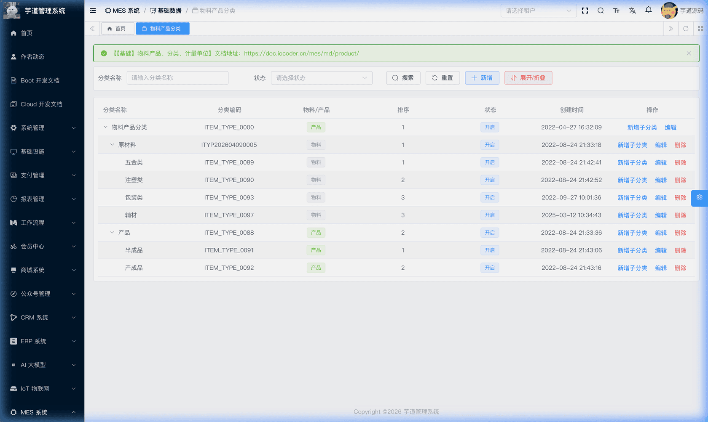
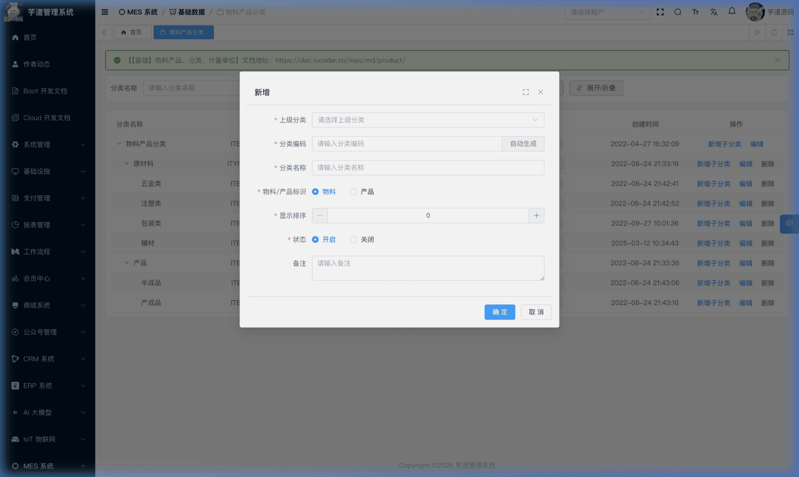
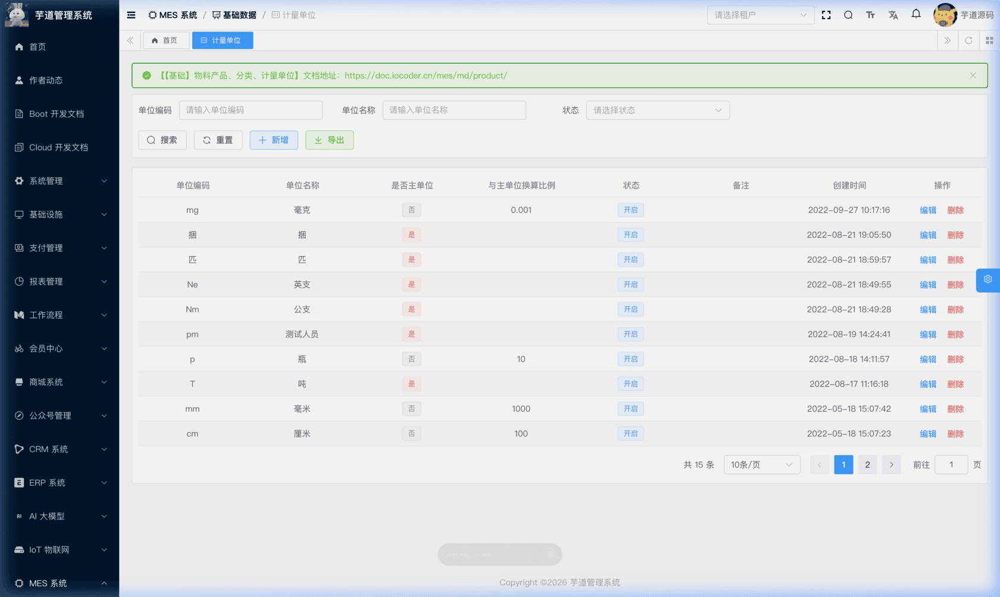
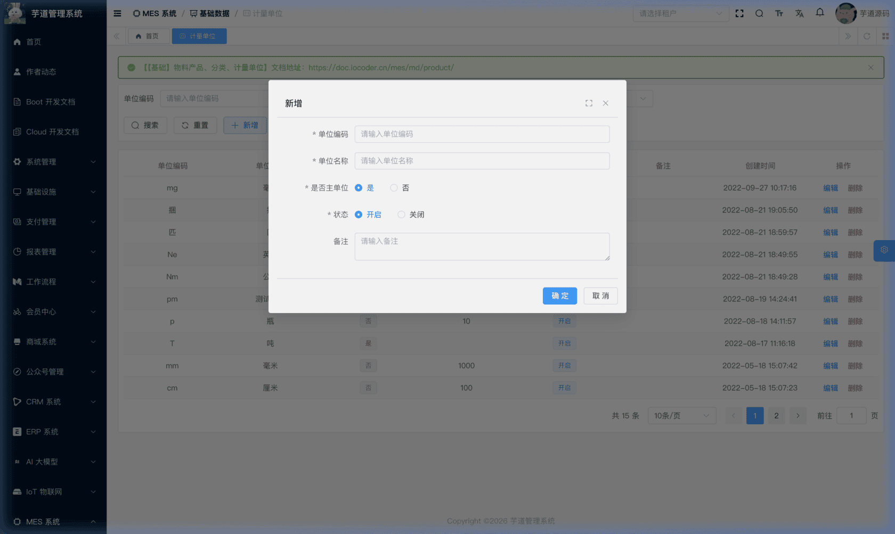
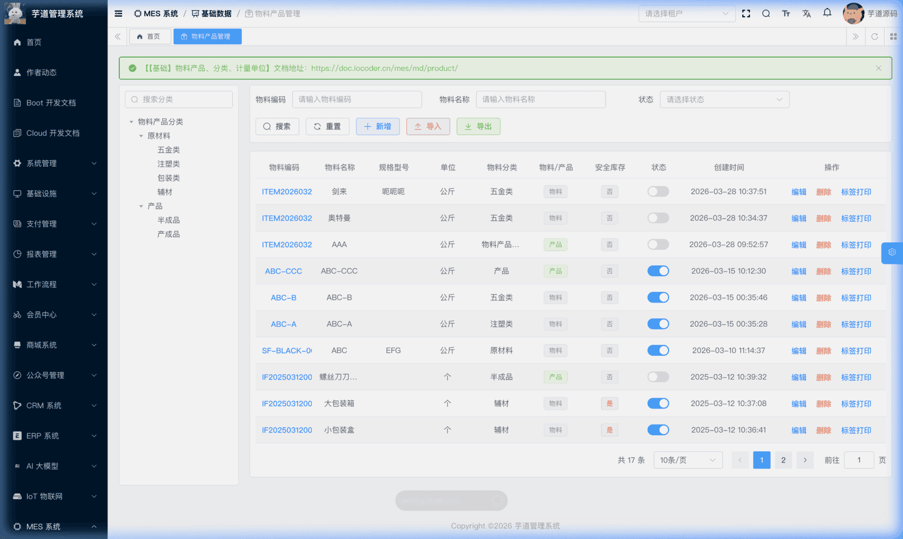
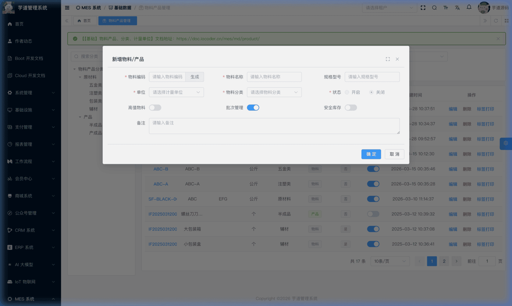
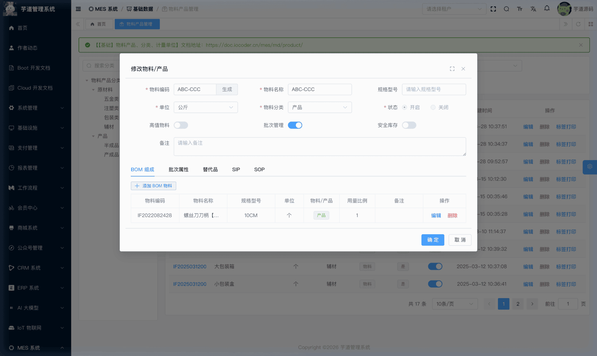
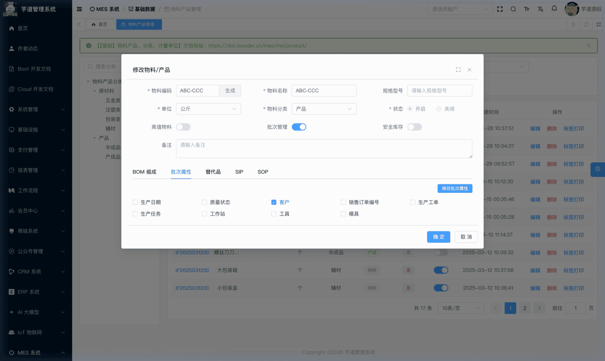
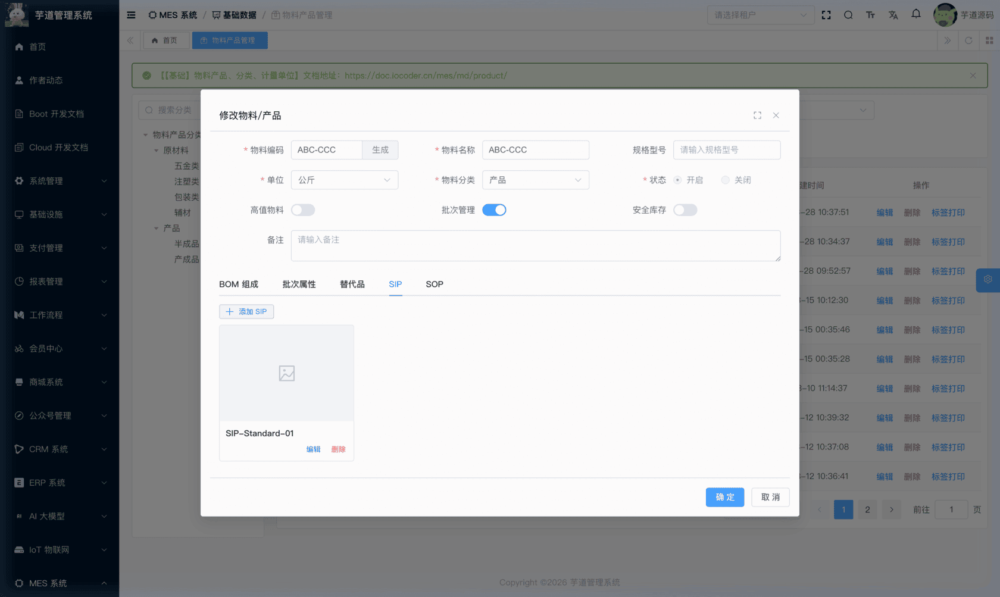
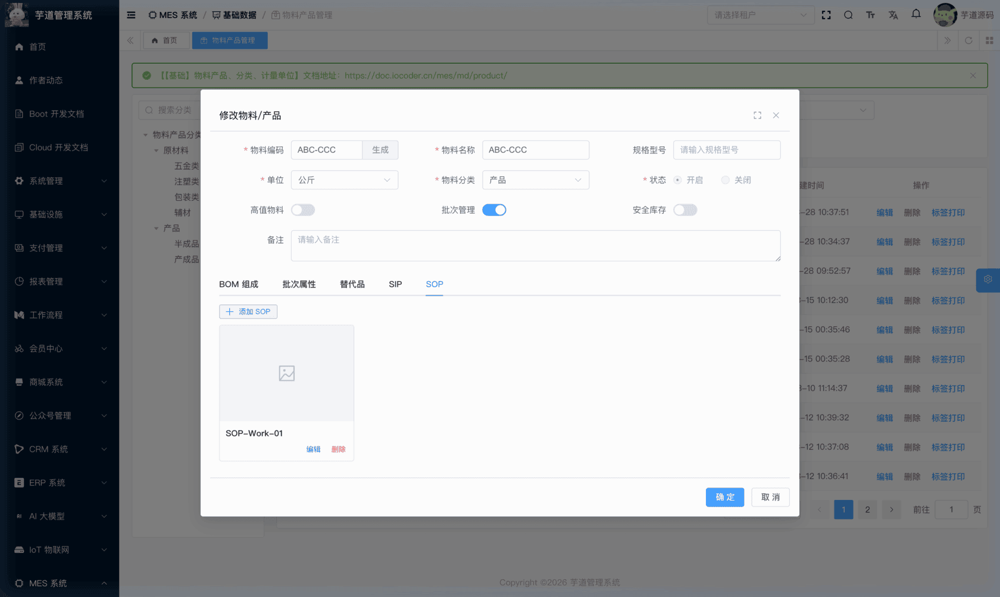

# 【基础】物料产品、分类、计量单位

物料产品模块，由 `yudao-module-mes` 后端模块的 `md` 包实现，主要有物料产品管理、物料产品分类、计量单位等功能。
- **物料产品**：MES 系统最核心的基础数据，几乎所有业务模块（生产、仓库、质检）都依赖于此。
- **物料产品分类**：以树形结构组织物料和产品的分类体系，区分「物料」与「产品」两种类型，为物料产品提供归类管理。
- **计量单位**：定义物料产品的度量基准，支持主单位与辅助单位的换算关系配置。
 
## # 1. 物料产品分类
物料产品分类，由 MesMdItemTypeController 提供接口。
### # 1.1 表结构
省略 creator/create_time/updater/update_time/deleted/tenant_id 等通用字段
CREATE TABLE `mes_md_item_type` (
`id` bigint NOT NULL AUTO_INCREMENT COMMENT '分类编号',
`code` varchar(64) NOT NULL COMMENT '分类编码',
`name` varchar(255) NOT NULL COMMENT '分类名称',
`sort` int NOT NULL DEFAULT '0' COMMENT '显示排序',
`remark` varchar(500) DEFAULT '' COMMENT '备注',
`parent_id` bigint NOT NULL DEFAULT '0' COMMENT '父分类编号',
`item_or_product` varchar(20) NOT NULL COMMENT '物料/产品标识',
`status` tinyint NOT NULL DEFAULT '0' COMMENT '状态',
PRIMARY KEY (`id`)
) ENGINE=InnoDB COMMENT='MES 物料产品分类表';
① `parent_id` 为父分类编号，顶级分类为 0，支持无限层级树形结构。
② `item_or_product` 为物料/产品标识，对应 MesMdItemTypeEnum 枚举，区分该分类下挂的是物料（ITEM）还是产品（PRODUCT）。
系统建议将从供应商采购且本厂不生产的物资指定为「物料」，将任何可以生产的物资指定为「产品」（实际生产中，同一个对象既可能是物料也可能是半成品/产品）。
③ `status` 为分类状态，对应 CommonStatusEnum 枚举。
### # 1.2 管理后台
对应 [MES 系统 -> 基础数据 -> 物料产品分类] 菜单，对应 `yudao-ui-admin-vue3` 项目的 `@/views/mes/md/item/type` 目录。
系统采用树形结构组织整个工厂中使用到的物料和产品分类信息，用户可根据工厂实际情况自行指定父子级关系。
#### # 列表
页面以树形表格展示所有物料产品分类，支持按分类名称和状态搜索，可展开/折叠整棵分类树。每行操作栏提供「新增子分类」「编辑」「删除」按钮（顶级分类不可删除）。
 
#### # 新增
点击【新增】按钮，弹出分类新增表单。需要选择上级分类、填写分类编码（支持自动生成）和名称，并指定当前分类是「物料」还是「产品」。在父级分类行点击「新增子分类」按钮时，上级分类会自动填充为当前行。
 
## # 2. 计量单位
计量单位，由 MesMdUnitMeasureController 提供接口。
### # 2.1 表结构
省略 creator/create_time/updater/update_time/deleted/tenant_id 等通用字段
CREATE TABLE `mes_md_unit_measure` (
`id` bigint NOT NULL AUTO_INCREMENT COMMENT '单位编号',
`code` varchar(64) NOT NULL COMMENT '单位编码',
`name` varchar(255) NOT NULL COMMENT '单位名称',
`remark` varchar(500) DEFAULT '' COMMENT '备注',
`primary_flag` bit(1) NOT NULL DEFAULT b'1' COMMENT '是否主单位',
`primary_id` bigint DEFAULT NULL COMMENT '主单位编号',
`change_rate` decimal(12,4) DEFAULT NULL COMMENT '与主单位换算比例',
`status` tinyint NOT NULL DEFAULT '0' COMMENT '状态',
PRIMARY KEY (`id`)
) ENGINE=InnoDB COMMENT='MES 计量单位表';
① `primary_flag` 标识是否为主单位。计量单位分为主单位和非主单位两种，主单位可被其它辅助单位引用作为换算基准。
② `primary_id` 为主单位编号，当 `primary_flag = false`（非主单位）时，需要选择对应的主单位（关联 `mes_md_unit_measure` 表的 `id` 字段），并指定与主单位的换算关系。
`change_rate` 为与主单位的换算比例，精度 4 位小数。例如主单位为「千克」，辅助单位「克」的换算比例为 0.0010。
③ `status` 为单位状态，对应 CommonStatusEnum 枚举。
### # 2.2 管理后台
对应 [MES 系统 -> 基础数据 -> 计量单位] 菜单，对应 `yudao-ui-admin-vue3` 项目的 `@/views/mes/md/unitmeasure` 目录。
#### # 列表
页面展示所有计量单位，支持按单位编码、名称和状态搜索，并提供导出功能。列表清晰展示每个单位的编码、名称、是否主单位、与主单位换算比例等信息。
 
#### # 新增
点击【新增】按钮，弹出单位新增表单。主要填写单位编码和名称。如果选择「非主单位」，则需要选择对应的主单位，并指定与主单位的换算关系。
 
## # 3. 物料产品
物料产品，由 MesMdItemController 提供接口。
### # 3.1 表结构
省略 creator/create_time/updater/update_time/deleted/tenant_id 等通用字段
CREATE TABLE `mes_md_item` (
`id` bigint NOT NULL AUTO_INCREMENT COMMENT '物料编号',
`code` varchar(64) NOT NULL COMMENT '物料编码',
`name` varchar(255) NOT NULL COMMENT '物料名称',
`specification` varchar(500) DEFAULT NULL COMMENT '规格型号',
`remark` varchar(500) DEFAULT '' COMMENT '备注',
`unit_measure_id` bigint NOT NULL DEFAULT '0' COMMENT '计量单位编号',
`item_type_id` bigint NOT NULL DEFAULT '0' COMMENT '物料分类编号',
`status` tinyint NOT NULL DEFAULT '0' COMMENT '状态',
`safe_stock_flag` bit(1) NOT NULL DEFAULT b'0' COMMENT '是否启用安全库存',
`min_stock` decimal(12,4) NOT NULL DEFAULT '0.0000' COMMENT '最低库存量',
`max_stock` decimal(12,4) NOT NULL DEFAULT '0.0000' COMMENT '最高库存量',
`high_value` bit(1) NOT NULL DEFAULT b'0' COMMENT '是否高值物料',
`batch_flag` bit(1) NOT NULL DEFAULT b'1' COMMENT '是否启用批次管理',
PRIMARY KEY (`id`)
) ENGINE=InnoDB COMMENT='MES 物料产品表';
① `item_type_id` 为物料分类编号，关联 `mes_md_item_type` 表的 `id` 字段。通过分类的 `item_or_product` 字段区分当前记录是物料还是产品。
② `unit_measure_id` 为计量单位编号，关联 `mes_md_unit_measure` 表的 `id` 字段。
③ `safe_stock_flag` 为安全库存开关。启用后 `min_stock`（最低库存量）、`max_stock`（最高库存量）生效，用于库存预警；关闭时自动清零。
④ `batch_flag` 为批次管理开关。启用批次管理后，物料在启用（`status` 切换为开启）前需完成批次属性配置（见下方 ★ 批次属性配置）；批次属性保存时，系统会校验至少勾选一个属性。
⑤ `high_value` 为高值物料标记，仅作为信息标识，无特别的业务逻辑。
⑥ `status` 为物料状态，对应 CommonStatusEnum 枚举。注意：启用产品类（PRODUCT）物料时，会校验是否已配置 BOM。
该表包含四个子表，在管理后台的修改弹窗中以 Tab 页形式维护：
- `mes_md_product_bom`（产品 BOM）：产品级物料清单，定义生产该产品需要消耗的物料/半成品。
- `mes_md_item_batch_config`（批次属性配置）：配置该物料在批次管理中需要记录哪些属性。
- `mes_md_product_sip`（SIP 检验规程）：挂载该物料的 SIP 检验标准文件。
- `mes_md_product_sop`（SOP 操作规程）：配置该产品在某道工序中的标准操作规程。
- 替代品（预留 Tab，暂未开放）：用于维护物料的替代关系，当前仅 UI 预留，功能尚未实现。
### # 3.2 管理后台
对应 [MES 系统 -> 基础数据 -> 物料产品管理] 菜单，对应 `yudao-ui-admin-vue3` 项目的 `@/views/mes/md/item` 目录。
#### # 列表
页面左侧为分类树，点击分类可过滤右侧物料列表。
 
#### # 新增
点击【新增】按钮，弹出物料新增表单。
 
#### # 修改
点击【编辑】按钮，弹出物料修改表单，底部包含以下 Tab 页：
 ★ **产品 BOM**（物料详情 Tab）：产品类物料的 BOM（Bill of Materials）组成清单，由 `mes_md_product_bom` 表存储。启用产品类物料前需先配置 BOM。点击「新增」按钮，可在弹出的物料产品清单中选择当前产品生产时需要消耗的物料/半成品。例如：产成品「螺丝刀」的 BOM 应配置为「螺丝刀刀头」和「螺丝刀刀柄」；「螺丝刀刀头」的 BOM 应配置为「螺纹钢」；「螺丝刀刀柄」的 BOM 应配置为「PVC 颗粒」。按照此逻辑可一直追溯到原材料级别。由 MesMdProductBomController 提供接口。
mes_md_product_bom 表结构 
省略 creator/create_time/updater/update_time/deleted/tenant_id 等通用字段
CREATE TABLE `mes_md_product_bom` (
`id` bigint NOT NULL AUTO_INCREMENT COMMENT 'BOM 编号',
`item_id` bigint NOT NULL COMMENT '物料产品 ID（父产品）',
`bom_item_id` bigint NOT NULL COMMENT 'BOM 物料 ID（子物料）',
`quantity` decimal(12,4) NOT NULL DEFAULT '0.0000' COMMENT '物料使用比例',
`status` tinyint NOT NULL DEFAULT '0' COMMENT '是否启用',
`remark` varchar(500) DEFAULT NULL COMMENT '备注',
PRIMARY KEY (`id`)
) ENGINE=InnoDB COMMENT='MES 产品BOM表（物料清单）';
① `item_id` 为父产品编号，关联 `mes_md_item` 表的 `id` 字段，表示这个 BOM 属于哪个产品。
② `bom_item_id` 为子物料编号，同样关联 `mes_md_item` 表的 `id` 字段，表示生产该产品所需的原材料。
③ `quantity` 为物料使用比例，即生产一个父产品需要多少数量的子物料。
 ★ **批次属性配置**（物料详情 Tab）：由 `mes_md_item_batch_config` 表存储，配置该物料在批次管理中需要记录哪些属性（生产日期、有效期、供应商、客户等）。由 MesMdItemBatchConfigController 提供接口。
mes_md_item_batch_config 表结构 
省略 creator/create_time/updater/update_time/deleted/tenant_id 等通用字段
CREATE TABLE `mes_md_item_batch_config` (
`id` bigint NOT NULL AUTO_INCREMENT COMMENT '编号',
`item_id` bigint NOT NULL COMMENT '物料编号',
`produce_date_flag` bit(1) NOT NULL DEFAULT b'0' COMMENT '批次属性-生产日期',
`expire_date_flag` bit(1) NOT NULL DEFAULT b'0' COMMENT '批次属性-有效期',
`receipt_date_flag` bit(1) NOT NULL DEFAULT b'0' COMMENT '批次属性-入库日期',
`vendor_flag` bit(1) NOT NULL DEFAULT b'0' COMMENT '批次属性-供应商',
`client_flag` bit(1) NOT NULL DEFAULT b'0' COMMENT '批次属性-客户',
`sales_order_code_flag` bit(1) NOT NULL DEFAULT b'0' COMMENT '批次属性-销售订单编号',
`purchase_order_code_flag` bit(1) NOT NULL DEFAULT b'0' COMMENT '批次属性-采购订单编号',
`work_order_flag` bit(1) NOT NULL DEFAULT b'0' COMMENT '批次属性-生产工单',
`task_flag` bit(1) NOT NULL DEFAULT b'0' COMMENT '批次属性-生产任务',
`workstation_flag` bit(1) NOT NULL DEFAULT b'0' COMMENT '批次属性-工作站',
`tool_flag` bit(1) NOT NULL DEFAULT b'0' COMMENT '批次属性-工具',
`mold_flag` bit(1) NOT NULL DEFAULT b'0' COMMENT '批次属性-模具',
`lot_number_flag` bit(1) NOT NULL DEFAULT b'0' COMMENT '批次属性-生产批号',
`quality_status_flag` bit(1) NOT NULL DEFAULT b'0' COMMENT '批次属性-质量状态',
PRIMARY KEY (`id`),
UNIQUE KEY `uk_item_id` (`item_id`)
) ENGINE=InnoDB COMMENT='MES 物料批次属性配置表';
① `item_id` 关联 `mes_md_item` 表的 `id` 字段，一对一关系。每个 `*_flag` 字段控制该物料在仓库批次流转时是否需要记录对应属性。
② 各 `*_flag` 字段为布尔开关，按需勾选。勾选后，该属性将纳入批次管理的记录范围。例如勾选 `vendor_flag`，表示该物料的批次需要记录供应商信息；勾选 `expire_date_flag`，表示需要记录有效期。具体的下游消费逻辑（如生产工单中 `clientFlag=true` 时客户必填）由各业务模块自行实现。
 ★ **SIP 检验规程**（物料详情 Tab）：由 `mes_md_product_sip` 表存储，挂载该物料的 SIP 检验标准文件。由 MesMdProductSipController 提供接口。
mes_md_product_sip 表结构 
省略 creator/create_time/updater/update_time/deleted/tenant_id 等通用字段
CREATE TABLE `mes_md_product_sip` (
`id` bigint NOT NULL AUTO_INCREMENT COMMENT 'SIP 编号',
`title` varchar(255) DEFAULT NULL COMMENT '标题',
`description` varchar(500) DEFAULT NULL COMMENT '详细描述',
`url` varchar(255) DEFAULT NULL COMMENT '图片地址',
`sort` int DEFAULT NULL COMMENT '排列顺序',
`item_id` bigint NOT NULL COMMENT '物料产品 ID',
`process_id` bigint DEFAULT NULL COMMENT '工序 ID',
`remark` varchar(500) DEFAULT NULL COMMENT '备注',
PRIMARY KEY (`id`)
) ENGINE=InnoDB COMMENT='MES 产品标准检验程序表（SIP）';
① `item_id` 关联 `mes_md_item` 表的 `id` 字段，表示该 SIP 属于哪个物料产品。
② `process_id` 关联工序表，指定该检验规程对应的生产工序。
③ `url` 为检验规程的图片地址，支持上传检验标准截图等图片资料。
 ★ **SOP 操作规程**（物料详情 Tab）：由 `mes_md_product_sop` 表存储，用于维护当前产品在指定工序上的 SOP（Standard Operating Procedure，标准操作规程）资料。用户可将 SOP 信息扫描为图片上传，绑定到对应工序。由 MesMdProductSopController 提供接口。
mes_md_product_sop 表结构 
省略 creator/create_time/updater/update_time/deleted/tenant_id 等通用字段
CREATE TABLE `mes_md_product_sop` (
`id` bigint NOT NULL AUTO_INCREMENT COMMENT 'SOP 编号',
`title` varchar(255) DEFAULT NULL COMMENT '标题',
`description` varchar(500) DEFAULT NULL COMMENT '详细描述',
`url` varchar(255) DEFAULT NULL COMMENT '图片地址',
`sort` int DEFAULT NULL COMMENT '排列顺序',
`remark` varchar(500) DEFAULT NULL COMMENT '备注',
`item_id` bigint NOT NULL COMMENT '物料产品 ID',
`process_id` bigint DEFAULT NULL COMMENT '工序 ID',
PRIMARY KEY (`id`)
) ENGINE=InnoDB COMMENT='MES 产品标准作业程序表（SOP）';
① `item_id` 关联 `mes_md_item` 表的 `id` 字段，表示该 SOP 属于哪个物料产品。
② `process_id` 关联工序表，指定该操作规程对应的生产工序，详见 [《【生产】工序设置、工艺流程》](/mes/pro/process-route/)。
.pageB img{width:80px!important;}
.wwads-horizontal .wwads-text, .wwads-content .wwads-text{line-height:1;}
[功能开启](/mes/build/) [【基础】客户管理、供应商管理](/mes/md/client-vendor/) 
←
[功能开启](/mes/build/) [【基础】客户管理、供应商管理](/mes/md/client-vendor/)→
 
Theme by
[Vdoing](https://github.com/xugaoyi/vuepress-theme-vdoing) 
| Copyright © 2019-2026
芋道源码 | MIT License   
- 跟随系统
- 浅色模式
- 深色模式
- 阅读模式
× 
.windowRB{ padding: 0;}
.windowRB .wwads-img{margin-top: 10px;}
.windowRB .wwads-content{margin: 0 10px 10px 10px;}
.custom-html-window-rb .close-but{
display: none;
}