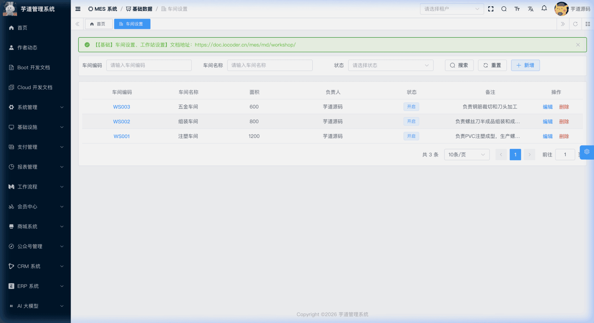
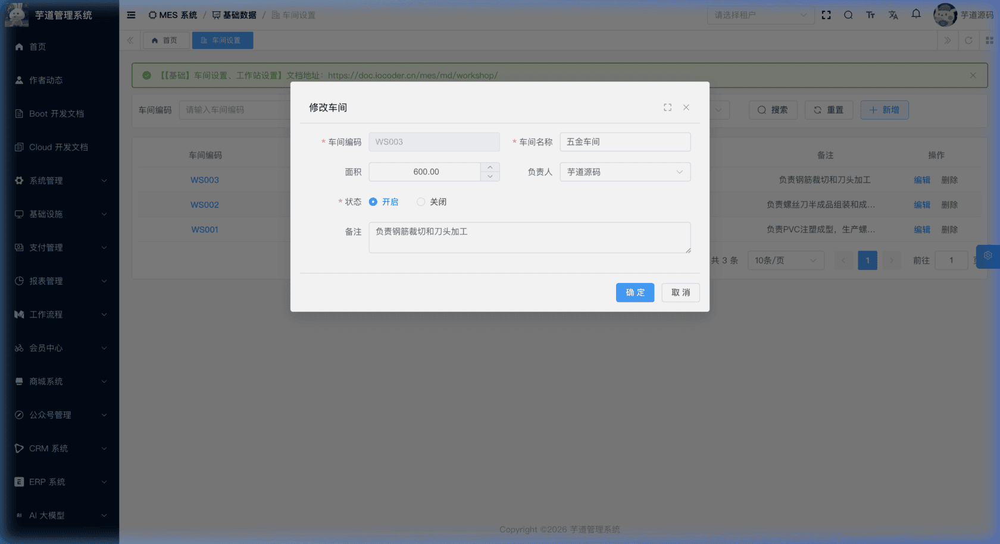
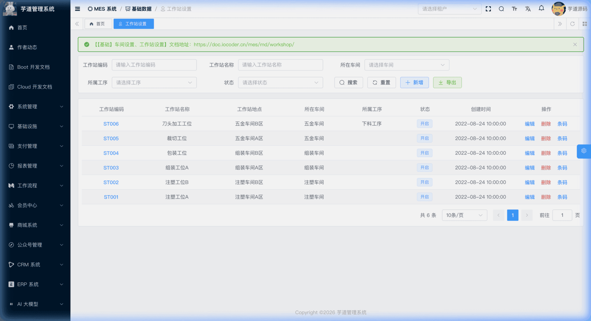
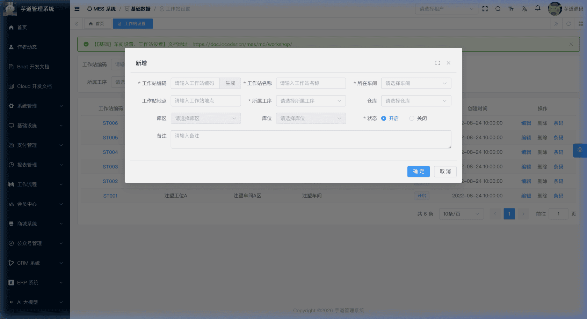
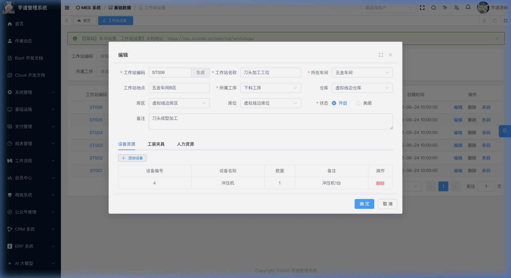
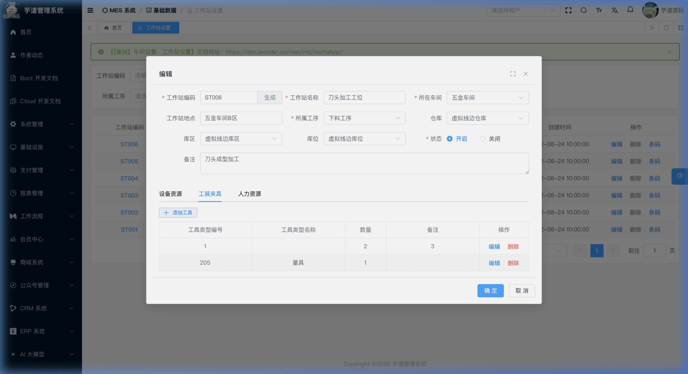
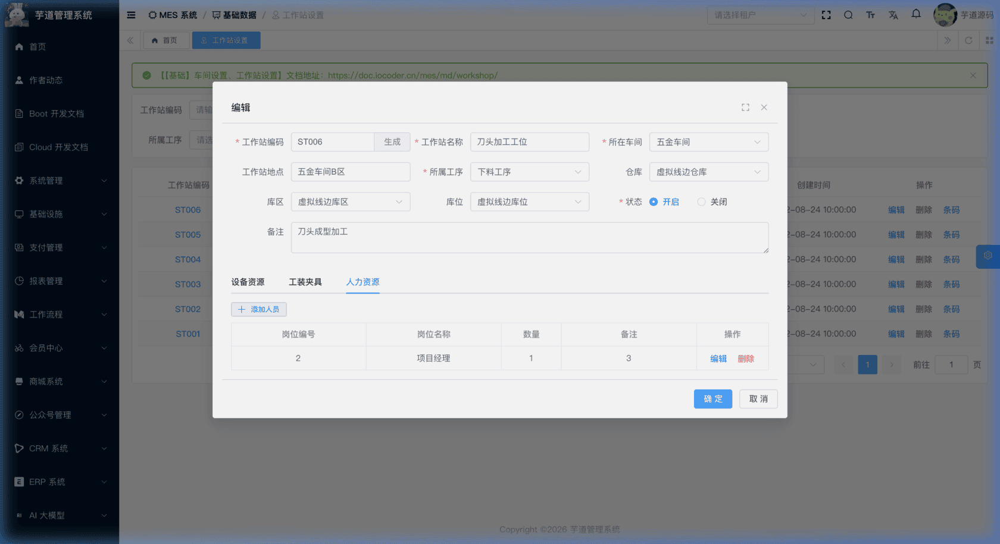

# 【基础】车间设置、工作站设置

车间与工作站模块，由 `yudao-module-mes` 后端模块的 `md.workstation` 包实现，主要有车间设置、工作站设置等功能。
- **车间**：工厂的物理生产区域划分单元。一个工厂通常包含多个车间（如注塑车间、组装车间、五金车间），每个车间有独立的负责人和面积属性。车间是工作站的上级组织单位，也是设备台账、生产排产等模块的关联维度。
- **工作站**：工作站是工厂中某道工序的基本生产单元，也是生产排产时生产任务的最小负责单元。每个工作站归属于某个车间，绑定一道工序，可包含 0~N 台机器设备、0~N 个岗位工人以及配套的工装夹具等完成该工序所需的全部资源；同时可关联仓库（仓库→库区→库位）用于物料暂存。工作站状态当前由 `status` 字段控制；设备、工装夹具、人力资源子表用于记录资源配置关系。
本文涉及表如下图所示：
 
## # 1. 车间设置
车间设置，由 MesMdWorkshopController 提供接口。
### # 1.1 表结构
省略 creator/create_time/updater/update_time/deleted/tenant_id 等通用字段
CREATE TABLE `mes_md_workshop` (
`id` bigint NOT NULL AUTO_INCREMENT COMMENT '车间编号',
`code` varchar(64) NOT NULL COMMENT '车间编码',
`name` varchar(100) NOT NULL COMMENT '车间名称',
`area` decimal(12,2) DEFAULT NULL COMMENT '面积',
`remark` varchar(500) DEFAULT NULL COMMENT '备注',
`charge_user_id` bigint DEFAULT NULL COMMENT '负责人用户 ID',
`status` tinyint NOT NULL DEFAULT 0 COMMENT '状态',
PRIMARY KEY (`id`),
UNIQUE KEY `uk_code` (`code`)
) ENGINE=InnoDB COMMENT='MES 车间';
都是一些信息字段，仅仅用于展示，没有什么特殊逻辑。
### # 1.2 管理后台
对应 [MES 系统 -> 基础数据 -> 车间管理] 菜单，对应 `yudao-ui-admin-vue3` 项目的 `@/views/mes/md/workstation/workshop` 目录。
#### # 列表
支持按车间编码、名称、状态等条件搜索。点击车间编码可查看详情。
 
#### # 新增 / 修改
点击【新增】按钮新建车间，点击【编辑】按钮修改已有车间。表单字段相同，主要填写车间编码、名称、面积和负责人。
 
## # 2. 工作站设置
工作站设置，由 MesMdWorkstationController 提供接口。
### # 2.1 表结构
省略 creator/create_time/updater/update_time/deleted/tenant_id 等通用字段
CREATE TABLE `mes_md_workstation` (
`id` bigint NOT NULL AUTO_INCREMENT COMMENT '工作站编号',
`code` varchar(64) NOT NULL COMMENT '工作站编码',
`name` varchar(100) NOT NULL COMMENT '工作站名称',
`address` varchar(255) DEFAULT NULL COMMENT '工作站地点',
`remark` varchar(500) DEFAULT NULL COMMENT '备注',
`workshop_id` bigint NOT NULL COMMENT '所在车间 ID',
`process_id` bigint DEFAULT NULL COMMENT '工序 ID',
`warehouse_id` bigint DEFAULT NULL COMMENT '仓库 ID',
`location_id` bigint DEFAULT NULL COMMENT '库区 ID',
`area_id` bigint DEFAULT NULL COMMENT '库位 ID',
`status` tinyint NOT NULL DEFAULT 0 COMMENT '状态',
PRIMARY KEY (`id`),
UNIQUE KEY `uk_code` (`code`)
) ENGINE=InnoDB COMMENT='MES 工作站';
① `workshop_id` 为所在车间编号，关联 `mes_md_workshop` 表的 `id` 字段，必填。每个工作站必须归属于某个车间。
② `process_id` 为工序编号，关联 `mes_pro_process` 表的 `id` 字段，**保存时必填**，且校验工序必须为启用状态。指定该工作站负责执行的生产工序，详见 [《【生产】工序设置、工艺流程》](/mes/pro/process-route/)。
③ `warehouse_id` / `location_id` / `area_id` 为工作站关联的线边库三级定位（仓库→库区→库位），分别关联 `mes_wm_warehouse`、`mes_wm_warehouse_location`、`mes_wm_warehouse_area` 表的 `id` 字段。**三者全空时，系统自动回填虚拟线边库层级**；手工填写时，必须满足仓库→库区→库位的归属关系（即库区属于所选仓库、库位属于所选库区），否则保存时会校验报错。仓库、库区、库位的详细说明详见 [《【仓库】仓库与库区库位、条码赋码、SN码》](/mes/wm/warehouse-setup/)。
④ `status` 为工作站状态，对应 CommonStatusEnum 枚举。
该表包含三个子表，在管理后台的编辑/详情弹窗中以 Tab 页形式维护（新增模式下不显示资源 Tab）：
- `mes_md_workstation_machine`（设备资源）：管理该工作站配备的生产设备。
- `mes_md_workstation_tool`（工装夹具）：管理该工作站使用的工装夹具。
- `mes_md_workstation_worker`（人力资源）：管理该工作站所需的人员岗位配置。
删除工作站时，会级联删除其下所有设备资源、工装夹具和人力资源记录。
### # 2.2 管理后台
对应 [MES 系统 -> 基础数据 -> 工作站管理] 菜单，对应 `yudao-ui-admin-vue3` 项目的 `@/views/mes/md/workstation` 目录。
#### # 列表
支持按工作站编码、名称、所在车间、所属工序、状态等条件搜索。点击工作站编码可查看详情。
 
#### # 新增
点击【新增】按钮，弹出工作站新增表单。编码右侧提供「生成」按钮，可通过编码规则自动生成工作站编码。
 
#### # 编辑
点击【编辑】按钮，弹出工作站修改表单。表单底部包含「设备资源」「工装夹具」「人力资源」三个 Tab 页，用于维护子资源（新增模式下不显示资源 Tab，需保存后从列表进入编辑模式维护）。点击工作站编码链接可以只读模式查看详情。
 ★ **设备资源**（工作站编辑 Tab）：由 `mes_md_workstation_machine` 表存储，管理该工作站配备的生产设备。由 MesMdWorkstationMachineController 提供接口。**约束：每台设备台账记录只能分配到一个工作站**，重复分配时系统会提示已归属的工作站名称。
mes_md_workstation_machine 表结构 
省略 creator/create_time/updater/update_time/deleted/tenant_id 等通用字段
CREATE TABLE `mes_md_workstation_machine` (
`id` bigint NOT NULL AUTO_INCREMENT COMMENT '编号',
`workstation_id` bigint NOT NULL COMMENT '工作站 ID',
`machinery_id` bigint NOT NULL COMMENT '设备 ID',
`quantity` int NOT NULL DEFAULT 1 COMMENT '数量',
`remark` varchar(500) DEFAULT NULL COMMENT '备注',
PRIMARY KEY (`id`)
) ENGINE=InnoDB COMMENT='MES 工作站-设备资源';
① `workstation_id` 关联 `mes_md_workstation` 表的 `id` 字段，表示该设备资源属于哪个工作站。
② `machinery_id` 关联 `mes_dv_machinery` 表的 `id` 字段，表示具体的设备台账记录，详见 [《【设备】设备类型、设备台账》](/mes/dv/device/)。
③ `quantity` 为该设备在当前工作站的配备数量。
 ★ **工装夹具**（工作站编辑 Tab）：由 `mes_md_workstation_tool` 表存储，管理该工作站使用的工装夹具。由 MesMdWorkstationToolController 提供接口，支持新增、修改和删除。**约束：同一工作站下工具类型不能重复**。
mes_md_workstation_tool 表结构 
省略 creator/create_time/updater/update_time/deleted/tenant_id 等通用字段
CREATE TABLE `mes_md_workstation_tool` (
`id` bigint NOT NULL AUTO_INCREMENT COMMENT '编号',
`workstation_id` bigint NOT NULL COMMENT '工作站 ID',
`tool_type_id` bigint NOT NULL COMMENT '工具类型 ID',
`quantity` int NOT NULL DEFAULT 1 COMMENT '数量',
`remark` varchar(500) DEFAULT NULL COMMENT '备注',
PRIMARY KEY (`id`)
) ENGINE=InnoDB COMMENT='MES 工作站-工装夹具资源';
① `workstation_id` 关联 `mes_md_workstation` 表的 `id` 字段，表示该工装夹具属于哪个工作站。
② `tool_type_id` 关联 `mes_tm_tool_type` 表的 `id` 字段，表示具体的工具类型，详见 [《【工具】工具类型、工装夹具台账》](/mes/tm/tool/)。
③ `quantity` 为该工装夹具在当前工作站的配备数量。
 ★ **人力资源**（工作站编辑 Tab）：由 `mes_md_workstation_worker` 表存储，管理该工作站所需的人员岗位配置。由 MesMdWorkstationWorkerController 提供接口，支持新增、修改和删除。**约束：同一工作站下岗位不能重复**。
mes_md_workstation_worker 表结构 
省略 creator/create_time/updater/update_time/deleted/tenant_id 等通用字段
CREATE TABLE `mes_md_workstation_worker` (
`id` bigint NOT NULL AUTO_INCREMENT COMMENT '编号',
`workstation_id` bigint NOT NULL COMMENT '工作站 ID',
`post_id` bigint NOT NULL COMMENT '岗位 ID',
`quantity` int NOT NULL DEFAULT 1 COMMENT '数量',
`remark` varchar(500) DEFAULT NULL COMMENT '备注',
PRIMARY KEY (`id`)
) ENGINE=InnoDB COMMENT='MES 工作站-人力资源';
① `workstation_id` 关联 `mes_md_workstation` 表的 `id` 字段，表示该人力资源属于哪个工作站。
② `post_id` 关联 `system_post` 表的 `id` 字段，表示具体的系统岗位（如操作员、质检员等）。
③ `quantity` 为该岗位在当前工作站所需的人员数量。
.pageB img{width:80px!important;}
.wwads-horizontal .wwads-text, .wwads-content .wwads-text{line-height:1;}
[【基础】客户管理、供应商管理](/mes/md/client-vendor/) [【基础】编码规则](/mes/md/autocode/) 
←
[【基础】客户管理、供应商管理](/mes/md/client-vendor/) [【基础】编码规则](/mes/md/autocode/)→
 
Theme by
[Vdoing](https://github.com/xugaoyi/vuepress-theme-vdoing) 
| Copyright © 2019-2026
芋道源码 | MIT License   
- 跟随系统
- 浅色模式
- 深色模式
- 阅读模式
× 
.windowRB{ padding: 0;}
.windowRB .wwads-img{margin-top: 10px;}
.windowRB .wwads-content{margin: 0 10px 10px 10px;}
.custom-html-window-rb .close-but{
display: none;
}