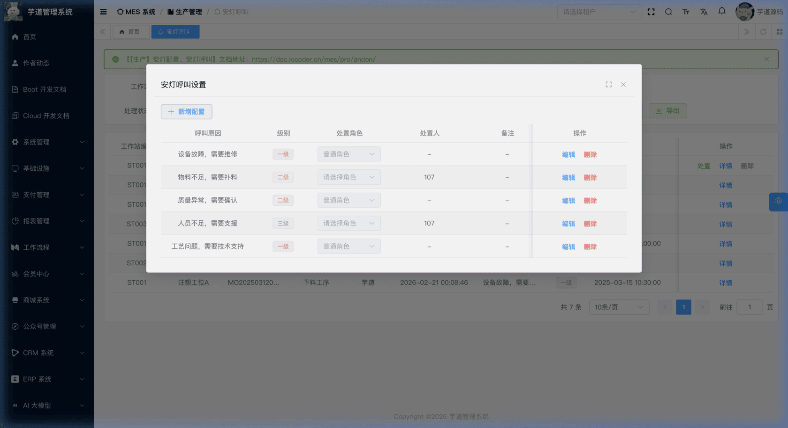
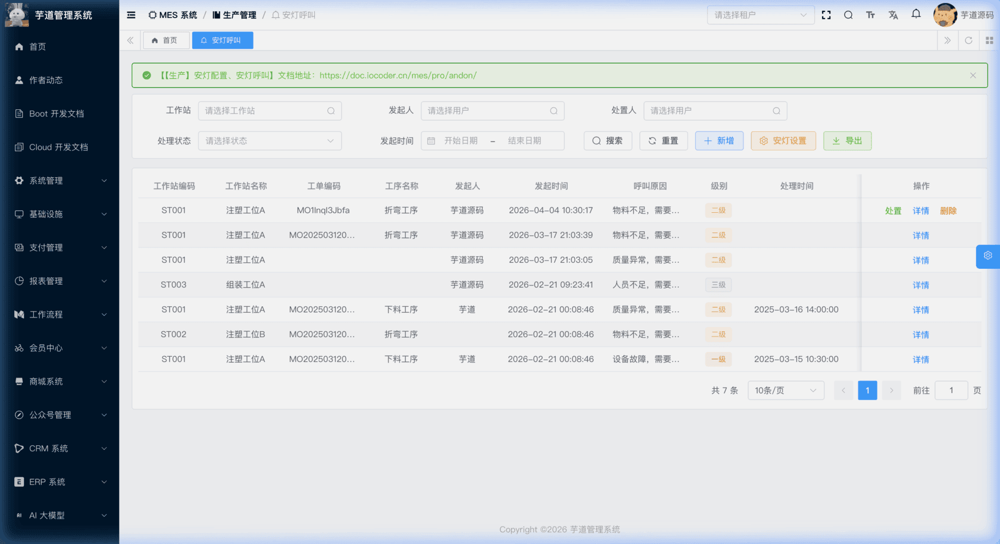
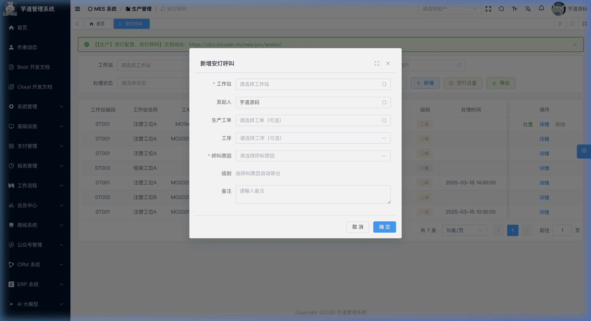
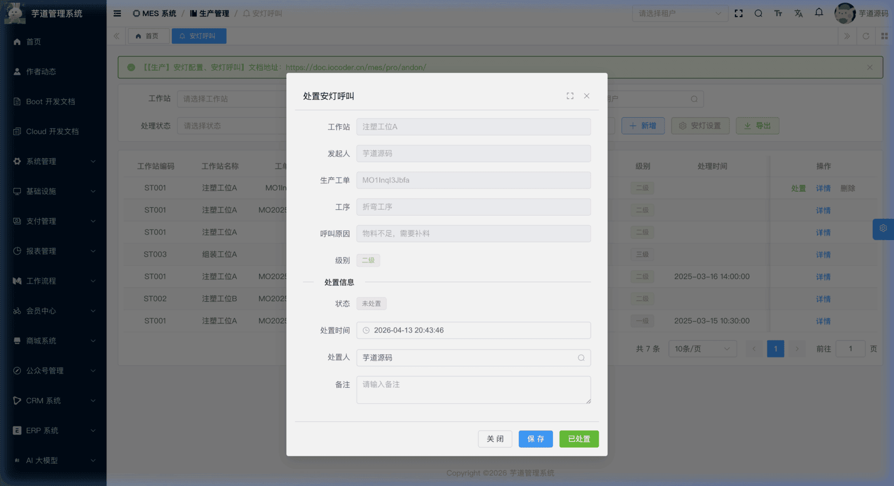

# 【生产】安灯配置、安灯呼叫

安灯（Andon）模块，由 `yudao-module-mes` 后端模块的 `pro.andon` 包实现，是精益生产中用于**异常快速响应**的车间可视化管理工具。
当生产现场发生设备故障、物料短缺、质量异常等问题时，操作人员可通过安灯呼叫功能快速发起报警请求，系统按预设的呼叫原因自动带出**级别**信息，使管理人员能够及时响应并处理异常，减少生产停滞时间。
本模块由两部分组成：
- **安灯配置**：预定义呼叫原因列表及每种原因对应的级别、处置角色/处置人。处置角色和处置人用于配置维护，实际处置时仍需在处置弹窗中确认或填写。
- **安灯呼叫记录**：车间操作人员发起的每一次安灯呼叫，关联工作站、工单、工序等生产上下文信息，记录从发起到处置完成的全过程。
本文涉及表如下图所示：
 
## # 1. 安灯配置
安灯配置，由 MesProAndonConfigController 提供接口。
### # 1.1 表结构
省略 creator/create_time/updater/update_time/deleted/tenant_id 等通用字段
CREATE TABLE `mes_pro_andon_config` (
`id` bigint NOT NULL AUTO_INCREMENT COMMENT '编号',
`reason` varchar(500) NOT NULL COMMENT '呼叫原因',
`level` tinyint NOT NULL DEFAULT 3 COMMENT '级别',
`handler_role_id` bigint DEFAULT NULL COMMENT '处置人角色编号',
`handler_user_id` bigint DEFAULT NULL COMMENT '处置人编号',
`remark` varchar(500) DEFAULT '' COMMENT '备注',
PRIMARY KEY (`id`)
) ENGINE=InnoDB COMMENT='MES 安灯呼叫配置';
① `level` 为安灯级别，对应字典 `mes_pro_andon_level`，枚举 MesProAndonLevelEnum（1=一级，2=二级，3=三级）。
② `handler_role_id` 关联 `system_role` 表的 `id` 字段，标识该类问题的处置人所属角色（如维修组长、质量主管等）。
③ `handler_user_id` 关联 `system_users` 表的 `id` 字段，标识该类问题的预设处置人，仅用于安灯配置维护与参考，当前不会在发起呼叫或处置时自动带入记录。当发起安灯呼叫时，由创建人手动选择呼叫原因（配置项），系统自动带出级别信息。
### # 1.2 管理后台
安灯配置没有独立的菜单页面，而是嵌入在安灯呼叫记录的列表页中，通过搜索栏的【安灯设置】按钮打开配置弹窗。
对应 `yudao-ui-admin-vue3` 项目的 `@/views/mes/pro/andon/config` 目录。
#### # 安灯设置弹窗
在安灯呼叫列表页点击【安灯设置】按钮，弹出安灯配置管理弹窗。弹窗内以列表形式展示所有已配置的呼叫原因，支持新增、编辑、删除操作。保存时要求**处置角色和处置人至少填写一项**，否则保存会失败。
 
## # 2. 安灯呼叫记录
安灯呼叫记录，由 MesProAndonRecordController 提供接口。
### # 2.1 表结构
省略 creator/create_time/updater/update_time/deleted/tenant_id 等通用字段
CREATE TABLE `mes_pro_andon_record` (
`id` bigint NOT NULL AUTO_INCREMENT COMMENT '编号',
`config_id` bigint NOT NULL COMMENT '安灯配置编号',
`workstation_id` bigint NOT NULL COMMENT '工作站编号',
`user_id` bigint NOT NULL COMMENT '发起用户编号',
`work_order_id` bigint DEFAULT NULL COMMENT '生产工单编号',
`process_id` bigint DEFAULT NULL COMMENT '工序编号',
`reason` varchar(500) NOT NULL COMMENT '呼叫原因',
`level` tinyint NOT NULL DEFAULT 3 COMMENT '级别',
`status` tinyint NOT NULL DEFAULT '0' COMMENT '处置状态',
`handle_time` datetime DEFAULT NULL COMMENT '处置时间',
`handler_user_id` bigint DEFAULT NULL COMMENT '处置人编号',
`remark` varchar(500) DEFAULT '' COMMENT '备注',
PRIMARY KEY (`id`)
) ENGINE=InnoDB COMMENT='MES 安灯呼叫记录';
① `config_id` 关联 `mes_pro_andon_config` 表的 `id` 字段，标识本次呼叫选择的安灯配置。创建时会从配置中**快照** `reason` 和 `level` 到记录中，即使后续修改配置也不会影响已创建的记录。
② `workstation_id` 关联 `mes_md_workstation` 表的 `id` 字段（必填），标识安灯呼叫发生在哪个工作站，详见 [《【基础】车间设置、工作站设置》](/mes/md/workshop/)。
③ `user_id` 关联 `system_users` 表的 `id` 字段，标识安灯呼叫的发起人。创建时前端默认填充当前登录用户。
④ `work_order_id` 关联 `mes_pro_work_order` 表的 `id` 字段（选填），标识呼叫时关联的生产工单（仅显示已确认状态的工单），详见 [《【生产】生产工单》](/mes/pro/work-order/)。
⑤ `process_id` 关联 `mes_pro_process` 表的 `id` 字段（选填，仅显示已启用的工序），标识呼叫时关联的工序，详见 [《【生产】工序设置、工艺流程》](/mes/pro/process-route/)。
⑥ `reason` 和 `level` 为快照字段，值从安灯配置中复制而来，不随配置的后续变更而变更，确保历史记录的准确性。
⑦ `status` 为处置状态，对应字典 `mes_pro_andon_status`，枚举 MesProAndonStatusEnum：
| 状态值 | 枚举 | 说明 | 可执行操作 |
| --- | --- | --- | --- |
| 0 | `ACTIVE` | 未处置 | 处置（保存/已处置）、删除 |
| 1 | `HANDLED` | 已处置 | — |
状态流转说明
发起呼叫 ──→ 未处置(0) ──保存──→ 未处置(0)
│
└──已处置──→ 已处置(1)
- **发起呼叫**（`createAndonRecord`）：创建安灯记录，初始状态为「未处置」。系统自动从选中的安灯配置快照呼叫原因和级别。
- **保存**：在处置弹窗中填写处置时间、处置人、备注后点击【保存】，更新记录但**不变更状态**，仍保持「未处置」。适用于记录进展但尚未完全解决的场景。
- **已处置**：点击【已处置】按钮，将状态变更为「已处置」。要求必须填写处置时间和处置人。
⑧ `handle_time` 为处置时间，`handler_user_id` 为处置人编号。首次处置或字段为空时，前端默认填充当前时间和当前用户；已保存过的处置信息会保留原值，不会被覆盖。用户可修改。
### # 2.2 管理后台
对应 [MES 系统 -> 生产管理 -> 安灯呼叫] 菜单，对应 `yudao-ui-admin-vue3` 项目的 `@/views/mes/pro/andon/record` 目录。
#### # 列表
支持按工作站、发起人、处置人、处理状态、发起时间范围等条件搜索。列表展示工作站编码/名称、工单编码、工序名称、发起人、发起时间、呼叫原因、级别、处理时间、处理人、处置状态等信息。
操作列根据状态动态展示按钮：
- **未处置**：处置、详情、删除
- **已处置**：详情
 
#### # 新增（发起呼叫）
点击【新增】按钮，弹出安灯呼叫新增表单。主要填写工作站（必填）、发起人、生产工单（选填，仅显示已确认状态）、工序（选填）、呼叫原因（必填，选中后自动带出级别）。
 
#### # 处置
在列表中点击【处置】按钮（仅未处置状态可操作），弹出处置弹窗。弹窗上半部分以只读方式展示呼叫信息，下半部分填写处置时间、处置人、备注。底部提供【保存】和【已处置】两个按钮。
 
.pageB img{width:80px!important;}
.wwads-horizontal .wwads-text, .wwads-content .wwads-text{line-height:1;}
[【生产】生产报工](/mes/pro/feedback/) [【生产】工作记录](/mes/pro/work-record/) 
←
[【生产】生产报工](/mes/pro/feedback/) [【生产】工作记录](/mes/pro/work-record/)→
 
Theme by
[Vdoing](https://github.com/xugaoyi/vuepress-theme-vdoing) 
| Copyright © 2019-2026
芋道源码 | MIT License   
- 跟随系统
- 浅色模式
- 深色模式
- 阅读模式
× 
.windowRB{ padding: 0;}
.windowRB .wwads-img{margin-top: 10px;}
.windowRB .wwads-content{margin: 0 10px 10px 10px;}
.custom-html-window-rb .close-but{
display: none;
}