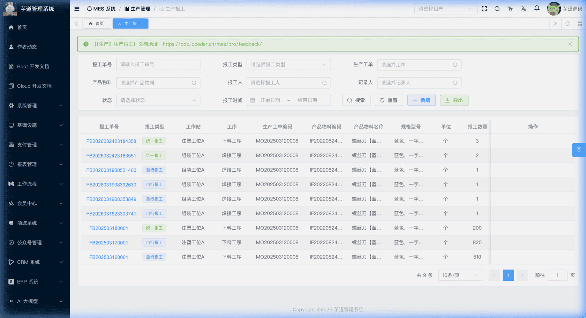
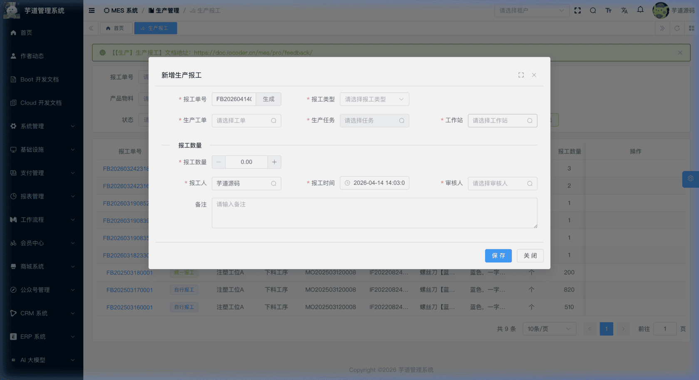
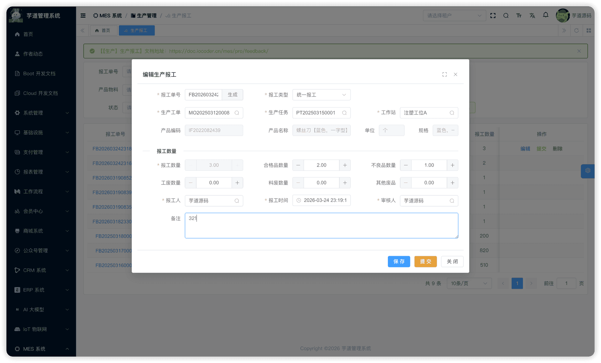
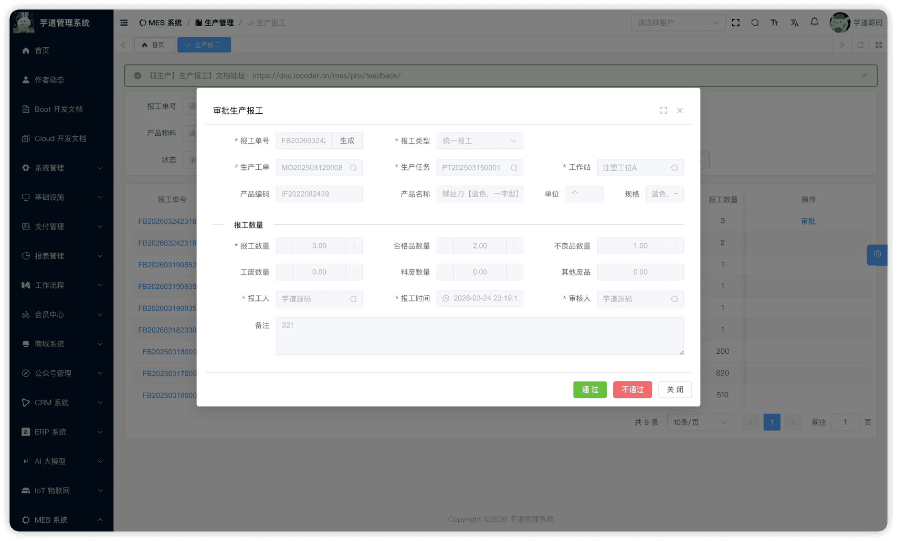
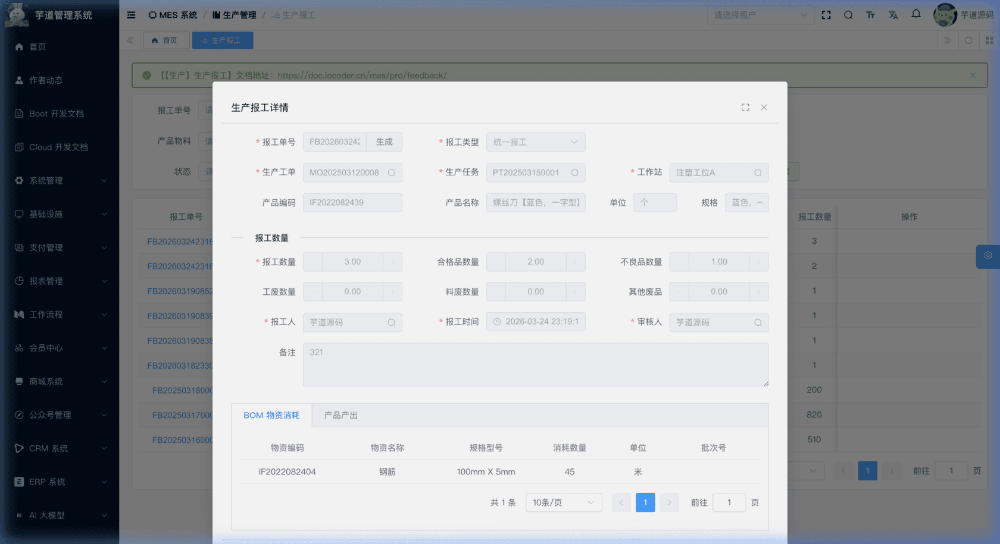
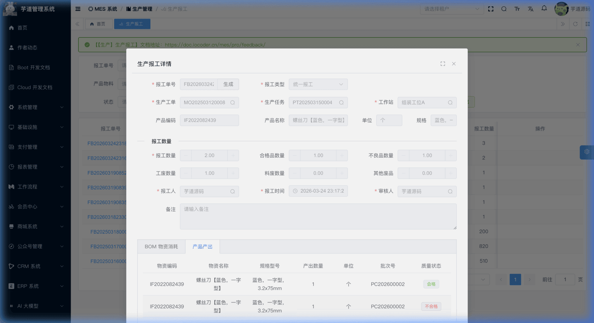

# 【生产】生产报工

生产报工模块，由 `yudao-module-mes` 后端模块的 `pro.feedback` 包实现，是生产管理中**记录实际产出、驱动库存变更**的核心环节。
生产报工是车间操作人员在完成某道工序的生产后，向系统提交实际生产数据的过程。每张报工单关联一个生产任务，记录本次报工的数量（合格品 + 不良品）、报工人、报工时间等信息，并指定审核人进行审批。审批通过后，系统会根据工序的**关键工序**和**质检工序**标识，执行不同的后续处理。
- **报工类型**：支持「自行报工」和「统一报工」两种方式，用于区分报工来源。当前实现中两种类型仅作为分类标签记录，不影响业务处理逻辑。
- **数量录入规则**：根据工序是否标记为质检工序（`checkFlag`），动态切换数量填写方式——质检工序只需填写报工数量（待质检拆分合格/不合格），非质检工序需分别填写合格品和不良品数量。
- **审批流程**：草稿 → 提交 → 审批中 → 审批通过/驳回。审批通过后，若工序配置了 BOM 则自动扣减物料库存（物料消耗）；关键非质检工序会即时生成产品产出入库并更新任务/工单数量；关键质检工序则先进入「待检验」状态，待 IPQC 完成后再入库和回写数量。
- **质检联动**：**关键质检工序**（`keyFlag` + `checkFlag` 同时为 true）的报工审批通过后进入「待检验」状态，由 IPQC 过程检验完成后回调拆分合格/不合格品，完成产出入库并更新任务/工单数量。非关键工序即使标记为质检工序，审批通过后也直接完结。
本文涉及表如下图所示：
 
## # 1. 生产报工
生产报工，由 MesProFeedbackController 提供接口。
### # 1.1 表结构
省略 creator/create_time/updater/update_time/deleted/tenant_id 等通用字段
CREATE TABLE `mes_pro_feedback` (
`id` bigint NOT NULL AUTO_INCREMENT COMMENT '编号',
`code` varchar(64) NOT NULL COMMENT '报工单编号',
`type` tinyint NOT NULL COMMENT '报工类型',
`channel` varchar(64) DEFAULT NULL COMMENT '报工途径',
`feedback_time` datetime DEFAULT NULL COMMENT '报工时间',
`workstation_id` bigint NOT NULL COMMENT '工作站编号',
`route_id` bigint NOT NULL COMMENT '工艺路线编号',
`process_id` bigint NOT NULL COMMENT '工序编号',
`work_order_id` bigint NOT NULL COMMENT '生产工单编号',
`task_id` bigint NOT NULL COMMENT '生产任务编号',
`item_id` bigint NOT NULL COMMENT '产品物料编号',
`expire_date` datetime DEFAULT NULL COMMENT '过期日期',
`lot_number` varchar(64) DEFAULT NULL COMMENT '生产批号',
`scheduled_quantity` decimal(14,2) NOT NULL DEFAULT '0.00' COMMENT '排产数量',
`feedback_quantity` decimal(14,2) NOT NULL DEFAULT '0.00' COMMENT '本次报工数量',
`qualified_quantity` decimal(14,2) NOT NULL DEFAULT '0.00' COMMENT '合格品数量',
`unqualified_quantity` decimal(14,2) NOT NULL DEFAULT '0.00' COMMENT '不良品数量',
`uncheck_quantity` decimal(14,2) NOT NULL DEFAULT '0.00' COMMENT '待检测数量',
`labor_scrap_quantity` decimal(14,2) NOT NULL DEFAULT '0.00' COMMENT '工废数量',
`material_scrap_quantity` decimal(14,2) NOT NULL DEFAULT '0.00' COMMENT '料废数量',
`other_scrap_quantity` decimal(14,2) NOT NULL DEFAULT '0.00' COMMENT '其他废品数量',
`feedback_user_id` bigint DEFAULT NULL COMMENT '报工用户编号',
`approve_user_id` bigint DEFAULT NULL COMMENT '审核用户编号',
`status` tinyint NOT NULL DEFAULT '0' COMMENT '状态',
`remark` varchar(500) DEFAULT '' COMMENT '备注',
PRIMARY KEY (`id`)
) ENGINE=InnoDB COMMENT='MES 生产报工';
① `type` 为报工类型，对应字典 `mes_pro_feedback_type`，枚举 MesProFeedbackTypeEnum（1=自行报工，2=统一报工）。当前实现中两种类型仅作为分类标签，不影响报工人指定或审批流程。
② `workstation_id` 关联 `mes_md_workstation` 表的 `id` 字段，标识报工的工作站，详见 [《【基础】车间设置、工作站设置》](/mes/md/workshop/)。后端会校验工作站绑定的工序必须与报工的工序一致。
③ `route_id` 关联 `mes_pro_route` 表的 `id` 字段，`process_id` 关联 `mes_pro_process` 表的 `id` 字段，标识报工所在的工艺路线和工序，详见 [《【生产】工序设置、工艺流程》](/mes/pro/process-route/)。
④ `work_order_id` 关联 `mes_pro_work_order` 表的 `id` 字段（要求工单为已确认状态），详见 [《【生产】生产工单》](/mes/pro/work-order/)。
⑤ `task_id` 关联 `mes_pro_task` 表的 `id` 字段，标识报工对应的生产任务（要求任务未终态），详见 [《【生产】生产排产、工序流转卡》](/mes/pro/schedule-card/)。后端还会校验任务的工单、工作站、工艺路线、工序、产品必须与报工一致。
⑥ `item_id` 关联 `mes_md_item` 表的 `id` 字段。前端选择任务后自动回填（`@NotNull` 要求传入），后端创建时会以任务的 `itemId` 覆盖传入值，确保与任务一致。详见 [《【基础】物料产品、分类、计量单位》](/mes/md/product/)。
⑦ 数量相关字段——根据工序是否标记为质检工序（`checkFlag`），录入规则不同：
**非质检工序**（`checkFlag = false`）：
| 字段 | 说明 |
| --- | --- |
| `qualified_quantity` | 合格品数量（用户填写） |
| `unqualified_quantity` | 不良品数量（用户填写，或由废品明细自动合计） |
| `feedback_quantity` | 报工数量 = 合格品 + 不良品（前端自动计算，只读） |
| `uncheck_quantity` | 固定为 0 |
不良品可进一步拆分为三种废品分类：
| 字段 | 说明 |
| --- | --- |
| `labor_scrap_quantity` | 工废数量（工艺操作不当导致的废品） |
| `material_scrap_quantity` | 料废数量（原材料质量问题导致的废品） |
| `other_scrap_quantity` | 其他废品数量 |
当 `unqualified_quantity > 0` 时，前端自动展开废品分类区域。修改废品明细时，不良品数量 = 工废 + 料废 + 其他，报工数量随之联动。
**质检工序**（`checkFlag = true`）：
| 字段 | 说明 |
| --- | --- |
| `feedback_quantity` | 报工数量（用户填写，必须 > 0） |
| `uncheck_quantity` | 待检测数量 = 报工数量（质检工序提交时自动设置） |
| `qualified_quantity` | 初始为 0，由 IPQC 质检完成后回写 |
| `unqualified_quantity` | 初始为 0，由 IPQC 质检完成后回写 |
⑧ `feedback_user_id` 为报工人编号，关联 `system_users` 表。创建报工时前端默认设置为当前登录用户，可手动修改为其他用户。提交后该字段保持用户指定的值，不会被系统覆盖。
⑨ `approve_user_id` 为审核人编号，关联 `system_users` 表。创建报工时由用户指定，作为该报工单的预设审批人。审批按钮仅对该审核人可见。
⑩ `status` 为报工状态，对应字典 `mes_pro_feedback_status`，枚举 MesProFeedbackStatusEnum：
| 状态值 | 枚举 | 说明 | 可执行操作 |
| --- | --- | --- | --- |
| 0 | `PREPARE` | 草稿 | 编辑、提交、删除 |
| 2 | `APPROVING` | 审批中 | 审批通过、驳回 |
| 3 | `UNCHECK` | 待检验 | —（等待 IPQC 回调） |
| 4 | `FINISHED` | 已完成 | — |
状态流转说明
创建 ──→ 草稿(0) ──提交──→ 审批中(2) ──通过──┬──→ 已完成(4)           [非质检 / 非关键]
│       └──→ 待检验(3) ──IPQC回调──→ 已完成(4)  [关键+质检]
│
└──驳回──→ 草稿(0)
- **创建**（`createFeedback`）：创建报工单，初始状态为草稿。自动从任务中复制 `itemId`。
- **提交**（`submitFeedback`）：草稿 → 审批中。提交前若有修改先保存（保存时写入报工人和报工时间），提交仅推进状态。提交后表单主体不可再修改。
- **驳回**（`rejectFeedback`）：审批中 → 草稿。退回后可修改重新提交。
- **审批通过**（`approveFeedback`）：审批中 → 已完成（或待检验）。核心业务逻辑详见下方「审批通过处理流程」。
该模块涉及两个关联子表（由审批通过触发自动生成，非用户手动维护）：
- `mes_wm_item_consume_line`（物料消耗行）：审批通过后若工序配置了 BOM，自动生成消耗记录行。详见 [《【仓库】生产领料、生产退料、物料消耗》](/mes/wm/issue-return/)。
- `mes_wm_product_produce_line`（产品产出行）：关键工序审批通过后自动生成产出记录行。详见 [《【仓库】产品产出、产品入库》](/mes/wm/product-in/)。
### # 1.2 审批通过处理流程
审批通过（`approveFeedback`）是报工模块最关键的业务方法，采用事务性处理。审批通过时会先查询当前工序的工序级 BOM（`mes_pro_route_product_bom`）：
- **若该工序配置了 BOM**，则自动生成物料消耗记录（`MesWmItemConsumeDO`）并执行库存扣减；
- 若未配置 BOM，则跳过物料消耗步骤。详见 [《【仓库】生产领料、生产退料、物料消耗》](/mes/wm/issue-return/)。
在此基础上，根据工序的**关键工序**（`keyFlag`）和**质检工序**（`checkFlag`）标识分为三种情况：
**① 关键工序 + 非质检工序**（最常见场景）
1. 生成产品产出单（`MesWmProductProduceDO`），按合格品/不合格品拆分明细行。
1. 自动完成产出入库（执行库存增加）。
1. 累加生产任务的已生产数量、合格品数量、不良品数量。
1. 累加生产工单的已生产数量。
1. 报工状态更新为「已完成」。
**② 关键工序 + 质检工序**
1. 生成产品产出单，质量状态为「待检验」。
1. 报工状态更新为「待检验」（`UNCHECK`），**不立即入库**。
1. 等待 IPQC 过程检验完成后回调（`updateProFeedbackWhenIpqcFinish`），拆分合格/不合格品行并完成入库。
1. 回写合格品/不合格品/废品数量到报工单，更新状态为「已完成」。
详见 [《【质量】过程检验（IPQC）》](/mes/qc/ipqc/)。
**③ 非关键工序**
不生成产出单，不更新任务/工单数量，直接标记为「已完成」。
关键工序 vs 质检工序
这两个标识定义在工艺路线工序表（`mes_pro_route_process`）上，详见 [《【生产】工序设置、工艺流程》](/mes/pro/process-route/)。审批通过后的处理取决于两者的**组合**：
| `keyFlag` | `checkFlag` | 审批通过后行为 |
| --- | --- | --- |
| true | false | 即时生成产出单并入库，累加任务/工单数量，状态 → 已完成 |
| true | true | 生成待检产出行，状态 → 待检验（IPQC 回调后入库并回写数量） |
| false | — | 不生成产出单，不更新任务/工单数量，状态 → 已完成 |
### # 1.3 管理后台
对应 [MES 系统 -> 生产管理 -> 生产报工] 菜单，对应 `yudao-ui-admin-vue3` 项目的 `@/views/mes/pro/feedback` 目录。
#### # 列表
支持按报工单号、报工类型、生产工单、产品、状态、报工时间等条件搜索。列表展示报工单号、报工类型、工作站、工序、工单、产品信息、报工数量、报工人、审核人、状态等。
 
#### # 新增
点击【新增】按钮，弹出报工新增表单。主要填写报工单号（可点击「生成」自动生成）、报工类型、生产工单（仅已确认状态）、生产任务（根据工单过滤）。选择任务后自动填充工作站、工艺路线、工序、产品等信息。新建成功后弹窗自动切换为编辑模式。
 **报工数量**：根据当前工序的 `checkFlag` 标识动态切换录入方式：
- **非质检工序**（`checkFlag = false`）：显示「合格品数量」和「不良品数量」两个输入框，「报工数量」为只读自动合计。当不良品数量 > 0 时，自动展开废品分类区域（工废、料废、其他），修改废品明细会联动更新不良品数量和报工数量。
- **质检工序**（`checkFlag = true`）：只显示「报工数量」一个输入框，合格/不良品数量初始为 0。关键质检工序审批通过后由 IPQC 质检回调拆分；非关键质检工序直接完结，不拆分。
下方截图为非质检工序的报工数量区域。质检工序界面仅展示一个「报工数量」输入框，不显示合格品/不良品及废品分类区域。
 报工人/审核人：报工人默认为当前登录用户（可手动修改），审核人由用户手动指定。
#### # 修改
点击【编辑】按钮（仅草稿状态可编辑），弹出报工修改表单。弹窗标题为「编辑生产报工」，表单内容与新增一致，可修改所有字段。
 
#### # 提交
在表单弹窗底部点击【提交】按钮（仅草稿状态时显示）。系统会先检查表单是否有修改（脏检查），有修改则先保存再提交。提交仅将状态变更为「审批中」，报工人和报工时间在保存阶段已写入。
#### # 审批
在列表页点击【审批】按钮（仅审批中状态且审核人为当前用户时显示），弹出审批对话框。弹窗标题为「审批生产报工」，以只读方式展示报工详情，底部提供「通过」和「不通过」两个按钮。审批中状态下不会显示「BOM 物资消耗 / 产品产出」Tab（该 Tab 仅在待检验或已完成状态时出现）。
 
- **通过**：执行审批通过逻辑，按工序标识分为三种结果： **关键非质检工序**：若配置了工序级 BOM，先扣减物料库存；然后生成产品产出单并即时完成入库，累加生产任务和工单的已生产数量，报工状态更新为「已完成」，提示"报工单已审批完成"。
- **关键质检工序**：若配置了工序级 BOM，先扣减物料库存；然后生成质量状态为「待检验」的产出行，报工状态更新为「待检验」（**不立即入库，不更新任务/工单数量**），提示"报工成功，请等待质量检验完成！"。后续由 IPQC 质检完成后回调拆分并入库。
- **非关键工序**：若配置了工序级 BOM，扣减物料库存；不生成产出单，不更新任务/工单数量，直接标记为「已完成」。
**不通过**（驳回）：报工状态回退为草稿，可修改后重新提交。 
#### # BOM 物资消耗 / 产品产出
在报工单处于**已完成**或**待检验**状态时，详情弹窗底部会展示两个 Tab 页：
 ★ **BOM 物资消耗**（报工详情 Tab）：以只读列表展示该报工单触发的物料消耗记录行，包含物资编码、名称、规格、消耗数量、单位、批次号等。数据来自 `mes_wm_item_consume_line` 表，详见 [《【仓库】生产领料、生产退料、物料消耗》](/mes/wm/issue-return/)。由 MesWmItemConsumeLineController 提供接口。
mes_wm_item_consume_line 表结构 CREATE TABLE `mes_wm_item_consume_line` (
`id` bigint NOT NULL AUTO_INCREMENT COMMENT '编号',
`consume_id` bigint NOT NULL COMMENT '消耗单ID',
`item_id` bigint NOT NULL COMMENT '物料ID',
`quantity` decimal(14,2) NOT NULL COMMENT '消耗数量',
`batch_id` bigint DEFAULT NULL COMMENT '批次ID',
`batch_code` varchar(128) DEFAULT NULL COMMENT '批次号',
`remark` varchar(500) DEFAULT NULL COMMENT '备注',
PRIMARY KEY (`id`)
) ENGINE=InnoDB COMMENT='MES 物料消耗行';
① `consume_id` 关联主表 `mes_wm_item_consume` 的 `id` 字段。
② `item_id` 为消耗物料，来自 BOM 配置。`quantity` = BOM 用料比例 × 报工数量，**由系统自动计算**。
 ★ **产品产出**（报工详情 Tab）：以只读列表展示该报工单触发的产品产出记录行，包含物资编码、名称、规格、产出数量、单位、批次号、质量状态（合格/不合格/待检验）等。数据来自 `mes_wm_product_produce_line` 表，详见 [《【仓库】产品产出、产品入库》](/mes/wm/product-in/)。由 MesWmProductProduceLineController 提供接口。
mes_wm_product_produce_line 表结构 CREATE TABLE `mes_wm_product_produce_line` (
`id` bigint NOT NULL AUTO_INCREMENT COMMENT '编号',
`produce_id` bigint NOT NULL COMMENT '产出单ID',
`feedback_id` bigint NOT NULL COMMENT '报工记录ID',
`item_id` bigint NOT NULL COMMENT '物料ID',
`quantity` decimal(12,2) NOT NULL COMMENT '产出数量',
`batch_id` bigint DEFAULT NULL COMMENT '批次ID',
`batch_code` varchar(255) DEFAULT NULL COMMENT '批次号',
`expire_date` datetime DEFAULT NULL COMMENT '有效期',
`lot_number` varchar(128) DEFAULT NULL COMMENT '批号',
`quality_status` int DEFAULT NULL COMMENT '质量状态',
`remark` varchar(500) DEFAULT NULL COMMENT '备注',
PRIMARY KEY (`id`)
) ENGINE=InnoDB COMMENT='MES 产品产出行';
① `produce_id` 关联主表 `mes_wm_product_produce` 的 `id` 字段。`feedback_id` 关联报工记录。
② `item_id` 为产出物料（来自报工记录的产品），`quantity` 为产出数量。
③ `quality_status` 为质量状态，枚举 MesWmQualityStatusEnum：不需检验时按合格/不合格生成行（`PASS`/`FAIL`），需要 IPQC 时初始为 `PENDING`。
仅**关键工序**（`keyFlag = true`）的报工审批通过后才会生成产品产出数据。非关键工序的报工单虽然也会展示「产品产出」Tab，但该 Tab 内容为空，属于正常业务行为。
.pageB img{width:80px!important;}
.wwads-horizontal .wwads-text, .wwads-content .wwads-text{line-height:1;}
[【生产】生产排产、工序流转卡](/mes/pro/schedule-card/) [【生产】安灯配置、安灯呼叫](/mes/pro/andon/) 
←
[【生产】生产排产、工序流转卡](/mes/pro/schedule-card/) [【生产】安灯配置、安灯呼叫](/mes/pro/andon/)→
 
Theme by
[Vdoing](https://github.com/xugaoyi/vuepress-theme-vdoing) 
| Copyright © 2019-2026
芋道源码 | MIT License   
- 跟随系统
- 浅色模式
- 深色模式
- 阅读模式
× 
.windowRB{ padding: 0;}
.windowRB .wwads-img{margin-top: 10px;}
.windowRB .wwads-content{margin: 0 10px 10px 10px;}
.custom-html-window-rb .close-but{
display: none;
}