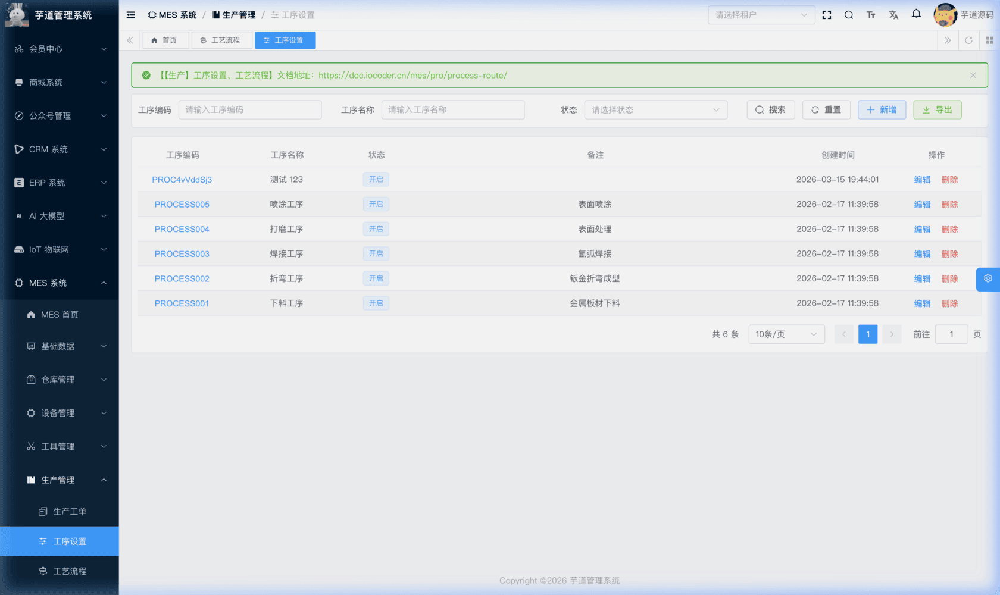
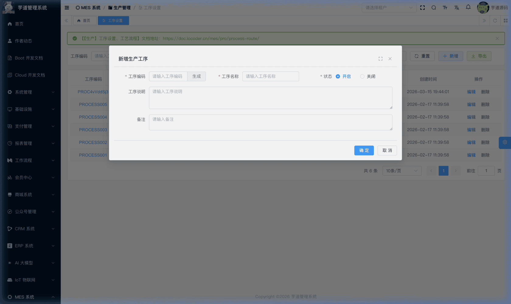
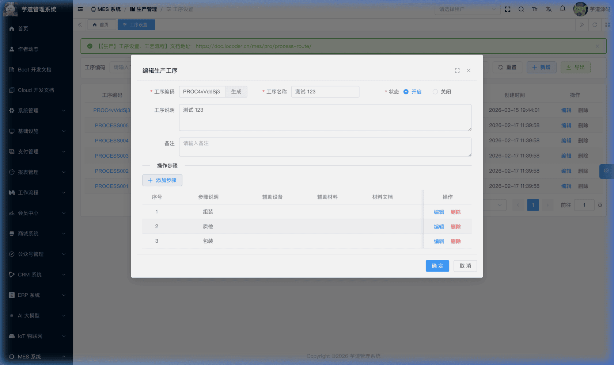
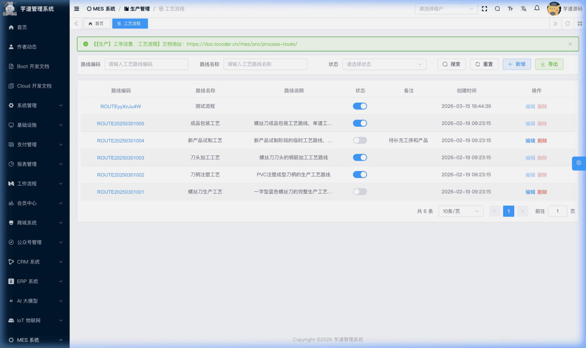
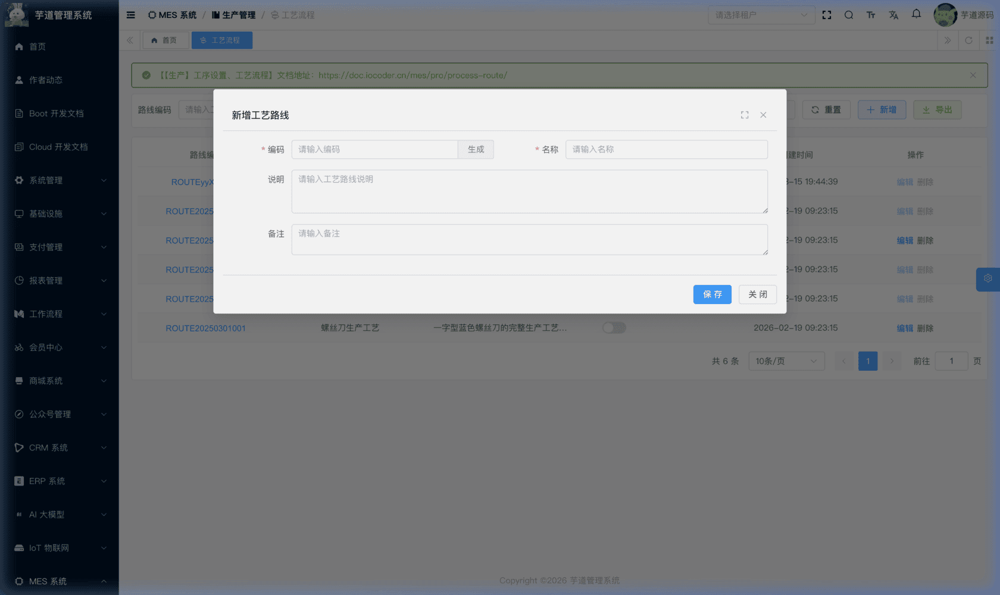
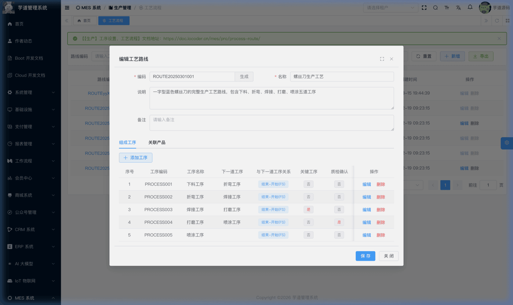
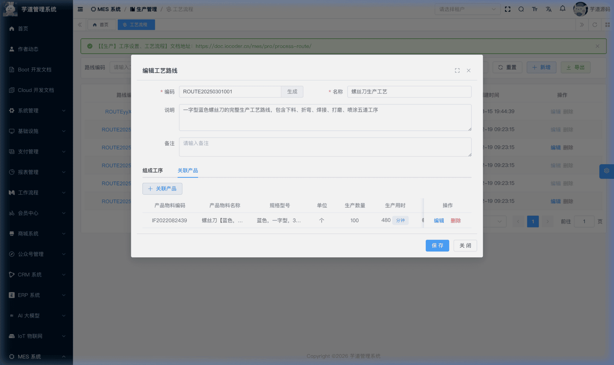
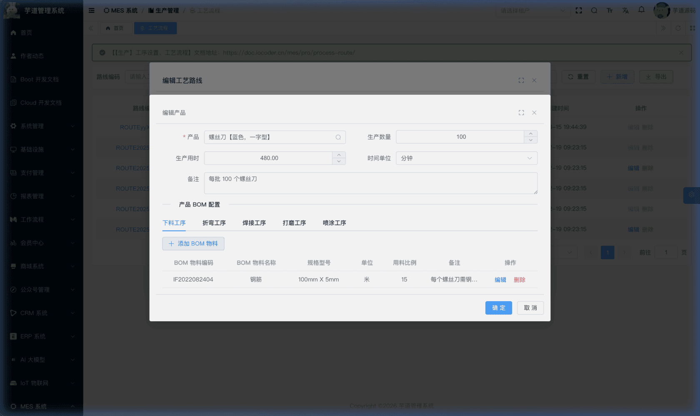

# 【生产】工序设置、工艺流程

工序与工艺流程模块，由 `yudao-module-mes` 后端模块的 `pro.process` 和 `pro.route` 包实现，是生产管理的基础配置。
- **工序设置**：工序是工厂生产流程中可分辨的生产步骤，具有明确的物资输入和产品/半成品输出，以及专属的生产要素作为生产条件。系统中每道工序（如"下料"、"焊接"、"装配"）可维护详细的操作步骤说明。工序是排产、报工、质检等后续模块的基础引用数据。**注意**：如果某道工序不需要进行生产任务分派或生产报工，则不需要在系统中配置对应的工序。
- **工艺流程（工艺路线）**：工艺流程是半成品/产成品生产过程的工序集合。将多道工序按先后顺序编排成一条完整的工艺路线，并关联产品与工序级 BOM。工艺路线定义了"某个产品要经过哪些工序、按什么顺序加工、每道工序消耗哪些物料"，是生产工单下达和排产的核心依据。为保持结构清晰，建议按照 BOM 结构拆分生产流程——即为每个产成品/半成品分别配置独立的工艺路线，而非将所有工序混合在一条路线中。
本文涉及表如下图所示：
 
## # 1. 工序设置
工序设置，由 MesProProcessController 提供接口。
### # 1.1 表结构
省略 creator/create_time/updater/update_time/deleted/tenant_id 等通用字段
CREATE TABLE `mes_pro_process` (
`id` bigint NOT NULL AUTO_INCREMENT COMMENT '编号',
`code` varchar(64) NOT NULL COMMENT '工序编码',
`name` varchar(255) NOT NULL COMMENT '工序名称',
`attention` varchar(1000) DEFAULT NULL COMMENT '工艺要求',
`status` tinyint NOT NULL DEFAULT '0' COMMENT '状态',
`remark` varchar(500) DEFAULT '' COMMENT '备注',
PRIMARY KEY (`id`)
) ENGINE=InnoDB COMMENT='MES 生产工序';
① `status` 为工序状态，对应 CommonStatusEnum 枚举（0=开启，1=关闭）。仅开启状态的工序才会出现在工艺路线的工序下拉选择中（`/mes/pro/process/simple-list` 接口）。
该表包含一个子表，在管理后台的编辑弹窗下方维护：
- `mes_pro_process_content`（操作步骤）：记录该工序的详细操作步骤说明。
### # 1.2 管理后台
对应 [MES 系统 -> 生产管理 -> 工序设置] 菜单，对应 `yudao-ui-admin-vue3` 项目的 `@/views/mes/pro/process` 目录。
#### # 列表
支持按工序编码、工序名称、状态等条件搜索。点击工序编码链接可查看工序详情。
 
#### # 新增
点击【新增】按钮，弹出工序新增表单。主要填写工序编码（可点击「生成」按钮自动生成）、工序名称、状态（开启/关闭）、工序说明和备注。
 
#### # 修改
点击编码链接或【编辑】按钮，弹出工序修改表单。在表单下方自动展示该工序的**操作步骤列表**。
 ★ **操作步骤**（工序编辑弹窗下方）：由 `mes_pro_process_content` 表存储，记录该工序的详细操作步骤。编辑弹窗中通过 `` 分隔展示操作步骤子表，支持新增、编辑、删除步骤。由 MesProProcessContentController 提供接口。
mes_pro_process_content 表结构 
省略 creator/create_time/updater/update_time/deleted/tenant_id 等通用字段
CREATE TABLE `mes_pro_process_content` (
`id` bigint NOT NULL AUTO_INCREMENT COMMENT '编号',
`process_id` bigint NOT NULL COMMENT '工序编号',
`sort` int NOT NULL DEFAULT '0' COMMENT '顺序编号',
`content` varchar(500) DEFAULT NULL COMMENT '步骤说明',
`device` varchar(255) DEFAULT NULL COMMENT '辅助设备',
`material` varchar(255) DEFAULT NULL COMMENT '辅助材料',
`doc_url` varchar(255) DEFAULT NULL COMMENT '材料文档 URL',
`remark` varchar(500) DEFAULT '' COMMENT '备注',
PRIMARY KEY (`id`),
KEY `idx_process_id` (`process_id`)
) ENGINE=InnoDB COMMENT='MES 生产工序内容';
① `process_id` 关联 `mes_pro_process` 表的 `id` 字段。
② `sort` 为步骤顺序编号，决定操作步骤的执行先后。
## # 2. 工艺流程（工艺路线）
工艺路线，由 MesProRouteController 提供接口。
### # 2.1 表结构
省略 creator/create_time/updater/update_time/deleted/tenant_id 等通用字段
CREATE TABLE `mes_pro_route` (
`id` bigint NOT NULL AUTO_INCREMENT COMMENT '编号',
`code` varchar(64) NOT NULL COMMENT '工艺路线编码',
`name` varchar(255) NOT NULL COMMENT '工艺路线名称',
`description` varchar(500) DEFAULT NULL COMMENT '工艺路线说明',
`status` tinyint NOT NULL DEFAULT '0' COMMENT '状态',
`remark` varchar(500) DEFAULT '' COMMENT '备注',
PRIMARY KEY (`id`)
) ENGINE=InnoDB COMMENT='MES 工艺路线表';
① `status` 为路线状态，对应 CommonStatusEnum 枚举。
该表包含两个子表，在管理后台的修改弹窗中以 Tab 页形式维护：
- `mes_pro_route_process`（组成工序）：记录路线包含的工序列表及执行顺序。
- `mes_pro_route_product`（关联产品）：记录该路线可生产的产品及产能参数。
另有一个嵌套子表，属于关联产品的下一层：
- `mes_pro_route_product_bom`（工序级 BOM）：记录每道工序消耗的物料清单。非独立 Tab，而是嵌套在关联产品的编辑弹窗内展示。
### # 2.2 管理后台
对应 [MES 系统 -> 生产管理 -> 工艺流程] 菜单，对应 `yudao-ui-admin-vue3` 项目的 `@/views/mes/pro/route` 目录。
状态管理规则
工艺路线采用**先创建后启用**的管理模式：新建路线时默认为「停用」状态，此时可自由编辑/删除路线及其子表（组成工序、关联产品）。确认配置完成后，通过列表页的状态开关切换为「启用」状态。
**启用状态下，删除操作和子表操作由后端强制禁用**（`validateRouteNotEnable`），表头编辑由前端 tooltip 提示限制。需先停用后才能修改。
#### # 列表
支持按路线编码、路线名称、状态等条件搜索。点击路线编码链接可查看详情。
 
#### # 新增
点击【新增】按钮，弹出工艺路线新增表单。填写路线编码（可点击「生成」自动生成）、名称、说明和备注。新建成功后，弹窗自动切换为编辑模式，并展示「组成工序」和「关联产品」两个 Tab 页，方便继续配置子表数据。
 
#### # 修改
点击编码链接或【编辑】按钮，弹出工艺路线修改表单，底部包含以下 Tab 页：
 ★ **组成工序**（工艺路线详情 Tab）：由 `mes_pro_route_process` 表存储，维护该路线包含的工序列表及执行顺序。配置过程中需要添加组成的工序，并设置各个工序之间的先后关系。每条记录可设置：引用工序、排序、工序关系类型、准备时间、等待时间、甘特图颜色、是否关键工序、是否质检工序（`next_process_id` 由系统根据 `sort` 自动计算，无需手动维护）。其中可选指定一个**「关键工序」**（最多一个，不是必须设置），生产过程中当前工艺流程的实际生产数量将以此关键工序的报工为准。**若未设置关键工序，则所有工序的报工审批通过后都不会生成产品产出单，也不会回写任务/工单的已生产数量**。由 MesProRouteProcessController 提供接口。
mes_pro_route_process 表结构 
省略 creator/create_time/updater/update_time/deleted/tenant_id 等通用字段
CREATE TABLE `mes_pro_route_process` (
`id` bigint NOT NULL AUTO_INCREMENT COMMENT '编号',
`route_id` bigint NOT NULL COMMENT '工艺路线编号',
`process_id` bigint NOT NULL COMMENT '工序编号',
`sort` int NOT NULL DEFAULT '1' COMMENT '序号',
`next_process_id` bigint DEFAULT NULL COMMENT '下一道工序编号',
`link_type` tinyint NOT NULL DEFAULT '0' COMMENT '与下一道工序关系',
`prepare_time` int DEFAULT '0' COMMENT '准备时间（分钟）',
`wait_time` int DEFAULT '0' COMMENT '等待时间（分钟）',
`color_code` char(7) DEFAULT '#00AEF3' COMMENT '甘特图显示颜色',
`key_flag` bit(1) NOT NULL DEFAULT b'0' COMMENT '是否关键工序',
`check_flag` bit(1) NOT NULL DEFAULT b'0' COMMENT '是否质检工序',
`remark` varchar(500) DEFAULT '' COMMENT '备注',
PRIMARY KEY (`id`)
) ENGINE=InnoDB COMMENT='MES 工艺路线工序表';
① `route_id` 关联 `mes_pro_route` 表的 `id` 字段，`process_id` 关联 `mes_pro_process` 表的 `id` 字段，标识该工序节点引用的工序。
② `sort` 为工序序号，决定该工序在路线中的执行顺序。同一路线下**序号不可重复**（由 `validateSortUnique` 校验）。
③ 同一路线下**同一工序不可重复添加**（由 `validateProcessUnique` 校验）。
④ `next_process_id` 为下一道工序的编号，关联 `mes_pro_process` 表的 `id` 字段。**此字段由系统自动维护**：每次新增、修改或删除组成工序时，后端会调用 `rebuildProcessChain` 方法，按 `sort` 升序重新计算并更新所有工序的 `nextProcessId`（尾节点设为 `null`），并非用户手动填写。`link_type` 为与下一道工序的关系类型，对应字典 `mes_pro_link_type`，枚举 MesProLinkTypeEnum：
| 类型值 | 枚举 | 说明 |
| --- | --- | --- |
| 0 | `START_START` | 开始-开始（两道工序同时开始） |
| 1 | `FINISH_FINISH` | 结束-结束（两道工序同时结束） |
| 2 | `START_FINISH` | 开始-结束（前序开始时后序结束） |
| 3 | `FINISH_START` | 结束-开始（前序结束后后序开始，最常见） |
⑥ `key_flag` 标记是否为关键工序。每条工艺路线中**最多只能有一道关键工序**（由 `validateKeyProcessUnique` 校验）。关键工序在报工审批通过时，会自动生成产出入库单（`MesWmProductProduce`），并累加工单和任务的已生产数量；非关键工序报工通过后仅更新报工状态，不产生产出入库。详见 MesProFeedbackServiceImpl 的 `approveFeedback` 方法。
⑦ `check_flag` 标记是否为质检工序。当关键工序同时标记为质检工序时，报工审批通过后不会直接完成入库，而是生成"待检验"状态的产出单，报工状态变为"待检验"，等待 IPQC 质检完成后回调拆分合格/不合格行并入库。此外，质检工序的报工表单只需填写报工数量，无需拆分合格品/不合格品数量（由 MesProFeedbackServiceImpl 的 `validateFeedbackData` 方法校验）。
 ★ **关联产品**（工艺路线详情 Tab）：由 `mes_pro_route_product` 表存储，维护该路线可生产的产品列表及产能参数。同一条工艺路线可应用于多个生产过程相同或相似的产品。每条记录可设置：产品物料、生产数量、生产用时和时间单位。选择产品后，可进一步展开**工序级 BOM** 子表（`RouteProductBomList.vue`），为该产品在每一道工序中配置消耗的 BOM 物料和用料比例。工序级 BOM 是报工审批时自动扣减物料库存的核心依据——报工通过后系统会根据此配置计算实际消耗量并执行库存扣减。由 MesProRouteProductController 提供接口。
mes_pro_route_product 表结构 
省略 creator/create_time/updater/update_time/deleted/tenant_id 等通用字段
CREATE TABLE `mes_pro_route_product` (
`id` bigint NOT NULL AUTO_INCREMENT COMMENT '编号',
`route_id` bigint NOT NULL COMMENT '工艺路线编号',
`item_id` bigint NOT NULL COMMENT '产品物料编号',
`quantity` int DEFAULT '1' COMMENT '生产数量',
`production_time` decimal(12,2) DEFAULT '1.00' COMMENT '生产用时',
`time_unit_type` varchar(64) DEFAULT 'MINUTE' COMMENT '时间单位',
`remark` varchar(500) DEFAULT '' COMMENT '备注',
PRIMARY KEY (`id`)
) ENGINE=InnoDB COMMENT='MES 工艺路线产品表';
① `route_id` 关联 `mes_pro_route` 表的 `id` 字段，`item_id` 关联 `mes_md_item`（物料产品表）的 `id` 字段，标识该路线可以生产的产品。一条工艺路线可关联多个产品。
② `quantity` 为生产数量，表示该产能参数对应的标准产量。
③ `production_time` 为生产用时，与 `time_unit_type` 配合使用，表示生产 `quantity` 数量的产品所需时间。`time_unit_type` 对应字典 `mes_time_unit_type`，枚举 MesTimeUnitTypeEnum（支持分钟、小时、天）。
 ★ **工序级 BOM**（关联产品子表）：由 `mes_pro_route_product_bom` 表存储，记录每道工序消耗的物料清单。在「关联产品」Tab 中点击某个产品的【编辑】按钮进入编辑弹窗后，弹窗底部会展示「产品 BOM 配置」区域（仅在编辑已保存的产品记录时渲染，新增产品时需先保存后再进入编辑才能配置 BOM），可为该产品在每一道工序中配置消耗的 BOM 物料和用料比例。由 MesProRouteProductBomController 提供接口。
**配置前提**：工序级 BOM 的工序页签由路线下的「组成工序」列表生成。若路线尚未配置任何组成工序，则 BOM 区域不会出现可切换的工序页签，新增按钮也因缺少 `activeProcessId` 而不可用。此外，产品本身必须先在物料产品模块维护**产品 BOM**（`mes_md_product_bom`），因为工序级 BOM 的物料选择器仅从该产品的产品 BOM 子项中加载候选，后端也会通过 `validateBomItemBelongsToProduct` 校验所选物料是否属于该产品的产品 BOM。因此正确的配置顺序为：① 物料产品模块维护产品 BOM → ② 组成工序 Tab 添加工序 → ③ 关联产品 Tab 添加产品 → ④ 编辑产品维护工序级 BOM。
mes_pro_route_product_bom 表结构 
省略 creator/create_time/updater/update_time/deleted/tenant_id 等通用字段
CREATE TABLE `mes_pro_route_product_bom` (
`id` bigint NOT NULL AUTO_INCREMENT COMMENT '编号',
`route_id` bigint NOT NULL COMMENT '工艺路线编号',
`process_id` bigint NOT NULL COMMENT '工序编号',
`product_id` bigint NOT NULL COMMENT '产品物料编号',
`item_id` bigint NOT NULL COMMENT 'BOM 物料编号',
`quantity` decimal(12,2) DEFAULT '1.00' COMMENT '用料比例',
`remark` varchar(500) DEFAULT '' COMMENT '备注',
PRIMARY KEY (`id`)
) ENGINE=InnoDB COMMENT='MES 工艺路线产品 BOM 表';
① `route_id` 关联 `mes_pro_route` 表的 `id` 字段，`process_id` 关联 `mes_pro_process` 表的 `id` 字段，标识该 BOM 物料在哪道工序中被消耗。
② `product_id` 关联 `mes_md_item` 表的 `id` 字段，标识所属的产品物料；`item_id` 同样关联 `mes_md_item` 表的 `id` 字段，标识被消耗的 BOM 物料。注意：`product_id` 是"生产什么"，`item_id` 是"消耗什么"。
③ `quantity` 为用料比例，`decimal(12,2)` 精度，表示生产该产品在指定工序中消耗该物料的标准数量。
工序级 BOM vs 产品 BOM
系统中有两层 BOM 设计：
- **产品 BOM**（`mes_md_product_bom`）：定义在物料产品上，是产品级的完整物料清单，详见 [《【基础】物料产品、分类、计量单位》](/mes/md/product/)。
- **工序级 BOM**（`mes_pro_route_product_bom`）：定义在工艺路线上，将产品 BOM 进一步拆分到具体工序，明确"哪道工序消耗哪些物料"。
工序级 BOM 主要用于**报工审批时的物料消耗扣减**（见 `MesWmItemConsumeServiceImpl`）。报工审批通过后，系统会根据当前工序的 BOM 配置计算实际消耗量并执行库存扣减。
#### # 启用
在列表页切换状态开关即可启用工艺路线。启用前需确认工序和产品 BOM 配置完整。**启用后列表页的编辑和删除按钮将被禁用**（前端通过 `el-tooltip` 提示“仅停用状态，才可以操作”）。
.pageB img{width:80px!important;}
.wwads-horizontal .wwads-text, .wwads-content .wwads-text{line-height:1;}
[【基础】编码规则](/mes/md/autocode/) [【生产】生产工单](/mes/pro/work-order/) 
←
[【基础】编码规则](/mes/md/autocode/) [【生产】生产工单](/mes/pro/work-order/)→
 
Theme by
[Vdoing](https://github.com/xugaoyi/vuepress-theme-vdoing) 
| Copyright © 2019-2026
芋道源码 | MIT License   
- 跟随系统
- 浅色模式
- 深色模式
- 阅读模式
× 
.windowRB{ padding: 0;}
.windowRB .wwads-img{margin-top: 10px;}
.windowRB .wwads-content{margin: 0 10px 10px 10px;}
.custom-html-window-rb .close-but{
display: none;
}