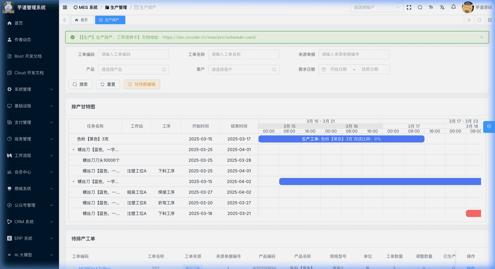
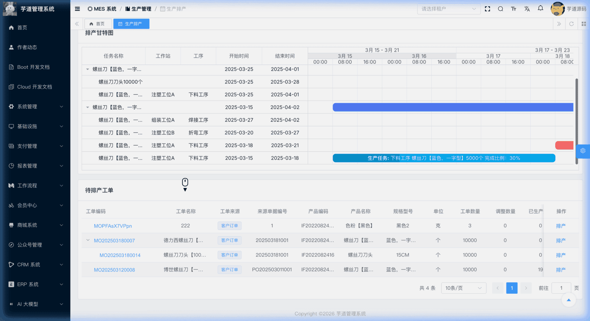
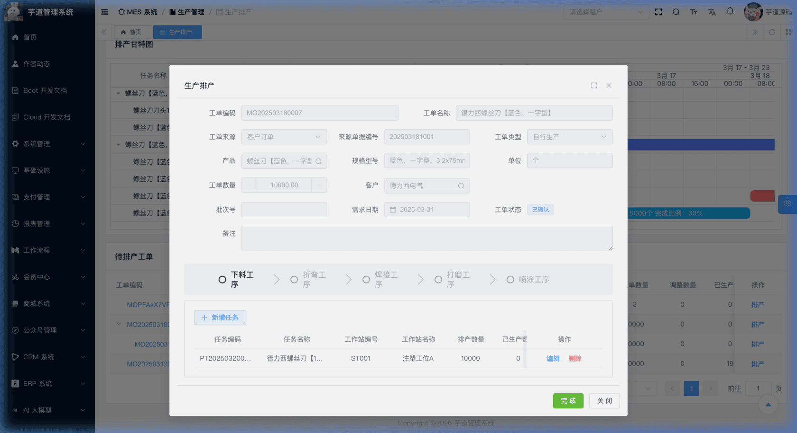
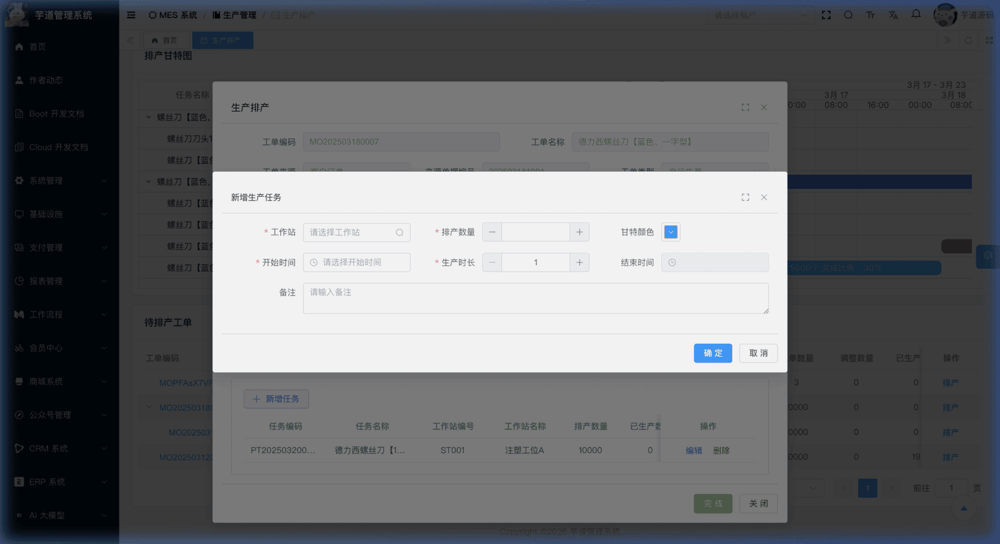
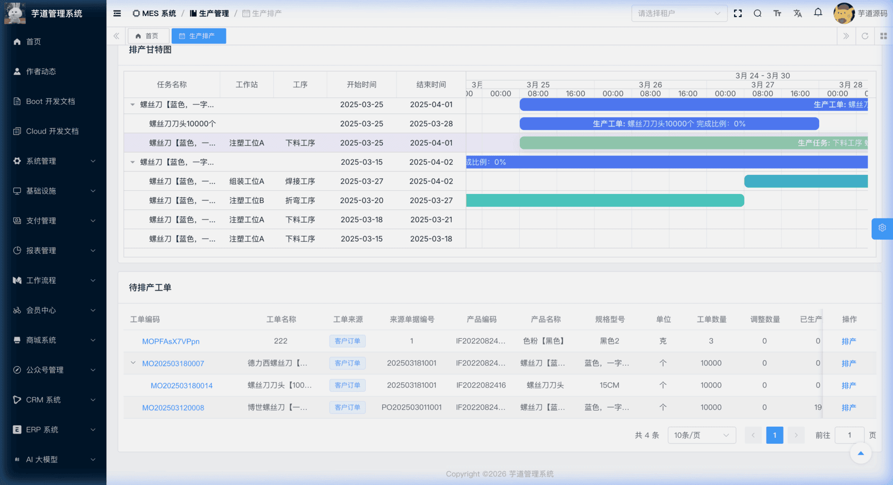
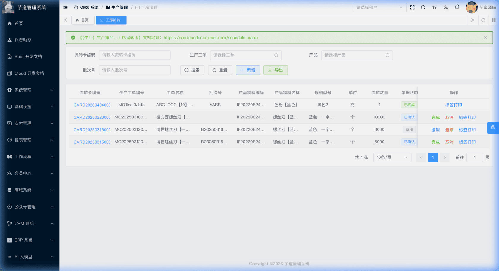
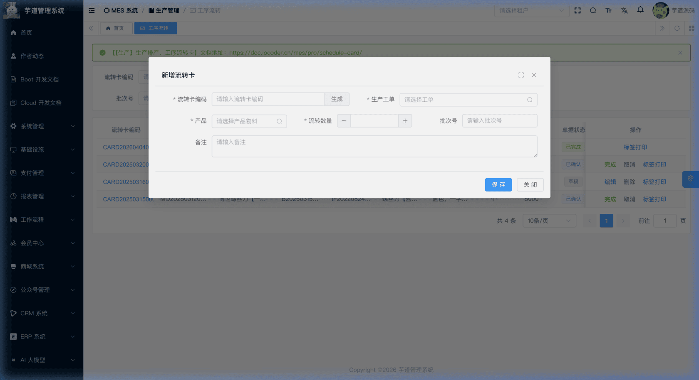
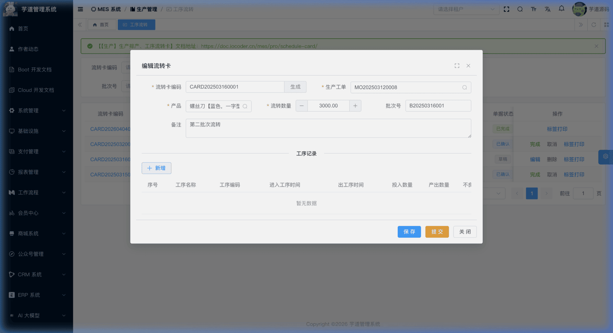

# 【生产】生产排产、工序流转卡

生产排产与工序流转卡模块，由 `yudao-module-mes` 后端模块的 `pro.task` 和 `pro.card` 包实现，是生产管理中承接工单、驱动车间实际执行的核心环节。
- **生产排产（生产任务）**：在实际生产中，同一道工序可能由多个工作站协同完成。生产排产就是将已确认的生产工单按工艺路线中的各道工序，分解为具体可执行的生产任务，指定到对应工作站。每个任务包含工作站、排产数量、开始时间、生产时长等信息，排产结果通过**甘特图**可视化展示，便于对多个工单的时间分布和资源分配进行统筹调整。
- **工序流转卡**：工序流转卡是伴随产品在各道工序之间流转的实物跟踪凭证。一张流转卡关联一张工单和一个产品，记录产品在每道工序中的进出时间、投入/产出数量、不合格品数量、操作人等信息，实现产品在工序间的全程追溯。
本文涉及表如下图所示：
 
## # 1. 生产排产（生产任务）
生产任务，由 MesProTaskController 提供接口。
### # 1.1 表结构
省略 creator/create_time/updater/update_time/deleted/tenant_id 等通用字段
CREATE TABLE `mes_pro_task` (
`id` bigint NOT NULL AUTO_INCREMENT COMMENT '编号',
`code` varchar(64) NOT NULL COMMENT '任务编码',
`name` varchar(255) NOT NULL COMMENT '任务名称',
`work_order_id` bigint NOT NULL COMMENT '生产工单编号',
`workstation_id` bigint NOT NULL COMMENT '工作站编号',
`route_id` bigint NOT NULL COMMENT '工艺路线编号',
`process_id` bigint NOT NULL COMMENT '工序编号',
`item_id` bigint NOT NULL COMMENT '产品物料编号',
`quantity` decimal(14,2) NOT NULL DEFAULT '0.00' COMMENT '排产数量',
`produced_quantity` decimal(14,2) NOT NULL DEFAULT '0.00' COMMENT '已生产数量',
`qualify_quantity` decimal(14,2) NOT NULL DEFAULT '0.00' COMMENT '合格品数量',
`unqualify_quantity` decimal(14,2) NOT NULL DEFAULT '0.00' COMMENT '不良品数量',
`changed_quantity` decimal(14,2) NOT NULL DEFAULT '0.00' COMMENT '调整数量',
`client_id` bigint DEFAULT NULL COMMENT '客户编号',
`start_time` datetime DEFAULT NULL COMMENT '开始生产时间',
`duration` int NOT NULL DEFAULT '1' COMMENT '生产时长（工作日，1=8小时）',
`end_time` datetime DEFAULT NULL COMMENT '结束生产时间',
`color_code` char(7) DEFAULT '#00AEF3' COMMENT '甘特图显示颜色',
`finish_date` datetime DEFAULT NULL COMMENT '完成日期',
`cancel_date` datetime DEFAULT NULL COMMENT '取消日期',
`status` tinyint NOT NULL DEFAULT '0' COMMENT '任务状态',
`remark` varchar(500) DEFAULT '' COMMENT '备注',
PRIMARY KEY (`id`)
) ENGINE=InnoDB COMMENT='MES 生产任务';
① `name` 为任务名称，创建时由系统自动生成，格式为 `{产品名}【{排产数量}】{单位名}`。修改排产数量或产品后，名称会同步更新。
② `work_order_id` 关联 `mes_pro_work_order` 表的 `id` 字段，标识该任务属于哪个工单，详见 [《【生产】生产工单》](/mes/pro/work-order/)。
③ `workstation_id` 关联 `mes_md_workstation` 表的 `id` 字段，标识该任务分配到哪个工作站执行，详见 [《【基础】车间设置、工作站设置》](/mes/md/workshop/)。
④ `route_id` 关联 `mes_pro_route` 表的 `id` 字段，`process_id` 关联 `mes_pro_process` 表的 `id` 字段，标识该任务所在的工艺路线和对应工序，详见 [《【生产】工序设置、工艺流程》](/mes/pro/process-route/)。
⑤ `item_id` 关联 `mes_md_item` 表的 `id` 字段，标识该任务生产的产品物料，详见 [《【基础】物料产品、分类、计量单位》](/mes/md/product/)。
⑥ 数量相关字段：
| 字段 | 说明 |
| --- | --- |
| `quantity` | 排产数量（创建任务时填写） |
| `produced_quantity` | 已生产数量（仅关键工序回写：关键非质检工序审批通过时即时累加，关键质检工序在 IPQC 完成后累加；非关键工序不更新） |
| `qualify_quantity` | 合格品数量（回写时机同上） |
| `unqualify_quantity` | 不良品数量（回写时机同上） |
| `changed_quantity` | 调整数量（用于生产过程中的数量变更） |
⑦ `client_id` 关联 `mes_md_client` 表（客户），创建任务时若未指定客户，系统自动从工单中继承，详见 [《【基础】客户管理、供应商管理》](/mes/md/client-vendor/)。
⑧ `start_time` 为开始生产时间，`duration` 为生产时长（单位：工作日，1 工作日 = 8 小时），`end_time` 为结束生产时间（由前端根据 `start_time + duration × 8小时` 自动计算）。这三个字段用于甘特图展示。
⑨ `color_code` 为甘特图显示颜色，默认值 `#00AEF3`（蓝色），从工艺路线工序配置中继承。用户可在排产时自定义修改颜色以区分不同工序的任务。
⑩ `status` 为任务状态，对应 MesProTaskStatusEnum 枚举：
| 状态值 | 枚举 | 说明 | 触发方式 |
| --- | --- | --- | --- |
| 0 | `PREPARE` | 草稿 | 创建任务 |
| 4 | `FINISHED` | 已完成 | 工单完成时级联完成 |
| 5 | `CANCELED` | 已取消 | 工单取消时级联取消 |
任务状态说明
与工单的状态流转不同，**生产任务没有独立的确认/完成/取消操作**。任务的终态由关联工单驱动：
- 工单**完成**时（`finishWorkOrder`），会级联完成该工单下所有未终态的任务。
- 工单**取消**时（`cancelWorkOrder`），会级联取消该工单下所有未终态的任务。
该表包含一个关联子表（注意：投料明细目前仅后端有接口实现，前端页面暂未集成）：
- `mes_pro_task_issue`（生产任务投料）：记录生产任务的投料明细，包含投料的物料、批次、数量等信息。
### # 1.2 管理后台
对应 [MES 系统 -> 生产管理 -> 生产排产] 菜单，对应 `yudao-ui-admin-vue3` 项目的 `@/views/mes/pro/task` 目录。
排产页面的整体设计思路是：**以工艺路线的工序列表为导航，按工序维度分别管理该工序下的生产任务**。页面由三部分组成：搜索栏 + 甘特图预览 + 待排产工单列表。
#### # 甘特图预览
页面上方展示排产甘特图，以只读模式展示。甘特图在页面初始化时按默认筛选条件（`status=已确认, type=自行生产`）加载一次，后续搜索/重置操作仅刷新下方工单列表，不会联动刷新甘特图。其中工单为 project 行（父级），任务为 task 行（子级），通过不同颜色区分工序。
 
#### # 待排产工单列表
下方展示已确认且为自行生产类型的工单列表（固定筛选 `status = 已确认, type = 自行生产`），以树形表格呈现父子工单关系。列表展示工单编码、名称、来源类型、来源单据编号、产品信息、工单数量、调整数量、已生产数量、客户信息、需求日期和排产状态。
 
#### # 排产
在工单列表中，点击「排产」按钮（仅在已确认状态的工单上显示），弹出排产对话框。
对话框上半部分以**只读方式**展示工单表头信息（编码、名称、来源、类型、产品、数量、客户、批次号、需求日期、状态等）。
对话框下半部分展示该工单关联产品的**工艺路线工序导航条**，按排序展示所有工序。点击不同工序，切换显示对应工序下的任务列表。用户通过【新增任务】按钮逐条创建生产任务，每次指定一个工作站及其排产参数（排产数量、开始时间、生产时长等）。
 工艺路线自动加载
打开排产对话框时，系统自动根据工单的产品编号查询关联的工艺路线及其工序列表。如果产品未配置工艺路线，会提示"当前产品未配置工艺路线，请先在工艺路线中维护"。
#### # 新增任务
在某道工序的任务列表中，点击【新增任务】按钮，弹出任务新增表单。系统自动带入工单、工艺路线、工序、产品等上下文参数（不在表单中显示），用户只需填写工作站、排产数量、开始时间和生产时长：
- **生产时长**：以工作日为单位（1 工作日 = 8 小时），输入后自动计算结束时间
- **甘特颜色**：默认从工艺路线工序配置继承，用户可按需调整
 
#### # 甘特图编辑
在搜索栏右侧点击【甘特图编辑】按钮，跳转到独立的甘特图编辑页面（路由名 `MesProTaskGanttEdit`，源码文件为 `@/views/mes/pro/task/edit/index.vue`），支持通过拖拽方式直接调整任务的开始时间和持续时长，方便对整个工厂的多个工单进行统筹排产、合理分配产能。
 
#### # 完成工单
在排产对话框底部点击【完成】按钮，确认后会自动完成该工单及其下所有生产任务（级联更新为「已完成」状态）。完成后工单不可再排产。
★ **生产任务投料**（后端接口已实现，前端暂未集成）：由 `mes_pro_task_issue` 表存储，记录生产任务的投料明细。由 MesProTaskIssueController 提供接口。
mes_pro_task_issue 表结构 
省略 creator/create_time/updater/update_time/deleted/tenant_id 等通用字段
CREATE TABLE `mes_pro_task_issue` (
`id` bigint NOT NULL AUTO_INCREMENT COMMENT '编号',
`task_id` bigint NOT NULL COMMENT '生产任务编号',
`work_order_id` bigint DEFAULT NULL COMMENT '生产工单编号',
`workstation_id` bigint DEFAULT NULL COMMENT '工作站编号',
`source_doc_type` varchar(64) DEFAULT NULL COMMENT '来源单据类型',
`source_doc_id` bigint NOT NULL COMMENT '来源单据编号',
`source_line_id` bigint DEFAULT NULL COMMENT '来源单据行编号',
`source_doc_code` varchar(64) DEFAULT NULL COMMENT '来源单据编码',
`batch_code` varchar(64) DEFAULT NULL COMMENT '投料批次',
`item_id` bigint DEFAULT NULL COMMENT '产品物料编号',
`unit_measure_id` bigint DEFAULT NULL COMMENT '单位编号',
`issued_quantity` decimal(12,2) DEFAULT '0.00' COMMENT '总投料数量',
`available_quantity` decimal(12,2) DEFAULT '0.00' COMMENT '当前可用数量',
`used_quantity` decimal(12,2) DEFAULT '0.00' COMMENT '当前使用数量',
`remark` varchar(500) DEFAULT '' COMMENT '备注',
PRIMARY KEY (`id`)
) ENGINE=InnoDB COMMENT='MES 生产任务投料';
① `task_id` 关联 `mes_pro_task` 表的 `id` 字段，标识该投料记录属于哪个生产任务。
② `work_order_id` 关联 `mes_pro_work_order` 表的 `id` 字段，冗余工单编号以便快速查询。
③ `source_doc_*` 系列字段记录投料的来源单据信息（如生产领料单），用于追溯物料从仓库到生产线的流转路径。
④ `item_id` 关联 `mes_md_item` 表的 `id` 字段，标识投料的物料产品。`unit_measure_id` 关联 `mes_md_unit_measure` 表的 `id` 字段。
⑤ `issued_quantity` 为总投料数量，`available_quantity` 为当前可用数量，`used_quantity` 为当前已使用数量。业务约定 `available = issued - used`，但当前服务层为普通 CRUD，不会自动维护三者关系，需由调用方保证一致性。
## # 2. 工序流转卡
工序流转卡，由 MesProCardController 提供接口。
### # 2.1 表结构
省略 creator/create_time/updater/update_time/deleted/tenant_id 等通用字段
CREATE TABLE `mes_pro_card` (
`id` bigint NOT NULL AUTO_INCREMENT COMMENT '编号',
`code` varchar(64) NOT NULL COMMENT '流转卡编码',
`work_order_id` bigint NOT NULL COMMENT '生产工单编号',
`item_id` bigint NOT NULL COMMENT '产品物料编号',
`batch_code` varchar(64) DEFAULT NULL COMMENT '批次号',
`transfered_quantity` decimal(14,2) NOT NULL DEFAULT '0.00' COMMENT '流转数量',
`status` tinyint NOT NULL DEFAULT '0' COMMENT '状态',
`remark` varchar(500) DEFAULT '' COMMENT '备注',
PRIMARY KEY (`id`)
) ENGINE=InnoDB COMMENT='MES 生产流转卡';
① `code` 为流转卡编码，支持手动输入或通过编码规则自动生成（点击「生成」按钮）。
② `work_order_id` 关联 `mes_pro_work_order` 表的 `id` 字段，且要求工单处于**已确认**状态才能创建流转卡，详见 [《【生产】生产工单》](/mes/pro/work-order/)。创建时还会校验 `item_id` 必须与工单的产品一致。
③ `item_id` 关联 `mes_md_item` 表的 `id` 字段，标识流转跟踪的产品物料，详见 [《【基础】物料产品、分类、计量单位》](/mes/md/product/)。
④ `transfered_quantity` 为本批次的流转数量。
⑤ `status` 复用 MesProWorkOrderStatusEnum 枚举：
| 状态值 | 枚举 | 说明 | 可执行操作 |
| --- | --- | --- | --- |
| 0 | `PREPARE` | 草稿 | 编辑、提交、删除 |
| 1 | `CONFIRMED` | 已确认 | 完成、取消 |
| 2 | `FINISHED` | 已完成 | — |
| 3 | `CANCELED` | 已取消 | — |
状态流转说明
创建 ──→ 草稿(0) ──提交──→ 已确认(1) ──完成──→ 已完成(2)
│               │
└──取消──→ 已取消(3) ←──取消──┘
- **创建**（`createCard`）：创建流转卡，初始状态为草稿。同时自动生成条码（`BarcodeBizTypeEnum.PROCARD`）。
- **提交**（`submitCard`）：草稿 → 已确认。校验流转卡为草稿状态后，直接更新状态为已确认。**提交后主表与工序记录均不可再修改**（前后端均校验草稿状态），因此工序记录需要在草稿编辑态维护完成。
- **完成**（`finishCard`）：已确认 → 已完成。
- **取消**（`cancelCard`）：后端支持草稿或已确认状态取消，已完成和已取消状态不允许取消；当前管理后台列表页仅对已确认状态展示【取消】按钮。
该表包含一个子表，在管理后台的新增/编辑弹窗中以分隔线下方的列表形式维护，在详情/完成弹窗中只读展示：
- `mes_pro_card_process`（工序记录）：记录产品在每道工序中的流转数据。
### # 2.2 管理后台
对应 [MES 系统 -> 生产管理 -> 工序流转卡] 菜单，对应 `yudao-ui-admin-vue3` 项目的 `@/views/mes/pro/card` 目录。
#### # 列表
支持按流转卡编码、生产工单、产品、批次号等条件搜索。列表展示流转卡编码、工单编号、工单名称、批次号、产品物料信息、单位、流转数量、单据状态等。
 
#### # 新增
点击【新增】按钮，弹出流转卡新增表单。主要填写流转卡编码（可点击「生成」按钮自动生成）、生产工单（仅显示已确认状态的工单）、产品、流转数量、批次号。新建成功后弹窗自动切换为编辑模式，并在表单下方展示工序记录列表。
 
#### # 修改
点击流转卡编码链接会进入详情弹窗；点击【编辑】按钮（仅草稿状态显示）才会进入修改表单。表单下方通过 `el-divider` 分隔展示**工序记录**列表。
 ★ **工序记录**（流转卡编辑弹窗下方）：由 `mes_pro_card_process` 表存储，记录产品在每道工序中的流转数据。由 MesProCardProcessController 提供接口。
mes_pro_card_process 表结构 
省略 creator/create_time/updater/update_time/deleted/tenant_id 等通用字段
CREATE TABLE `mes_pro_card_process` (
`id` bigint NOT NULL AUTO_INCREMENT COMMENT '编号',
`card_id` bigint NOT NULL COMMENT '流转卡编号',
`sort` int DEFAULT NULL COMMENT '序号',
`process_id` bigint DEFAULT NULL COMMENT '工序编号',
`input_time` datetime DEFAULT NULL COMMENT '进入工序时间',
`output_time` datetime DEFAULT NULL COMMENT '出工序时间',
`input_quantity` decimal(14,2) DEFAULT NULL COMMENT '投入数量',
`output_quantity` decimal(14,2) DEFAULT NULL COMMENT '产出数量',
`unqualified_quantity` decimal(14,2) DEFAULT NULL COMMENT '不合格品数量',
`workstation_id` bigint DEFAULT NULL COMMENT '工位编号',
`user_id` bigint DEFAULT NULL COMMENT '操作人编号',
`ipqc_id` bigint DEFAULT NULL COMMENT '过程检验单编号',
`remark` varchar(500) DEFAULT '' COMMENT '备注',
PRIMARY KEY (`id`),
KEY `idx_card_id` (`card_id`)
) ENGINE=InnoDB COMMENT='MES 流转卡工序记录';
① `card_id` 关联 `mes_pro_card` 表的 `id` 字段，标识该工序记录属于哪张流转卡。
② `sort` 为工序序号，决定工序记录在列表中的展示顺序。当前系统无基于该字段的工序执行控制逻辑。
③ `process_id` 关联 `mes_pro_process` 表的 `id` 字段，标识当前工序，详见 [《【生产】工序设置、工艺流程》](/mes/pro/process-route/)。
④ `input_time` 为进入工序时间，`output_time` 为出工序时间，用于记录产品在该工序的停留时间。
⑤ `input_quantity` 为投入数量，`output_quantity` 为产出数量，`unqualified_quantity` 为不合格品数量。通过这三个字段追踪每道工序的质量损耗情况。
⑥ `workstation_id` 关联 `mes_md_workstation` 表的 `id` 字段，标识该工序在哪个工作站执行。
⑦ `user_id` 关联 `system_users` 表的 `id` 字段，标识该工序的操作人。
⑧ `ipqc_id` 为过程检验单编号，预留字段，用于后续对接 IPQC 检验模块。当前后端未校验该字段，前端也未提供维护入口，流转卡工序记录尚未与 IPQC 模块打通，详见 [《【质量】过程检验（IPQC）》](/mes/qc/ipqc/)。
#### # 提交
在编辑弹窗底部点击【提交】按钮（仅草稿状态显示）。系统校验流转卡为草稿状态后，直接更新状态为已确认。提交后流转卡主表和工序记录均不可再修改（后端通过 `validateCardExistsAndPrepare` 校验草稿状态）。
#### # 完成
流转卡处于已确认状态时，在列表页点击【完成】按钮或在弹窗中操作，将流转卡标记为已完成。
#### # 取消
在列表页点击【取消】按钮（当前仅已确认状态显示），需二次确认。取消后不可恢复。
.pageB img{width:80px!important;}
.wwads-horizontal .wwads-text, .wwads-content .wwads-text{line-height:1;}
[【生产】生产工单](/mes/pro/work-order/) [【生产】生产报工](/mes/pro/feedback/) 
←
[【生产】生产工单](/mes/pro/work-order/) [【生产】生产报工](/mes/pro/feedback/)→
 
Theme by
[Vdoing](https://github.com/xugaoyi/vuepress-theme-vdoing) 
| Copyright © 2019-2026
芋道源码 | MIT License   
- 跟随系统
- 浅色模式
- 深色模式
- 阅读模式
× 
.windowRB{ padding: 0;}
.windowRB .wwads-img{margin-top: 10px;}
.windowRB .wwads-content{margin: 0 10px 10px 10px;}
.custom-html-window-rb .close-but{
display: none;
}