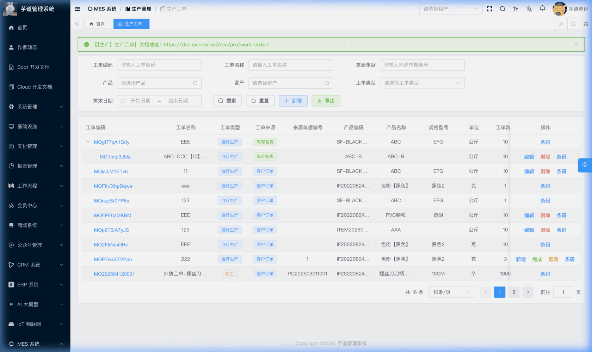
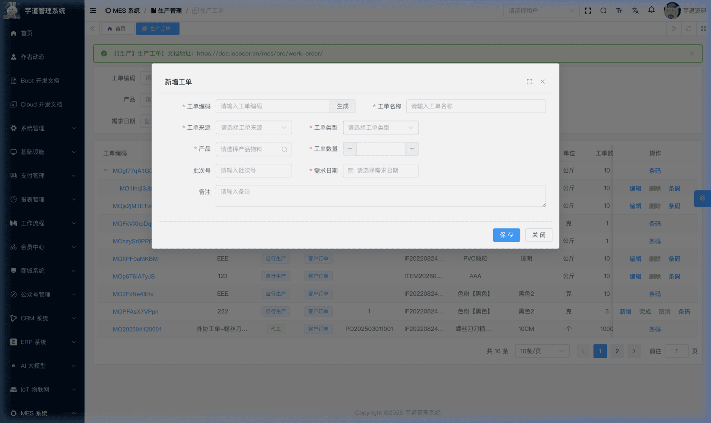
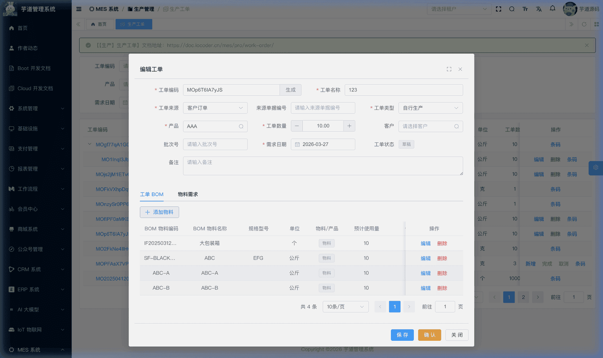
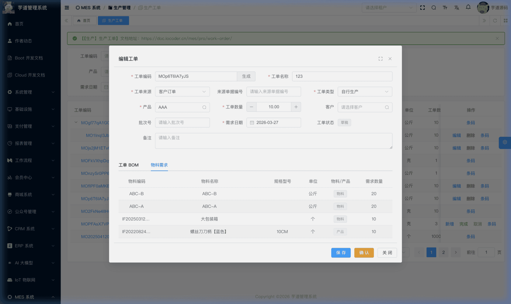
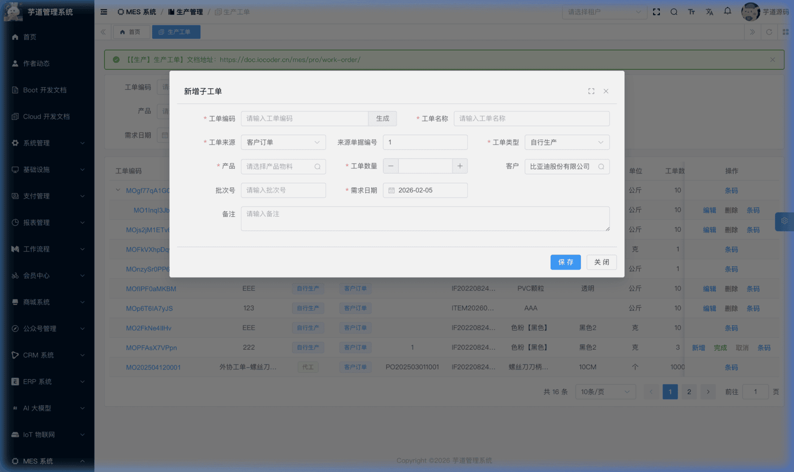

# 【生产】生产工单

生产工单模块，由 `yudao-module-mes` 后端模块的 `pro.workorder` 包实现，是 MES 系统中**生产执行的核心驱动单据**。
生产工单是工厂车间执行生产的指令，其来源可以是客户订单也可以是库存备货要求，核心信息为"生产的产品"、"生产的数量"、"需求日期"。保存工单后，系统会自动根据产品 BOM 配置，计算出依赖的物资需求数量。若一个产成品依赖多个半成品，可为每个半成品生成子工单；按此逻辑逐层追溯到原材料级别，即可实现最终产品到原材料的完整工单分解。
- **工单 BOM**：工单级别的物料清单，从产品 BOM 复制而来，可在工单维度微调用料数量。
- **父子工单**：支持树形结构，一个父工单可拆分出多个子工单（半成品工单），前端通过 `handleTree` 以树形表格展示。
- **状态流转**：草稿 → 已确认 → 已完成 / 已取消，贯穿工单全生命周期。
本文涉及表如下图所示：
 
## # 1. 生产工单
生产工单，由 MesProWorkOrderController 提供接口。
### # 1.1 表结构
省略 creator/create_time/updater/update_time/deleted/tenant_id 等通用字段
CREATE TABLE `mes_pro_work_order` (
`id` bigint NOT NULL AUTO_INCREMENT COMMENT '编号',
`code` varchar(64) NOT NULL COMMENT '工单编码',
`name` varchar(255) NOT NULL COMMENT '工单名称',
`type` tinyint NOT NULL DEFAULT '1' COMMENT '工单类型',
`order_source_type` tinyint NOT NULL COMMENT '来源类型',
`order_source_code` varchar(64) DEFAULT NULL COMMENT '来源单据编号',
`product_id` bigint NOT NULL COMMENT '产品编号',
`quantity` decimal(14,2) NOT NULL DEFAULT '0.00' COMMENT '生产数量',
`quantity_produced` decimal(14,2) NOT NULL DEFAULT '0.00' COMMENT '已生产数量',
`quantity_changed` decimal(14,2) NOT NULL DEFAULT '0.00' COMMENT '调整数量',
`quantity_scheduled` decimal(14,2) NOT NULL DEFAULT '0.00' COMMENT '已排产数量',
`client_id` bigint DEFAULT NULL COMMENT '客户编号',
`vendor_id` bigint DEFAULT NULL COMMENT '供应商编号',
`batch_code` varchar(64) DEFAULT NULL COMMENT '批次号',
`request_date` datetime NOT NULL COMMENT '需求日期',
`parent_id` bigint NOT NULL DEFAULT '0' COMMENT '父工单编号',
`finish_date` datetime DEFAULT NULL COMMENT '完成时间',
`cancel_date` datetime DEFAULT NULL COMMENT '取消时间',
`status` tinyint NOT NULL DEFAULT '0' COMMENT '工单状态',
`remark` varchar(500) DEFAULT '' COMMENT '备注',
PRIMARY KEY (`id`)
) ENGINE=InnoDB COMMENT='MES 生产工单';
① `name` 为工单名称。从 BOM 行点击「生成工单」新增子工单时，前端 `WorkOrderForm.vue` 的 `handleGenerateWorkOrder` 方法会自动以 `{BOM物料名}【{数量}】{单位}` 格式预填名称；从列表页点击「新增」子工单时不会自动生成名称，需用户手动填写。
② `type` 为工单类型，对应字典 `mes_pro_work_order_type`，枚举 MesProWorkOrderTypeEnum：
| 类型值 | 枚举 | 说明 | 前端联动 |
| --- | --- | --- | --- |
| 1 | `SELF` | 自行生产 | 已确认状态下可新增子工单 |
| 2 | `OUTSOURCE` | 代工 | 显示供应商选择 |
| 3 | `PURCHASE` | 采购 | 显示供应商选择 |
③ `order_source_type` 为来源类型，对应字典 `mes_pro_work_order_source_type`，枚举 MesProWorkOrderSourceTypeEnum：
| 类型值 | 枚举 | 说明 | 前端联动 |
| --- | --- | --- | --- |
| 1 | `ORDER` | 客户订单 | 显示来源单据编号、客户选择 |
| 2 | `STORE` | 库存备货 | 隐藏来源单据编号和客户 |
④ `order_source_code` 为来源单据编号，仅当 `order_source_type = 1`（客户订单）时使用，用于记录关联的外部订单号。
⑤ `product_id` 关联 `mes_md_item` 表的 `id` 字段，标识本工单要生产的产品物料。
⑥ 数量相关字段：
| 字段 | 说明 |
| --- | --- |
| `quantity` | 计划生产数量（创建时填写） |
| `quantity_produced` | 已生产数量（自行生产：关键非质检工序审批通过时即时累加，关键质检工序在 IPQC 完成后累加，非关键工序不更新；外协工单：外协入库单完成时累加） |
| `quantity_changed` | 调整数量（预留字段，当前后端暂无自动回写逻辑） |
| `quantity_scheduled` | 已排产数量（预留字段，当前后端暂无自动回写逻辑） |
⑦ `client_id` 关联 `mes_md_client` 表（客户）。前端仅在来源类型为客户订单（`ORDER`）时展示客户选择控件；但后端 `validateWorkOrderSaveData()` 会在产品批次配置 `clientFlag=true` 时强制要求 `clientId`，因此库存备货等其他场景下该字段也可能存在值。详见 [《【基础】客户管理、供应商管理》](/mes/md/client-vendor/)。
⑧ `vendor_id` 关联 `mes_md_vendor` 表（供应商），仅当工单类型为代工或采购时使用，详见 [《【基础】客户管理、供应商管理》](/mes/md/client-vendor/)。
⑨ `batch_code` 为批次号，由用户在新增工单时手动填写，用于标记该工单生产的产品所属批次。
⑩ `parent_id` 为父工单编号，关联 `mes_pro_work_order` 表自身的 `id` 字段。值为 `0` 表示顶级工单（无父工单）。通过此字段构建父子工单的树形结构。
⑪ `status` 为工单状态，对应字典 `mes_pro_work_order_status`，枚举 MesProWorkOrderStatusEnum：
| 状态值 | 枚举 | 说明 | 可执行操作 |
| --- | --- | --- | --- |
| 0 | `PREPARE` | 草稿 | 编辑、确认、删除 |
| 1 | `CONFIRMED` | 已确认 | 新增子工单（仅自行生产）、完成、取消 |
| 2 | `FINISHED` | 已完成 | — |
| 3 | `CANCELED` | 已取消 | — |
状态流转说明
创建 ──→ 草稿(0) ──确认──→ 已确认(1) ──完成──→ 已完成(2)
│
└──取消──→ 已取消(3)
- **创建**（`createWorkOrder`）：创建工单，初始状态为草稿。同时自动根据产品 BOM 生成工单 BOM，并自动生成条码。
- **确认**（`confirmWorkOrder`）：确认前可在编辑模式下同时保存修改并确认（脏检查：若表单有修改则先保存再确认）。确认后工单表头不可再修改。
- **完成**（`finishWorkOrder`）：记录 `finish_date`，同时级联完成所有关联的生产任务。
- **取消**（`cancelWorkOrder`）：记录 `cancel_date`，同时级联取消所有关联的生产任务。取消后不可恢复。
该表包含一个子表，在管理后台的修改弹窗中以 Tab 页形式维护：
- `mes_pro_work_order_bom`（工单 BOM）：工单级物料清单，从产品 BOM 复制而来，可微调用料数量。
### # 1.2 管理后台
对应 [MES 系统 -> 生产管理 -> 生产工单] 菜单，对应 `yudao-ui-admin-vue3` 项目的 `@/views/mes/pro/workorder` 目录。
#### # 列表
采用**树形表格**（`el-table` + `row-key="id"` + `tree-props`）展示父子工单关系，默认全部展开。支持按工单编码、名称、来源单据编号、产品、客户、工单类型、需求日期范围等条件搜索。每行操作列始终显示**「条码」**按钮，点击可查看该工单关联的条码详情。
 
#### # 新增
点击【新增】按钮，弹出工单新增表单。主要填写工单编码、名称、产品、生产数量、工单类型、来源类型、需求日期等。指定产品和数量保存后，系统自动根据产品 BOM 配置生成工单 BOM，并计算出依赖的物资需求数量。新建成功后弹窗自动切换为编辑模式，展示 Tab 页。
 
#### # 修改
点击编码链接查看工单详情（只读），点击【编辑】按钮进入修改表单（可编辑）。详情模式下弹窗底部还提供**「查看条码」**按钮，可打开该工单的条码详情弹窗。弹窗底部包含以下 Tab 页：
 ★ **工单 BOM**（工单详情 Tab）：由 `mes_pro_work_order_bom` 表存储，维护该工单的物料清单。列表展示 BOM 物料编码、名称、规格、单位、预计使用量等。**草稿状态下**支持新增、编辑、删除 BOM 行；**已确认 + 自行生产**的工单中，类型为「产品」的 BOM 行会显示**「生成工单」**按钮，点击后预填并打开子工单新增表单（需用户补充工单编码等信息后手动保存）。由 MesProWorkOrderBomController 提供接口。
**⚠️ 注意**：草稿态下修改工单的**产品**或**工单数量**并保存时，后端会先删除当前所有工单 BOM 行，再按新的产品 BOM 和数量重新生成。因此，之前手工调整过的 BOM 行和预计使用量不会保留。建议先确定产品和数量，再进行 BOM 微调。
mes_pro_work_order_bom 表结构 
省略 creator/create_time/updater/update_time/deleted/tenant_id 等通用字段
CREATE TABLE `mes_pro_work_order_bom` (
`id` bigint NOT NULL AUTO_INCREMENT COMMENT '编号',
`work_order_id` bigint NOT NULL COMMENT '生产工单编号',
`item_id` bigint NOT NULL COMMENT 'BOM 物料编号',
`quantity` decimal(14,2) NOT NULL DEFAULT '0.00' COMMENT '预计使用量',
`remark` varchar(500) DEFAULT '' COMMENT '备注',
PRIMARY KEY (`id`)
) ENGINE=InnoDB COMMENT='MES 生产工单 BOM';
① `work_order_id` 关联 `mes_pro_work_order` 表的 `id` 字段。
② `item_id` 关联 `mes_md_item` 表的 `id` 字段，标识该工单需要消耗的 BOM 物料。
③ `quantity` 为预计使用量。系统自动生成工单 BOM 时，会按 `工单数量 × 产品 BOM 比例` 换算为总量；手工新增 BOM 行时，前端默认带出产品 BOM 的比例值，用户需根据实际需求自行调整，后端会原样保存。
工单 BOM 与产品 BOM 的关系
工单 BOM 通常从产品的 BOM（`mes_md_product_bom`）复制而来，但允许在工单维度微调预计使用量，并按需增删 BOM 子项。需要注意的是，手工新增 BOM 行时，可选物料范围限定在当前产品的产品 BOM 子项内（后端 `validateWorkOrderBomSaveData()` 会校验，非当前产品 BOM 物料将被拒绝）。
工单 BOM 还支持**生成工单**功能：在 BOM 列表中，点击某条 BOM 物料行的「生成工单」按钮，会自动预填并打开子工单新增表单（以该 BOM 物料为产品，同时继承父工单的类型、来源、客户等信息），用户需补充工单编码等必填项后手动保存，并非一键自动落库创建。
 ★ **物料需求**（工单详情 Tab）：以只读方式展示该工单的物料需求汇总（查询时基于当前工单 BOM 逐层展开并汇总得到的叶子物料需求清单）。当前前端在工单弹窗打开时加载一次，后续修改工单 BOM 后不会自动刷新，需关闭并重新打开弹窗才能看到最新结果。由 MesProWorkOrderBomController 提供接口。
#### # 确认工单
在编辑弹窗中点击【确认】按钮（仅草稿状态下显示）。系统会先检查表单是否有修改（脏检查），有修改则先保存再确认。确认后工单表头锁定为只读状态。
#### # 完成工单
在列表页点击【完成】或在弹窗中操作。会自动记录完成时间（`finish_date`）。
#### # 取消工单
在列表页点击【取消】按钮，需二次确认。取消后不可恢复，记录取消时间（`cancel_date`）。**草稿状态下删除工单时，如果存在子工单则不允许删除**。
#### # 新增子工单
新增子工单有两个入口，预填行为不同：
- **列表页【新增】按钮**：仅在**已确认 + 自行生产**的工单行上显示。点击后弹出空白新增表单，自动继承父工单的类型、来源、来源单据编号、客户、供应商、需求日期，`parent_id` 设为父工单 ID。产品、数量、名称等字段需用户自行填写。
- **BOM 行【生成工单】按钮**：在工单 BOM Tab 中，已确认 + 自行生产的工单里，类型为「产品」的 BOM 行会显示此按钮。点击后除继承父工单基础信息外，还会自动预填产品（BOM 物料）、数量（BOM 预计使用量）及名称（`{BOM物料名}【{数量}】{单位}` 格式）。
两种方式创建的子工单均需用户补充工单编码后手动保存。若产成品依赖多个半成品，可为每个半成品分别生成子工单；按此逻辑逐层追溯到原材料级别，即可实现完整的工单分解。子工单在列表中通过树形缩进展示在父工单下方。
 
.pageB img{width:80px!important;}
.wwads-horizontal .wwads-text, .wwads-content .wwads-text{line-height:1;}
[【生产】工序设置、工艺流程](/mes/pro/process-route/) [【生产】生产排产、工序流转卡](/mes/pro/schedule-card/) 
←
[【生产】工序设置、工艺流程](/mes/pro/process-route/) [【生产】生产排产、工序流转卡](/mes/pro/schedule-card/)→
 
Theme by
[Vdoing](https://github.com/xugaoyi/vuepress-theme-vdoing) 
| Copyright © 2019-2026
芋道源码 | MIT License   
- 跟随系统
- 浅色模式
- 深色模式
- 阅读模式
× 
.windowRB{ padding: 0;}
.windowRB .wwads-img{margin-top: 10px;}
.windowRB .wwads-content{margin: 0 10px 10px 10px;}
.custom-html-window-rb .close-but{
display: none;
}