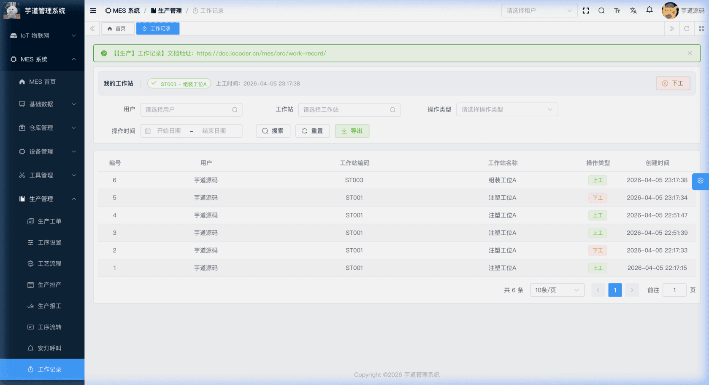
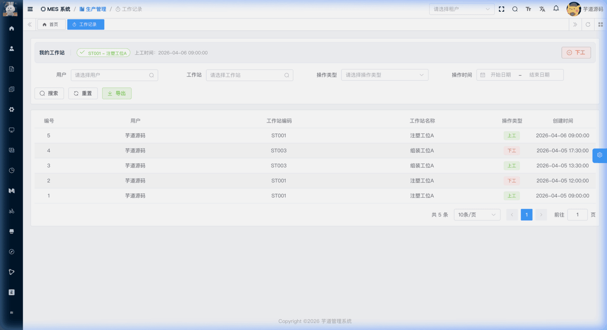

# 【生产】工作记录

工作记录模块，由 `yudao-module-mes` 后端模块的 `pro.workrecord` 包实现，用于管理车间操作人员与工作站之间的**上工/下工绑定关系**。
- 操作人员进入产线前，通过【上工】操作将自己绑定到某个工作站，表示"我现在在这个工位上工作"；离开时通过【下工】操作标记为已下工状态（快照表保留上一次工作站信息，不会清空）。
- 系统会记录每一次上下工事件，形成完整的人员出勤流水，便于管理人员追踪哪些人在哪些工位上工作过、何时上工/下工。
模块采用**快照 + 流水**的双表架构：
- **当前绑定状态**：快照表，每个用户最多一条记录，反映该用户最近一次操作的工作站及当前上工/下工状态。下工后 `workstation_id` **不会被清空**，仍保留上一次工作站信息。
- **上下工记录流水**：流水表，记录每一次上工/下工操作，形成完整的历史时间线。
本文涉及表如下图所示：
 
## # 1. 当前绑定状态（快照表）
当前绑定状态表用于存储每个用户**最新的**工作站绑定快照，由 MesProWorkRecordServiceImpl 内部维护，不由前端直接增删改。
### # 1.1 表结构
省略 creator/create_time/updater/update_time/deleted/tenant_id 等通用字段
CREATE TABLE `mes_pro_work_record` (
`id` bigint NOT NULL AUTO_INCREMENT COMMENT '编号',
`user_id` bigint NOT NULL COMMENT '用户编号',
`workstation_id` bigint NOT NULL COMMENT '工作站编号',
`type` tinyint NOT NULL COMMENT '当前状态（1=上工 2=下工）',
`clock_in_time` datetime DEFAULT NULL COMMENT '上工时间',
`clock_out_time` datetime DEFAULT NULL COMMENT '下工时间',
`remark` varchar(500) DEFAULT '' COMMENT '备注',
PRIMARY KEY (`id`),
UNIQUE KEY `uk_user_id` (`user_id`)
) ENGINE=InnoDB COMMENT='MES 当前绑定状态快照';
① `user_id` 关联 `system_users` 表的 `id` 字段，通过唯一索引 `uk_user_id` 保证每个用户最多一条记录。首次上工时插入，后续上工/下工均为更新。
② `workstation_id` 关联 `mes_md_workstation` 表的 `id` 字段，记录用户最近一次操作的工作站，详见 [《【基础】车间设置、工作站设置》](/mes/md/workshop/)。**下工时不会清空该字段**，仅更新 `type` 和 `clock_out_time`。
③ `type` 为当前状态，枚举 MesProWorkRecordTypeEnum（1=上工，2=下工）。上工时设置为 1，下工时设置为 2。
④ `clock_in_time` 和 `clock_out_time` 记录最近一次上工/下工的时间。**上工时**系统更新 `clock_in_time`，`clock_out_time` 保留上一次下工时间不变；**下工时**系统写入 `clock_out_time`。
## # 2. 上下工记录流水
上下工记录流水，由 MesProWorkRecordController 提供接口。每一次上工/下工操作都会在流水表中追加一条记录，构成完整的历史时间线。
### # 2.1 表结构
省略 creator/create_time/updater/update_time/deleted/tenant_id 等通用字段
CREATE TABLE `mes_pro_work_record_log` (
`id` bigint NOT NULL AUTO_INCREMENT COMMENT '编号',
`user_id` bigint NOT NULL COMMENT '用户编号',
`workstation_id` bigint NOT NULL COMMENT '工作站编号',
`type` tinyint NOT NULL COMMENT '操作类型（1=上工 2=下工）',
`remark` varchar(500) DEFAULT '' COMMENT '备注',
PRIMARY KEY (`id`)
) ENGINE=InnoDB COMMENT='MES 上下工记录流水';
① `user_id` 关联 `system_users` 表的 `id` 字段，标识执行上工/下工操作的用户。
② `workstation_id` 关联 `mes_md_workstation` 表的 `id` 字段，标识本次操作关联的工作站，详见 [《【基础】车间设置、工作站设置》](/mes/md/workshop/)。
③ `type` 为操作类型，枚举 MesProWorkRecordTypeEnum（1=上工，2=下工）。
上工/下工业务流程
用户A 上工(工作站X) ──→ 快照表：插入/更新为上工状态
流水表：追加一条「上工」记录
用户A 下工 ──────────→ 快照表：更新为下工状态
流水表：追加一条「下工」记录
用户A 再次上工(工作站Y) → 快照表：更新工作站为Y，状态为上工
流水表：追加一条「上工」记录
- **上工**（`clockInWorkRecord`）：校验工作站存在 → 校验用户未处于上工状态（防止重复上工） → 写入上工流水 → 更新快照表（首次则插入，非首次则更新工作站、状态、`clock_in_time`，`clock_out_time` 保留不变）。
- **下工**（`clockOutWorkRecord`）：校验用户处于上工状态 → 写入下工流水 → 更新快照表状态为下工，记录 `clock_out_time`。
### # 2.2 管理后台
对应 [MES 系统 -> 生产管理 -> 工作记录] 菜单，对应 `yudao-ui-admin-vue3` 项目的 `@/views/mes/pro/workrecord` 目录。
#### # 我的工作站状态栏
页面顶部有一个横向状态栏（WorkRecordStatusBar.vue），显示当前登录用户的工作站绑定状态：
- **已上工**：显示绑定的工作站编码和名称（绿色标签），以及上工时间。右侧提供【下工】按钮，点击后二次确认即可解绑。
- **未上工**：显示「当前未上工」（灰色标签）。右侧提供【上工】按钮，点击后弹出工作站选择器，选择目标工作站后点击【确认上工】完成绑定。
上工/下工操作完成后，状态栏会自动刷新，同时触发下方流水列表重新加载。
 
#### # 列表
状态栏下方为上下工记录流水列表。支持按用户、工作站、操作类型、操作时间范围等条件搜索。列表展示编号、用户、工作站编码、工作站名称、操作类型（上工/下工）、创建时间等信息。
 
.pageB img{width:80px!important;}
.wwads-horizontal .wwads-text, .wwads-content .wwads-text{line-height:1;}
[【生产】安灯配置、安灯呼叫](/mes/pro/andon/) [【仓库】仓库与库区库位、条码赋码、SN码](/mes/wm/warehouse-setup/) 
←
[【生产】安灯配置、安灯呼叫](/mes/pro/andon/) [【仓库】仓库与库区库位、条码赋码、SN码](/mes/wm/warehouse-setup/)→
 
Theme by
[Vdoing](https://github.com/xugaoyi/vuepress-theme-vdoing) 
| Copyright © 2019-2026
芋道源码 | MIT License   
- 跟随系统
- 浅色模式
- 深色模式
- 阅读模式
× 
.windowRB{ padding: 0;}
.windowRB .wwads-img{margin-top: 10px;}
.windowRB .wwads-content{margin: 0 10px 10px 10px;}
.custom-html-window-rb .close-but{
display: none;
}