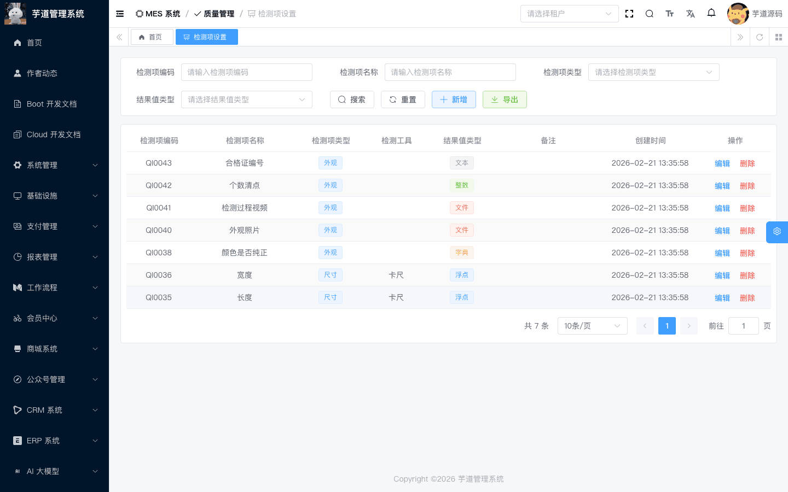
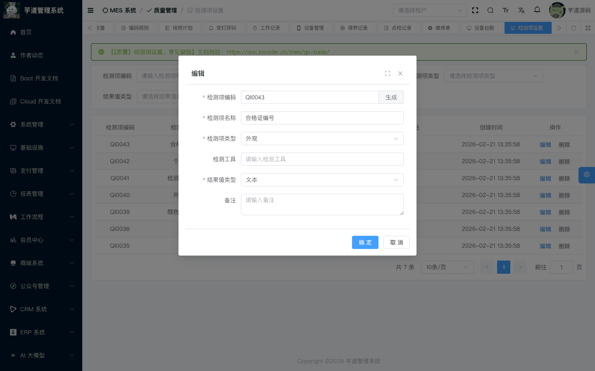
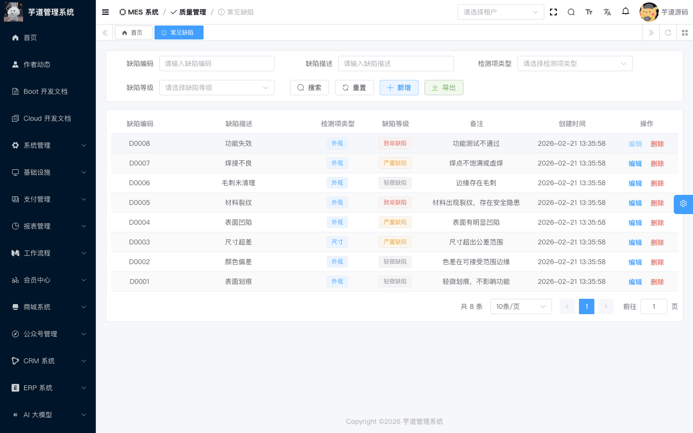
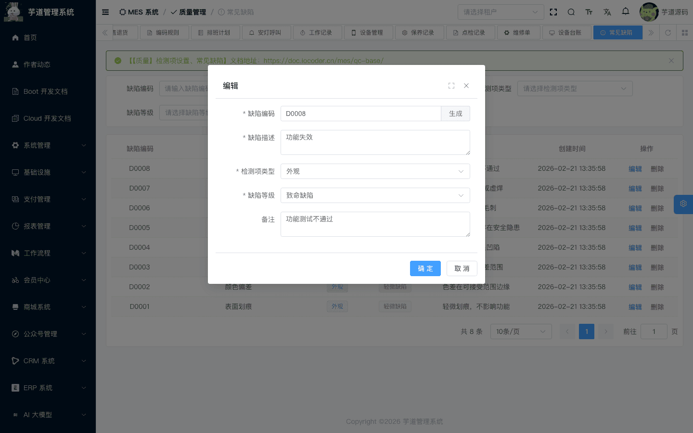

# 【质量】检测项设置、常见缺陷

质量管理覆盖**来料检验**（IQC）、**过程检验**（IPQC）、**出货检验**（OQC）、**退货检验**（RQC）四个环节，贯穿从原材料入库到成品出货的全流程。本文介绍质量检验的基础数据，由 `yudao-module-mes` 后端模块的 `qc.indicator`、`qc.defect` 包实现。
本文涉及两个子模块：
- **检测项设置**：定义质量检验中的检测项（如外观检查、尺寸测量、硬度测试等），是质检方案的最小检验单元。
- **常见缺陷**：定义生产和检验过程中的常见缺陷项（如划痕、变形、色差等），为后续缺陷记录的快速选择做数据准备（当前缺陷记录仍为手动填写）。
本文涉及表如下图所示：
 
## # 1. 检测项设置
检测项设置，由 MesQcIndicatorController 提供接口。检测项是质检方案中的最小检验单元，定义「检什么」、「用什么工具检」、「结果是什么类型」。
### # 1.1 表结构
省略 creator/create_time/updater/update_time/deleted/tenant_id 等通用字段
CREATE TABLE `mes_qc_indicator` (
`id` bigint NOT NULL AUTO_INCREMENT COMMENT '编号',
`code` varchar(64) NOT NULL COMMENT '检测项编码',
`name` varchar(255) NOT NULL COMMENT '检测项名称',
`type` tinyint NOT NULL COMMENT '检测项类型',
`tool` varchar(255) DEFAULT NULL COMMENT '检测工具',
`result_type` tinyint NOT NULL COMMENT '结果类型',
`result_specification` varchar(255) DEFAULT NULL COMMENT '结果值属性',
`remark` varchar(500) DEFAULT '' COMMENT '备注',
PRIMARY KEY (`id`)
) ENGINE=InnoDB COMMENT='MES 质检指标';
① `type` 为检测项类型，使用数据字典 `mes_indicator_type`（如外观检测、尺寸检测、性能检测等），可在系统管理中自定义扩展。
② `result_type` 为检测结果的数据类型，枚举 MesQcResultValueTypeEnum（1=浮点，2=整数，3=文本，4=字典，5=文件）。决定了质检时该检测项的结果录入方式。
③ `result_specification` 为结果值属性。当 `result_type` 为字典（4）时填写数据字典类型编码（如 `sys_yes_no`）；为文件（5）时填写 `IMG`（图片）或 `FILE`（文件）。浮点/整数/文本类型不使用此字段。
### # 1.2 管理后台
对应 [MES 系统 -> 质量管理 -> 检测项设置] 菜单，对应 `yudao-ui-admin-vue3` 项目的 `@/views/mes/qc/indicator` 目录。
#### # 列表
支持按检测项编码、名称、类型等条件搜索。
 
#### # 新增/修改
点击【新增】或【编辑】按钮，弹出检测项表单。主要填写检测项编码（可自动生成）、名称、类型、检测工具、结果类型。
 
## # 2. 常见缺陷
常见缺陷，由 MesQcDefectController 提供接口。预定义生产和检验过程中的常见缺陷项，为缺陷记录提供基础数据（当前缺陷记录组件尚未接入快速选择，仍为手动填写缺陷描述和等级）。
### # 2.1 表结构
省略 creator/create_time/updater/update_time/deleted/tenant_id 等通用字段
CREATE TABLE `mes_qc_defect` (
`id` bigint NOT NULL AUTO_INCREMENT COMMENT '编号',
`code` varchar(64) NOT NULL COMMENT '缺陷编码',
`name` varchar(500) NOT NULL COMMENT '缺陷描述',
`type` tinyint NOT NULL COMMENT '检测项类型',
`level` int NOT NULL COMMENT '缺陷等级',
`remark` varchar(500) DEFAULT '' COMMENT '备注',
PRIMARY KEY (`id`)
) ENGINE=InnoDB COMMENT='MES 缺陷类型表';
① `type` 为检测项类型，使用数据字典 `mes_defect_type`（如尺寸、外观、重量、性能、成分等），可在系统管理中自定义扩展。
② `level` 为缺陷等级，枚举 MesQcDefectLevelEnum（1=致命，2=严重，3=轻微），用于评估缺陷的严重程度。
### # 2.2 管理后台
对应 [MES 系统 -> 质量管理 -> 常见缺陷] 菜单，对应 `yudao-ui-admin-vue3` 项目的 `@/views/mes/qc/defect` 目录。
#### # 列表
支持按缺陷编码、名称、类型、等级等条件搜索。
 
#### # 新增/修改
点击【新增】或【编辑】按钮，弹出缺陷表单。主要填写缺陷编码（可自动生成）、缺陷描述、检测项类型、缺陷等级。
 
## # 3. 质量检验体系概览
基础数据在质量检验体系中的位置
检测项设置 ──→ 质检方案（模板） ──→ 来料检验(IQC) / 过程检验(IPQC) / 出货检验(OQC) / 退货检验(RQC)
│
常见缺陷   ──→ 缺陷记录（检验过程中引用）──────────────┘
- **检测项**是质检方案的组成单元。一个质检方案包含多个检测项（通过 `mes_qc_template_indicator` 关联），每个检测项定义检测内容和结果类型。详见 [《【质量】质检方案》](/mes/qc/template/)。
- **常见缺陷**为质检过程中的缺陷记录提供基础数据。当前缺陷记录组件（DefectRecordInlineList.vue）采用手动填写缺陷描述和选择等级的方式，尚未接入常见缺陷快速选择功能（`getDefectSimpleList` API 已定义但未被页面调用）。
.pageB img{width:80px!important;}
.wwads-horizontal .wwads-text, .wwads-content .wwads-text{line-height:1;}
[【仓库】库存盘点](/mes/wm/stocktaking/) [【质量】质检方案](/mes/qc/template/) 
←
[【仓库】库存盘点](/mes/wm/stocktaking/) [【质量】质检方案](/mes/qc/template/)→
 
Theme by
[Vdoing](https://github.com/xugaoyi/vuepress-theme-vdoing) 
| Copyright © 2019-2026
芋道源码 | MIT License   
- 跟随系统
- 浅色模式
- 深色模式
- 阅读模式
× 
.windowRB{ padding: 0;}
.windowRB .wwads-img{margin-top: 10px;}
.windowRB .wwads-content{margin: 0 10px 10px 10px;}
.custom-html-window-rb .close-but{
display: none;
}