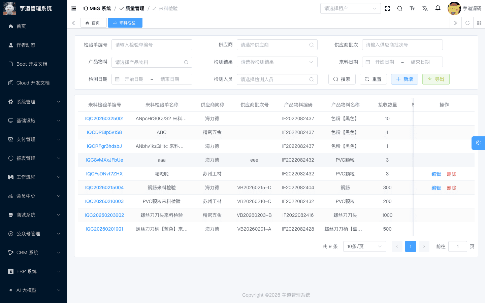
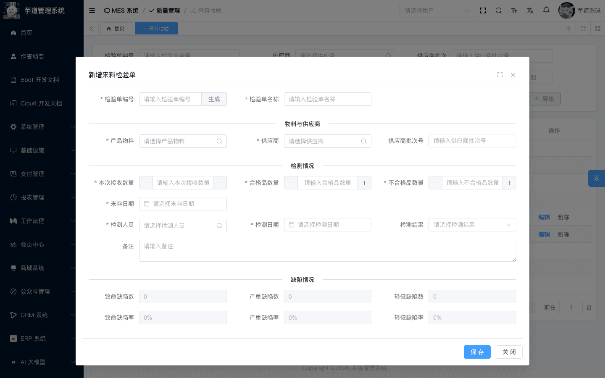
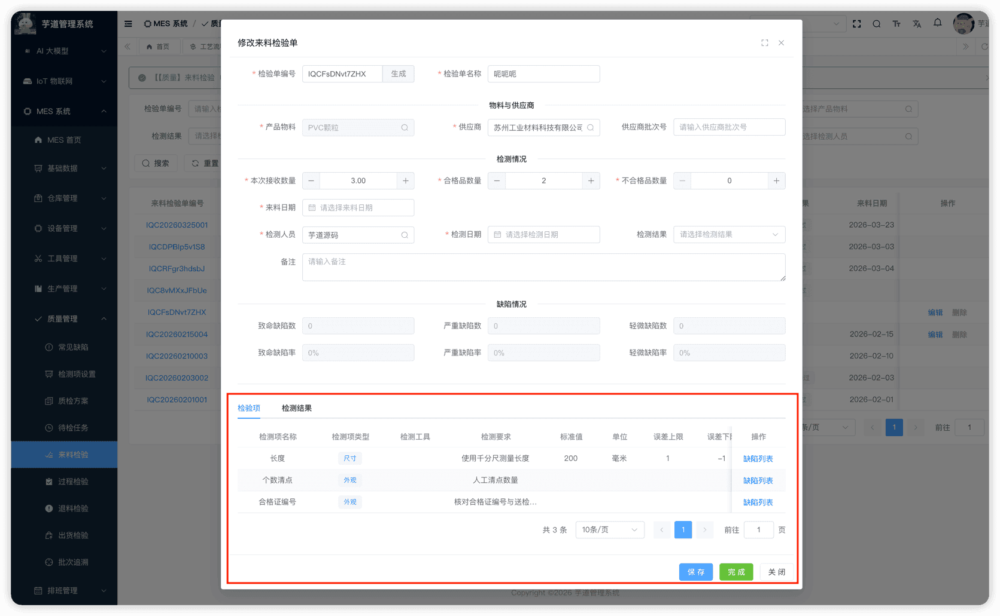

# 【质量】来料检验（IQC）

来料检验（IQC，Incoming Quality Control）模块，由 `yudao-module-mes` 后端模块的 `qc.iqc` 包实现，覆盖采购物料到货后的质量检验场景。
IQC 检验单关联**来源单据**（到货通知单或外协入库单），创建时系统根据被检物料 + IQC 类型**自动匹配质检方案**并生成检验行。检验完成后，**若关联了来源单据则自动回写**相关质检字段；若为独立创建的检验单，则仅更新自身状态。
本文涉及表如下图所示：
 
## # 1. 来料检验单（IQC）
来料检验单，由 MesQcIqcController 提供接口。
### # 1.1 表结构
省略 creator/create_time/updater/update_time/deleted/tenant_id 等通用字段
CREATE TABLE `mes_qc_iqc` (
`id` bigint NOT NULL AUTO_INCREMENT COMMENT '编号',
`code` varchar(64) NOT NULL COMMENT '检验单编号',
`name` varchar(500) NOT NULL COMMENT '检验单名称',
`template_id` bigint NOT NULL COMMENT '检验模板ID',
`source_doc_type` tinyint DEFAULT NULL COMMENT '来源单据类型',
`source_doc_id` bigint DEFAULT NULL COMMENT '来源单据ID',
`source_line_id` bigint DEFAULT NULL COMMENT '来源单据行ID',
`source_doc_code` varchar(64) DEFAULT NULL COMMENT '来源单据编号（冗余）',
`vendor_id` bigint NOT NULL COMMENT '供应商ID',
`vendor_batch` varchar(64) DEFAULT NULL COMMENT '供应商批次号',
`item_id` bigint NOT NULL COMMENT '产品物料ID',
`received_quantity` decimal(14,2) NOT NULL COMMENT '本次接收数量',
`check_quantity` decimal(14,2) DEFAULT NULL COMMENT '本次检测数量',
`qualified_quantity` decimal(14,2) DEFAULT '0.00' COMMENT '合格品数量',
`unqualified_quantity` decimal(14,2) DEFAULT '0.00' COMMENT '不合格品数量',
`critical_rate` decimal(14,2) DEFAULT '0.00' COMMENT '致命缺陷率',
`major_rate` decimal(14,2) DEFAULT '0.00' COMMENT '严重缺陷率',
`minor_rate` decimal(14,2) DEFAULT '0.00' COMMENT '轻微缺陷率',
`critical_quantity` int DEFAULT '0' COMMENT '致命缺陷数量',
`major_quantity` int DEFAULT '0' COMMENT '严重缺陷数量',
`minor_quantity` int DEFAULT '0' COMMENT '轻微缺陷数量',
`check_result` tinyint DEFAULT NULL COMMENT '检测结果',
`receive_date` datetime DEFAULT NULL COMMENT '来料日期',
`inspect_date` datetime DEFAULT NULL COMMENT '检测日期',
`inspector_user_id` bigint DEFAULT NULL COMMENT '检测人员用户 ID',
`status` tinyint NOT NULL DEFAULT '0' COMMENT '状态',
`remark` varchar(500) DEFAULT '' COMMENT '备注',
PRIMARY KEY (`id`)
) ENGINE=InnoDB COMMENT='MES 来料检验单（IQC）';
① `template_id` 关联 `mes_qc_template` 表，**创建时由系统自动匹配**（根据 `item_id` + IQC 类型查找适用的质检方案）。详见 [《【质量】质检方案》](/mes/qc/template/)。
② `source_doc_type` 为来源单据类型（选填），枚举 MesQcSourceDocTypeEnum（ARRIVAL_NOTICE=到货通知单，OUTSOURCE_RECPT=外协入库单）。`source_doc_id`、`source_line_id`、`source_doc_code` 标识来源单据及行信息。
来源单据不是必填项，可以独立创建 IQC 检验单；但如果填写了来源单据，检验完成后会自动回写。创建后不可修改来源单据。
③ `vendor_id` 关联供应商。`item_id` 关联被检物料。`received_quantity` 为本次接收数量。`qualified_quantity`（合格数量）和 `unqualified_quantity`（不合格数量）由检验员填写。
`check_quantity`（检验数量）为系统自动计算字段，**在创建和更新时由系统根据 `qualified_quantity` + `unqualified_quantity` 自动计算赋值**，无需人工填写。
保存时后端还会校验 `qualified_quantity + unqualified_quantity = received_quantity`，否则不允许提交。
④ `critical_rate`/`major_rate`/`minor_rate` 和 `critical_quantity`/`major_quantity`/`minor_quantity` 为缺陷统计数据，**由系统根据缺陷记录自动汇总更新**（通过 `recalculateDefectStats` 方法）。
⑤ `check_result` 为检验结果，枚举 MesQcCheckResultEnum（1=检验通过，2=检验不通过）。由检验员手动填写。
⑥ `status` 为检验单状态，枚举 MesQcStatusEnum（0=草稿，4=已完成）：
| 状态值 | 枚举名 | 说明 | 可执行操作 |
| --- | --- | --- | --- |
| 0 | DRAFT | 草稿 | 编辑、删除、录入检测结果/缺陷记录、填写检验结论、完成 |
| 4 | FINISHED | 已完成 | — |
状态流转说明
创建 ──→ 草稿(0) ──录入检测结果──→ (按需)录入缺陷记录 ──→ 填写检验结论 ──完成──→ 已完成(4)
├── 有来源单据 → 回写来源单据
└── 无来源单据 → 仅更新自身状态
检测结果、缺陷记录均可在草稿阶段按需维护，缺陷记录不是完成前的必经步骤。
- **创建**（`createIqc`）：校验供应商、物料、检验员存在。通过 `item_id` + IQC 类型自动匹配质检方案，从方案检测项克隆生成检验行。
- **完成**（`finishIqc`）：校验 `checkResult` 已填写，且至少存在一条检测结果。状态变为「已完成」，随后按来源单据分两种情况处理： **有来源单据**（`sourceDocType` 非空）：**回写来源单据**： 来源为到货通知 → 回写到货通知行的 `iqcId` + 合格数量（`qualifiedQuantity`），并在全部待检行完成后把主单从「待质检」推进到「待入库」
- 来源为外协入库 → 合格品更新原行数量并置质量状态为 PASS，不合格品拆新行并置质量状态为 FAIL，同时把主单推进到「待上架」
**无来源单据**（`sourceDocType` 为空）：仅更新自身状态为已完成，**不触发任何来源回写**。  
该表包含一个子表：
- `mes_qc_iqc_line`（IQC 检验行）：由方案自动生成，记录每个检测项的检测方法和标准值/阈值。
### # 1.2 管理后台
对应 [MES 系统 -> 质量管理 -> 来料检验] 菜单，对应 `yudao-ui-admin-vue3` 项目的 `@/views/mes/qc/iqc` 目录。
#### # 列表
支持按检验单编码、供应商、供应商批次、产品物料、检测结果、来料日期、检测日期、检测人员等条件搜索。
 
#### # 新增
IQC 检验单有两个创建入口，预填行为不同：
- **从待检任务创建**（推荐）：在 [待检任务](/mes/qc/pending-inspect/) 页面点击「来料检验」按钮，系统自动预填并锁定来源单据（来源类型、来源单据编号）、供应商、物料、本次接收数量，并自动带出检验单名称和来料日期。来源单据区域、供应商、物料、本次接收数量在此场景下均为**禁用不可修改**状态。检验员继续填写供应商批次、合格/不合格数量、检测人员、检测日期、检测结果等。
- **从 IQC 菜单独立创建**：在来料检验列表页点击【新增】按钮，弹出空白新增表单。此时无来源单据信息，需手动填写供应商（必填）、物料（必填）、检验员（必填）、到货数量、检验日期等。独立创建的 IQC 完成后不会触发来源回写。
注意：来源单据区域（来源类型、来源编号）仅在有预填来源时显示，且始终为只读禁用状态，不支持用户手动填写。
保存成功后关闭弹窗并刷新列表；需要查看检验行时，再从列表进入详情或编辑弹窗。
 
#### # 修改
点击编码链接查看只读详情，点击【编辑】按钮（仅草稿状态可见）进入可编辑的修改表单。表单上方展示基本信息和缺陷统计（只读汇总），下方通过 `el-divider` 分隔展示两个 Tab 页：**「检验项」和**「检测结果」。缺陷记录不是独立的第三个 Tab，而是在「检验项」Tab 的每一行检验项上提供「缺陷列表」按钮，点击后弹出 `DefectRecordInlineList.vue` 弹窗进行逐行维护。
 ★ **检验行**（编辑弹窗下方）：由 `mes_qc_iqc_line` 表存储，从质检方案自动生成。由 MesQcIqcLineController 提供接口。
mes_qc_iqc_line 表结构 CREATE TABLE `mes_qc_iqc_line` (
`id` bigint NOT NULL AUTO_INCREMENT COMMENT '编号',
`iqc_id` bigint NOT NULL COMMENT '来料检验单ID',
`indicator_id` bigint NOT NULL COMMENT '检测指标ID',
`tool` varchar(255) DEFAULT NULL COMMENT '检测工具',
`check_method` varchar(500) DEFAULT NULL COMMENT '检测方法',
`standard_value` decimal(14,4) DEFAULT NULL COMMENT '标准值',
`unit_measure_id` bigint DEFAULT NULL COMMENT '计量单位ID',
`max_threshold` decimal(14,4) DEFAULT NULL COMMENT '误差上限',
`min_threshold` decimal(14,4) DEFAULT NULL COMMENT '误差下限',
`critical_quantity` int DEFAULT '0' COMMENT '致命缺陷数量',
`major_quantity` int DEFAULT '0' COMMENT '严重缺陷数量',
`minor_quantity` int DEFAULT '0' COMMENT '轻微缺陷数量',
`remark` varchar(500) DEFAULT '' COMMENT '备注',
PRIMARY KEY (`id`)
) ENGINE=InnoDB COMMENT='MES 来料检验单行';
① `iqc_id` 关联主表 `mes_qc_iqc` 的 `id` 字段。
② `indicator_id` 关联 `mes_qc_indicator` 表的 `id` 字段（详见 [《【质量】检测项设置、常见缺陷》](/mes/qc/base/)）。
其余字段（`tool`、`check_method`、`standard_value`、`unit_measure_id`、`max_threshold`、`min_threshold`）均为**说明性字段**，从质检方案检测项克隆而来（详见 [《【质量】质检方案》](/mes/qc/template/)），后端不参与业务逻辑判定，供检验员在前端页面中参考。
③ `critical_quantity`、`major_quantity`、`minor_quantity` 为该检测项维度的缺陷数统计，**由系统根据缺陷记录自动汇总**。
#### # 检测结果
在编辑弹窗中录入每个检测项的实际检测结果值。检测结果采用“主表 + 明细表”两层存储：**样品头信息**存 `mes_qc_indicator_result` 表（记录样品编号、关联质检单、物料等），**每个检测项的实际检测值**存 `mes_qc_indicator_result_detail` 表（关联检验结果主表和检测项，记录具体检测值）。详见 [《【质量】待检任务、检验结果、缺陷记录》](/mes/qc/pending-inspect/)。
#### # 缺陷记录
在编辑弹窗中记录检验过程中发现的缺陷。选择缺陷类型（来自常见缺陷）、缺陷等级（致命/严重/轻微）、缺陷数量。
缺陷记录变更时，系统通过 MesQcIqcServiceImpl 的 `recalculateDefectStats` 方法自动按等级汇总缺陷数量和缺陷率到检验行和主表。
#### # 完成
在编辑弹窗中填写检验结论（通过/不通过）后，点击【完成】按钮。系统校验至少存在一条检测结果，状态变为「已完成」。**仅当关联了来源单据时才自动回写来源单据**：到货通知单回写合格数量并在全部待检行完成后推进主单状态（待质检 → 待入库）；外协入库单按合格/不合格拆分行并更新质量状态，再把主单推进到「待上架」。独立创建的 IQC 完成后仅更新自身状态。
.pageB img{width:80px!important;}
.wwads-horizontal .wwads-text, .wwads-content .wwads-text{line-height:1;}
[【质量】质检方案](/mes/qc/template/) [【质量】过程检验（IPQC）](/mes/qc/ipqc/) 
←
[【质量】质检方案](/mes/qc/template/) [【质量】过程检验（IPQC）](/mes/qc/ipqc/)→
 
Theme by
[Vdoing](https://github.com/xugaoyi/vuepress-theme-vdoing) 
| Copyright © 2019-2026
芋道源码 | MIT License   
- 跟随系统
- 浅色模式
- 深色模式
- 阅读模式
× 
.windowRB{ padding: 0;}
.windowRB .wwads-img{margin-top: 10px;}
.windowRB .wwads-content{margin: 0 10px 10px 10px;}
.custom-html-window-rb .close-but{
display: none;
}