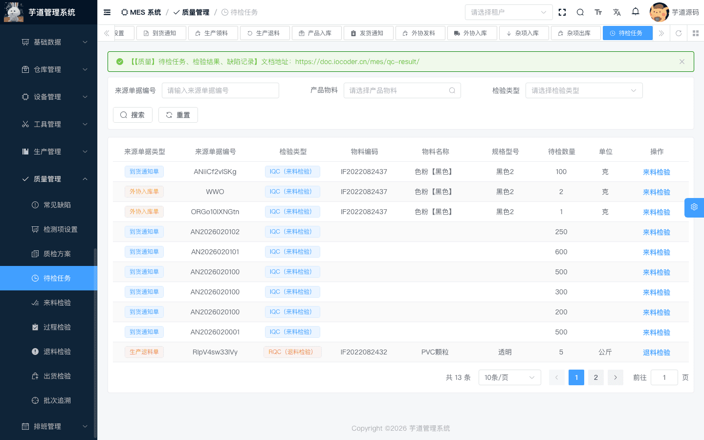
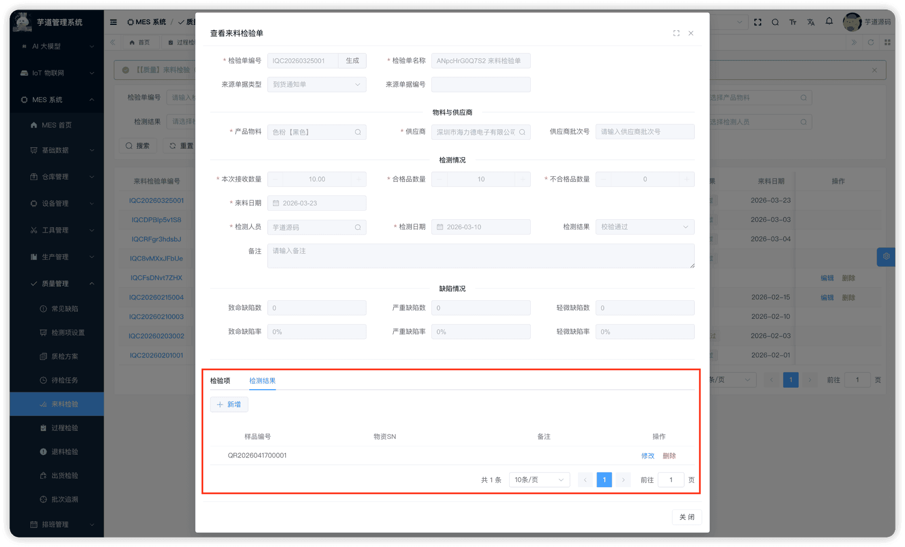
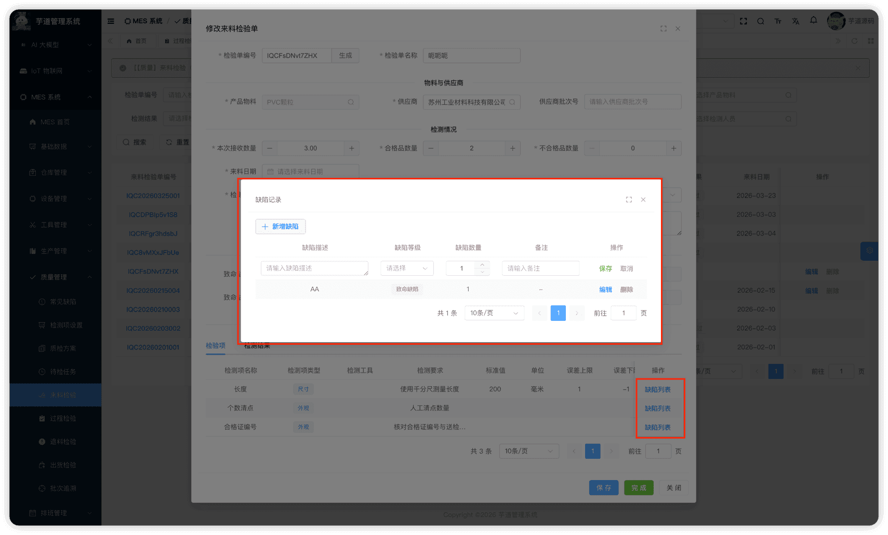

# 【质量】待检任务、检验结果、缺陷记录

质量辅助模块，由 `yudao-module-mes` 后端模块的 `qc.pendinginspect`、`qc.indicatorresult`、`qc.defectrecord` 包实现，为 IQC/IPQC/OQC/RQC 四类质检单提供共享的辅助功能。
本文涉及三个子模块：
- **待检任务**：聚合查询视图，汇总所有来源业务单据中处于「待检验」状态的行，方便检验员从统一入口快速发起质检。列表中每行代表一条待检来源行，检验员点击操作按钮后会打开对应质检模块的新增弹窗（IQC/IPQC/OQC/RQC），并自动预填来源单据信息及业务字段。
- **检验结果**：记录每次检验中各检测项的实际检测值，支持多次录入（如批量抽检）。
- **缺陷记录**：记录检验过程中发现的缺陷，系统自动按等级汇总到质检单和检验行。
本文涉及表如下图所示：
 
## # 1. 待检任务
待检任务，由 MesQcPendingInspectController 提供接口。**不是实体表，而是聚合查询视图**——通过 SQL UNION ALL 将六类来源业务单据中状态为「待检验」的行合并展示：
| 序号 | 来源业务表 | 质检类型 | 筛选条件 |
| --- | --- | --- | --- |
| 1 | 到货通知行（`mes_wm_arrival_notice_line`） | IQC | 单据状态=待检验，行 `iqc_check_flag=1` 且 `iqc_id IS NULL` |
| 2 | 外协入库行（`mes_wm_outsource_receipt_line`） | IQC | 单据状态=已确认，行 `iqc_check_flag=1` 且 `iqc_id IS NULL` |
| 3 | 产品产出行（`mes_wm_product_produce_line`） | IPQC | 产出行 `quality_status=PENDING`（通过产出单头→报工关联，`sourceDocType` 记为 `PRO_FEEDBACK`） |
| 4 | 销售出库行（`mes_wm_product_sales_line`） | OQC | 单据状态=已确认，行 `oqc_check_flag=1` 且 `oqc_id IS NULL` |
| 5 | 生产退料行（`mes_wm_return_issue_line`） | RQC | 单据状态=已确认，行 `rqc_check_flag=1` 且 `rqc_id IS NULL` 且 `quality_status=PENDING` |
| 6 | 销售退货行（`mes_wm_return_sales_line`） | RQC | 单据状态=已确认，行 `rqc_check_flag=1` 且 `rqc_id IS NULL` 且 `quality_status=PENDING` |
注意：IPQC 来源在 SQL 中只有**一类**（待检验的产品产出行），通过 JOIN 产出单头和报工记录获取关联信息。
### # 1.1 管理后台
对应 [MES 系统 -> 质量管理 -> 待检任务] 菜单，对应 `yudao-ui-admin-vue3` 项目的 `@/views/mes/qc/pendinginspect` 目录。
支持按来源单据编码、检验类型、物料等条件搜索。列表统一展示所有待检来源行，每行根据质检类型显示对应的操作按钮：
 点击操作按钮（「来料检验」/「过程检验」/「退料检验」/「出货检验」），系统会**打开对应质检模块的新增弹窗**（IqcForm/IpqcForm/RqcForm/OqcForm），并自动预填来源单据信息及各业务所需字段；哪些字段只读、哪些字段可继续补录，以对应质检表单实现为准。保存成功后关闭弹窗并刷新列表。检验完成后，系统自动回写来源单据：
| 质检类型 | 来源单据 | 完成后回写 |
| --- | --- | --- |
| [IQC](/mes/qc/iqc/) | 到货通知单 / 外协入库单 | 到货通知回写 `iqcId` + 合格数量；外协入库按合格/不合格拆行并推进单据状态 |
| [IPQC](/mes/qc/ipqc/) | 生产报工单（产品产出行） | 回写合格/缺损/各类报废数量，触发产出入库和进度更新 |
| [OQC](/mes/qc/oqc/) | 销售出库单 | 回写行的 `quality_status` 和 `oqc_id` |
| [RQC](/mes/qc/rqc/) | 生产退料单 / 销售退货单 | 回写行的 `quality_status`，拆分行并联动主单状态 |
## # 2. 检验结果
检验结果，由 MesQcIndicatorResultController 提供接口。记录质检过程中每个检测项的实际检测值，支持同一质检单多次录入（如抽检多个样本）。
### # 2.1 表结构
省略 creator/create_time/updater/update_time/deleted/tenant_id 等通用字段
CREATE TABLE `mes_qc_indicator_result` (
`id` bigint NOT NULL AUTO_INCREMENT COMMENT '编号',
`code` varchar(64) DEFAULT NULL COMMENT '样品编号',
`qc_id` bigint NOT NULL COMMENT '关联质检单ID（IQC/IPQC/OQC/RQC 的 id）',
`qc_type` tinyint NOT NULL COMMENT '质检类型',
`item_id` bigint DEFAULT NULL COMMENT '产品物料ID',
`sn` varchar(255) DEFAULT NULL COMMENT '物资SN',
`remark` varchar(500) DEFAULT '' COMMENT '备注',
PRIMARY KEY (`id`)
) ENGINE=InnoDB COMMENT='MES 检验结果记录';
① `qc_id` + `qc_type` 关联质检单。`qc_type` 枚举 MesQcTypeEnum（IQC/IPQC/OQC/RQC），用于区分关联到哪张质检表。
② `item_id` 为被检物料。`sn` 为样品的 SN 码（选填），用于追溯具体是哪个样品的检测结果。
该表包含一个子表：
- `mes_qc_indicator_result_detail`（检验结果明细）：记录每个检测项的实际检测值。
### # 2.2 管理后台
对应 `yudao-ui-admin-vue3` 项目的 `@/views/mes/qc/indicatorresult` 目录。**当前该目录无独立的 `index.vue` 列表页面**，`QcIndicatorResultForm.vue` 和 `QcIndicatorResultList.vue` 作为嵌入式组件在 IQC/IPQC/OQC/RQC 各质检单编辑表单中复用。后端 MesQcIndicatorResultController 已提供完整的 CRUD + 分页查询接口。
 ★ **检验结果明细**：由 `mes_qc_indicator_result_detail` 表存储，记录每个检测项的实际值。明细表无独立 Controller，对外接口由 MesQcIndicatorResultController 统一承载（`get-detail`/`create`/`update`/`delete`），明细持久化由 MesQcIndicatorResultServiceImpl 内部调用 MesQcIndicatorResultDetailServiceImpl 完成。
mes_qc_indicator_result_detail 表结构 CREATE TABLE `mes_qc_indicator_result_detail` (
`id` bigint NOT NULL AUTO_INCREMENT COMMENT '编号',
`result_id` bigint NOT NULL COMMENT '关联检验结果ID',
`indicator_id` bigint DEFAULT NULL COMMENT '检测指标ID',
`value` varchar(500) DEFAULT NULL COMMENT '检测值（统一存为字符串）',
`remark` varchar(500) DEFAULT '' COMMENT '备注',
PRIMARY KEY (`id`)
) ENGINE=InnoDB COMMENT='MES 检验结果明细记录';
① `result_id` 关联主表 `mes_qc_indicator_result` 的 `id` 字段。
② `indicator_id` 关联检测项。`value` 为实际检测值（文本存储，适配不同结果类型：浮点、整数、文本、字典、文件）。
## # 3. 缺陷记录
缺陷记录，由 MesQcDefectRecordController 提供接口。记录质检过程中发现的缺陷，关联到质检单和具体的检验行。
### # 3.1 表结构
省略 creator/create_time/updater/update_time/deleted/tenant_id 等通用字段
CREATE TABLE `mes_qc_defect_record` (
`id` bigint NOT NULL AUTO_INCREMENT COMMENT '编号',
`qc_type` int NOT NULL DEFAULT '1' COMMENT '质检类型',
`qc_id` bigint NOT NULL COMMENT '质检单ID',
`line_id` bigint NOT NULL COMMENT '检验行ID',
`name` varchar(500) NOT NULL COMMENT '缺陷描述',
`level` int NOT NULL COMMENT '缺陷等级',
`quantity` int DEFAULT '1' COMMENT '缺陷数量',
`remark` varchar(500) DEFAULT '' COMMENT '备注',
PRIMARY KEY (`id`)
) ENGINE=InnoDB COMMENT='MES 缺陷记录';
① `qc_type` + `qc_id` 关联质检单（IQC/IPQC/OQC/RQC）。`line_id` 关联具体检验行（**NOT NULL**，后端 `@NotNull` 校验），用于细粒度的缺陷定位和检验行级别的缺陷统计。
② `name` 为缺陷描述。当前前端弹窗通过手工填写缺陷描述的方式录入，未集成常见缺陷下拉选择。
`level` 为缺陷等级，枚举 MesQcDefectLevelEnum（1=致命，2=严重，3=轻微）。
`quantity` 为缺陷数量，`DEFAULT '1'`（后端 `@NotNull` 校验）。前端新增缺陷时默认初始化为 1。
③ 如需维护参考缺陷库，可详见 [《【质量】检测项设置、常见缺陷》](/mes/qc/base/)；但当前缺陷记录弹窗不会直接从该表下拉选择。
### # 3.2 缺陷自动汇总
缺陷记录发生变更时（新增/修改/删除），系统通过 `recalculateDefectStats` 方法**自动汇总**缺陷数据：
1. **行级汇总**：按检验行（`line_id`）分组统计各等级缺陷数量，更新检验行的 `critical_quantity`、`major_quantity`、`minor_quantity`。
1. **主表汇总**：汇总所有缺陷记录的各等级总数量，计算缺陷率（缺陷数 × 100 / 检验数量），更新主表的缺陷数和缺陷率。
### # 3.3 管理后台
缺陷记录在各质检单（IQC/IPQC/OQC/RQC）的编辑弹窗中**内联维护**：在「检验项」Tab 的每一行检验项上提供「缺陷列表」按钮，点击后弹出 `DefectRecordInlineList.vue` 弹窗，可新增、编辑、删除该检验行的缺陷记录。
 **当前前端没有独立的缺陷记录管理页面**（`@/views/mes/qc/defectrecord` 目录下仅有内联弹窗组件），后端 MesQcDefectRecordController 已提供完整的 CRUD 接口。
.pageB img{width:80px!important;}
.wwads-horizontal .wwads-text, .wwads-content .wwads-text{line-height:1;}
[【质量】退货检验（RQC）](/mes/qc/rqc/) [【设备】设备类型、设备台账](/mes/dv/device/) 
←
[【质量】退货检验（RQC）](/mes/qc/rqc/) [【设备】设备类型、设备台账](/mes/dv/device/)→
 
Theme by
[Vdoing](https://github.com/xugaoyi/vuepress-theme-vdoing) 
| Copyright © 2019-2026
芋道源码 | MIT License   
- 跟随系统
- 浅色模式
- 深色模式
- 阅读模式
× 
.windowRB{ padding: 0;}
.windowRB .wwads-img{margin-top: 10px;}
.windowRB .wwads-content{margin: 0 10px 10px 10px;}
.custom-html-window-rb .close-but{
display: none;
}