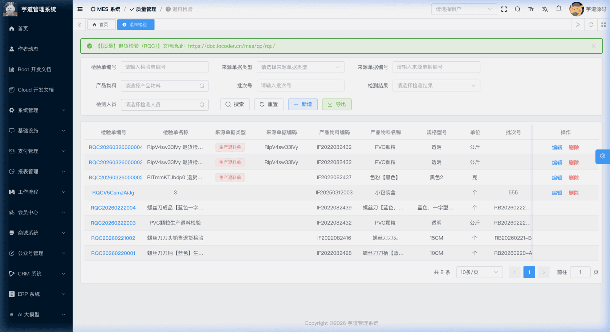
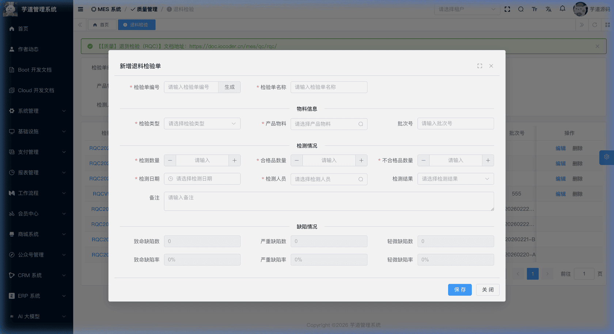
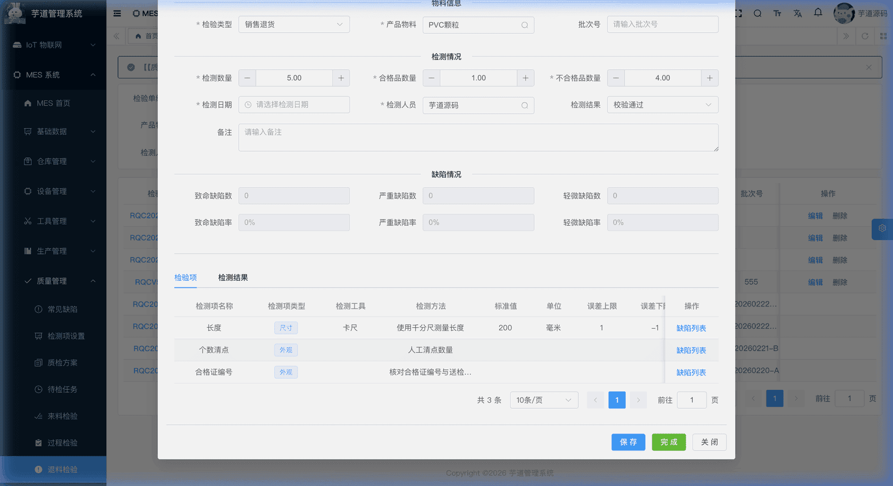

# 【质量】退货检验（RQC）

退货检验（RQC，Return Quality Control）模块，由 `yudao-module-mes` 后端模块的 `qc.rqc` 包实现，覆盖退回物料的质量检验场景——包括生产退料和销售退货两种来源。
RQC 检验单关联**来源单据**（生产退料单或销售退货单），创建时系统根据被检物料 + RQC 类型**自动匹配质检方案**并生成检验行。检验完成后，**若关联了来源单据则自动回写**质量状态；若为独立创建的检验单，则仅更新自身状态。
本文涉及表如下图所示：
 
## # 1. 退货检验单（RQC）
退货检验单，由 MesQcRqcController 提供接口。
### # 1.1 表结构
省略 creator/create_time/updater/update_time/deleted/tenant_id 等通用字段
CREATE TABLE `mes_qc_rqc` (
`id` bigint NOT NULL AUTO_INCREMENT COMMENT '编号',
`code` varchar(64) NOT NULL COMMENT '检验单编码',
`name` varchar(500) NOT NULL COMMENT '检验单名称',
`template_id` bigint NOT NULL COMMENT '质检方案ID',
`source_doc_type` tinyint DEFAULT NULL COMMENT '来源单据类型',
`source_doc_id` bigint DEFAULT NULL COMMENT '来源单据ID',
`source_line_id` bigint DEFAULT NULL COMMENT '来源单据行ID',
`source_doc_code` varchar(64) DEFAULT NULL COMMENT '来源单据编码',
`type` int DEFAULT NULL COMMENT '退货检验类型',
`item_id` bigint NOT NULL COMMENT '物料ID',
`batch_code` varchar(128) DEFAULT NULL COMMENT '批次编码',
`check_quantity` decimal(14,2) DEFAULT NULL COMMENT '检验数量',
`qualified_quantity` decimal(14,2) DEFAULT '0.00' COMMENT '合格数量',
`unqualified_quantity` decimal(14,2) DEFAULT '0.00' COMMENT '不合格数量',
`critical_rate` decimal(5,2) DEFAULT '0.00' COMMENT '致命缺陷率',
`major_rate` decimal(5,2) DEFAULT '0.00' COMMENT '严重缺陷率',
`minor_rate` decimal(5,2) DEFAULT '0.00' COMMENT '轻微缺陷率',
`critical_quantity` int DEFAULT '0' COMMENT '致命缺陷数',
`major_quantity` int DEFAULT '0' COMMENT '严重缺陷数',
`minor_quantity` int DEFAULT '0' COMMENT '轻微缺陷数',
`check_result` tinyint DEFAULT NULL COMMENT '检验结果',
`inspect_date` datetime DEFAULT NULL COMMENT '检验日期',
`inspector_user_id` bigint DEFAULT NULL COMMENT '检验员',
`status` tinyint NOT NULL DEFAULT '0' COMMENT '状态',
`remark` varchar(500) DEFAULT NULL COMMENT '备注',
PRIMARY KEY (`id`)
) ENGINE=InnoDB COMMENT='MES 退货检验单';
① `template_id` 关联 `mes_qc_template` 表，**创建时由系统根据 `item_id` + RQC 类型自动匹配**。详见 [《【质量】质检方案》](/mes/qc/template/)。
② `source_doc_type` 为来源单据类型（选填），枚举 MesQcSourceDocTypeEnum（RETURN_ISSUE=生产退料单，RETURN_SALES=销售退货单）。`source_doc_id`、`source_line_id`、`source_doc_code` 标识来源单据及行信息。
来源单据不是必填项，可以独立创建 RQC 检验单；但如果填写了来源单据，检验完成后会自动回写。创建后不可修改来源单据。
③ `item_id` 为被检物料。
`check_quantity`（检验数量）、`qualified_quantity`（合格数量）和 `unqualified_quantity`（不合格数量）三者均为必填字段，系统校验 `check_quantity = qualified_quantity + unqualified_quantity` 一致性。独立创建时由检验员手动填写；从待检任务创建时，`check_quantity` 由系统预填并禁用，`qualified_quantity` 和 `unqualified_quantity` 仍需检验员手动填写。`batch_code` 为批次编码（选填）。
④ `critical_rate`/`major_rate`/`minor_rate` 和 `critical_quantity`/`major_quantity`/`minor_quantity` 为缺陷统计数据，**由系统根据缺陷记录自动汇总更新**（通过 MesQcRqcServiceImpl 的 `recalculateDefectStats` 方法）。
⑤ `check_result` 为检验结果，枚举 MesQcCheckResultEnum（1=检验通过，2=检验不通过）。由检验员手动填写。
⑥ `status` 为检验单状态，枚举 MesQcStatusEnum（0=草稿，4=已完成）：
| 状态值 | 枚举名 | 说明 | 可执行操作 |
| --- | --- | --- | --- |
| 0 | DRAFT | 草稿 | 编辑、删除、录入检测结果/缺陷记录、填写检验结论、完成 |
| 4 | FINISHED | 已完成 | — |
状态流转说明
创建 ──→ 草稿(0) ──录入检测结果──→ (按需)录入缺陷记录 ──→ 填写检验结论 ──完成──→ 已完成(4)
├── 有来源单据 → 回写来源单据
└── 无来源单据 → 仅更新自身状态
检测结果、缺陷记录均可在草稿阶段按需维护，缺陷记录不是完成前的必经步骤。
- **创建**（`createRqc`）：校验物料、检验员存在。通过 `item_id` + RQC 类型自动匹配质检方案，从方案检测项克隆生成检验行。
- **完成**（`finishRqc`）：校验以下三个条件，全部满足后状态变为「已完成」： `checkResult`（检验结论）已填写；
- `合格品数量 + 不合格品数量 = 检测数量`（数量一致性）；
- 至少存在一条检测结果。
- **有来源单据**（`sourceDocType` 非空）：**回写来源单据**： 来源为生产退料 → 回写退料行的质量状态（合格/不合格），拆分行并联动主单状态。详见 [《【仓库】生产领料、生产退料、物料消耗》](/mes/wm/issue-return/)。
- 来源为销售退货 → 回写退货行的质量状态（合格/不合格），拆分行并联动主单状态。详见 [《【仓库】发货通知、销售出库、销售退货》](/mes/wm/sales-out/)。
**无来源单据**（`sourceDocType` 为空）：仅更新自身状态为已完成，**不触发任何来源回写**。  
该表包含一个子表：
- `mes_qc_rqc_line`（RQC 检验行）：由方案自动生成，记录每个检测项的检测方法和标准值/阈值。
### # 1.2 管理后台
对应 [MES 系统 -> 质量管理 -> 退货检验] 菜单，对应 `yudao-ui-admin-vue3` 项目的 `@/views/mes/qc/rqc` 目录。
#### # 列表
支持按检验单编码、来源单据类型、来源单据编号、产品物料、批次号、检测结果、检测人员等条件搜索。
 
#### # 新增
RQC 检验单有两个创建入口，预填行为不同：
- **从待检任务创建**（推荐）：在 [待检任务](/mes/qc/pending-inspect/) 页面点击「退料检验」按钮，系统自动预填来源单据信息（来源类型、来源单据编号）、产品物料（**禁用不可改**）、检验数量（**禁用不可改**）、检验日期和检验单名称。检验员需补录检验单编码、检验类型（必填）、检测人员、合格品数量、不合格品数量、检测结果等，以及可选的批次号和备注。
- **从 RQC 菜单独立创建**：在退货检验列表页点击【新增】按钮，弹出空白新增表单。此时无来源单据信息，需手动填写产品物料（必填）、检验类型（必填）、检验员（必填）、检测数量、合格品数量、不合格品数量、检验日期等。独立创建的 RQC 完成后不会触发来源回写。
注意：来源单据区域（来源类型、来源编号）仅在有预填来源时显示，且始终为只读禁用状态，不支持用户手动填写。
新建成功后弹窗自动切换为编辑模式，在表单下方展示检验行列表。
 
#### # 修改
点击编码链接查看只读详情，点击【编辑】按钮（仅草稿状态可见）进入可编辑的修改表单。表单上方展示基本信息和缺陷统计（只读汇总），下方通过 `el-divider` 分隔展示两个 Tab 页：**「检验项」和**「检测结果」。缺陷记录不是独立的第三个 Tab，而是在「检验项」Tab 的每一行检验项上提供「缺陷列表」按钮，点击后弹出 `DefectRecordInlineList.vue` 弹窗进行逐行维护。
 ★ **检验行**（编辑弹窗下方）：由 `mes_qc_rqc_line` 表存储，从质检方案自动生成。由 MesQcRqcLineController 提供接口。
mes_qc_rqc_line 表结构 CREATE TABLE `mes_qc_rqc_line` (
`id` bigint NOT NULL AUTO_INCREMENT COMMENT '编号',
`rqc_id` bigint NOT NULL COMMENT '检验单ID',
`indicator_id` bigint NOT NULL COMMENT '检测项ID',
`tool` varchar(255) DEFAULT NULL COMMENT '检测工具',
`check_method` varchar(500) DEFAULT NULL COMMENT '检测方法',
`standard_value` decimal(14,4) DEFAULT NULL COMMENT '标准值',
`unit_measure_id` bigint DEFAULT NULL COMMENT '计量单位ID',
`max_threshold` decimal(14,4) DEFAULT NULL COMMENT '上限值',
`min_threshold` decimal(14,4) DEFAULT NULL COMMENT '下限值',
`critical_quantity` int DEFAULT '0' COMMENT '致命缺陷数',
`major_quantity` int DEFAULT '0' COMMENT '严重缺陷数',
`minor_quantity` int DEFAULT '0' COMMENT '轻微缺陷数',
`remark` varchar(500) DEFAULT NULL COMMENT '备注',
PRIMARY KEY (`id`)
) ENGINE=InnoDB COMMENT='MES 退货检验行';
① `rqc_id` 关联主表 `mes_qc_rqc` 的 `id` 字段。
② `indicator_id` 关联 `mes_qc_indicator` 表的 `id` 字段（详见 [《【质量】检测项设置、常见缺陷》](/mes/qc/base/)）。
其余字段（`tool`、`check_method`、`standard_value`、`unit_measure_id`、`max_threshold`、`min_threshold`）均为**说明性字段**，从质检方案检测项克隆而来（详见 [《【质量】质检方案》](/mes/qc/template/)），后端不参与业务逻辑判定，供检验员在前端页面中参考。
③ `critical_quantity`、`major_quantity`、`minor_quantity` 为该检测项维度的缺陷数统计，**由系统根据缺陷记录自动汇总**。
#### # 检测结果
在编辑弹窗中录入每个检测项的实际检测结果值。检测结果采用“主表 + 明细表”两层存储：**样品头信息**存 `mes_qc_indicator_result` 表（记录样品编号、关联质检单、物料等），**每个检测项的实际检测值**存 `mes_qc_indicator_result_detail` 表（关联检验结果主表和检测项，记录具体检测值）。详见 [《【质量】待检任务、检验结果、缺陷记录》](/mes/qc/pending-inspect/)。
#### # 缺陷记录
在编辑弹窗中记录检验过程中发现的缺陷。选择缺陷类型（来自常见缺陷）、缺陷等级（致命/严重/轻微）、缺陷数量。
缺陷记录变更时，系统通过 MesQcRqcServiceImpl 的 `recalculateDefectStats` 方法自动按等级汇总缺陷数量和缺陷率到检验行和主表。
#### # 完成
在编辑弹窗中填写检验结论（通过/不通过）后，点击【完成】按钮。系统校验：
- ① 检验结论已填写；
- ② 合格品数量 + 不合格品数量 = 检测数量；
- ③ 至少存在一条检测结果。校验通过后状态变为「已完成」。
**仅当关联了来源单据时才自动回写来源单据**；独立创建的 RQC 完成后仅更新自身状态。
.pageB img{width:80px!important;}
.wwads-horizontal .wwads-text, .wwads-content .wwads-text{line-height:1;}
[【质量】出货检验（OQC）](/mes/qc/oqc/) [【质量】待检任务、检验结果、缺陷记录](/mes/qc/pending-inspect/) 
←
[【质量】出货检验（OQC）](/mes/qc/oqc/) [【质量】待检任务、检验结果、缺陷记录](/mes/qc/pending-inspect/)→
 
Theme by
[Vdoing](https://github.com/xugaoyi/vuepress-theme-vdoing) 
| Copyright © 2019-2026
芋道源码 | MIT License   
- 跟随系统
- 浅色模式
- 深色模式
- 阅读模式
× 
.windowRB{ padding: 0;}
.windowRB .wwads-img{margin-top: 10px;}
.windowRB .wwads-content{margin: 0 10px 10px 10px;}
.custom-html-window-rb .close-but{
display: none;
}