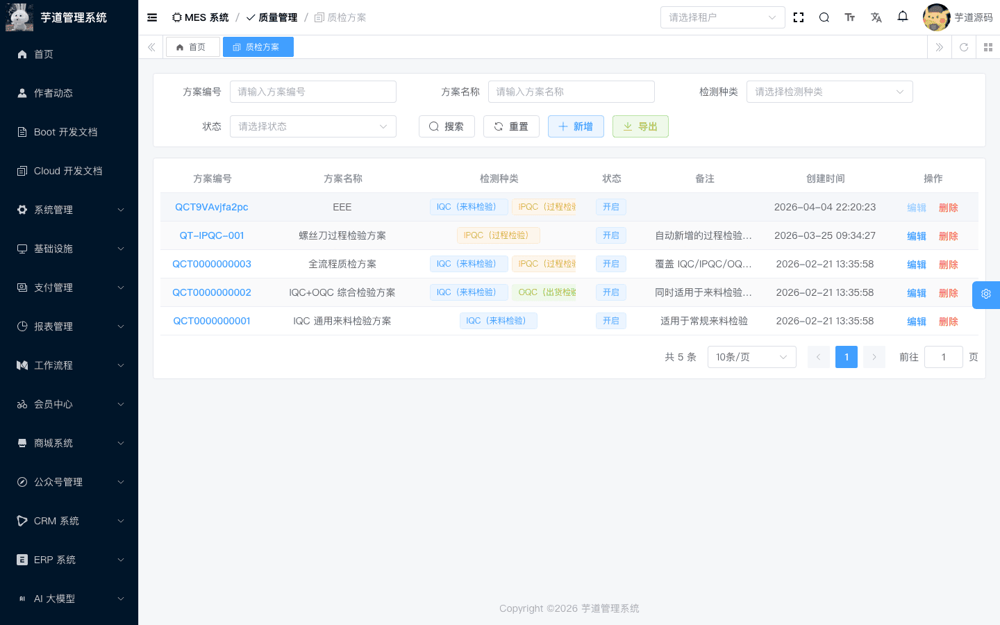
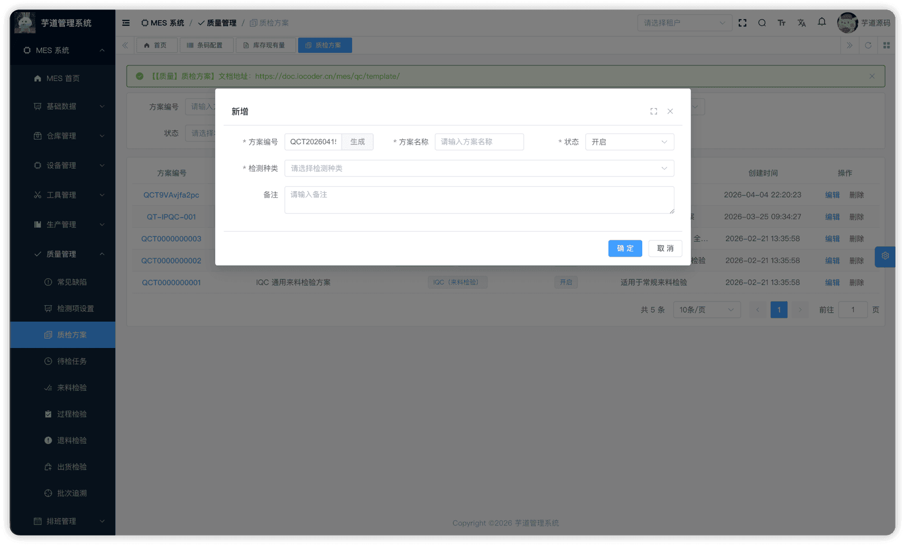
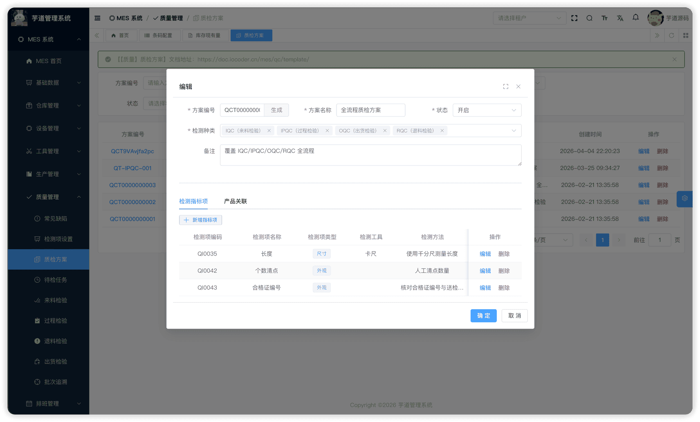
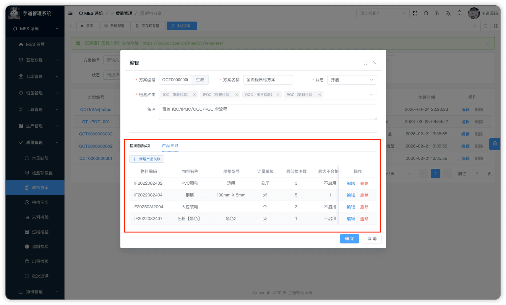

# 【质量】质检方案

质检方案模块，由 `yudao-module-mes` 后端模块的 `qc.template` 包实现，定义质量检验的**模板**——规定「用哪些检测项检验」、「各检测项的标准值和阈值」、「哪些物料适用该方案」。
质检方案是连接基础数据（检测项、物料）与质检业务（IQC/IPQC/OQC/RQC）的桥梁。IQC/IPQC 等质检单创建时，系统根据被检物料 + 检验类型**自动匹配**适用的质检方案，并从方案中克隆检验行。
本文涉及表如下图所示：
 
## # 1. 质检方案
质检方案，由 MesQcTemplateController 提供接口。
### # 1.1 表结构
省略 creator/create_time/updater/update_time/deleted/tenant_id 等通用字段
CREATE TABLE `mes_qc_template` (
`id` bigint NOT NULL AUTO_INCREMENT COMMENT '编号',
`code` varchar(64) NOT NULL COMMENT '方案编码',
`name` varchar(255) NOT NULL COMMENT '方案名称',
`types` varchar(255) NOT NULL COMMENT '检验类型',
`status` tinyint NOT NULL DEFAULT '0' COMMENT '状态',
`remark` varchar(500) DEFAULT NULL COMMENT '备注',
PRIMARY KEY (`id`)
) ENGINE=InnoDB COMMENT='MES 质检方案';
① `types` 为检验类型列表（多选），枚举 MesQcTypeEnum（IQC=来料检验，IPQC=过程检验，OQC=出货检验，RQC=退货检验）。一个方案可适用于多种检验类型。
② `status` 使用通用状态 CommonStatusEnum（0=开启，1=关闭）。方案需开启后才能被质检单自动匹配。
该表包含两个子表：
- `mes_qc_template_indicator`（方案检测项）：定义该方案包含哪些检测项及其标准值/阈值。
- `mes_qc_template_item`（方案适用物料）：定义该方案适用于哪些物料。
### # 1.2 管理后台
对应 [MES 系统 -> 质量管理 -> 质检方案] 菜单，对应 `yudao-ui-admin-vue3` 项目的 `@/views/mes/qc/template` 目录。
#### # 列表
支持按方案编码、名称、检验类型、状态等条件搜索。
 
#### # 新增
点击【新增】按钮，弹出质检方案表单。主要填写方案编码（可自动生成）、方案名称、检验类型（多选）、状态。保存成功后弹窗自动关闭，刷新列表。
 
#### # 修改
点击操作列的【编辑】按钮，弹出修改表单。点击编码链接打开的是**详情**（只读模式）。编辑弹窗下方展示子表数据（需先保存主表后才会显示子表 Tab）：
 ★ **方案检测项**（编辑弹窗下方）：由 `mes_qc_template_indicator` 表存储，定义该方案包含的检测项及其标准值、阈值。由 MesQcTemplateIndicatorController 提供接口。
mes_qc_template_indicator 表结构 CREATE TABLE `mes_qc_template_indicator` (
`id` bigint NOT NULL AUTO_INCREMENT COMMENT '编号',
`template_id` bigint NOT NULL COMMENT '质检方案ID',
`indicator_id` bigint NOT NULL COMMENT '检测项ID',
`check_method` varchar(500) DEFAULT NULL COMMENT '检测方法',
`standard_value` decimal(12,4) DEFAULT NULL COMMENT '标准值',
`unit_measure_id` bigint DEFAULT NULL COMMENT '计量单位ID',
`threshold_max` decimal(12,4) DEFAULT NULL COMMENT '上限值',
`threshold_min` decimal(12,4) DEFAULT NULL COMMENT '下限值',
`doc_url` varchar(255) DEFAULT NULL COMMENT '说明图',
`remark` varchar(500) DEFAULT NULL COMMENT '备注',
PRIMARY KEY (`id`)
) ENGINE=InnoDB COMMENT='MES 质检方案检测项';
① `template_id` 关联主表 `mes_qc_template` 的 `id` 字段。
② `indicator_id` 关联 `mes_qc_indicator` 表的 `id` 字段（详见 [《【质量】检测项设置、常见缺陷》](/mes/qc/base/)）。
③ 创建质检单时，以下字段会被克隆到检验行：`check_method`、`standard_value`、`threshold_max`/`threshold_min`、`unit_measure_id`。`doc_url` 仅在方案模板中维护，**不会**被克隆到检验行。
 ★ **适用物料**（编辑弹窗下方）：由 `mes_qc_template_item` 表存储，定义该方案适用于哪些物料。由 MesQcTemplateItemController 提供接口。
mes_qc_template_item 表结构 CREATE TABLE `mes_qc_template_item` (
`id` bigint NOT NULL AUTO_INCREMENT COMMENT '编号',
`template_id` bigint NOT NULL COMMENT '质检方案ID',
`item_id` bigint NOT NULL COMMENT '物料ID',
`quantity_check` int NOT NULL DEFAULT '1' COMMENT '抽检数量',
`quantity_unqualified` int NOT NULL DEFAULT '0' COMMENT '最大不合格数',
`critical_rate` decimal(12,2) NOT NULL DEFAULT '0.00' COMMENT '致命缺陷率阈值',
`major_rate` decimal(12,2) NOT NULL DEFAULT '0.00' COMMENT '严重缺陷率阈值',
`minor_rate` decimal(12,2) NOT NULL DEFAULT '100.00' COMMENT '轻微缺陷率阈值',
`remark` varchar(500) DEFAULT NULL COMMENT '备注',
PRIMARY KEY (`id`)
) ENGINE=InnoDB COMMENT='MES 质检方案适用物料';
① `template_id` 关联主表 `mes_qc_template` 的 `id` 字段。
② `item_id` 关联 `mes_md_item` 表的 `id` 字段。
③ 其余字段为**模板维护字段（参考阈值）**，当前版本仅在前端页面中展示供检验员参考，**后端不参与自动判定逻辑**：
| 字段 | 说明 |
| --- | --- |
| `quantity_check` | 最低检测数（抽检时建议的最少检验数量，默认 1） |
| `quantity_unqualified` | 最大不合格数参考阈值（0=不启用，默认 0） |
| `critical_rate`/`major_rate`/`minor_rate` | 各等级缺陷率参考阈值（默认 0/0/100，单位 %） |
#### # 开启/关闭
在新增或编辑弹窗的「状态」字段中维护（列表页状态列为只读标签）。**开启后方案可被 IQC/IPQC/OQC/RQC 自动匹配**。
## # 2. 方案自动匹配机制
自动匹配流程
创建质检单（如 IQC）时，系统自动执行以下匹配：
被检物料 ID + 检验类型(IQC/IPQC/OQC/RQC)
│
│ 查询 mes_qc_template_item
↓
找到 item_id 匹配的记录 → 获取 template_id
│
│ 验证方案已开启 + types 包含该检验类型
↓
从方案的检测项（mes_qc_template_indicator）克隆 → 生成质检单的检验行
- 匹配规则：通过 MesQcTemplateItemServiceImpl 的 `getRequiredTemplateByItemIdAndType` 方法实现。
- 如果找不到匹配的方案，创建质检单时会报错。
- **多方案命中时**：当同一物料 + 同一检验类型存在多个已启用方案时，系统取查询结果中的**第一条**（`findFirst`），不保证确定性。建议业务上保持「同一物料 + 同一检验类型」只启用一个方案。
.pageB img{width:80px!important;}
.wwads-horizontal .wwads-text, .wwads-content .wwads-text{line-height:1;}
[【质量】检测项设置、常见缺陷](/mes/qc/base/) [【质量】来料检验（IQC）](/mes/qc/iqc/) 
←
[【质量】检测项设置、常见缺陷](/mes/qc/base/) [【质量】来料检验（IQC）](/mes/qc/iqc/)→
 
Theme by
[Vdoing](https://github.com/xugaoyi/vuepress-theme-vdoing) 
| Copyright © 2019-2026
芋道源码 | MIT License   
- 跟随系统
- 浅色模式
- 深色模式
- 阅读模式
× 
.windowRB{ padding: 0;}
.windowRB .wwads-img{margin-top: 10px;}
.windowRB .wwads-content{margin: 0 10px 10px 10px;}
.custom-html-window-rb .close-but{
display: none;
}