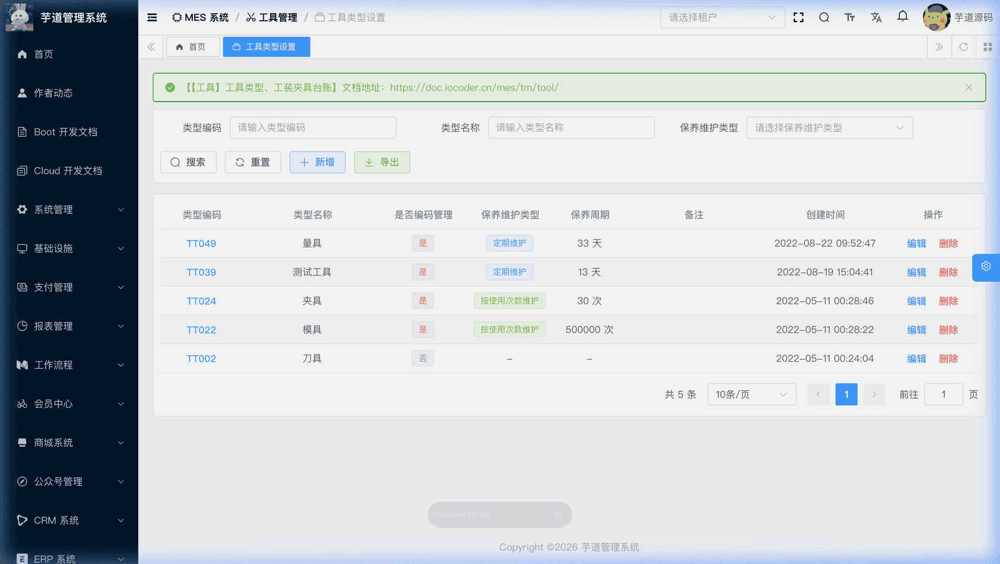
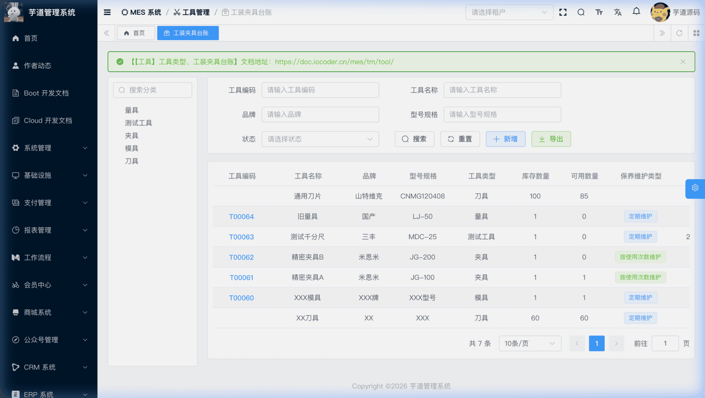
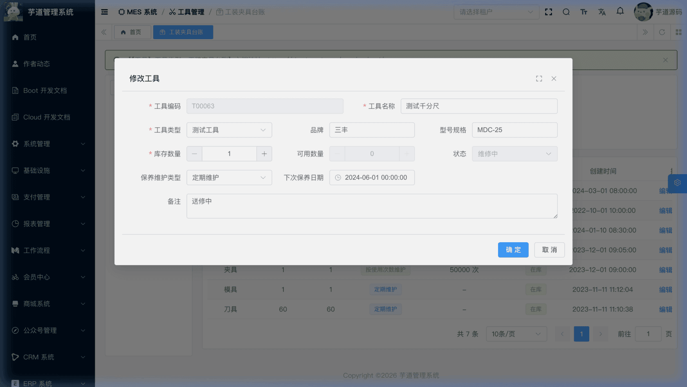

# 【工具】工具类型、工装夹具台账

工具管理模块，由 `yudao-module-mes` 后端模块的 `tm.tool` 包实现。管理生产过程中使用的工装夹具（如模具、治具、刀具等），跟踪工具的使用数量、可用数量和保养周期。
本文涉及两个子模块：
- **工具类型**：对工装夹具进行分类管理，并可配置该类工具的默认保养方式和保养周期。
- **工装夹具台账**：记录每件工具的基本信息、库存数量、保养状态等。
本文涉及表如下图所示：
 
## # 1. 工具类型
工具类型，由 MesTmToolTypeController 提供接口。
### # 1.1 表结构
省略 creator/create_time/updater/update_time/deleted/tenant_id 等通用字段
CREATE TABLE `mes_tm_tool_type` (
`id` bigint NOT NULL AUTO_INCREMENT COMMENT '编号',
`code` varchar(64) NOT NULL COMMENT '类型编码',
`name` varchar(255) NOT NULL COMMENT '类型名称',
`code_flag` bit(1) NOT NULL DEFAULT b'1' COMMENT '是否编码管理',
`mainten_type` tinyint DEFAULT NULL COMMENT '保养方式',
`mainten_period` int DEFAULT NULL COMMENT '保养周期',
`remark` varchar(500) DEFAULT NULL COMMENT '备注',
PRIMARY KEY (`id`)
) ENGINE=InnoDB COMMENT='MES 工具类型';
① `code_flag` 标识该类型的工具**是否编码管理**。为 `true` 时，表示每一件工具独立编码追踪：前端创建工具时数量锁定为 1，工具类型表单中会展示保养配置字段（保养方式、保养周期）。为 `false` 时，工具可以批量管理（数量可大于 1），保养配置字段在工具类型表单中隐藏。注意：工具编码始终由用户手动填写或手动点击【生成】按钮调用自动编码规则生成，`code_flag` 不控制编码生成方式或只读状态。
② `mainten_type` 为默认保养方式，枚举 MesTmMaintenTypeEnum（1=定期维护，2=按使用次数维护）。`mainten_period` 为默认保养周期（定期维护时单位为天，按使用次数维护时单位为次）。工具类型表可存储默认保养配置，但当前代码未在创建工具时自动继承这两个默认值，需由用户在工具表单中手动填写。
### # 1.2 管理后台
对应 [MES 系统 -> 工具管理 -> 工具类型设置] 菜单，对应 `yudao-ui-admin-vue3` 项目的 `@/views/mes/tm/tool/type` 目录。工具类型提供**独立的管理页面**（`index.vue`），支持搜索、分页列表、新增、编辑、删除、导出等完整管理能力。
同时，工装夹具台账页面左侧通过 `TmToolTypeList` 组件复用工具类型列表作为筛选条件。
支持新增、修改、删除操作。删除时会校验该类型是否被工具（`mes_tm_tool`）或工作站工装资源引用，若存在引用则不允许删除。
 
## # 2. 工装夹具台账
工装夹具台账，由 MesTmToolController 提供接口。
### # 2.1 表结构
省略 creator/create_time/updater/update_time/deleted/tenant_id 等通用字段
CREATE TABLE `mes_tm_tool` (
`id` bigint NOT NULL AUTO_INCREMENT COMMENT '编号',
`code` varchar(64) DEFAULT NULL COMMENT '工具编码',
`name` varchar(255) NOT NULL COMMENT '工具名称',
`brand` varchar(255) DEFAULT NULL COMMENT '品牌',
`specification` varchar(255) DEFAULT NULL COMMENT '规格型号',
`tool_type_id` bigint NOT NULL COMMENT '工具类型编号',
`quantity` int NOT NULL DEFAULT '1' COMMENT '数量',
`available_quantity` int DEFAULT NULL COMMENT '可用数量',
`mainten_type` tinyint DEFAULT NULL COMMENT '保养维护类型',
`next_mainten_period` int DEFAULT NULL COMMENT '下次保养周期（次数）',
`next_mainten_date` datetime DEFAULT NULL COMMENT '下次保养日期',
`status` tinyint NOT NULL DEFAULT '1' COMMENT '状态',
`remark` varchar(500) DEFAULT NULL COMMENT '备注',
PRIMARY KEY (`id`)
) ENGINE=InnoDB COMMENT='MES 工具台账';
① `tool_type_id` 关联 `mes_tm_tool_type` 表的 `id` 字段，不可为空。`code` 为工具编码，数据库层允许为空，但应用层通过 VO 校验强制要求非空。
② `quantity` 为总数量（不可为空，默认值为 1），`available_quantity` 为当前可用数量（业务语义上表示可用库存，当前由表单直接维护，数据库层允许为空）。当工具类型的 `code_flag` 为 `true` 时，前端数量锁定为 1，新增时可用数量与数量同步。
③ `mainten_type` 为保养方式。这三个保养相关字段由表单直接维护，系统不会自动从工具类型继承或计算：使用"按使用次数维护"时填写 `next_mainten_period`（下次保养的剩余次数），使用"定期维护"时填写 `next_mainten_date`（下次保养日期）。更新时，后端会按保养方式互斥清空另一个字段（定期维护时清空 `next_mainten_period`，按次数维护时清空 `next_mainten_date`）。
④ `status` 为工具生命周期状态，枚举 MesTmToolStatusEnum（1=在库，2=领用中，3=维修中，4=报废）。新建时默认为「在库」。
### # 2.2 管理后台
对应 [MES 系统 -> 工具管理 -> 工装夹具台账] 菜单，对应 `yudao-ui-admin-vue3` 项目的 `@/views/mes/tm/tool` 目录。页面左侧通过 `TmToolTypeList` 组件展示工具类型列表作为筛选条件，右侧展示工具台账列表。
#### # 列表
支持按工具编码、名称、品牌、型号规格、状态等条件搜索，同时可通过左侧工具类型树筛选。
 
#### # 新增/修改
点击【新增】或【编辑】按钮，弹出工具信息表单。主要填写工具编码（可手动点击【生成】按钮调用自动编码规则生成）、名称、品牌、规格型号、工具类型、数量、保养信息等。创建成功后系统会自动生成条码。
 删除工具时，会校验该工具是否被批次（`mes_wm_batch`）引用，若存在引用则不允许删除。
.pageB img{width:80px!important;}
.wwads-horizontal .wwads-text, .wwads-content .wwads-text{line-height:1;}
[【设备】点检记录、保养记录、维修单](/mes/dv/check-record/) [【排班】班组设置、节假日设置](/mes/cal/team/) 
←
[【设备】点检记录、保养记录、维修单](/mes/dv/check-record/) [【排班】班组设置、节假日设置](/mes/cal/team/)→
 
Theme by
[Vdoing](https://github.com/xugaoyi/vuepress-theme-vdoing) 
| Copyright © 2019-2026
芋道源码 | MIT License   
- 跟随系统
- 浅色模式
- 深色模式
- 阅读模式
× 
.windowRB{ padding: 0;}
.windowRB .wwads-img{margin-top: 10px;}
.windowRB .wwads-content{margin: 0 10px 10px 10px;}
.custom-html-window-rb .close-but{
display: none;
}