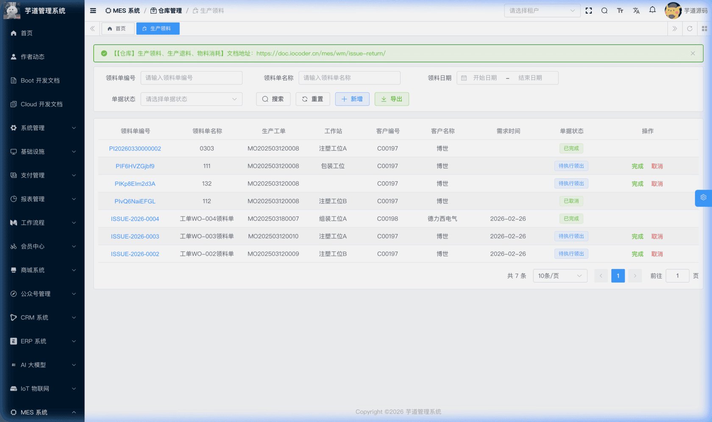
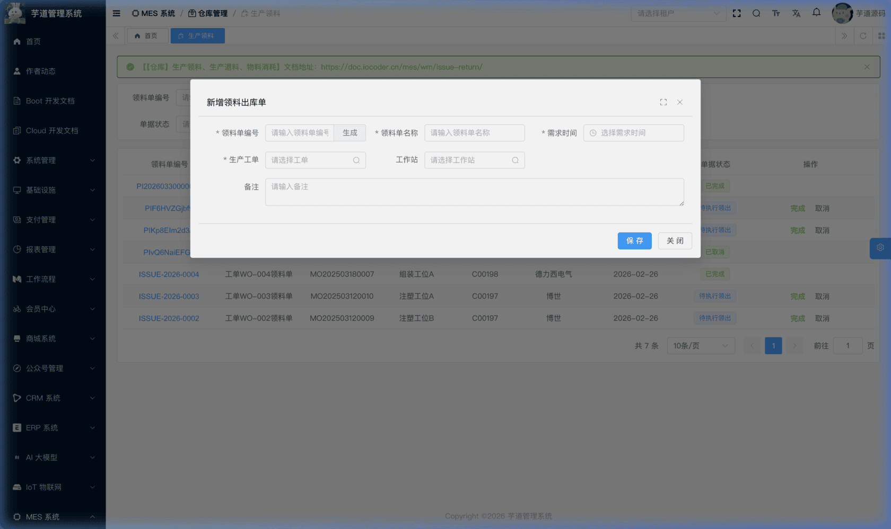
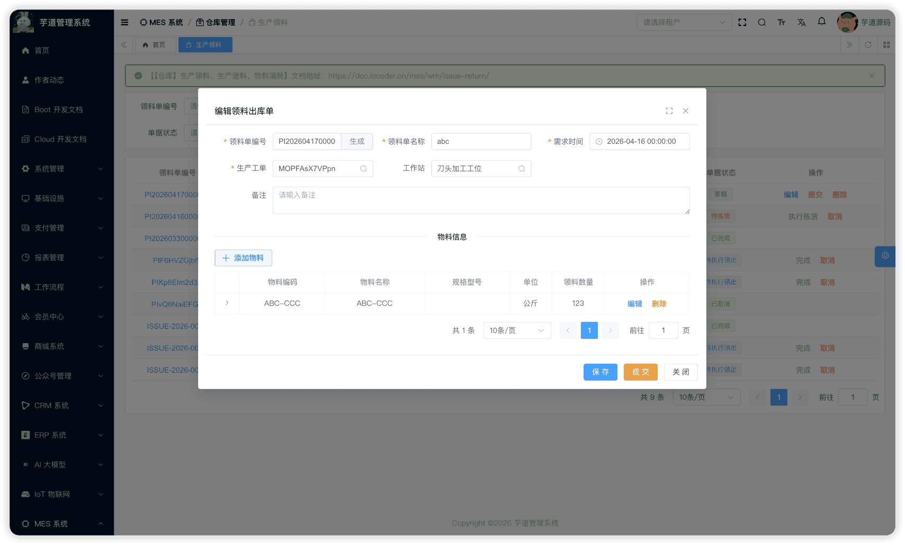
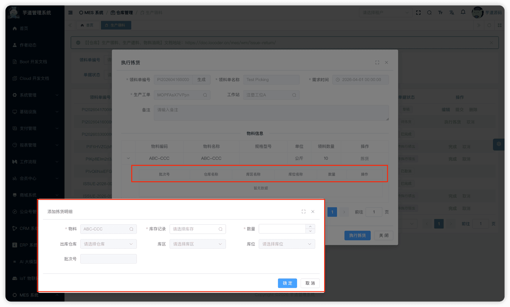
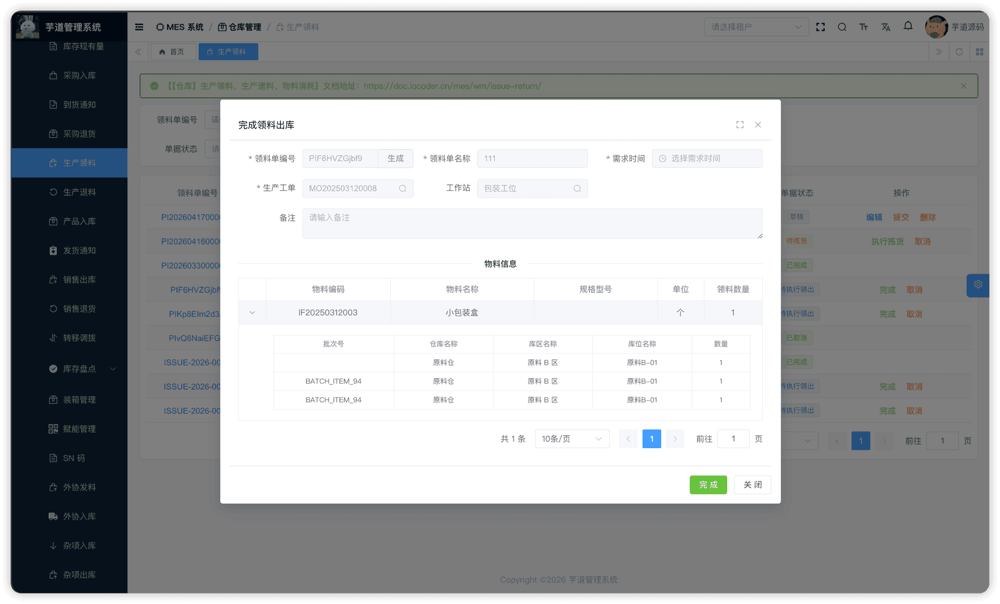
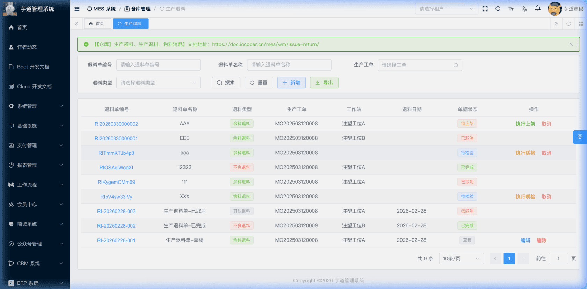
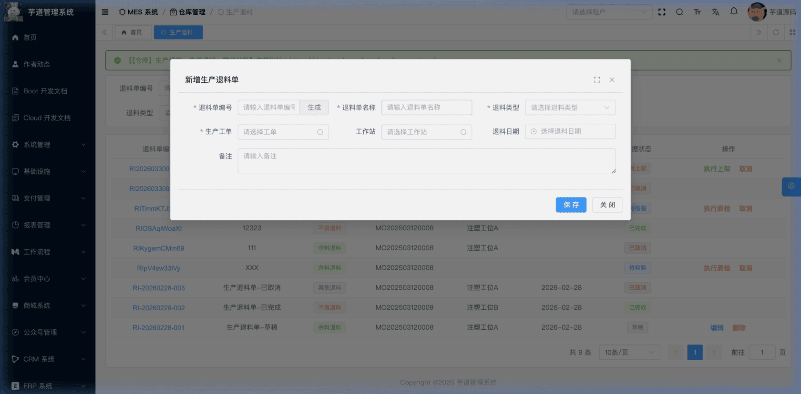
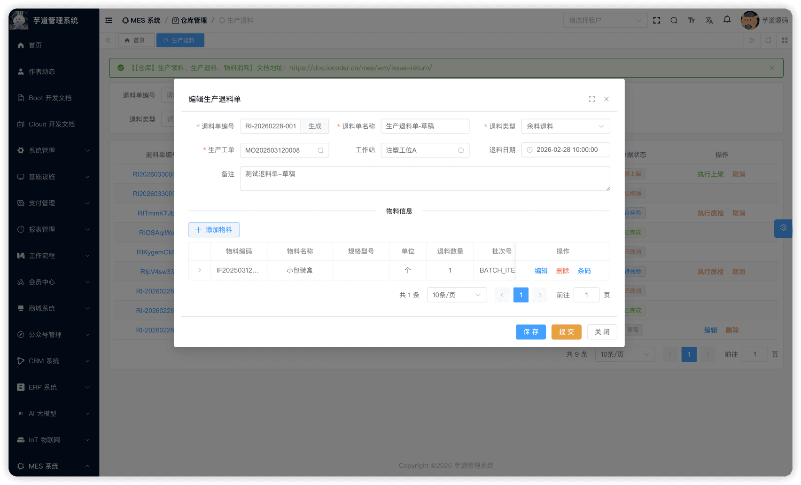
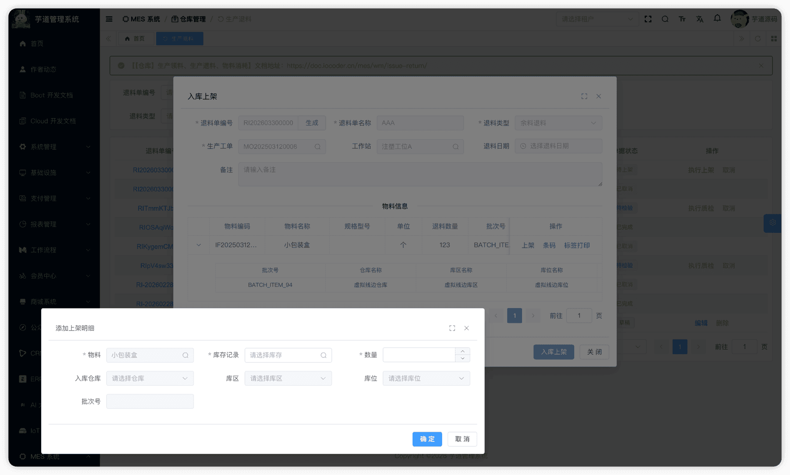
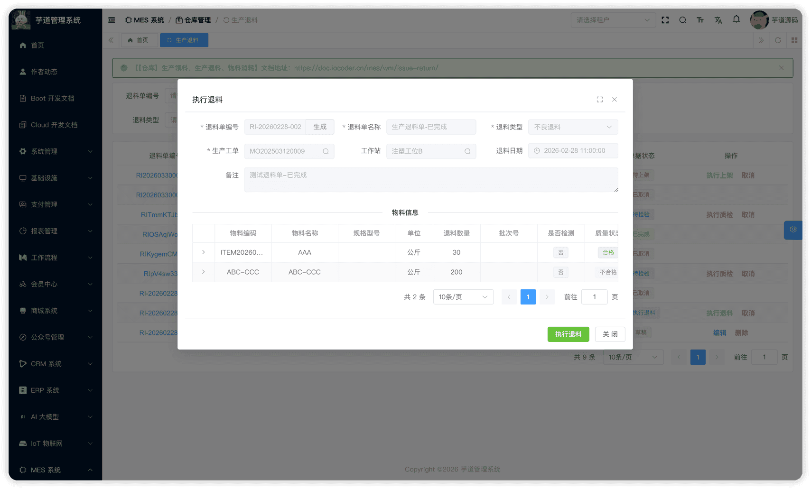

# 【仓库】生产领料、生产退料、物料消耗

生产领退料模块，由 `yudao-module-mes` 后端模块的 `wm.productissue`、`wm.returnissue`、`wm.itemconsume` 包实现，覆盖生产过程中物料从仓库领出到车间、从车间退回仓库、以及报工审批通过后自动消耗线边库存的**完整生产物料流转链路**。
本文涉及三个子模块：
- **生产领料**：将仓库物料领出到车间线边库（虚拟仓库），供生产使用。关联生产工单和工作站。
- **生产退料**：将车间未使用的余料或不良品退回仓库。支持 RQC 退料检验流程。
- **物料消耗**：报工审批通过后，系统根据工序级 BOM 用料配置自动生成消耗记录，按 FIFO 从线边库扣减库存。**当前 yudao 无独立前端入口页面，由报工审批流程自动触发**。
本文涉及表如下图所示：
 
## # 1. 生产领料
生产领料，由 MesWmProductIssueController 提供接口。
### # 1.1 表结构
省略 creator/create_time/updater/update_time/deleted/tenant_id 等通用字段
CREATE TABLE `mes_wm_product_issue` (
`id` bigint NOT NULL AUTO_INCREMENT COMMENT '编号',
`code` varchar(64) NOT NULL COMMENT '领料单编码',
`name` varchar(255) DEFAULT NULL COMMENT '领料单名称',
`work_order_id` bigint NOT NULL COMMENT '生产工单ID',
`workstation_id` bigint DEFAULT NULL COMMENT '工作站ID',
`task_id` bigint DEFAULT NULL COMMENT '生产任务ID',
`issue_date` datetime DEFAULT NULL COMMENT '领料日期',
`required_time` datetime DEFAULT NULL COMMENT '需求日期',
`status` int NOT NULL DEFAULT '0' COMMENT '状态',
`remark` varchar(500) DEFAULT NULL COMMENT '备注',
PRIMARY KEY (`id`)
) ENGINE=InnoDB COMMENT='MES 领料出库单';
① `work_order_id` 关联 `mes_pro_work_order` 表的 `id` 字段（必填），标识该领料单为哪个工单服务。创建时校验工单必须为已确认（或更高）状态，详见 [《【生产】生产工单》](/mes/pro/work-order/)。
`workstation_id` 关联 `mes_md_workstation` 表，详见 [《【基础】车间设置、工作站设置》](/mes/md/workshop/)。
`task_id` 关联 `mes_pro_task` 表（选填），详见 [《【生产】生产排产、工序流转卡》](/mes/pro/schedule-card/)。
② `issue_date` 为实际领料日期，**完成领料出库时由系统自动回写当前时间**。`required_time` 为需求日期，由用户填写。
③ `status` 为领料单状态，枚举 MesWmProductIssueStatusEnum：
| 状态值 | 枚举 | 说明 | 可执行操作 |
| --- | --- | --- | --- |
| 0 | `PREPARE` | 草稿 | 编辑、提交、删除 |
| 2 | `APPROVING` | 待拣货 | 执行拣货、取消 |
| 3 | `APPROVED` | 待完成领出 | 完成、取消 |
| 4 | `FINISHED` | 已完成 | — |
| 5 | `CANCELED` | 已取消 | — |
状态流转说明
创建 ──→ 草稿(0) ──提交──→ 待拣货(2) ──拣货──→ 待完成领出(3) ──完成──→ 已完成(4)
│
└──取消──→ 已取消(5)
- **创建**（`createProductIssue`）：创建领料单，初始状态为草稿。
- **提交**（`submitProductIssue`）：校验领料行不能为空，状态变为「待拣货」。
- **拣货**（`stockProductIssue`）：校验每行的拣货明细数量之和等于行领料数量后，状态变为「待完成领出」。
- **完成**（`finishProductIssue`）：产生库存事务——每条明细产生 **OUT**（实际仓库扣减）+ **IN**（虚拟线边库增加）一对事务，同时回写 `issue_date`。
- **取消**（`cancelProductIssue`）：已完成和已取消状态不允许取消，其他状态均可取消。
虚拟线边库
生产领料不是简单的出库，而是**仓库间转移**。物料从实际仓库出库后，立即入库到虚拟线边库（`WIP_VIRTUAL_WAREHOUSE` / `WIP_VIRTUAL_LOCATION` / `WIP_VIRTUAL_AREA`），代表物料已到达车间。
线边库的库存会在后续「物料消耗」环节被扣减。
该表包含两个子表：
- `mes_wm_product_issue_line`（领料行）：在新增/编辑弹窗中维护，记录领料物料和数量。
- `mes_wm_product_issue_detail`（领料明细）：在拣货操作中维护，记录从哪个库位拣货。
### # 1.2 管理后台
对应 [MES 系统 -> 仓库管理 -> 生产领料] 菜单，对应 `yudao-ui-admin-vue3` 项目的 `@/views/mes/wm/productissue` 目录。
#### # 列表
支持按领料单编码、名称、领料日期、状态等条件搜索。
 
#### # 新增
点击【新增】按钮，弹出领料单新增表单。主要填写领料单编码（可自动生成）、领料单名称、生产工单（必填）、工作站、生产任务、需求日期。新建成功后弹窗自动切换为编辑模式，在表单下方展示领料行列表。
 
#### # 修改
点击编码链接或【编辑】按钮（仅草稿状态可编辑），弹出领料单修改表单。表单下方通过 `el-divider` 分隔展示**领料行**列表。
 ★ **领料行**（编辑弹窗下方）：由 `mes_wm_product_issue_line` 表存储，记录领料物料和数量。由 MesWmProductIssueLineController 提供接口。
mes_wm_product_issue_line 表结构 CREATE TABLE `mes_wm_product_issue_line` (
`id` bigint NOT NULL AUTO_INCREMENT COMMENT '编号',
`issue_id` bigint NOT NULL COMMENT '领料单ID',
`item_id` bigint NOT NULL COMMENT '物料ID',
`quantity` decimal(12,2) NOT NULL COMMENT '领料数量',
`batch_id` bigint DEFAULT NULL COMMENT '批次ID',
`remark` varchar(500) DEFAULT NULL COMMENT '备注',
PRIMARY KEY (`id`)
) ENGINE=InnoDB COMMENT='MES 领料出库单行';
① `issue_id` 关联主表 `mes_wm_product_issue` 的 `id` 字段。
② `item_id` 关联 `mes_md_item` 表的 `id` 字段，标识领料物料。`quantity` 为领料数量。
③ `batch_id` 关联批次管理（选填）。
#### # 提交
在编辑弹窗中点击【提交】按钮（仅草稿状态下显示）。系统会先检查表单是否有修改（脏检查），有修改则先保存再提交。**提交后主表不可再修改**。
#### # 拣货
在「待拣货」状态下，点击【执行拣货】按钮，为每个领料行添加拣货明细。从现有库存中选择库存记录，指定仓库/库区/库位和拣货数量。支持从多个库位拣货。
 ★ **拣货明细**（拣货弹窗中）：由 `mes_wm_product_issue_detail` 表存储，记录从哪个库位拣货。由 MesWmProductIssueDetailController 提供接口。
mes_wm_product_issue_detail 表结构 CREATE TABLE `mes_wm_product_issue_detail` (
`id` bigint NOT NULL AUTO_INCREMENT COMMENT '编号',
`issue_id` bigint NOT NULL COMMENT '领料单ID',
`line_id` bigint NOT NULL COMMENT '领料单行ID',
`material_stock_id` bigint DEFAULT NULL COMMENT '库存记录ID',
`item_id` bigint NOT NULL COMMENT '物料ID',
`quantity` decimal(12,2) NOT NULL COMMENT '拣货数量',
`batch_id` bigint DEFAULT NULL COMMENT '批次ID',
`batch_code` varchar(64) DEFAULT NULL COMMENT '批次号',
`warehouse_id` bigint NOT NULL COMMENT '仓库ID',
`location_id` bigint NOT NULL COMMENT '库区ID',
`area_id` bigint NOT NULL COMMENT '库位ID',
`remark` varchar(500) DEFAULT NULL COMMENT '备注',
PRIMARY KEY (`id`)
) ENGINE=InnoDB COMMENT='MES 领料出库明细';
① `issue_id` 关联主表（冗余字段，便于按领料单查询所有明细）。`line_id` 关联领料行 `mes_wm_product_issue_line` 的 `id` 字段。
② `material_stock_id` 关联 `mes_wm_material_stock` 表的 `id` 字段，标识从哪个库存记录中扣减库存。
③ `item_id` 从领料行继承。`quantity` 为拣货数量，所有明细的 `quantity` 之和必须等于领料行的 `quantity`。
④ `warehouse_id`、`location_id`、`area_id` 指定拣货来源的仓库/库区/库位。
#### # 完成领料出库
 在「待完成领出」状态下，点击【完成】按钮，弹出确认弹窗「完成领料出库」。系统通过 MesWmProductIssueServiceImpl 的 `finishProductIssue` 方法，遍历所有拣货明细，每条明细产生一对库存事务：
1. **OUT 事务**：从实际仓库扣减库存
1. **IN 事务**：入虚拟线边库增加库存，`relatedTransactionId` 关联上述 OUT 事务
同时回写 `issue_date` 为当前时间，状态变为「已完成」。
#### # 取消
在列表页点击【取消】按钮（已完成和已取消状态不允许取消，其他状态均可取消），需二次确认。取消后不可恢复。
## # 2. 生产退料
生产退料，由 MesWmReturnIssueController 提供接口。
### # 2.1 表结构
省略 creator/create_time/updater/update_time/deleted/tenant_id 等通用字段
CREATE TABLE `mes_wm_return_issue` (
`id` bigint NOT NULL AUTO_INCREMENT COMMENT '编号',
`code` varchar(64) NOT NULL COMMENT '退料单编号',
`name` varchar(255) DEFAULT NULL COMMENT '退料单名称',
`work_order_id` bigint NOT NULL COMMENT '生产工单ID',
`workstation_id` bigint DEFAULT NULL COMMENT '工作站ID',
`type` int NOT NULL COMMENT '退料类型',
`return_date` datetime DEFAULT NULL COMMENT '退料日期',
`status` int NOT NULL DEFAULT '0' COMMENT '状态',
`remark` varchar(500) DEFAULT NULL COMMENT '备注',
PRIMARY KEY (`id`)
) ENGINE=InnoDB COMMENT='MES 生产退料单';
① `work_order_id` 关联 `mes_pro_work_order` 表的 `id` 字段（必填）。`workstation_id` 关联 `mes_md_workstation` 表。
② `type` 为退料类型，枚举 MesWmReturnIssueTypeEnum：
| 类型值 | 枚举 | 说明 |
| --- | --- | --- |
| 1 | `REMAINDER` | 余料退料 |
| 2 | `DEFECTIVE` | 不良退料 |
| 3 | `OTHER` | 其他退料 |
退料行的质量状态由 `rqc_check_flag`（是否需要质检）和 `type`（退料类型）共同决定，计算逻辑如下（参见 `MesWmReturnIssueLineServiceImpl.calculateQualityStatus`）：
1. 若行勾选了 `rqc_check_flag = true` → **待检验**（PENDING），无论退料类型为何；
1. 若未勾选质检，且退料类型为「余料退料」（REMAINDER）→ **合格**（PASS）；
1. 若未勾选质检，且退料类型为「不良退料」（DEFECTIVE）或「其他退料」（OTHER）→ **不合格**（FAIL）。
修改主表退料类型时，系统会基于上述规则批量刷新所有行的质量状态。
③ `status` 为退料单状态，枚举 MesWmReturnIssueStatusEnum：
| 状态值 | 枚举 | 说明 | 可执行操作 |
| --- | --- | --- | --- |
| 0 | `PREPARE` | 草稿 | 编辑、提交、删除 |
| 1 | `CONFIRMED` | 待检验 | 执行质检、取消 |
| 2 | `APPROVING` | 待上架 | 执行上架、取消 |
| 3 | `APPROVED` | 待执行退料 | 执行退料、取消 |
| 4 | `FINISHED` | 已完成 | — |
| 5 | `CANCELED` | 已取消 | — |
状态流转说明
创建 ──→ 草稿(0) ──提交──→ 待检验(1) ──检验完成──→ 待上架(2) ──上架──→ 待执行退料(3) ──执行退料──→ 已完成(4)
│                                                                    │
└──无待检验行────────────→ 待上架(2)                                        └──取消──→ 已取消(5)
- **创建**（`createReturnIssue`）：创建退料单，初始状态为草稿。
- **提交**（`submitReturnIssue`）：校验退料行不能为空。根据行的 `qualityStatus` 决定主表目标状态： 若存在任意行 `qualityStatus` 为「待检验」（PENDING），主表状态变为「待检验」（CONFIRMED）；
- 若所有行均非「待检验」状态，主表状态直接变为「待上架」（APPROVING）。
**上架**（`stockReturnIssue`）：校验每行的上架明细数量之和不小于退料数量后，状态变为「待执行退料」。 **执行退料**（`finishReturnIssue`）：产生库存事务——每条明细产生 **OUT**（虚拟线边库扣减，允许负库存）+ **IN**（实际仓库增加）一对事务。 **取消**（`cancelReturnIssue`）：已完成和已取消状态不允许取消，其他状态均可取消。 
虚拟线边库
生产退料与领料方向相反，是从虚拟线边库出库、到实际仓库入库的**仓库间转移**。线边库端的出库事务设置 `checkFlag=false`，允许负库存（因线边库可能已被消耗但物理上仍有余料）。
该表包含两个子表：
- `mes_wm_return_issue_line`（退料行）：在新增/编辑弹窗中维护，记录退料物料、数量和质量状态。
- `mes_wm_return_issue_detail`（退料明细）：在上架操作中维护，记录退料物料上架到哪个库位。
### # 2.2 管理后台
对应 [MES 系统 -> 仓库管理 -> 生产退料] 菜单，对应 `yudao-ui-admin-vue3` 项目的 `@/views/mes/wm/returnissue` 目录。
#### # 列表
支持按退料单编码、名称、生产工单、退料类型等条件搜索。
 
#### # 新增
点击【新增】按钮，弹出退料单新增表单。主要填写退料单编码（可自动生成）、退料单名称、生产工单（必填）、工作站、退料类型（必填：余料退料/不良退料/其他退料）。新建成功后弹窗自动切换为编辑模式，在表单下方展示退料行列表。
 
#### # 修改
点击编码链接或【编辑】按钮（仅草稿状态可编辑），弹出退料单修改表单。表单下方通过 `el-divider` 分隔展示**退料行**列表。
 ★ **退料行**（编辑弹窗下方）：由 `mes_wm_return_issue_line` 表存储，记录退料物料、数量和 RQC 检验信息。由 MesWmReturnIssueLineController 提供接口。添加退料行时，从线边库（`XBK_VIRTUAL`）中选择物资（当前实现仅限定线边库，不校验工单归属）。
mes_wm_return_issue_line 表结构 CREATE TABLE `mes_wm_return_issue_line` (
`id` bigint NOT NULL AUTO_INCREMENT COMMENT '编号',
`issue_id` bigint NOT NULL COMMENT '退料单ID',
`item_id` bigint NOT NULL COMMENT '物料ID',
`quantity` decimal(12,2) NOT NULL COMMENT '退料数量',
`material_stock_id` bigint DEFAULT NULL COMMENT '库存记录ID',
`batch_id` bigint DEFAULT NULL COMMENT '批次ID',
`batch_code` varchar(255) DEFAULT NULL COMMENT '批次号',
`rqc_check_flag` bit(1) NOT NULL DEFAULT b'0' COMMENT '是否需要退料检验',
`rqc_id` bigint DEFAULT NULL COMMENT '退料检验单ID',
`quality_status` int DEFAULT NULL COMMENT '质量状态',
`remark` varchar(500) DEFAULT NULL COMMENT '备注',
PRIMARY KEY (`id`)
) ENGINE=InnoDB COMMENT='MES 生产退料单行';
① `issue_id` 关联主表 `mes_wm_return_issue` 的 `id` 字段。
② `item_id` 为退料物料，`quantity` 为退料数量。
③ `material_stock_id` 关联 `mes_wm_material_stock`（线边库库存记录）。`batch_id`、`batch_code` 为批次信息。
④ `rqc_check_flag` 标识该行是否需要退料检验（RQC）。`quality_status` 为质量状态，枚举 MesWmQualityStatusEnum，由 `rqc_check_flag` 和主表 `type` 共同决定：
- 若 `rqc_check_flag = true` → 「待检验」（PENDING），需 RQC 完成后回写；
- 若 `rqc_check_flag = false` 且 type=1（余料退料）→ 「合格」（PASS）；
- 若 `rqc_check_flag = false` 且 type=2（不良退料）或 type=3（其他退料）→ 「不合格」（FAIL）。
- 修改主表退料类型时，系统会基于上述规则批量刷新所有行的质量状态。
⑤ `rqc_id` 关联 `mes_qc_rqc` 表的 `id` 字段。**在 RQC 完成后由系统通过回调自动回写**。
#### # 提交
在编辑弹窗中点击【提交】按钮（仅草稿状态下显示）。系统会先检查表单是否有修改（脏检查），有修改则先保存再提交。**提交后主表不可再修改**。
#### # 执行质检
在「待检验」状态下，点击【执行质检】按钮，系统提示「请前往【质量管理 - 退货检验（RQC）】中进行退料检验操作」。RQC 完成后状态变为「待上架」。详见 [《【质量】退料检验 RQC》](/mes/qc/rqc/)。
#### # 上架
在「待上架」状态下，点击【执行上架】按钮，为每个退料行添加上架明细，指定仓库/库区/库位和上架数量。
 ★ **上架明细**（上架弹窗中）：由 `mes_wm_return_issue_detail` 表存储，记录退料物料上架到哪个库位。由 MesWmReturnIssueDetailController 提供接口。
mes_wm_return_issue_detail 表结构 CREATE TABLE `mes_wm_return_issue_detail` (
`id` bigint NOT NULL AUTO_INCREMENT COMMENT '编号',
`issue_id` bigint NOT NULL COMMENT '退料单ID',
`line_id` bigint NOT NULL COMMENT '退料单行ID',
`item_id` bigint NOT NULL COMMENT '物料ID',
`quantity` decimal(12,2) NOT NULL COMMENT '上架数量',
`material_stock_id` bigint DEFAULT NULL COMMENT '库存记录ID',
`batch_id` bigint DEFAULT NULL COMMENT '批次ID',
`batch_code` varchar(255) DEFAULT NULL COMMENT '批次号',
`warehouse_id` bigint NOT NULL COMMENT '仓库ID',
`location_id` bigint NOT NULL COMMENT '库区ID',
`area_id` bigint NOT NULL COMMENT '库位ID',
`remark` varchar(500) DEFAULT NULL COMMENT '备注',
PRIMARY KEY (`id`)
) ENGINE=InnoDB COMMENT='MES 生产退料明细';
① `issue_id` 关联主表（冗余字段）。`line_id` 关联退料行 `mes_wm_return_issue_line` 的 `id` 字段。
② `item_id`、`quantity` 从退料行继承。所有明细的 `quantity` 之和必须不小于退料行的 `quantity`。
③ `material_stock_id` 关联 `mes_wm_material_stock`（线边库库存记录，选填）。`batch_id`、`batch_code` 从退料行继承。
④ `warehouse_id`、`location_id`、`area_id` 指定上架到实际仓库的具体位置。
#### # 执行退料
 在「待执行退料」状态下，点击【执行退料】按钮。系统通过 MesWmReturnIssueServiceImpl 的 `finishReturnIssue` 方法，遍历所有上架明细，每条明细产生一对库存事务：
1. **OUT 事务**：从虚拟线边库扣减库存（`checkFlag=false`，允许负库存）
1. **IN 事务**：入实际仓库增加库存，`relatedTransactionId` 关联上述 OUT 事务
状态变为「已完成」。
#### # 取消
在列表页点击【取消】按钮（已完成和已取消状态不允许取消，其他状态均可取消），需二次确认。取消后不可恢复。
## # 3. 物料消耗
物料消耗，由 MesWmItemConsumeServiceImpl 提供业务逻辑（无独立主表 Controller，仅有 MesWmItemConsumeLineController 提供按报工查询消耗行接口）。
提示
当前 yudao 实现中，物料消耗没有独立的前端入口页面，主记录由报工审批流程自动生成，属于**系统自动触发**的后台模块。报工审批通过后，系统根据工序级 BOM 用料配置自动生成消耗记录并扣减线边库存。详见 [《【生产】生产报工》](/mes/pro/feedback/)。
### # 3.1 表结构
省略 creator/create_time/updater/update_time/deleted/tenant_id 等通用字段
CREATE TABLE `mes_wm_item_consume` (
`id` bigint NOT NULL AUTO_INCREMENT COMMENT '编号',
`work_order_id` bigint NOT NULL COMMENT '生产工单ID',
`task_id` bigint DEFAULT NULL COMMENT '生产任务ID',
`workstation_id` bigint DEFAULT NULL COMMENT '工作站ID',
`process_id` bigint DEFAULT NULL COMMENT '工序ID',
`feedback_id` bigint NOT NULL COMMENT '报工记录ID',
`consume_date` datetime DEFAULT NULL COMMENT '消耗日期',
`status` tinyint NOT NULL DEFAULT '0' COMMENT '状态',
`remark` varchar(500) DEFAULT NULL COMMENT '备注',
PRIMARY KEY (`id`)
) ENGINE=InnoDB COMMENT='MES 物料消耗记录';
① `work_order_id` 关联 `mes_pro_work_order`，`task_id` 关联 `mes_pro_task`，`workstation_id` 关联 `mes_md_workstation`，`process_id` 关联 `mes_pro_process`。**以上字段均从报工记录继承，由系统自动填充**。
② `feedback_id` 关联 `mes_pro_feedback` 表的 `id` 字段，标识该消耗记录由哪条报工触发。一条报工记录最多对应一条消耗记录。
③ `consume_date` 为消耗日期，**由系统自动设置为当前时间**。
④ `status` 为消耗单状态，枚举 MesWmItemConsumeStatusEnum：
| 状态值 | 枚举 | 说明 |
| --- | --- | --- |
| 0 | `PREPARE` | 草稿 |
| 4 | `FINISHED` | 已完成 |
物料消耗自动化流程
报工审批通过 ──→ 生成消耗单(草稿) + 消耗行 + 消耗明细(FIFO) ──→ 创建库存事务(OUT) ──→ 已完成
1. **生成消耗单**（`generateItemConsume`）：报工审批通过后自动触发。根据报工的 `routeId` + `processId` + `itemId` 查询 BOM 用料配置（`mes_pro_route_product_bom`），计算每种物料的消耗数量 = BOM 用料比例 × 报工数量。
1. **生成消耗行**：按 BOM 物料清单批量生成消耗行，每行对应一种物料。
1. **生成消耗明细（FIFO）**：从虚拟线边库按 FIFO（先入先出）分配批次库存： - 查询该物料在线边库中的库存记录（按入库时间升序排列） - 依次分配，直到消耗量满足 - 如果线边库无库存或库存不足，剩余数量生成无批次明细（待后续盘库核销）
1. **执行消耗**（`finishItemConsume`）：遍历所有明细，创建 OUT 库存事务扣减线边库存（`checkFlag=false`，允许负库存）。状态变为「已完成」。
该表包含两个子表：
- `mes_wm_item_consume_line`（消耗行）：记录每种物料的消耗数量，由系统自动生成。
- `mes_wm_item_consume_detail`（消耗明细）：记录从线边库哪个批次扣减，由系统按 FIFO 自动分配。
### # 3.2 子表结构
★ **消耗行**：由 `mes_wm_item_consume_line` 表存储。由 MesWmItemConsumeLineController 提供接口。
mes_wm_item_consume_line 表结构 CREATE TABLE `mes_wm_item_consume_line` (
`id` bigint NOT NULL AUTO_INCREMENT COMMENT '编号',
`consume_id` bigint NOT NULL COMMENT '消耗单ID',
`item_id` bigint NOT NULL COMMENT '物料ID',
`quantity` decimal(14,2) NOT NULL COMMENT '消耗数量',
`batch_id` bigint DEFAULT NULL COMMENT '批次ID',
`batch_code` varchar(128) DEFAULT NULL COMMENT '批次号',
`remark` varchar(500) DEFAULT NULL COMMENT '备注',
PRIMARY KEY (`id`)
) ENGINE=InnoDB COMMENT='MES 物料消耗行';
① `consume_id` 关联主表 `mes_wm_item_consume` 的 `id` 字段。
② `item_id` 为消耗物料，来自 BOM 配置。`quantity` = BOM 用料比例 × 报工数量，**由系统自动计算**。
★ **消耗明细**：由 `mes_wm_item_consume_detail` 表存储。当前无独立 Controller，消耗明细随消耗单由系统自动生成。
mes_wm_item_consume_detail 表结构 CREATE TABLE `mes_wm_item_consume_detail` (
`id` bigint NOT NULL AUTO_INCREMENT COMMENT '编号',
`consume_id` bigint NOT NULL COMMENT '消耗单ID',
`line_id` bigint NOT NULL COMMENT '消耗行ID',
`item_id` bigint NOT NULL COMMENT '物料ID',
`quantity` decimal(14,2) NOT NULL COMMENT '消耗数量',
`material_stock_id` bigint DEFAULT NULL COMMENT '库存记录ID',
`batch_id` bigint DEFAULT NULL COMMENT '批次ID',
`batch_code` varchar(128) DEFAULT NULL COMMENT '批次号',
`warehouse_id` bigint NOT NULL COMMENT '仓库ID',
`location_id` bigint NOT NULL COMMENT '库区ID',
`area_id` bigint NOT NULL COMMENT '库位ID',
`remark` varchar(500) DEFAULT NULL COMMENT '备注',
PRIMARY KEY (`id`)
) ENGINE=InnoDB COMMENT='MES 物料消耗明细';
① `consume_id` 关联主表（冗余字段）。`line_id` 关联消耗行 `mes_wm_item_consume_line` 的 `id` 字段。
② `item_id` 从消耗行继承。`quantity` 为 FIFO 分配到的实际消耗数量。
③ `material_stock_id` 关联 `mes_wm_material_stock`（线边库库存记录），FIFO 分配时自动关联。若线边库无库存则为 `null`。`batch_id`、`batch_code` 从库存记录继承。
④ `warehouse_id`、`location_id`、`area_id` 固定为虚拟线边库（`WIP_VIRTUAL_WAREHOUSE` / `WIP_VIRTUAL_LOCATION` / `WIP_VIRTUAL_AREA`），**由系统自动填充**。
## # 4. 生产物料流转总览
端到端业务流程
生产领料：仓库 ──OUT──→ 线边库 ──IN──→ 车间可用
│
┌───────────────┘
│
物料消耗：线边库 ──OUT──→ 扣减（报工自动触发，FIFO 分配）
│
│ （若有余料/不良品）
│
生产退料：线边库 ──OUT──→ 仓库 ──IN──→ 退回仓库
- **生产领料**完成后，物料从实际仓库转移到虚拟线边库，供车间使用。
- **物料消耗**在报工审批通过后自动触发，按 FIFO 从线边库扣减库存，无需人工操作。
- **生产退料**将车间未使用的物料退回实际仓库，支持余料/不良品分类和 RQC 检验。
- 三者通过**虚拟线边库**串联，实现从仓库到车间、车间消耗、车间退回仓库的完整物料流转闭环。
.pageB img{width:80px!important;}
.wwads-horizontal .wwads-text, .wwads-content .wwads-text{line-height:1;}
[【仓库】到货通知、采购入库、采购退货](/mes/wm/purchase-in/) [【仓库】产品产出、产品入库](/mes/wm/product-in/) 
←
[【仓库】到货通知、采购入库、采购退货](/mes/wm/purchase-in/) [【仓库】产品产出、产品入库](/mes/wm/product-in/)→
 
Theme by
[Vdoing](https://github.com/xugaoyi/vuepress-theme-vdoing) 
| Copyright © 2019-2026
芋道源码 | MIT License   
- 跟随系统
- 浅色模式
- 深色模式
- 阅读模式
× 
.windowRB{ padding: 0;}
.windowRB .wwads-img{margin-top: 10px;}
.windowRB .wwads-content{margin: 0 10px 10px 10px;}
.custom-html-window-rb .close-but{
display: none;
}