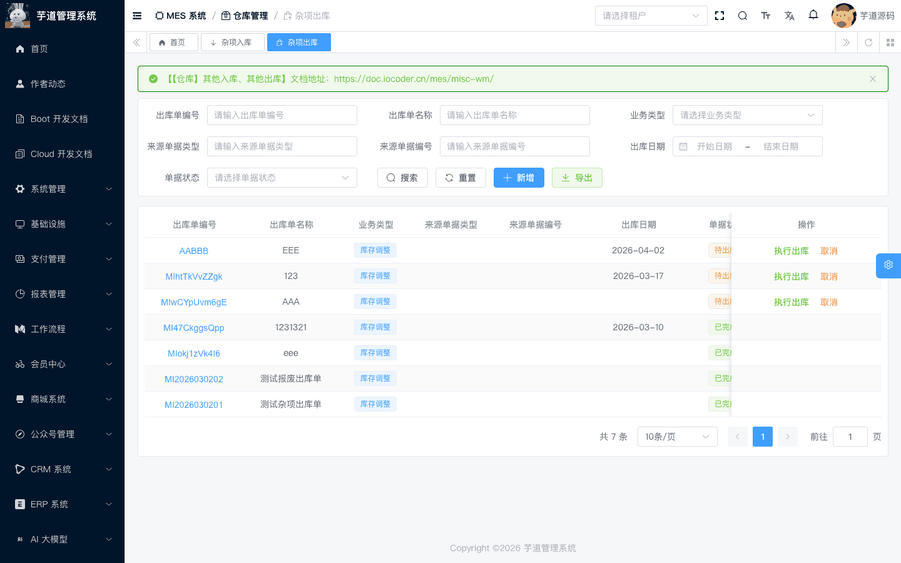
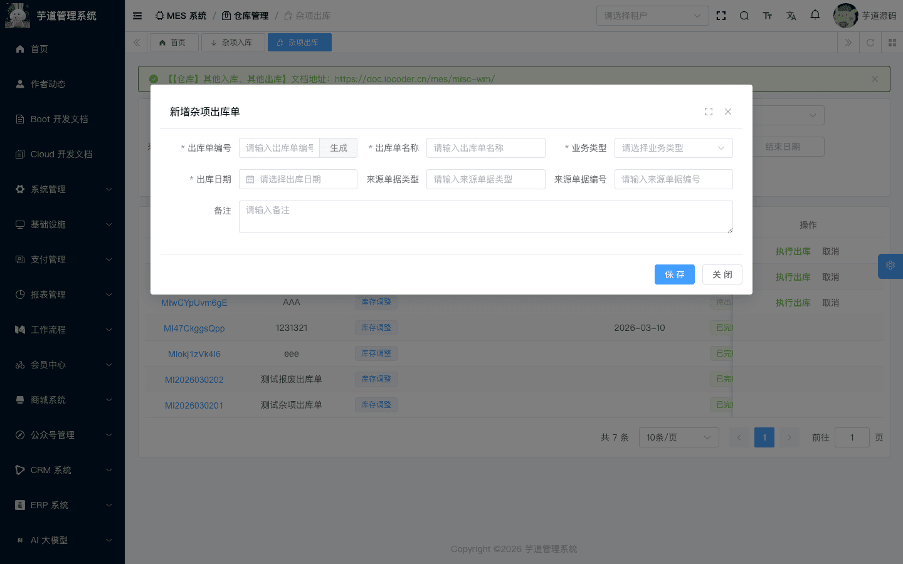
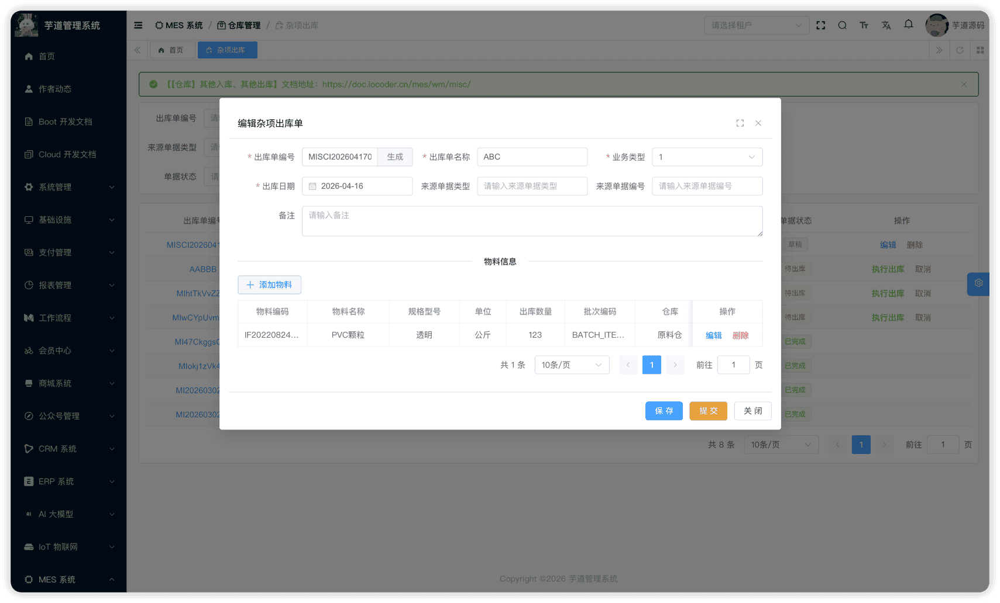
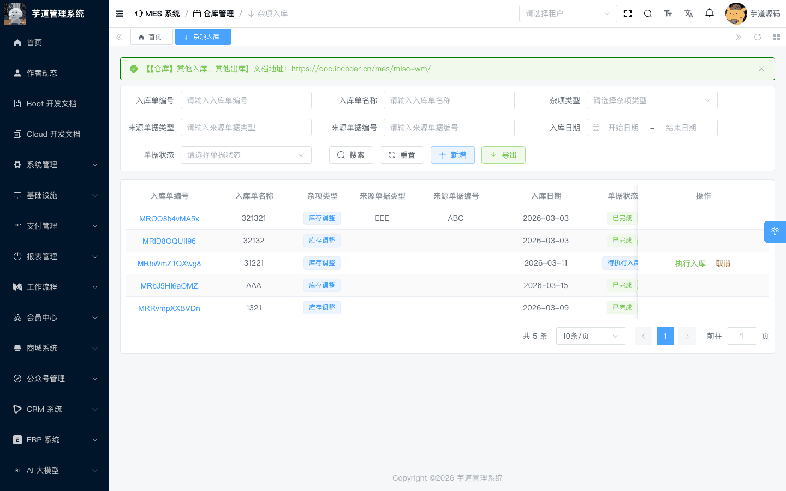
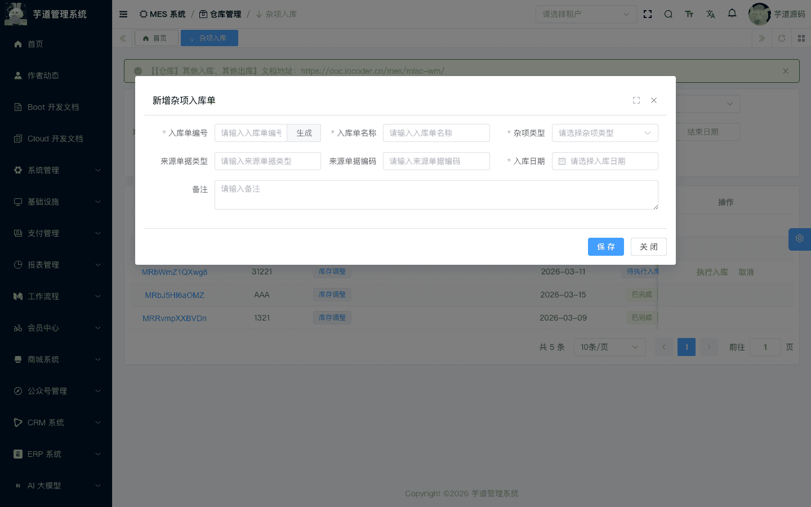
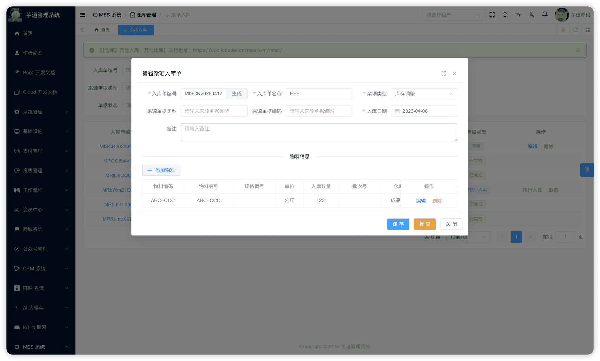

# 【仓库】其他入库、其他出库

其他出入库模块，由 `yudao-module-mes` 后端模块的 `wm.miscissue`、`wm.miscreceipt` 包实现，用于处理不属于常规采购、生产、销售、外协链路的**杂项出入库场景**（如库存调整、报废出库、样品入库等）。
本文涉及两个子模块：
- **其他出库**：将仓库物料以非常规原因出库（如库存调整、报废出库）。出库行通过选择库存物资自动关联库位。
- **其他入库**：将物料以非常规原因入库到仓库。入库行中直接指定入库库位。
本文涉及表如下图所示：
 
## # 1. 其他出库
其他出库，由 MesWmMiscIssueController 提供接口。
### # 1.1 表结构
省略 creator/create_time/updater/update_time/deleted/tenant_id 等通用字段
CREATE TABLE `mes_wm_misc_issue` (
`id` bigint NOT NULL AUTO_INCREMENT COMMENT '编号',
`code` varchar(64) NOT NULL COMMENT '出库单编码',
`name` varchar(255) DEFAULT NULL COMMENT '出库单名称',
`type` tinyint DEFAULT NULL COMMENT '出库类型',
`source_doc_id` bigint DEFAULT NULL COMMENT '来源单据ID',
`source_doc_code` varchar(64) DEFAULT NULL COMMENT '来源单据编号',
`source_doc_type` varchar(64) DEFAULT NULL COMMENT '来源单据类型',
`issue_date` datetime DEFAULT NULL COMMENT '出库日期',
`status` tinyint NOT NULL DEFAULT '0' COMMENT '状态',
`remark` varchar(500) DEFAULT NULL COMMENT '备注',
PRIMARY KEY (`id`)
) ENGINE=InnoDB COMMENT='MES 其他出库单';
① `type` 为出库类型，枚举 MesWmMiscIssueTypeEnum（1=库存调整，2=报废出库）。
② `source_doc_id`、`source_doc_code`、`source_doc_type` 为来源单据信息（选填），用于追溯该出库单的业务来源。
③ `status` 为出库单状态，枚举 MesWmMiscIssueStatusEnum：
| 状态值 | 枚举 | 说明 | 可执行操作 |
| --- | --- | --- | --- |
| 0 | `PREPARE` | 草稿 | 编辑、提交、删除 |
| 3 | `APPROVED` | 待执行出库 | 执行出库、取消 |
| 4 | `FINISHED` | 已完成 | — |
| 5 | `CANCELED` | 已取消 | — |
状态流转说明
创建 ──→ 草稿(0) ──提交──→ 待执行出库(3) ──执行出库──→ 已完成(4)
│
└──取消──→ 已取消(5)
- **创建**（`createMiscIssue`）：创建其他出库单，初始状态为草稿。
- **提交**（`submitMiscIssue`）：校验出库行不能为空，状态变为「待执行出库」。
- **执行出库**（`finishMiscIssue`）：产生库存事务（OUT 出库），扣减库存台账（`mes_wm_material_stock`）。
- **取消**（`cancelMiscIssue`）：已完成和已取消状态不允许取消，其他状态均可取消。
与常规出库的区别
其他出库的流程**没有拣货环节**。出库行通过选择「库存物资」（`WmMaterialStockSelect`），系统自动回填物料、批次号、仓库/库区/库位，并限制出库数量不超过当前库存量。提交后即可执行出库。适用于库存调整、报废等简单出库场景。
该表包含两个子表：
- `mes_wm_misc_issue_line`（出库行）：在新增/编辑弹窗中维护，记录出库物料、数量和出库库位。
- `mes_wm_misc_issue_detail`（出库明细）：由系统在创建/更新出库行时自动生成，无独立 UI。
### # 1.2 管理后台
对应 [MES 系统 -> 仓库管理 -> 其他出库] 菜单，对应 `yudao-ui-admin-vue3` 项目的 `@/views/mes/wm/miscissue` 目录。
#### # 列表
支持按出库单编码、名称、业务类型、来源单据类型、来源单据编号、出库日期、状态等条件搜索。
 
#### # 新增
点击【新增】按钮，弹出其他出库新增表单。主要填写出库单编码（可自动生成）、出库单名称、出库类型、来源单据信息（选填）、出库日期。新建成功后弹窗自动切换为编辑模式，在表单下方展示出库行列表。
 
#### # 修改
点击编码链接或【编辑】按钮（仅草稿状态可编辑），弹出其他出库修改表单。表单下方通过 `el-divider` 分隔展示**出库行**列表。
 ★ **出库行**（编辑弹窗下方）：由 `mes_wm_misc_issue_line` 表存储，记录出库物料、数量和出库库位。由 MesWmMiscIssueLineController 提供接口。
mes_wm_misc_issue_line 表结构 CREATE TABLE `mes_wm_misc_issue_line` (
`id` bigint NOT NULL AUTO_INCREMENT COMMENT '编号',
`issue_id` bigint NOT NULL COMMENT '出库单ID',
`source_doc_line_id` bigint DEFAULT NULL COMMENT '来源单据行ID',
`item_id` bigint NOT NULL COMMENT '物料ID',
`quantity` decimal(14,2) NOT NULL COMMENT '出库数量',
`material_stock_id` bigint DEFAULT NULL COMMENT '库存记录ID',
`batch_id` bigint DEFAULT NULL COMMENT '批次ID',
`batch_code` varchar(64) DEFAULT NULL COMMENT '批次号',
`warehouse_id` bigint NOT NULL COMMENT '仓库ID',
`location_id` bigint NOT NULL COMMENT '库区ID',
`area_id` bigint NOT NULL COMMENT '库位ID',
`remark` varchar(500) DEFAULT NULL COMMENT '备注',
PRIMARY KEY (`id`)
) ENGINE=InnoDB COMMENT='MES 其他出库单行';
① `issue_id` 关联主表 `mes_wm_misc_issue` 的 `id` 字段。`source_doc_line_id` 关联来源单据行（选填）。
② `item_id` 关联 `mes_md_item` 表的 `id` 字段，标识出库物料。`quantity` 为出库数量。
③ `material_stock_id` 关联 `mes_wm_material_stock`。前端通过 `WmMaterialStockSelect` 选择库存物资后，系统自动回填 `item_id`、`batch_code`、`warehouse_id`、`location_id`、`area_id`，并限制 `quantity` 不超过当前库存量。
④ `warehouse_id`、`location_id`、`area_id` 指定出库的仓库/库区/库位。**由选择库存物资时自动回填**（前端置灰不可手动修改），无需单独的拣货明细。
#### # 提交
在编辑弹窗中点击【提交】按钮（仅草稿状态下显示）。系统会先检查表单是否有修改（脏检查），有修改则先保存再提交。**提交后主表不可再修改**。
#### # 执行出库
在「待执行出库」状态下，点击【执行出库】按钮。系统通过 MesWmMiscIssueServiceImpl 的 `finishMiscIssue` 方法，遍历所有出库行，批量创建 OUT 库存事务（含 `batchId`/`batchCode`），扣减库存台账。
状态变为「已完成」。
#### # 取消
在列表页点击【取消】按钮（已完成和已取消状态不允许取消，其他状态均可取消），需二次确认。取消后不可恢复。
## # 2. 其他入库
其他入库，由 MesWmMiscReceiptController 提供接口。
### # 2.1 表结构
省略 creator/create_time/updater/update_time/deleted/tenant_id 等通用字段
CREATE TABLE `mes_wm_misc_receipt` (
`id` bigint NOT NULL AUTO_INCREMENT COMMENT '编号',
`code` varchar(64) NOT NULL COMMENT '入库单编码',
`name` varchar(255) DEFAULT NULL COMMENT '入库单名称',
`type` tinyint DEFAULT NULL COMMENT '入库类型',
`source_doc_id` bigint DEFAULT NULL COMMENT '来源单据ID',
`source_doc_code` varchar(64) DEFAULT NULL COMMENT '来源单据编号',
`source_doc_type` varchar(64) DEFAULT NULL COMMENT '来源单据类型',
`receipt_date` datetime DEFAULT NULL COMMENT '入库日期',
`status` tinyint NOT NULL DEFAULT '0' COMMENT '状态',
`remark` varchar(500) DEFAULT NULL COMMENT '备注',
PRIMARY KEY (`id`)
) ENGINE=InnoDB COMMENT='MES 其他入库单';
① `type` 为入库类型（选填），对应字典 `mes_wm_misc_receipt_type`，用于分类标识入库原因（如样品入库、库存调增等）。具体取值由系统字典配置决定。
② `source_doc_id`、`source_doc_code`、`source_doc_type` 为来源单据信息（选填），用于追溯该入库单的业务来源。
③ `status` 为入库单状态，枚举 MesWmMiscReceiptStatusEnum：
| 状态值 | 枚举 | 说明 | 可执行操作 |
| --- | --- | --- | --- |
| 0 | `PREPARE` | 草稿 | 编辑、提交、删除 |
| 3 | `APPROVED` | 待执行入库 | 执行入库、取消 |
| 4 | `FINISHED` | 已完成 | — |
| 5 | `CANCELED` | 已取消 | — |
状态流转说明
创建 ──→ 草稿(0) ──提交──→ 待执行入库(3) ──执行入库──→ 已完成(4)
│
└──取消──→ 已取消(5)
- **创建**（`createMiscReceipt`）：创建其他入库单，初始状态为草稿。
- **提交**（`submitMiscReceipt`）：校验入库行不能为空，状态变为「待执行入库」。
- **执行入库**（`finishMiscReceipt`）：产生库存事务（IN 入库），增加库存台账（`mes_wm_material_stock`）。
- **取消**（`cancelMiscReceipt`）：已完成和已取消状态不允许取消，其他状态均可取消。
与常规入库的区别
其他入库的流程**没有上架环节**。入库行中直接指定仓库/库区/库位，提交审批后即可执行入库。适用于样品入库、库存调增等简单入库场景。
该表包含两个子表：
- `mes_wm_misc_receipt_line`（入库行）：在新增/编辑弹窗中维护，记录入库物料、数量和入库库位。
- `mes_wm_misc_receipt_detail`（入库明细）：由系统在创建/更新入库行时自动生成，无独立 UI。
### # 2.2 管理后台
对应 [MES 系统 -> 仓库管理 -> 其他入库] 菜单，对应 `yudao-ui-admin-vue3` 项目的 `@/views/mes/wm/miscreceipt` 目录。
#### # 列表
支持按入库单编码、名称、杂项类型、来源单据类型、来源单据编号等条件搜索。
 
#### # 新增
点击【新增】按钮，弹出其他入库新增表单。主要填写入库单编码（可自动生成）、入库单名称、入库类型、来源单据信息（选填）、入库日期。新建成功后弹窗自动切换为编辑模式，在表单下方展示入库行列表。
 
#### # 修改
点击编码链接或【编辑】按钮（仅草稿状态可编辑），弹出其他入库修改表单。表单下方通过 `el-divider` 分隔展示**入库行**列表。
 ★ **入库行**（编辑弹窗下方）：由 `mes_wm_misc_receipt_line` 表存储，记录入库物料、数量和入库库位。由 MesWmMiscReceiptLineController 提供接口。
mes_wm_misc_receipt_line 表结构 CREATE TABLE `mes_wm_misc_receipt_line` (
`id` bigint NOT NULL AUTO_INCREMENT COMMENT '编号',
`receipt_id` bigint NOT NULL COMMENT '入库单ID',
`item_id` bigint NOT NULL COMMENT '物料ID',
`quantity` decimal(14,2) NOT NULL COMMENT '入库数量',
`batch_code` varchar(64) DEFAULT NULL COMMENT '批次号',
`warehouse_id` bigint NOT NULL COMMENT '仓库ID',
`location_id` bigint NOT NULL COMMENT '库区ID',
`area_id` bigint NOT NULL COMMENT '库位ID',
`remark` varchar(500) DEFAULT NULL COMMENT '备注',
PRIMARY KEY (`id`)
) ENGINE=InnoDB COMMENT='MES 其他入库单行';
① `receipt_id` 关联主表 `mes_wm_misc_receipt` 的 `id` 字段。
② `item_id` 关联 `mes_md_item` 表的 `id` 字段，标识入库物料。`quantity` 为入库数量。
③ `batch_code` 为批次号（选填）。前端可手动输入，由用户自行指定。
④ `warehouse_id`、`location_id`、`area_id` 指定入库的仓库/库区/库位。前端支持手动逐级选择（仓库→库区→库位），无需单独的上架明细。
#### # 提交
在编辑弹窗中点击【提交】按钮（仅草稿状态下显示）。系统会先检查表单是否有修改（脏检查），有修改则先保存再提交。**提交后主表不可再修改**。
#### # 执行入库
在「待执行入库」状态下，点击【执行入库】按钮。系统通过 MesWmMiscReceiptServiceImpl 的 `finishMiscReceipt` 方法，遍历所有入库行，批量创建 IN 库存事务，增加库存台账。
当前限制
当前 `finishMiscReceipt` 在构建库存事务请求时，**未将入库行的 `batchCode` 传递给事务服务**，导致生成的 `mes_wm_transaction` 记录丢失批次维度。对于启用批次管理的物料（`batch_flag = true`），入库事务会因缺少批次号而校验失败。待后端补齐批次传递后，此限制将解除。
状态变为「已完成」。
#### # 取消
在列表页点击【取消】按钮（已完成和已取消状态不允许取消，其他状态均可取消），需二次确认。取消后不可恢复。
## # 3. 其他出入库对比
与常规出入库的差异
| 差异点 | 常规出入库（采购/生产/销售/外协） | 其他出入库 |
| --- | --- | --- |
| **拣货/上架** | 有独立的拣货或上架环节（行+明细双层结构） | **无**，出库侧选库存物资自动带出库位，入库侧行表直接指定库位 |
| **状态节点** | 4~6 个状态（含检验、拣货、上架等） | 3 个核心状态（草稿→待执行入/出库→已完成） |
| **质检** | 可关联 IQC/OQC/RQC 检验 | 无质检环节 |
| **业务关联** | 关联工单、客户、供应商等 | 仅可选关联来源单据 |
| **适用场景** | 标准业务流程 | 库存调整、报废、样品、赠品等杂项场景 |
.pageB img{width:80px!important;}
.wwads-horizontal .wwads-text, .wwads-content .wwads-text{line-height:1;}
[【仓库】外协发料、外协入库](/mes/wm/outsource/) [【仓库】调拨单、装箱管理](/mes/wm/transfer/) 
←
[【仓库】外协发料、外协入库](/mes/wm/outsource/) [【仓库】调拨单、装箱管理](/mes/wm/transfer/)→
 
Theme by
[Vdoing](https://github.com/xugaoyi/vuepress-theme-vdoing) 
| Copyright © 2019-2026
芋道源码 | MIT License   
- 跟随系统
- 浅色模式
- 深色模式
- 阅读模式
× 
.windowRB{ padding: 0;}
.windowRB .wwads-img{margin-top: 10px;}
.windowRB .wwads-content{margin: 0 10px 10px 10px;}
.custom-html-window-rb .close-but{
display: none;
}