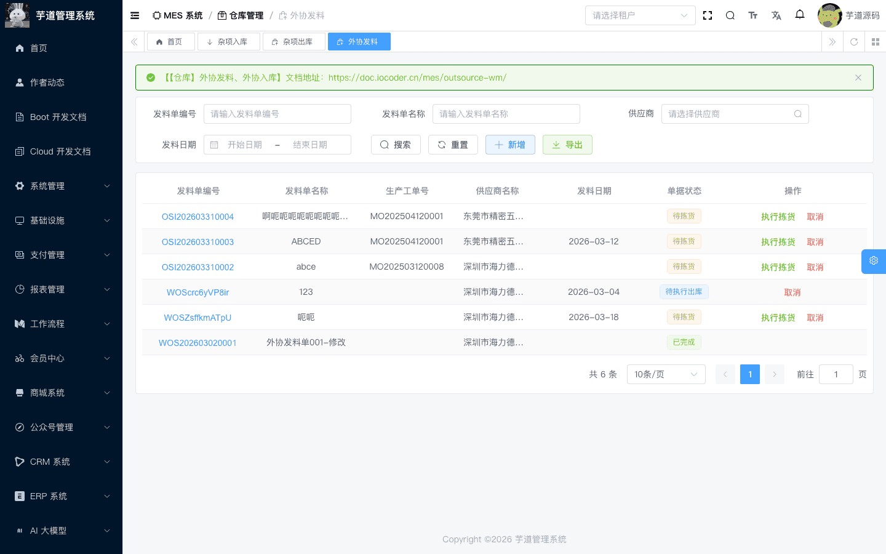
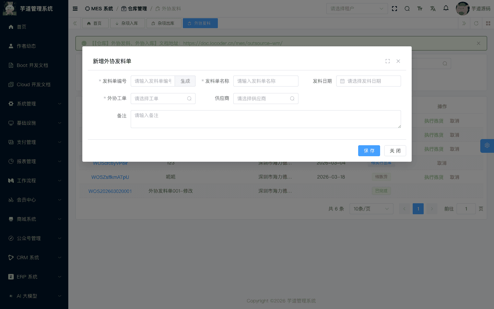
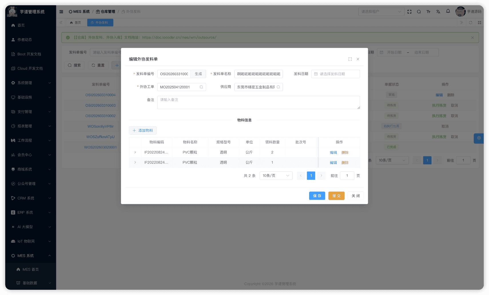
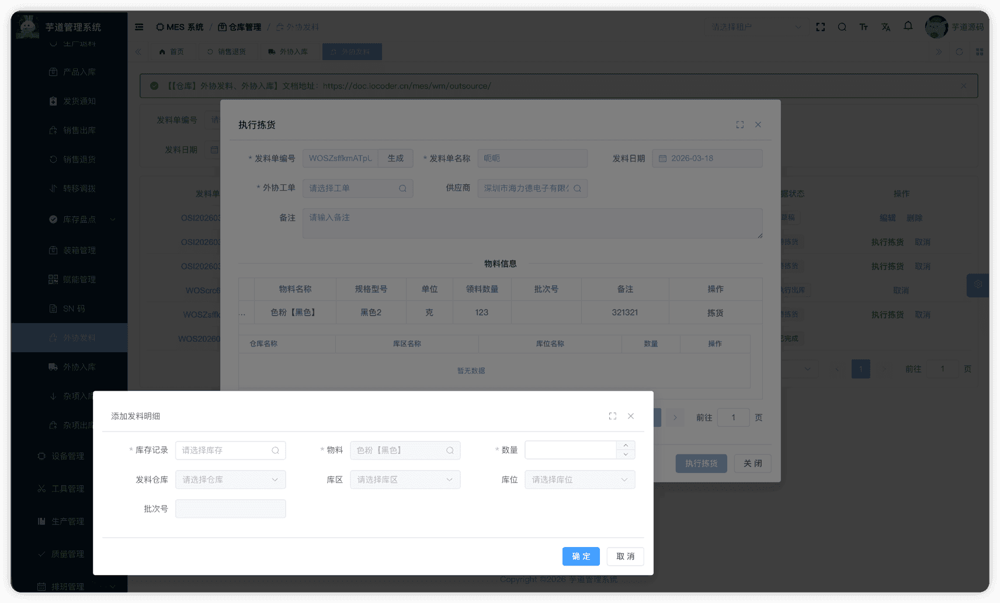
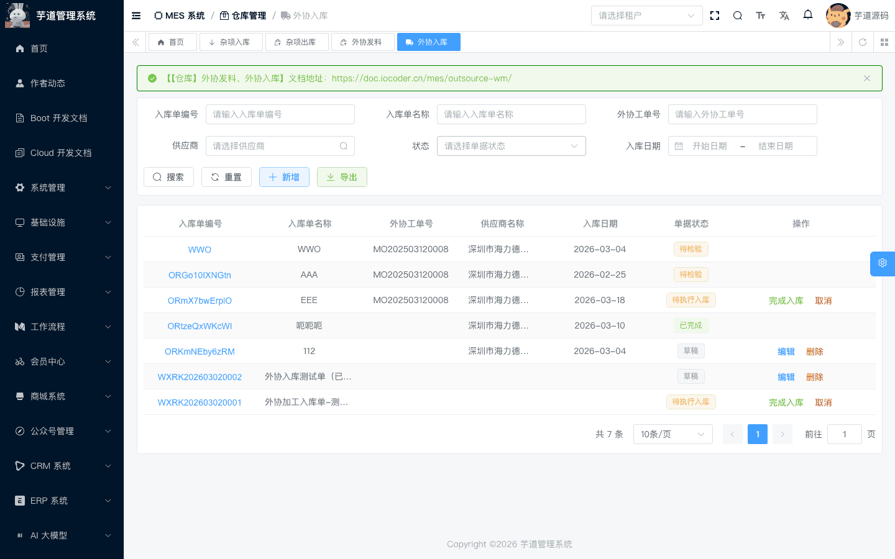
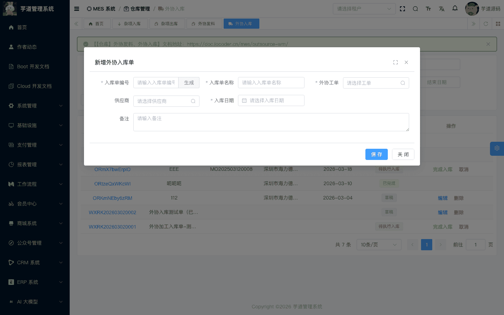
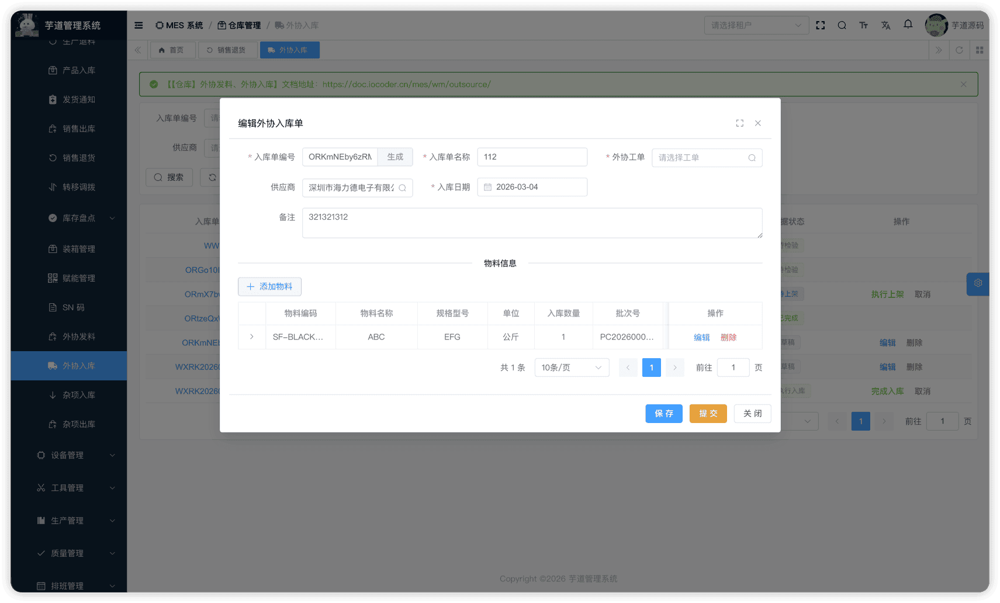
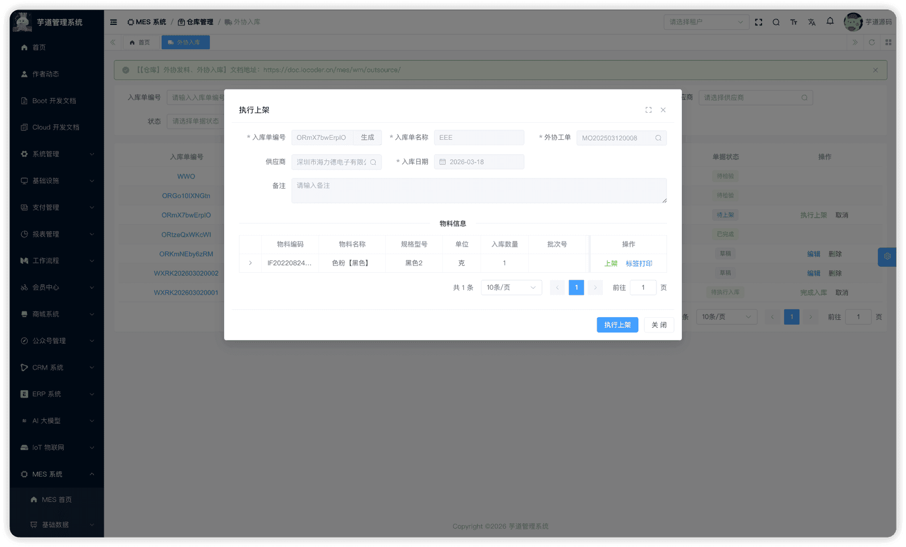
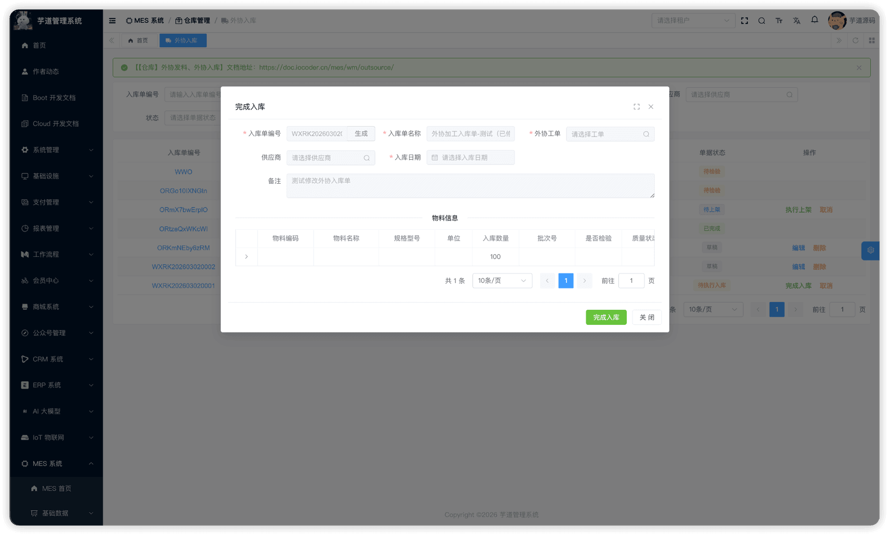

# 【仓库】外协发料、外协入库

外协收发料模块，由 `yudao-module-mes` 后端模块的 `wm.outsourceissue`、`wm.outsourcereceipt` 包实现，覆盖外协（代工）场景中原材料从仓库发往外协供应商、以及外协成品从供应商入库的**完整外协物料流转链路**。
本文涉及两个子模块：
- **外协发料**：将仓库物料发给外协供应商加工。关联外协类型的生产工单和供应商。
- **外协入库**：外协供应商加工完成后，将成品入库到仓库。支持 IQC 来料检验流程，入库时自动回写工单已生产数量。
本文涉及表如下图所示：
 
## # 1. 外协发料
外协发料，由 MesWmOutsourceIssueController 提供接口。
### # 1.1 表结构
省略 creator/create_time/updater/update_time/deleted/tenant_id 等通用字段
CREATE TABLE `mes_wm_outsource_issue` (
`id` bigint NOT NULL AUTO_INCREMENT COMMENT '编号',
`code` varchar(64) NOT NULL COMMENT '发料单编码',
`name` varchar(255) NOT NULL COMMENT '发料单名称',
`vendor_id` bigint NOT NULL COMMENT '供应商ID',
`work_order_id` bigint DEFAULT NULL COMMENT '生产工单ID',
`issue_date` datetime DEFAULT NULL COMMENT '发料日期',
`status` int NOT NULL DEFAULT '0' COMMENT '状态',
`remark` varchar(500) DEFAULT '' COMMENT '备注',
PRIMARY KEY (`id`)
) ENGINE=InnoDB COMMENT='MES 外协发料单';
① `vendor_id` 关联 `mes_md_vendor` 表的 `id` 字段（必填），标识外协供应商，详见 [《【基础】客户管理、供应商管理》](/mes/md/client-vendor/)。
② `work_order_id` 关联 `mes_pro_work_order` 表的 `id` 字段，详见 [《【生产】生产工单》](/mes/pro/work-order/)。**数据库字段允许 NULL（`DEFAULT NULL`），但当前 API（`@NotNull`）和管理后台表单均设为必填**。创建时校验工单需为已确认（或更高）状态，且工单类型必须为**外协（代工）**（`MesProWorkOrderTypeEnum.OUTSOURCE`）。
③ `status` 为发料单状态，枚举 MesWmOutsourceIssueStatusEnum：
| 状态值 | 枚举 | 说明 | 可执行操作 |
| --- | --- | --- | --- |
| 0 | `PREPARE` | 草稿 | 编辑、提交、删除 |
| 2 | `APPROVING` | 待拣货 | 执行拣货、取消 |
| 3 | `APPROVED` | 待执行出库 | 执行领出、取消 |
| 4 | `FINISHED` | 已完成 | — |
| 5 | `CANCELLED` | 已取消 | — |
状态流转说明
创建 ──→ 草稿(0) ──提交──→ 待拣货(2) ──拣货──→ 待执行出库(3) ──执行领出──→ 已完成(4)
│
└──取消──→ 已取消(5)
- **创建**（`createOutsourceIssue`）：创建外协发料单，初始状态为草稿。编码支持自动生成。
- **提交**（`submitOutsourceIssue`）：校验发料行不能为空，状态变为「待拣货」。
- **拣货**（`stockOutsourceIssue`）：校验每行的拣货明细数量之和等于行发料数量后，状态变为「待执行出库」。
- **执行领出**（`finishOutsourceIssue`）：产生库存事务（OUT 出库），扣减库存台账（`mes_wm_material_stock`）。事务中关联 `vendorId`，便于按供应商维度追溯物料去向。
- **取消**（`cancelOutsourceIssue`）：后端允许已完成和已取消以外的状态取消。**当前管理后台仅在「待拣货」和「待执行出库」状态下显示【取消】按钮**。
该表包含两个子表：
- `mes_wm_outsource_issue_line`（发料行）：在新增/编辑弹窗中维护，记录发料物料和数量。
- `mes_wm_outsource_issue_detail`（发料明细）：在拣货操作中维护，记录从哪个库位拣货。
### # 1.2 管理后台
对应 [MES 系统 -> 仓库管理 -> 外协发料] 菜单，对应 `yudao-ui-admin-vue3` 项目的 `@/views/mes/wm/outsourceissue` 目录。
#### # 列表
支持按发料单编码、名称、供应商、发料日期等条件搜索。
 
#### # 新增
点击【新增】按钮，弹出外协发料新增表单。主要填写发料单编码（可自动生成）、发料单名称、供应商（必填）、生产工单（必填，需为外协类型）、发料日期。新建成功后弹窗自动切换为编辑模式，在表单下方展示发料行列表。
 
#### # 修改
点击编码链接或【编辑】按钮（仅草稿状态可编辑），弹出外协发料修改表单。表单下方通过 `el-divider` 分隔展示**发料行**列表。
 ★ **发料行**（编辑弹窗下方）：由 `mes_wm_outsource_issue_line` 表存储，记录发料物料和数量。由 MesWmOutsourceIssueLineController 提供接口。
mes_wm_outsource_issue_line 表结构 CREATE TABLE `mes_wm_outsource_issue_line` (
`id` bigint NOT NULL AUTO_INCREMENT COMMENT '编号',
`issue_id` bigint NOT NULL COMMENT '发料单ID',
`item_id` bigint NOT NULL COMMENT '物料ID',
`quantity` decimal(12,2) NOT NULL COMMENT '发料数量',
`material_stock_id` bigint DEFAULT NULL COMMENT '库存记录ID',
`batch_id` bigint DEFAULT NULL COMMENT '批次ID',
`remark` varchar(500) DEFAULT '' COMMENT '备注',
PRIMARY KEY (`id`)
) ENGINE=InnoDB COMMENT='MES 外协发料单行';
① `issue_id` 关联主表 `mes_wm_outsource_issue` 的 `id` 字段。
② `item_id` 关联 `mes_md_item` 表的 `id` 字段，标识发料物料。`quantity` 为发料数量。
③ `material_stock_id` 关联 `mes_wm_material_stock`（选填）。`batch_id` 关联批次管理（选填）。
#### # 提交
在编辑弹窗中点击【提交】按钮（仅草稿状态下显示）。系统会先检查表单是否有修改（脏检查），有修改则先保存再提交。**提交后主表不可再修改**。
#### # 拣货
在「待拣货」状态下，点击【执行拣货】按钮，为每个发料行添加拣货明细。从现有库存中选择库存记录，指定仓库/库区/库位和拣货数量。支持从多个库位拣货。
 ★ **拣货明细**（拣货弹窗中）：由 `mes_wm_outsource_issue_detail` 表存储，记录从哪个库位拣货。由 MesWmOutsourceIssueDetailController 提供接口。
mes_wm_outsource_issue_detail 表结构 CREATE TABLE `mes_wm_outsource_issue_detail` (
`id` bigint NOT NULL AUTO_INCREMENT COMMENT '编号',
`line_id` bigint NOT NULL COMMENT '发料行ID',
`issue_id` bigint NOT NULL COMMENT '发料单ID',
`material_stock_id` bigint DEFAULT NULL COMMENT '库存记录ID',
`item_id` bigint NOT NULL COMMENT '物料ID',
`quantity` decimal(12,2) NOT NULL COMMENT '拣货数量',
`batch_id` bigint DEFAULT NULL COMMENT '批次ID',
`warehouse_id` bigint NOT NULL COMMENT '仓库ID',
`location_id` bigint DEFAULT NULL COMMENT '库区ID',
`area_id` bigint DEFAULT NULL COMMENT '库位ID',
`remark` varchar(500) DEFAULT '' COMMENT '备注',
PRIMARY KEY (`id`)
) ENGINE=InnoDB COMMENT='MES 外协发料明细';
① `line_id` 关联发料行 `mes_wm_outsource_issue_line` 的 `id` 字段。`issue_id` 关联主表（冗余字段，便于按发料单查询所有明细）。
② `material_stock_id` 关联 `mes_wm_material_stock` 表的 `id` 字段，标识从哪个库存记录中扣减库存。
③ `item_id` 从发料行继承。`quantity` 为拣货数量，所有明细的 `quantity` 之和必须等于发料行的 `quantity`。
④ `warehouse_id`、`location_id`、`area_id` 指定拣货来源的仓库/库区/库位。**数据库字段 `location_id`、`area_id` 允许 NULL，但业务拣货时由前端表单必填**。
#### # 执行领出
在「待执行出库」状态下，点击【执行领出】按钮。系统通过 MesWmOutsourceIssueServiceImpl 的 `finishOutsourceIssue` 方法，遍历所有拣货明细，批量创建 OUT 库存事务，扣减库存台账。
状态变为「已完成」。
#### # 取消
在列表页点击【取消】按钮，需二次确认。取消后不可恢复。**当前管理后台仅在「待拣货」和「待执行出库」状态下显示【取消】按钮**（后端接口层支持已完成和已取消以外的状态取消）。
## # 2. 外协入库
外协入库，由 MesWmOutsourceReceiptController 提供接口。
### # 2.1 表结构
省略 creator/create_time/updater/update_time/deleted/tenant_id 等通用字段
CREATE TABLE `mes_wm_outsource_receipt` (
`id` bigint NOT NULL AUTO_INCREMENT COMMENT '编号',
`code` varchar(64) NOT NULL COMMENT '入库单编码',
`name` varchar(255) DEFAULT NULL COMMENT '入库单名称',
`work_order_id` bigint DEFAULT NULL COMMENT '生产工单ID',
`vendor_id` bigint DEFAULT NULL COMMENT '供应商ID',
`receipt_date` datetime DEFAULT NULL COMMENT '入库日期',
`status` tinyint NOT NULL DEFAULT '0' COMMENT '状态',
`remark` varchar(500) DEFAULT '' COMMENT '备注',
PRIMARY KEY (`id`)
) ENGINE=InnoDB COMMENT='MES 外协入库单';
① `vendor_id` 关联 `mes_md_vendor` 表的 `id` 字段，标识外协供应商，详见 [《【基础】客户管理、供应商管理》](/mes/md/client-vendor/)。
② `work_order_id` 关联 `mes_pro_work_order` 表的 `id` 字段，详见 [《【生产】生产工单》](/mes/pro/work-order/)。创建时校验工单需为已确认（或更高）状态。**执行入库时，系统自动统计合格品数量并回写工单的已生产数量**（仅统计 `item_id` 等于工单目标产品 `mes_pro_work_order` 表的 `product_id` 的行，且排除不合格品）。
③ `status` 为入库单状态，枚举 MesWmOutsourceReceiptStatusEnum：
| 状态值 | 枚举 | 说明 | 可执行操作 |
| --- | --- | --- | --- |
| 0 | `PREPARE` | 草稿 | 编辑、提交、删除 |
| 1 | `CONFIRMED` | 待检验 | —（需前往待检任务处理） |
| 2 | `APPROVING` | 待上架 | 执行上架、取消 |
| 3 | `APPROVED` | 待执行入库 | 完成入库、取消 |
| 4 | `FINISHED` | 已完成 | — |
| 5 | `CANCELED` | 已取消 | — |
状态流转说明
创建 ──→ 草稿(0) ──提交──→ 待检验(1) ──检验完成──→ 待上架(2) ──上架──→ 待执行入库(3) ──完成入库──→ 已完成(4)
│                                                                    │
└──不需检验─────────────→ 待上架(2)                                        └──取消──→ 已取消(5)
- **创建**（`createOutsourceReceipt`）：创建外协入库单，初始状态为草稿。
- **提交**（`submitOutsourceReceipt`）：校验入库行不能为空。根据行的 `qualityStatus` 决定状态： 若任意行为「待检验」状态（需 IQC 检验），主表状态变为「待检验」；
- 若无待检验行（不需检验），状态直接变为「待上架」。
**上架**（`stockOutsourceReceipt`）：校验每行的上架明细数量之和不小于入库数量后，状态变为「待执行入库」。校验不通过时提示具体物料名。 **完成入库**（`finishOutsourceReceipt`）：产生库存事务（IN 入库），增加库存台账。同时自动回写工单已生产数量。 **取消**（`cancelOutsourceReceipt`）：后端允许已完成和已取消以外的状态取消。**当前管理后台仅在「待上架」和「待执行入库」状态下显示【取消】按钮**。  
该表包含两个子表：
- `mes_wm_outsource_receipt_line`（入库行）：在新增/编辑弹窗中维护，记录入库物料、数量和质量状态。
- `mes_wm_outsource_receipt_detail`（入库明细）：在上架操作中维护，记录上架到哪个库位。
### # 2.2 管理后台
对应 [MES 系统 -> 仓库管理 -> 外协入库] 菜单，对应 `yudao-ui-admin-vue3` 项目的 `@/views/mes/wm/outsourcereceipt` 目录。
#### # 列表
支持按入库单编码、名称、外协工单号、供应商、状态、入库日期等条件搜索。
 
#### # 新增
点击【新增】按钮，弹出外协入库新增表单。主要填写入库单编码（可自动生成）、入库单名称、供应商（必填）、生产工单（必填，需为外协类型）、入库日期（必填）。新建成功后弹窗自动切换为编辑模式，在表单下方展示入库行列表。
 
#### # 修改
点击编码链接或【编辑】按钮（仅草稿状态可编辑），弹出外协入库修改表单。表单下方通过 `el-divider` 分隔展示**入库行**列表。
 ★ **入库行**（编辑弹窗下方）：由 `mes_wm_outsource_receipt_line` 表存储，记录入库物料、数量和 IQC 检验信息。由 MesWmOutsourceReceiptLineController 提供接口。
mes_wm_outsource_receipt_line 表结构 CREATE TABLE `mes_wm_outsource_receipt_line` (
`id` bigint NOT NULL AUTO_INCREMENT COMMENT '编号',
`receipt_id` bigint NOT NULL COMMENT '入库单ID',
`item_id` bigint NOT NULL COMMENT '物料ID',
`quantity` decimal(14,2) DEFAULT NULL COMMENT '入库数量',
`batch_id` bigint DEFAULT NULL COMMENT '批次ID',
`batch_code` varchar(64) DEFAULT NULL COMMENT '批次号',
`production_date` datetime DEFAULT NULL COMMENT '生产日期',
`expire_date` datetime DEFAULT NULL COMMENT '有效期',
`lot_number` varchar(128) DEFAULT NULL COMMENT '批号',
`iqc_check_flag` bit(1) DEFAULT b'0' COMMENT '是否需要来料检验',
`iqc_id` bigint DEFAULT NULL COMMENT '来料检验单ID',
`quality_status` tinyint DEFAULT NULL COMMENT '质量状态',
`remark` varchar(500) DEFAULT '' COMMENT '备注',
PRIMARY KEY (`id`)
) ENGINE=InnoDB COMMENT='MES 外协入库单行';
① `receipt_id` 关联主表 `mes_wm_outsource_receipt` 的 `id` 字段。
② `item_id` 为入库物料，`quantity` 为入库数量。
③ `batch_id`、`batch_code` 关联批次管理。`production_date`、`expire_date`、`lot_number` 为批次相关日期和批号信息。
④ `iqc_check_flag` 标识该行是否需要来料检验（IQC），**新增时由用户填写**。`quality_status` 为质量状态，枚举 MesWmQualityStatusEnum（0=待检验，1=合格，2=不合格）。提交入库单时，系统根据行的 `qualityStatus` 决定状态：
- 若任意行为「待检验」状态，主表状态变为「待检验」；
- 若无待检验行，主表状态直接变为「待上架」。
⑤ `iqc_id` 关联 `mes_qc_iqc` 表的 `id` 字段，标识关联的来料检验单。**在 IQC 完成后由系统通过回调自动回写**（`updateOutsourceReceiptWhenIqcFinish`）。IQC 回调时会按合格/不合格数量拆行——合格品更新原行，不合格品新增一行。
#### # 提交
在编辑弹窗中点击【提交】按钮（仅草稿状态下显示）。系统会先检查表单是否有修改（脏检查），有修改则先保存再提交。**提交后主表不可再修改**。
#### # 检验（IQC）
提交后若存在待检验行，主表进入「待检验」状态。**当前外协入库单据页没有独立的【执行检验】按钮**，用户需前往 **[质量管理 → 待检任务]** 创建 IQC 来料检验单进行检验操作。IQC 完成后系统通过 `updateOutsourceReceiptWhenIqcFinish` 回调自动回写行的 `iqc_id` 和质量状态，并按合格/不合格数量拆行。
**当前实现为任一行 IQC 完成后即将主表状态推进为「待上架」**（不等待所有需检行全部完成，与到货通知的聚合门槛不同）。详见 [《【质量】来料检验 IQC》](/mes/qc/iqc/)。
#### # 上架
在「待上架」状态下，点击【执行上架】按钮，为每个入库行添加上架明细，指定仓库/库区/库位和上架数量。
 ★ **上架明细**（上架弹窗中）：由 `mes_wm_outsource_receipt_detail` 表存储，记录上架到哪个库位。由 MesWmOutsourceReceiptDetailController 提供接口。
mes_wm_outsource_receipt_detail 表结构 CREATE TABLE `mes_wm_outsource_receipt_detail` (
`id` bigint NOT NULL AUTO_INCREMENT COMMENT '编号',
`line_id` bigint NOT NULL COMMENT '入库行ID',
`receipt_id` bigint NOT NULL COMMENT '入库单ID',
`item_id` bigint NOT NULL COMMENT '物料ID',
`quantity` decimal(14,2) DEFAULT NULL COMMENT '上架数量',
`batch_id` bigint DEFAULT NULL COMMENT '批次ID',
`warehouse_id` bigint DEFAULT NULL COMMENT '仓库ID',
`location_id` bigint DEFAULT NULL COMMENT '库区ID',
`area_id` bigint DEFAULT NULL COMMENT '库位ID',
`remark` varchar(500) DEFAULT '' COMMENT '备注',
PRIMARY KEY (`id`)
) ENGINE=InnoDB COMMENT='MES 外协入库明细';
① `line_id` 关联入库行 `mes_wm_outsource_receipt_line` 的 `id` 字段。`receipt_id` 关联主表（冗余字段，便于按入库单查询所有明细）。
② `item_id`、`quantity` 信息从入库行继承。所有明细的 `quantity` 之和必须不小于入库行的 `quantity`。
③ `batch_id` 从入库行继承。
④ `warehouse_id`、`location_id`、`area_id` 指定上架到实际仓库的具体位置。
#### # 完成入库
在「待执行入库」状态下，点击【完成入库】按钮。系统通过 MesWmOutsourceReceiptServiceImpl 的 `finishOutsourceReceipt` 方法：
 
1. 遍历所有上架明细，批量创建 IN 库存事务，增加库存台账
1. 自动统计合格品数量并回写工单已生产数量（仅统计目标产品的合格行）
状态变为「已完成」。
#### # 取消
在列表页点击【取消】按钮，需二次确认。取消后不可恢复。**当前管理后台仅在「待上架」和「待执行入库」状态下显示【取消】按钮**（后端接口层支持已完成和已取消以外的状态取消）。
## # 3. 外协物料流转总览
端到端业务流程
外协发料：仓库 ──OUT──→ 发往供应商加工
│
（供应商加工完成）
│
外协入库：供应商成品 ──提交──→ 待检验 ──IQC──→ 待上架 ──上架──→ 待执行入库 ──完成入库──→ 仓库入库
│                                              │
└──不需 IQC──→ 待上架                              └──→ 回写工单已生产数量
- **外协发料**将原材料从仓库出库发到外协供应商，通过 OUT 库存事务扣减库存。
- **外协入库**将供应商加工完成的成品入库到仓库，通过 IN 库存事务增加库存。
- **IQC 来料检验**是可选环节，由入库行的 `iqc_check_flag` 控制。IQC 完成后按合格/不合格拆行。
- **工单回写**：外协入库完成时，自动统计合格品数量并回写到工单的已生产数量（`produced_quantity`），用于工单完工进度追踪。
.pageB img{width:80px!important;}
.wwads-horizontal .wwads-text, .wwads-content .wwads-text{line-height:1;}
[【仓库】发货通知、销售出库、销售退货](/mes/wm/sales-out/) [【仓库】其他入库、其他出库](/mes/wm/misc/) 
←
[【仓库】发货通知、销售出库、销售退货](/mes/wm/sales-out/) [【仓库】其他入库、其他出库](/mes/wm/misc/)→
 
Theme by
[Vdoing](https://github.com/xugaoyi/vuepress-theme-vdoing) 
| Copyright © 2019-2026
芋道源码 | MIT License   
- 跟随系统
- 浅色模式
- 深色模式
- 阅读模式
× 
.windowRB{ padding: 0;}
.windowRB .wwads-img{margin-top: 10px;}
.windowRB .wwads-content{margin: 0 10px 10px 10px;}
.custom-html-window-rb .close-but{
display: none;
}