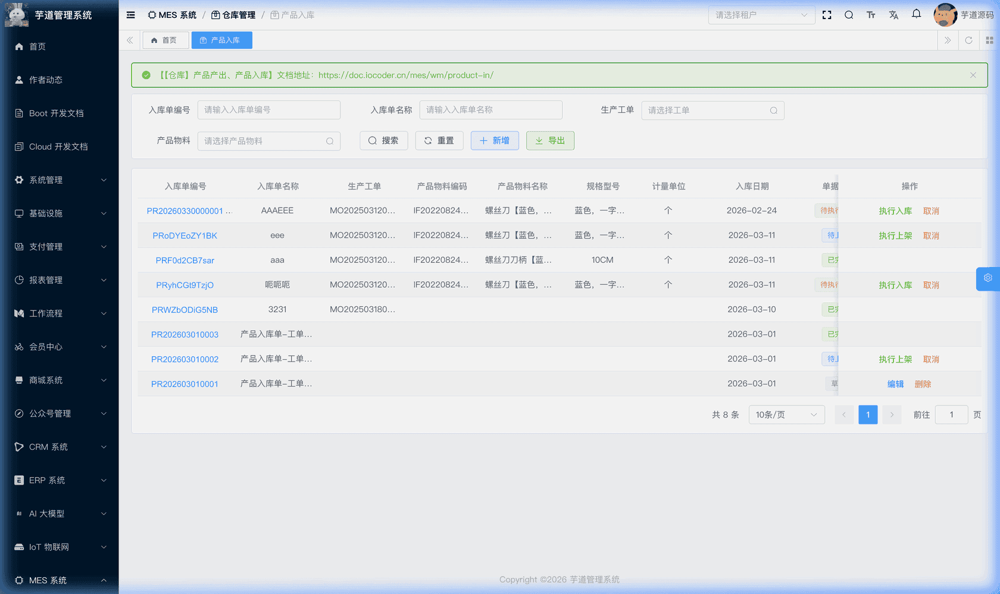
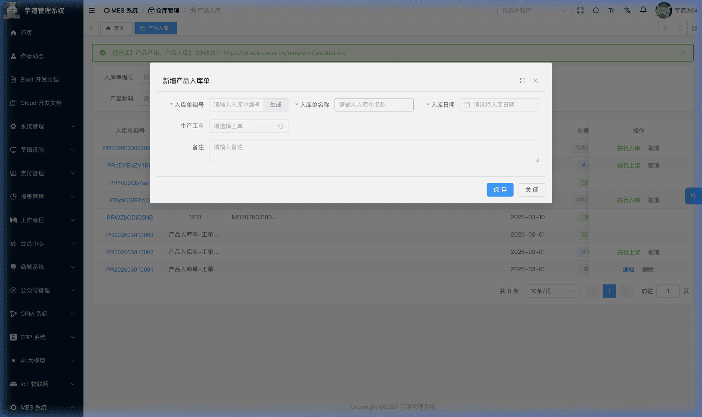
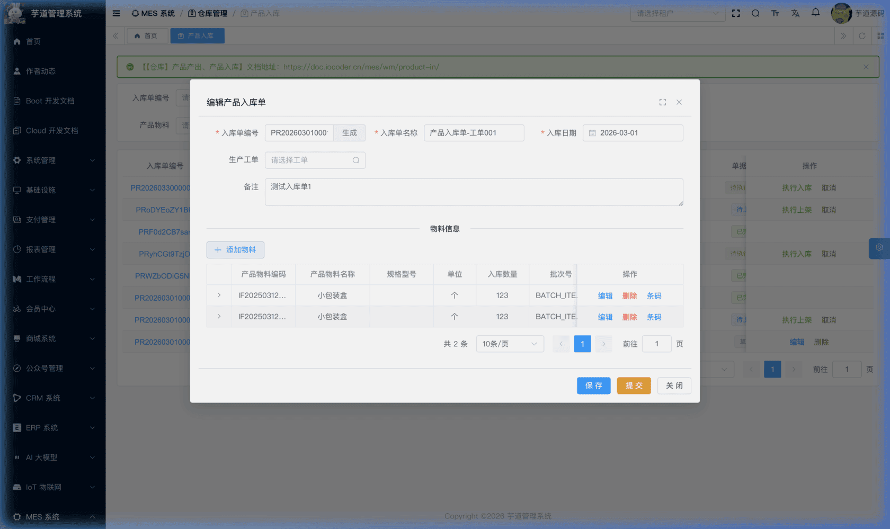
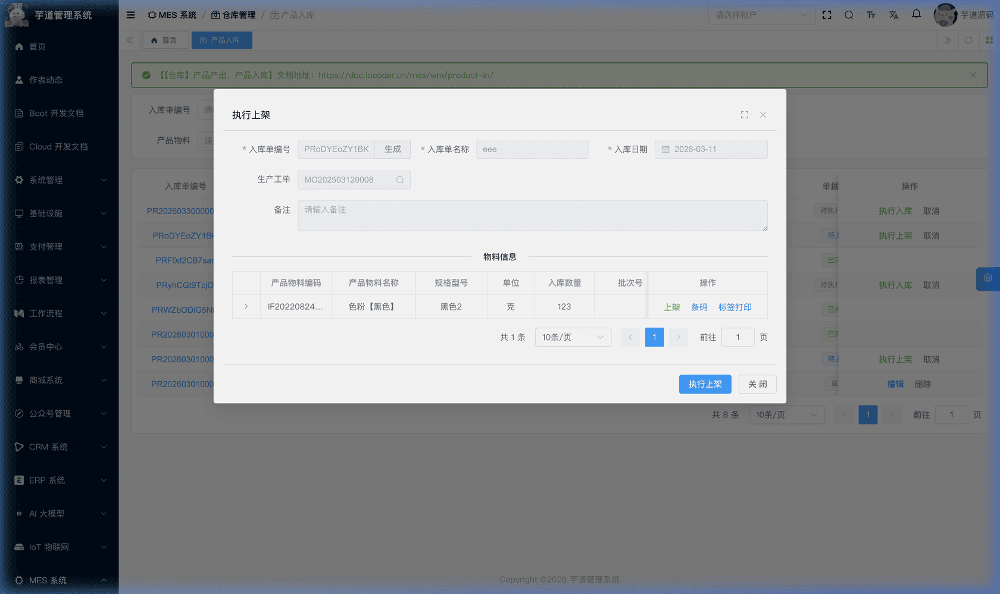
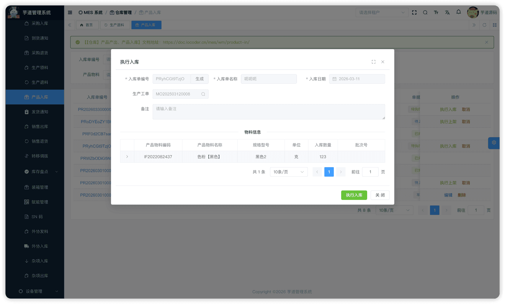

# 【仓库】产品产出、产品入库

产品产出与入库模块，由 `yudao-module-mes` 后端模块的 `wm.productproduce`、`wm.productreceipt` 包实现，覆盖生产完工后产品从车间线边库到实际仓库的**完整产品入库链路**。
本文涉及两个子模块：
- **产品产出**：报工审批通过后，系统自动生成产品产出记录，将产出产品入库到虚拟线边库。支持 IPQC 过程检验后按合格/不合格拆行处理。**无独立前端入口页面，由报工审批流程自动触发**。
- **产品入库**：将线边库中的产品转移到实际仓库上架，采用**行+明细**的双层结构——行表记录入库物料和数量，明细表记录上架到哪个库位。
本文涉及表如下图所示：
 
## # 1. 产品产出
产品产出，由 MesWmProductProduceServiceImpl 提供业务逻辑（无独立 Controller，由报工流程内部调用）。
提示
产品产出没有独立的前端入口页面，属于**系统自动触发**的后台模块。当报工审批通过后，系统根据报工数量和质检结果自动生成产出记录并入库到虚拟线边库。详见 [《【生产】生产报工》](/mes/pro/feedback/)。
### # 1.1 表结构
省略 creator/create_time/updater/update_time/deleted/tenant_id 等通用字段
CREATE TABLE `mes_wm_product_produce` (
`id` bigint NOT NULL AUTO_INCREMENT COMMENT '编号',
`work_order_id` bigint NOT NULL COMMENT '生产工单ID',
`feedback_id` bigint NOT NULL COMMENT '报工记录ID',
`task_id` bigint DEFAULT NULL COMMENT '生产任务ID',
`workstation_id` bigint DEFAULT NULL COMMENT '工作站ID',
`process_id` bigint DEFAULT NULL COMMENT '工序ID',
`produce_date` datetime DEFAULT NULL COMMENT '产出日期',
`status` int NOT NULL DEFAULT '0' COMMENT '状态',
`remark` varchar(500) DEFAULT NULL COMMENT '备注',
PRIMARY KEY (`id`)
) ENGINE=InnoDB COMMENT='MES 产品产出单';
① `work_order_id` 关联 `mes_pro_work_order` 表的 `id` 字段，详见 [《【生产】生产工单》](/mes/pro/work-order/)。
`task_id` 关联 `mes_pro_task` 表，详见 [《【生产】生产排产、工序流转卡》](/mes/pro/schedule-card/)。
`workstation_id` 关联 `mes_md_workstation` 表，详见 [《【基础】车间设置、工作站设置》](/mes/md/workshop/)。
`process_id` 关联 `mes_pro_process` 表，详见 [《【生产】工序设置、工艺流程》](/mes/pro/process-route/)。
**以上字段均从报工记录继承，由系统自动填充**。
② `feedback_id` 关联 `mes_pro_feedback` 表的 `id` 字段，标识该产出记录由哪条报工触发。一条报工记录最多对应一条产出记录。
③ `produce_date` 为产出日期，**由系统自动设置为当前时间**。
④ `status` 为产出单状态，枚举 MesWmProductProduceStatusEnum：
| 状态值 | 枚举 | 说明 |
| --- | --- | --- |
| 0 | `PREPARE` | 草稿 |
| 4 | `FINISHED` | 已完成 |
| 5 | `CANCELED` | 已取消 |
产品产出自动化流程
产品产出是系统自动执行的，有两条分支路径：
**路径 A：不需要 IPQC 检验**（`checkFlag=false`）
报工审批通过 ──→ 生成产出单(草稿) + 按合格/不合格分别生成行+明细 ──→ 执行产出(IN 线边库) ──→ 已完成
**路径 B：需要 IPQC 检验**（`checkFlag=true`）
报工审批通过 ──→ 生成产出单(草稿) + 生成待检验行(无明细) ──→ 等待 IPQC ──→ 检验完成 ──→ 按质量结果拆行+生成明细 ──→ 执行产出(IN 线边库) ──→ 已完成
**详细步骤：**
1. **生成产出单**（`generateProductProduce`）：报工审批通过后自动触发，同时获取或生成批次号。
1. **分支处理**： - **不需检验**：按 `qualifiedQuantity`（合格数）和 `unqualifiedQuantity`（不合格数）各生成一行+明细，质量状态分别为「合格」和「不合格」。 - **需要检验**：生成一条「待检验」行（质量状态=PENDING），不生成明细，等待 IPQC 完成。
1. **IPQC 回调拆行**（`splitPendingAndFinishProduce`）：IPQC 检验完成后，系统根据质量结果将「待检验」行拆分为合格行+不合格行，并生成对应明细。详见 [《【质量】过程检验 IPQC》](/mes/qc/ipqc/)。
1. **执行产出**（`finishProductProduce`）：校验每行的明细数量之和等于行数量后，遍历所有明细创建 IN 库存事务，将产品入库到虚拟线边库。
该表包含两个子表：
- `mes_wm_product_produce_line`（产出行）：记录产出产品、数量和质量状态，由系统自动生成。
- `mes_wm_product_produce_detail`（产出明细）：记录产出到线边库的具体位置，由系统自动生成。
### # 1.2 子表结构
★ **产出行**：由 `mes_wm_product_produce_line` 表存储。由 MesWmProductProduceLineController 提供接口。
mes_wm_product_produce_line 表结构 CREATE TABLE `mes_wm_product_produce_line` (
`id` bigint NOT NULL AUTO_INCREMENT COMMENT '编号',
`produce_id` bigint NOT NULL COMMENT '产出单ID',
`feedback_id` bigint NOT NULL COMMENT '报工记录ID',
`item_id` bigint NOT NULL COMMENT '物料ID',
`quantity` decimal(12,2) NOT NULL COMMENT '产出数量',
`batch_id` bigint DEFAULT NULL COMMENT '批次ID',
`batch_code` varchar(255) DEFAULT NULL COMMENT '批次号',
`expire_date` datetime DEFAULT NULL COMMENT '有效期',
`lot_number` varchar(128) DEFAULT NULL COMMENT '批号',
`quality_status` int DEFAULT NULL COMMENT '质量状态',
`remark` varchar(500) DEFAULT NULL COMMENT '备注',
PRIMARY KEY (`id`)
) ENGINE=InnoDB COMMENT='MES 产品产出行';
① `produce_id` 关联主表 `mes_wm_product_produce` 的 `id` 字段。`feedback_id` 关联报工记录。
② `item_id` 为产出物料（来自报工记录的产品），`quantity` 为产出数量。
③ `batch_id`、`batch_code` 为系统自动生成的批次信息。`expire_date` 和 `lot_number` 从报工记录继承。
④ `quality_status` 为质量状态，枚举 MesWmQualityStatusEnum：
- 不需检验时：按合格/不合格数量分别生成行，状态为 `PASS`(1) 或 `FAIL`(2)。
- 需要 IPQC 检验时：初始为 `PENDING`(0)，IPQC 完成后由 `splitPendingAndFinishProduce` 方法拆分更新。
★ **产出明细**：由 `mes_wm_product_produce_detail` 表存储。产出明细由系统自动生成，当前无独立管理接口（由 MesWmProductProduceServiceImpl 内部创建）。
mes_wm_product_produce_detail 表结构 CREATE TABLE `mes_wm_product_produce_detail` (
`id` bigint NOT NULL AUTO_INCREMENT COMMENT '编号',
`produce_id` bigint NOT NULL COMMENT '产出单ID',
`line_id` bigint NOT NULL COMMENT '产出行ID',
`item_id` bigint NOT NULL COMMENT '物料ID',
`quantity` decimal(12,2) NOT NULL COMMENT '产出数量',
`batch_id` bigint DEFAULT NULL COMMENT '批次ID',
`batch_code` varchar(255) DEFAULT NULL COMMENT '批次号',
`warehouse_id` bigint NOT NULL COMMENT '仓库ID',
`location_id` bigint NOT NULL COMMENT '库区ID',
`area_id` bigint NOT NULL COMMENT '库位ID',
`remark` varchar(500) DEFAULT NULL COMMENT '备注',
PRIMARY KEY (`id`)
) ENGINE=InnoDB COMMENT='MES 产品产出明细';
① `produce_id` 关联主表（冗余字段）。`line_id` 关联产出行 `mes_wm_product_produce_line` 的 `id` 字段。
② `item_id`、`quantity` 从产出行继承。
③ `batch_id`、`batch_code` 从产出行继承。
④ `warehouse_id`、`location_id`、`area_id` 固定为虚拟线边库（`WIP_VIRTUAL_WAREHOUSE` / `WIP_VIRTUAL_LOCATION` / `WIP_VIRTUAL_AREA`），**由系统自动填充**。
## # 2. 产品入库
产品入库，由 MesWmProductReceiptController 提供接口。
### # 2.1 表结构
省略 creator/create_time/updater/update_time/deleted/tenant_id 等通用字段
CREATE TABLE `mes_wm_product_receipt` (
`id` bigint NOT NULL AUTO_INCREMENT COMMENT '编号',
`code` varchar(64) NOT NULL COMMENT '入库单编码',
`name` varchar(255) DEFAULT NULL COMMENT '入库单名称',
`work_order_id` bigint DEFAULT NULL COMMENT '生产工单ID',
`item_id` bigint DEFAULT NULL COMMENT '产品ID',
`receipt_date` datetime DEFAULT NULL COMMENT '入库日期',
`status` int NOT NULL DEFAULT '0' COMMENT '状态',
`remark` varchar(500) DEFAULT NULL COMMENT '备注',
PRIMARY KEY (`id`)
) ENGINE=InnoDB COMMENT='MES 产品入库单';
① `work_order_id` 关联 `mes_pro_work_order` 表的 `id` 字段（选填），详见 [《【生产】生产工单》](/mes/pro/work-order/)。
创建时校验工单必须为已确认状态（后端 `validateWorkOrderConfirmed` 只允许 `CONFIRMED`，前端下拉也仅展示已确认工单），同时系统根据工单自动回写 `item_id`（产品 ID，来自 `mes_pro_work_order` 表的 `product_id`）。
② `status` 为入库单状态，枚举 MesWmProductReceiptStatusEnum：
| 状态值 | 枚举 | 说明 | 可执行操作 |
| --- | --- | --- | --- |
| 0 | `PREPARE` | 草稿 | 编辑、提交、删除 |
| 2 | `APPROVING` | 待上架 | 执行上架、取消 |
| 3 | `APPROVED` | 待执行入库 | 执行入库、取消 |
| 4 | `FINISHED` | 已完成 | — |
| 5 | `CANCELED` | 已取消 | — |
状态流转说明
创建 ──→ 草稿(0) ──提交──→ 待上架(2) ──上架──→ 待执行入库(3) ──执行入库──→ 已完成(4)
│
└──取消──→ 已取消(5)
- **创建**（`createProductReceipt`）：创建产品入库单，初始状态为草稿。系统根据关联工单自动回写 `item_id`。
- **提交**（`submitProductReceipt`）：校验入库行不能为空，状态变为「待上架」。
- **上架明细维护**：在「待上架」阶段，通过入库明细表单（ProductReceiptDetailForm）为每个入库行添加上架明细，指定目标仓库/库区/库位和上架数量。
- **执行上架**（`stockProductReceipt`）：校验状态为「待上架」后，将状态流转为「待执行入库」。该方法仅负责状态推进，上架明细由前一步单独维护。
- **执行入库**（`finishProductReceipt`）：产生库存事务——每条明细产生 **OUT**（虚拟线边库扣减，允许负库存）+ **IN**（实际仓库增加）一对事务。
- **取消**（`cancelProductReceipt`）：后端不允许已完成和已取消状态取消；当前前端仅在「待上架」和「待执行入库」状态显示【取消】按钮，草稿状态通过【删除】处理。
虚拟线边库
产品入库与生产退料类似，是从虚拟线边库出库、到实际仓库入库的**仓库间转移**。线边库端的出库事务设置 `checkFlag=false`，允许负库存。
产品入库的来源是「产品产出」——报工审批通过后产出的产品先入虚拟线边库，再通过产品入库单转移到实际仓库。
该表包含两个子表：
- `mes_wm_product_receipt_line`（入库行）：在新增/编辑弹窗中维护，记录入库物料和数量。
- `mes_wm_product_receipt_detail`（入库明细）：在上架操作中维护，记录上架到哪个库位。
### # 2.2 管理后台
对应 [MES 系统 -> 仓库管理 -> 产品入库] 菜单，对应 `yudao-ui-admin-vue3` 项目的 `@/views/mes/wm/productreceipt` 目录。
#### # 列表
支持按入库单编码、名称、生产工单、产品物料等条件搜索。
 
#### # 新增
点击【新增】按钮，弹出产品入库新增表单。主要填写入库单编码（可自动生成）、入库单名称、生产工单（选填，选择后系统自动回写产品 ID）、入库日期。新建成功后弹窗自动切换为编辑模式，在表单下方展示入库行列表。
 
#### # 修改
在列表页点击入库单编号打开**详情只读弹窗**；草稿状态下可点击【编辑】按钮进入修改表单。表单下方通过 `el-divider` 分隔展示**入库行**列表。
 ★ **入库行**（编辑弹窗下方）：由 `mes_wm_product_receipt_line` 表存储，记录入库物料和数量。由 MesWmProductReceiptLineController 提供接口。
mes_wm_product_receipt_line 表结构 CREATE TABLE `mes_wm_product_receipt_line` (
`id` bigint NOT NULL AUTO_INCREMENT COMMENT '编号',
`receipt_id` bigint NOT NULL COMMENT '入库单ID',
`item_id` bigint NOT NULL COMMENT '物料ID',
`quantity` decimal(12,2) NOT NULL COMMENT '入库数量',
`material_stock_id` bigint DEFAULT NULL COMMENT '库存记录ID',
`batch_id` bigint DEFAULT NULL COMMENT '批次ID',
`batch_code` varchar(255) DEFAULT NULL COMMENT '批次号',
`remark` varchar(500) DEFAULT NULL COMMENT '备注',
PRIMARY KEY (`id`)
) ENGINE=InnoDB COMMENT='MES 产品入库单行';
① `receipt_id` 关联主表 `mes_wm_product_receipt` 的 `id` 字段。
② `item_id` 为入库物料（从线边库中选取已产出的产品），`quantity` 为入库数量。
③ `material_stock_id` 关联 `mes_wm_material_stock`（线边库中的库存记录）。`batch_id`、`batch_code` 为批次信息。
#### # 提交
在编辑弹窗中点击【提交】按钮（仅草稿状态下显示）。系统会先检查表单是否有修改（脏检查），有修改则先保存再提交。**提交后主表不可再修改**。
#### # 上架
在「待上架」状态下，点击【执行上架】按钮，为每个入库行添加上架明细，指定目标仓库/库区/库位和上架数量。支持同一物料分配到多个库位。
 ★ **上架明细**（上架弹窗中）：由 `mes_wm_product_receipt_detail` 表存储，记录上架到哪个库位。由 MesWmProductReceiptDetailController 提供接口。
mes_wm_product_receipt_detail 表结构 CREATE TABLE `mes_wm_product_receipt_detail` (
`id` bigint NOT NULL AUTO_INCREMENT COMMENT '编号',
`line_id` bigint NOT NULL COMMENT '入库行ID',
`receipt_id` bigint NOT NULL COMMENT '入库单ID',
`item_id` bigint NOT NULL COMMENT '物料ID',
`quantity` decimal(12,2) NOT NULL COMMENT '上架数量',
`batch_id` bigint DEFAULT NULL COMMENT '批次ID',
`warehouse_id` bigint NOT NULL COMMENT '仓库ID',
`location_id` bigint NOT NULL COMMENT '库区ID',
`area_id` bigint NOT NULL COMMENT '库位ID',
`remark` varchar(500) DEFAULT NULL COMMENT '备注',
PRIMARY KEY (`id`)
) ENGINE=InnoDB COMMENT='MES 产品入库明细';
① `line_id` 关联入库行 `mes_wm_product_receipt_line` 的 `id` 字段。`receipt_id` 关联主表（冗余字段，便于按入库单查询所有明细）。
② `item_id`、`quantity` 信息从入库行继承。所有明细的 `quantity` 之和应等于入库行的 `quantity`（由前端通过 `checkProductReceiptQuantity` 接口校验，后端上架和入库操作不强制此约束）。
③ `batch_id` 从入库行继承。
④ `warehouse_id`、`location_id`、`area_id` 指定上架到实际仓库的具体位置。
#### # 执行入库
 在「待执行入库」状态下，点击【执行入库】按钮。系统通过 MesWmProductReceiptServiceImpl 的 `finishProductReceipt` 方法，遍历所有上架明细，每条明细产生一对库存事务：
1. **OUT 事务**：从虚拟线边库扣减库存（`checkFlag=false`，允许负库存）
1. **IN 事务**：入实际仓库增加库存，`relatedTransactionId` 关联上述 OUT 事务
状态变为「已完成」。
#### # 取消
在列表页点击【取消】按钮（当前前端仅在「待上架」和「待执行入库」状态显示；草稿状态通过【删除】处理），需二次确认。取消后不可恢复。
## # 3. 产品入库链路总览
端到端业务流程
生产报工 ──→ 产品产出(自动) ──IN──→ 线边库(虚拟)
│
└──→ 产品入库(人工) ──OUT(线边库)──→ IN(实际仓库) ──→ 上架完成
- **产品产出**在报工审批通过后自动触发，将产出产品入库到虚拟线边库。支持两种模式： 不需 IPQC：直接按合格/不合格数量生成行和明细
- 需要 IPQC：先生成待检验行，IPQC 完成后拆行+生成明细
**产品入库**由仓库人员手动操作，将线边库中的产品转移到实际仓库上架存放。 两者通过**虚拟线边库**衔接，前者负责「报工 → 线边库」的自动化入库，后者负责「线边库 → 实际仓库」的人工上架。 
.pageB img{width:80px!important;}
.wwads-horizontal .wwads-text, .wwads-content .wwads-text{line-height:1;}
[【仓库】生产领料、生产退料、物料消耗](/mes/wm/issue-return/) [【仓库】发货通知、销售出库、销售退货](/mes/wm/sales-out/) 
←
[【仓库】生产领料、生产退料、物料消耗](/mes/wm/issue-return/) [【仓库】发货通知、销售出库、销售退货](/mes/wm/sales-out/)→
 
Theme by
[Vdoing](https://github.com/xugaoyi/vuepress-theme-vdoing) 
| Copyright © 2019-2026
芋道源码 | MIT License   
- 跟随系统
- 浅色模式
- 深色模式
- 阅读模式
× 
.windowRB{ padding: 0;}
.windowRB .wwads-img{margin-top: 10px;}
.windowRB .wwads-content{margin: 0 10px 10px 10px;}
.custom-html-window-rb .close-but{
display: none;
}