# 【仓库】到货通知、采购入库、采购退货

采购入库模块，由 `yudao-module-mes` 后端模块的 `wm.arrivalnotice`、`wm.itemreceipt`、`wm.returnvendor` 包实现，覆盖物料从供应商到货、质检、入库上架到退货出库的**完整采购收货链路**。
本文涉及三个子模块：
- **到货通知**：记录供应商的到货信息，是采购入库的前置环节。到货通知可关联来料检验（IQC），所有需检行完成检验后进入待入库状态。
- **采购入库**：从待入库的到货通知创建采购入库单，将物料入库到指定仓库/库区/库位，采用**行+明细**的双层结构——行表记录物料和入库数量，明细表记录具体上架到哪个库位。
- **供应商退货**：将不合格或多余的采购物料退还给供应商，同样采用行+明细的双层结构。
本文涉及表如下图所示：
 
## # 1. 到货通知
到货通知，由 MesWmArrivalNoticeController 提供接口。
### # 1.1 表结构
省略 creator/create_time/updater/update_time/deleted/tenant_id 等通用字段
CREATE TABLE `mes_wm_arrival_notice` (
`id` bigint NOT NULL AUTO_INCREMENT COMMENT '编号',
`code` varchar(64) NOT NULL COMMENT '通知单编码',
`name` varchar(255) DEFAULT NULL COMMENT '通知单名称',
`vendor_id` bigint DEFAULT NULL COMMENT '供应商编号',
`purchase_order_code` varchar(64) DEFAULT NULL COMMENT '采购订单编号',
`arrival_date` datetime DEFAULT NULL COMMENT '到货日期',
`contact_name` varchar(64) DEFAULT NULL COMMENT '联系人',
`contact_telephone` varchar(128) DEFAULT NULL COMMENT '联系电话',
`status` tinyint NOT NULL DEFAULT '0' COMMENT '状态',
`remark` varchar(500) DEFAULT NULL COMMENT '备注',
PRIMARY KEY (`id`)
) ENGINE=InnoDB COMMENT='MES 到货通知单';
① `vendor_id` 关联 `mes_md_vendor` 表的 `id` 字段（必填），标识本次到货的供应商，详见 [《【基础】客户管理、供应商管理》](/mes/md/client-vendor/)。
② `purchase_order_code` 为采购订单编号（手工填写），用于关联 ERP 侧的采购订单。
③ `status` 为通知单状态，枚举 MesWmArrivalNoticeStatusEnum：
| 状态值 | 枚举 | 说明 | 可执行操作 |
| --- | --- | --- | --- |
| 0 | `PREPARE` | 草稿 | 编辑、提交、删除 |
| 2 | `PENDING_QC` | 待质检 | 执行质检（跳转提示至质量管理模块） |
| 3 | `PENDING_RECEIPT` | 待入库 | 执行入库（跳转提示至采购入库模块） |
| 4 | `FINISHED` | 已完成 | — |
状态流转说明
创建 ──→ 草稿(0) ──提交──→ 待质检(2)（需检验的行）
│
└── 待入库(3)（不需检验，或检验完成时）
│
└── 已完成(4)（采购入库完成后触发）
- **创建**（`createArrivalNotice`）：创建到货通知，初始状态为草稿。
- **提交**（`submitArrivalNotice`）：校验到货通知行是否为空。如果到货行中有需要来料检验（`iqc_check_flag = true`）的物料，状态变为「待质检」；否则直接变为「待入库」。提交按钮在编辑弹窗内部（保存后显示）。
- **IQC 完成回调**（`updateArrivalNoticeWhenIqcFinish`）：单行质检完成后，系统回写该行的 `iqc_id` 和 `qualified_quantity`。然后检查所有 `iqc_check_flag = true` 的行是否都已绑定 `iqc_id`——**只有全部需检行都完成后，主单状态才从「待质检」变为「待入库」**；否则主单保持「待质检」不变。
- **已完成**（`finishArrivalNotice`）：采购入库单完成后，系统自动将对应的到货通知标记为已完成。
该表包含一个子表，在管理后台的新增/编辑弹窗中维护：
- `mes_wm_arrival_notice_line`（到货通知行）：记录到货物料、数量及来料检验标识。
### # 1.2 管理后台
对应 [MES 系统 -> 仓库管理 -> 到货通知] 菜单，对应 `yudao-ui-admin-vue3` 项目的 `@/views/mes/wm/arrivalnotice` 目录。
#### # 列表
支持按通知单编码、名称、采购订单编号、供应商、到货日期等条件搜索。列表展示通知单编码/名称、采购订单号、供应商、到货日期、联系人/电话、状态等信息。
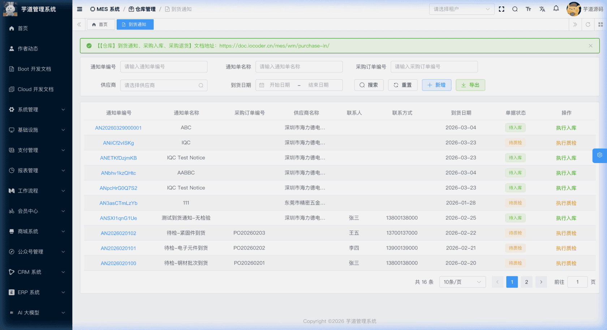 
#### # 新增
点击【新增】按钮，弹出到货通知新增表单。主要填写通知单编码（可自动生成）、通知单名称、供应商（必填）、采购订单编号、到货日期、联系人/电话。新建成功后弹窗自动切换为编辑模式，在表单下方展示到货行列表。
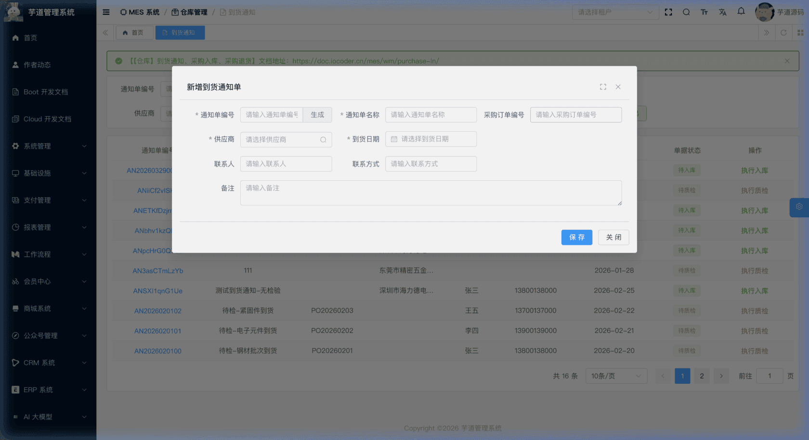 
#### # 修改
点击编码链接或【编辑】按钮（仅草稿状态可编辑），弹出到货通知修改表单。表单下方通过 `el-divider` 分隔展示**到货行**列表。
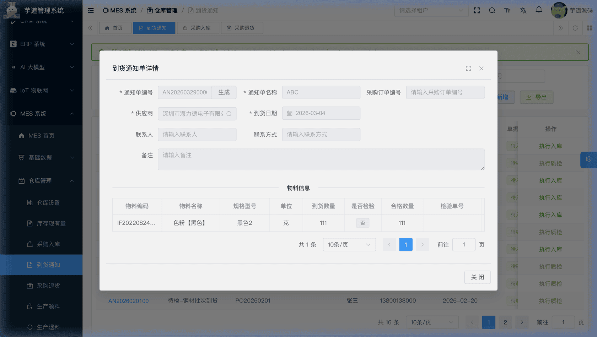 ★ **到货行**（编辑弹窗下方）：由 `mes_wm_arrival_notice_line` 表存储，记录到货物料、数量及来料检验标识。由 MesWmArrivalNoticeLineController 提供接口。
mes_wm_arrival_notice_line 表结构 CREATE TABLE `mes_wm_arrival_notice_line` (
`id` bigint NOT NULL AUTO_INCREMENT COMMENT '编号',
`notice_id` bigint NOT NULL COMMENT '到货通知单编号',
`item_id` bigint NOT NULL COMMENT '物料编号',
`arrival_quantity` decimal(14,2) DEFAULT NULL COMMENT '到货数量',
`iqc_check_flag` bit(1) NOT NULL DEFAULT b'0' COMMENT '是否需要来料检验',
`iqc_id` bigint DEFAULT NULL COMMENT '来料检验单编号',
`qualified_quantity` decimal(14,2) DEFAULT NULL COMMENT '合格数量',
`remark` varchar(500) DEFAULT NULL COMMENT '备注',
PRIMARY KEY (`id`)
) ENGINE=InnoDB COMMENT='MES 到货通知单行';
① `notice_id` 关联主表 `mes_wm_arrival_notice` 的 `id` 字段。
② `item_id` 关联 `mes_md_item` 表的 `id` 字段，标识到货的物料。`arrival_quantity` 为到货数量。
③ `iqc_check_flag` 标识该行物料是否需要来料检验，**新增时由用户填写**。提交到货通知时，系统根据此标识决定状态：
- 若任意行为 `true`（需检验），状态变为「待质检」；
- 若所有行为 `false`（不需检验），状态直接变为「待入库」。
④ `iqc_id` 关联 `mes_qc_iqc` 表的 `id` 字段，标识关联的来料检验单，**仅在 IQC 完成后由系统通过回调自动回写**。`qualified_quantity` 为合格数量，赋值时机分两种情况：
- **免检行**（`iqc_check_flag = false`）：新增或修改到货行时，系统自动将 `qualified_quantity` 初始化为 `arrival_quantity`（即到货数量 = 合格数量）；
- **需检行**（`iqc_check_flag = true`）：在 IQC 完成后，由系统通过 `updateArrivalNoticeLineWhenIqcFinish` 回调自动回写。
#### # 提交
在编辑弹窗中点击【提交】按钮（仅草稿状态下显示）。系统会先检查表单是否有修改（脏检查），有修改则先保存再提交。**提交后主表不可再修改**。
#### # 执行质检
在「待质检」状态下，点击【执行质检】按钮，系统提示前往「质量管理 - 待检任务」进行来料检验操作。每完成一个需检行的 IQC，系统通过 MesWmArrivalNoticeServiceImpl 的 `updateArrivalNoticeWhenIqcFinish` 方法回写该行的 `iqc_id` 和 `qualified_quantity`，并检查是否所有需检行都已完成——**只有全部需检行完成后，主单状态才从「待质检」变为「待入库」**。详见 [《【质量】来料检验 IQC》](/mes/qc/iqc/)。
#### # 执行入库
在「待入库」状态下，点击【执行入库】按钮，系统提示前往「仓库管理 - 采购入库」进行入库操作。采购入库单完成后，系统通过 MesWmArrivalNoticeServiceImpl 的 `finishArrivalNotice` 方法自动将对应的到货通知标记为已完成。详见本文「2. 采购入库」小节。
## # 2. 采购入库
采购入库，由 MesWmItemReceiptController 提供接口。
### # 2.1 表结构
省略 creator/create_time/updater/update_time/deleted/tenant_id 等通用字段
CREATE TABLE `mes_wm_item_receipt` (
`id` bigint NOT NULL AUTO_INCREMENT COMMENT '编号',
`code` varchar(64) NOT NULL COMMENT '入库单编码',
`name` varchar(255) DEFAULT NULL COMMENT '入库单名称',
`iqc_id` bigint DEFAULT NULL COMMENT '来料检验单编号',
`notice_id` bigint DEFAULT NULL COMMENT '到货通知单编号',
`purchase_order_code` varchar(64) DEFAULT NULL COMMENT '采购订单号',
`vendor_id` bigint DEFAULT NULL COMMENT '供应商编号',
`receipt_date` datetime DEFAULT NULL COMMENT '入库日期',
`status` tinyint NOT NULL DEFAULT '0' COMMENT '状态',
`remark` varchar(500) DEFAULT NULL COMMENT '备注',
PRIMARY KEY (`id`)
) ENGINE=InnoDB COMMENT='MES 采购入库单';
① `iqc_id` 关联 `mes_qc_iqc` 表的 `id` 字段，标识关联的来料检验单（选填）。
② `notice_id` 关联 `mes_wm_arrival_notice` 表的 `id` 字段，标识关联的到货通知单（选填，仅显示待入库状态的通知单）。选择后自动带出供应商、采购订单编号等信息。
③ `vendor_id` 关联 `mes_md_vendor` 表的 `id` 字段（必填），标识入库的供应商。
④ `status` 为入库单状态，枚举 MesWmItemReceiptStatusEnum：
| 状态值 | 枚举 | 说明 | 可执行操作 |
| --- | --- | --- | --- |
| 0 | `PREPARE` | 草稿 | 编辑、提交、删除 |
| 2 | `APPROVING` | 待上架 | 执行上架、取消 |
| 3 | `APPROVED` | 待执行入库 | 执行入库、取消 |
| 4 | `FINISHED` | 已完成 | — |
| 5 | `CANCELED` | 已取消 | — |
状态流转说明
创建 ──→ 草稿(0) ──提交──→ 待上架(2) ──上架──→ 待执行入库(3) ──执行入库──→ 已完成(4)
│                                              │
└──取消──→ 已取消(5)                             └── 到货通知变为已完成
- **创建**（`createItemReceipt`）：创建采购入库单，初始状态为草稿。
- **提交**（`submitItemReceipt`）：校验入库行不能为空，状态变为「待上架」。
- **上架**（`stockItemReceipt`）：在「待上架」状态下，为每个入库行添加上架明细（指定仓库/库区/库位和上架数量），校验所有行的上架数量总和等于入库数量后，状态变为「待执行入库」。
- **执行入库**（`finishItemReceipt`）：产生库存事务（IN 入库），更新库存台账（`mes_wm_material_stock`）。同时将关联的到货通知标记为已完成。
- **取消**（`cancelItemReceipt`）：已完成和已取消状态不允许取消，其他状态均可取消。
该表包含两个子表：
- `mes_wm_item_receipt_line`（采购入库行）：在新增/编辑弹窗中维护，记录入库物料和数量。
- `mes_wm_item_receipt_detail`（采购入库明细）：在上架操作中维护，记录具体上架到哪个库位。
### # 2.2 管理后台
对应 [MES 系统 -> 仓库管理 -> 采购入库] 菜单，对应 `yudao-ui-admin-vue3` 项目的 `@/views/mes/wm/itemreceipt` 目录。
#### # 列表
支持按入库单编码、名称、供应商、入库日期等条件搜索。
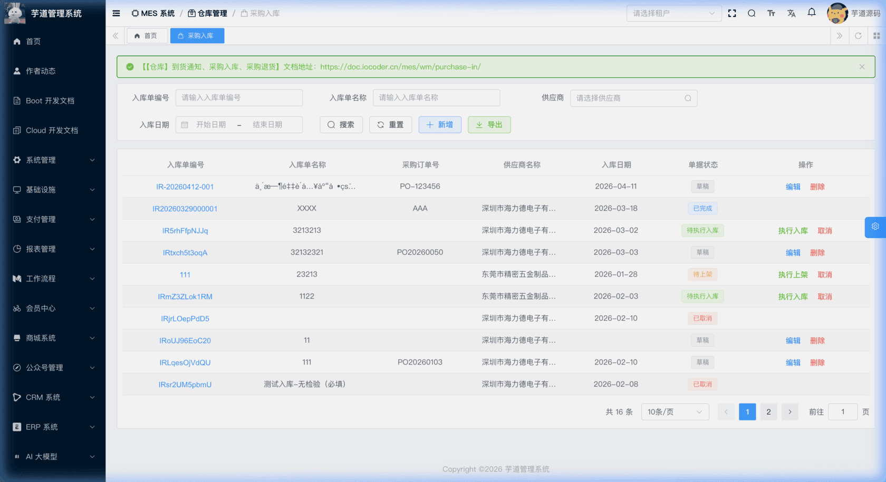 
#### # 新增
点击【新增】按钮，弹出采购入库新增表单。主要填写入库单编码（可自动生成）、入库单名称、到货通知单（选填，级联带出供应商等信息）、供应商（必填）、入库日期。新建成功后弹窗自动切换为编辑模式，在表单下方展示入库行列表。
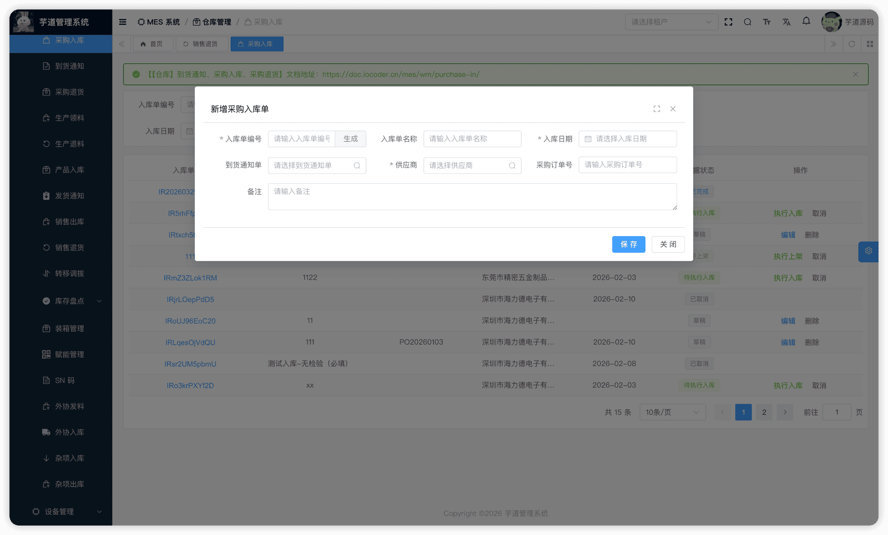 
#### # 修改
点击编码链接或【编辑】按钮（仅草稿状态可编辑），弹出采购入库修改表单。表单下方通过 `el-divider` 分隔展示**入库行**列表。
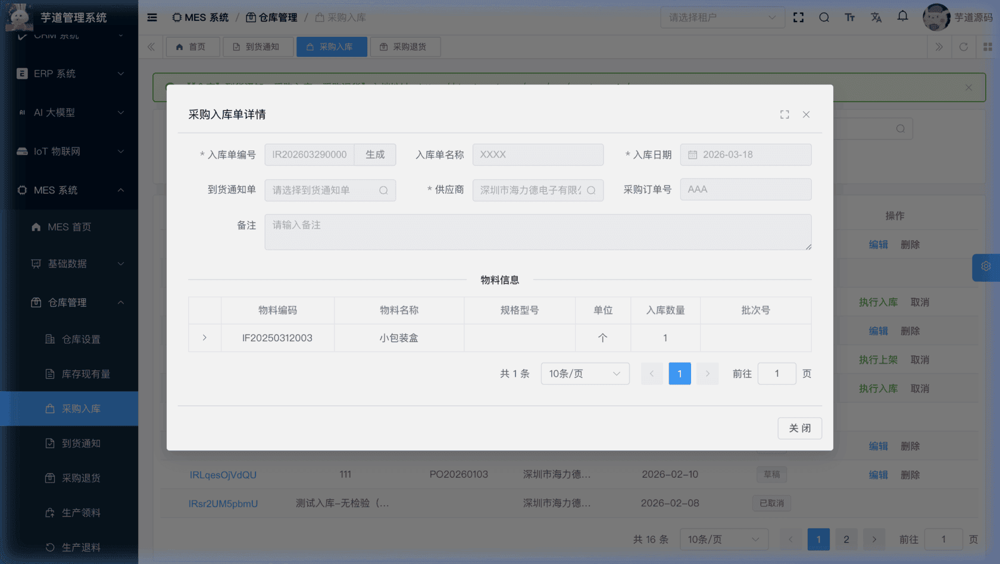 ★ **入库行**（编辑弹窗下方）：由 `mes_wm_item_receipt_line` 表存储，记录入库物料、数量和批次信息。由 MesWmItemReceiptLineController 提供接口。同一个物料如果批次号不同，可拆分为多行分别录入。
mes_wm_item_receipt_line 表结构 CREATE TABLE `mes_wm_item_receipt_line` (
`id` bigint NOT NULL AUTO_INCREMENT COMMENT '编号',
`receipt_id` bigint NOT NULL COMMENT '入库单编号',
`arrival_notice_line_id` bigint DEFAULT NULL COMMENT '到货通知单行编号',
`item_id` bigint NOT NULL COMMENT '物料编号',
`received_quantity` decimal(14,2) DEFAULT NULL COMMENT '入库数量',
`batch_id` bigint DEFAULT NULL COMMENT '批次编号',
`batch_code` varchar(64) DEFAULT NULL COMMENT '批次编码',
`production_date` datetime DEFAULT NULL COMMENT '生产日期',
`expire_date` datetime DEFAULT NULL COMMENT '有效期',
`lot_number` varchar(128) DEFAULT NULL COMMENT '生产批号',
`remark` varchar(500) DEFAULT NULL COMMENT '备注',
PRIMARY KEY (`id`)
) ENGINE=InnoDB COMMENT='MES 采购入库单行';
① `receipt_id` 关联主表 `mes_wm_item_receipt` 的 `id` 字段。`arrival_notice_line_id` 关联 `mes_wm_arrival_notice_line`，用于追溯该入库行源自哪个到货通知行。
② `item_id` 为物料编号，`received_quantity` 为入库数量。
③ `batch_id`、`batch_code` 关联批次管理。`production_date`、`expire_date`、`lot_number` 用于批次生成时的参数输入。
#### # 提交
在编辑弹窗中点击【提交】按钮（仅草稿状态下显示）。系统会先检查表单是否有修改（脏检查），有修改则先保存再提交。**提交后主表不可再修改**。
#### # 上架
在「待上架」状态下，点击【执行上架】按钮，为每个入库行添加上架明细，指定仓库/库区/库位和上架数量。支持同一物料分配到多个库位。系统校验所有行的上架数量总和等于入库数量后，状态变为「待执行入库」。
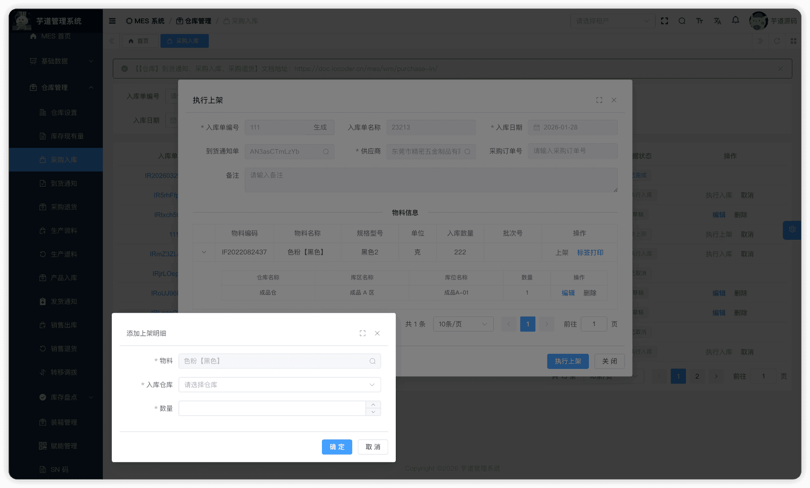 ★ **上架明细**（上架弹窗中）：由 `mes_wm_item_receipt_detail` 表存储，记录具体上架到哪个库位。由 MesWmItemReceiptDetailController 提供接口。
mes_wm_item_receipt_detail 表结构 CREATE TABLE `mes_wm_item_receipt_detail` (
`id` bigint NOT NULL AUTO_INCREMENT COMMENT '编号',
`line_id` bigint NOT NULL COMMENT '入库单行编号',
`receipt_id` bigint NOT NULL COMMENT '入库单编号',
`item_id` bigint NOT NULL COMMENT '物料编号',
`quantity` decimal(14,2) DEFAULT NULL COMMENT '上架数量',
`batch_id` bigint DEFAULT NULL COMMENT '批次编号',
`warehouse_id` bigint DEFAULT NULL COMMENT '仓库编号',
`location_id` bigint DEFAULT NULL COMMENT '库区编号',
`area_id` bigint DEFAULT NULL COMMENT '库位编号',
`remark` varchar(500) DEFAULT NULL COMMENT '备注',
PRIMARY KEY (`id`)
) ENGINE=InnoDB COMMENT='MES 采购入库明细';
① `line_id` 关联入库行 `mes_wm_item_receipt_line` 的 `id` 字段。`receipt_id` 关联主表 `mes_wm_item_receipt` 的 `id` 字段（冗余字段，便于按入库单查询所有明细）。一个入库行可以对应多个明细（同一物料上架到不同库位）。
② `item_id` 为物料编号，从入库行继承。`quantity` 为上架数量。所有明细的 `quantity` 之和必须等于入库行的 `received_quantity`。
③ `batch_id` 为批次编号，从入库行继承。
④ `warehouse_id`、`location_id`、`area_id` 分别关联仓库、库区、库位，指定具体上架位置。
#### # 执行入库
在「待执行入库」状态下，点击【执行入库】按钮。系统通过 MesWmItemReceiptServiceImpl 的 `finishItemReceipt` 方法产生库存事务（IN 入库），更新库存台账，同时将关联的到货通知标记为已完成。
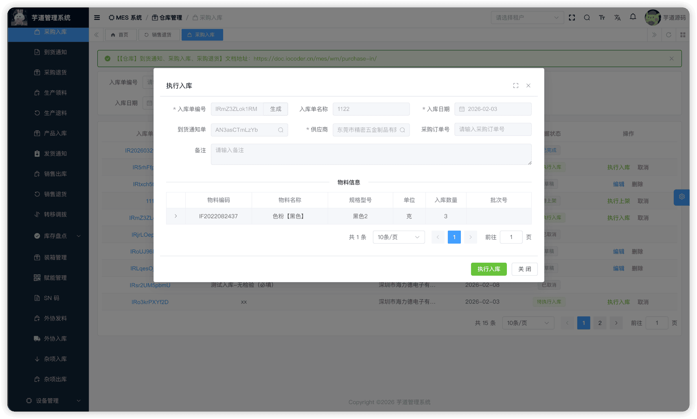 
#### # 取消
在列表页点击【取消】按钮（已完成和已取消状态不允许取消，其他状态均可取消），需二次确认。取消后不可恢复。
## # 3. 供应商退货
供应商退货（采购退货），由 MesWmReturnVendorController 提供接口。
### # 3.1 表结构
省略 creator/create_time/updater/update_time/deleted/tenant_id 等通用字段
CREATE TABLE `mes_wm_return_vendor` (
`id` bigint NOT NULL AUTO_INCREMENT COMMENT '编号',
`code` varchar(64) DEFAULT '' COMMENT '退货单编号',
`name` varchar(255) DEFAULT '' COMMENT '退货单名称',
`purchase_order_code` varchar(64) DEFAULT '' COMMENT '采购订单编号',
`vendor_id` bigint DEFAULT NULL COMMENT '供应商ID',
`return_date` datetime DEFAULT NULL COMMENT '退货日期',
`return_reason` varchar(255) DEFAULT '' COMMENT '退货原因',
`transport_code` varchar(128) DEFAULT '' COMMENT '物流单号',
`transport_telephone` varchar(128) DEFAULT '' COMMENT '物流联系电话',
`status` int NOT NULL DEFAULT '0' COMMENT '状态',
`remark` varchar(500) DEFAULT NULL COMMENT '备注',
PRIMARY KEY (`id`)
) ENGINE=InnoDB COMMENT='MES 供应商退货单';
① `vendor_id` 关联 `mes_md_vendor` 表的 `id` 字段（必填）。
② `status` 为退货单状态，枚举 MesWmReturnVendorStatusEnum：
| 状态值 | 枚举 | 说明 | 可执行操作 |
| --- | --- | --- | --- |
| 0 | `PREPARE` | 草稿 | 编辑、提交、删除 |
| 2 | `APPROVING` | 待拣货 | 执行拣货、取消 |
| 3 | `APPROVED` | 待执行退货 | 完成退货、取消 |
| 4 | `FINISHED` | 已完成 | — |
| 5 | `CANCELED` | 已取消 | — |
状态流转说明
创建 ──→ 草稿(0) ──提交──→ 待拣货(2) ──拣货──→ 待执行退货(3) ──执行退货──→ 已完成(4)
│
└──取消──→ 已取消(5)
- **创建**（`createReturnVendor`）：创建供应商退货单，初始状态为草稿。
- **提交**（`submitReturnVendor`）：校验退货行不能为空，状态变为「待拣货」。
- **拣货**（`stockReturnVendor`）：在「待拣货」状态下，为每个退货行添加拣货明细（指定库存记录、仓库/库区/库位和拣货数量）。后端仅校验主表状态，状态变为「待执行退货」。拣货数量匹配校验通过独立接口 `checkReturnVendorQuantity` 在前端完成。
- **执行退货**（`finishReturnVendor`）：产生库存事务（OUT 出库），扣减库存台账（`mes_wm_material_stock`）。
- **取消**（`cancelReturnVendor`）：已完成和已取消状态不允许取消，其他状态均可取消。
该表包含两个子表：
- `mes_wm_return_vendor_line`（供应商退货行）：在新增/编辑弹窗中维护，记录退货物料和数量。
- `mes_wm_return_vendor_detail`（供应商退货明细）：在拣货操作中维护，记录从哪个库位拣货。
### # 3.2 管理后台
对应 [MES 系统 -> 仓库管理 -> 供应商退货] 菜单，对应 `yudao-ui-admin-vue3` 项目的 `@/views/mes/wm/returnvendor` 目录。
#### # 列表
支持按退货单编码、名称、采购订单编号、供应商等条件搜索。
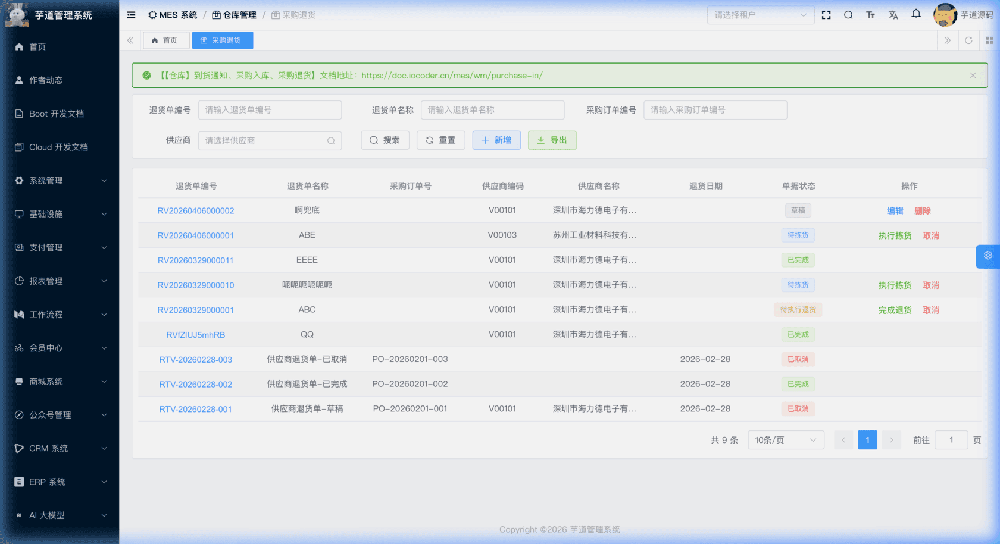 
#### # 新增
点击【新增】按钮，弹出供应商退货新增表单。主要填写退货单编码（可自动生成）、退货单名称、供应商（必填）、采购订单编号、退货日期、退货原因。新建成功后弹窗自动切换为编辑模式，在表单下方展示退货行列表。
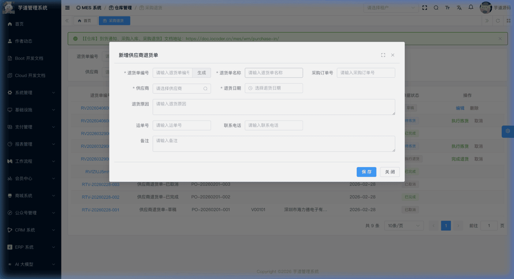 
#### # 修改
点击编码链接或【编辑】按钮（仅草稿状态可编辑），弹出供应商退货修改表单。表单下方通过 `el-divider` 分隔展示**退货行**列表。
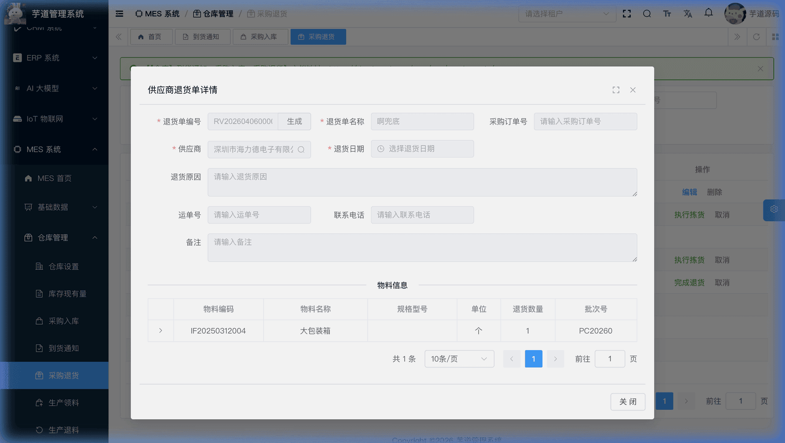 ★ **退货行**（编辑弹窗下方）：由 `mes_wm_return_vendor_line` 表存储，记录退货物料、数量和批次信息。由 MesWmReturnVendorLineController 提供接口。
mes_wm_return_vendor_line 表结构 CREATE TABLE `mes_wm_return_vendor_line` (
`id` bigint NOT NULL AUTO_INCREMENT COMMENT '编号',
`return_id` bigint NOT NULL COMMENT '退货单ID',
`item_id` bigint NOT NULL COMMENT '物料ID',
`quantity` decimal(12,2) NOT NULL DEFAULT '0.00' COMMENT '退货数量',
`batch_id` bigint DEFAULT NULL COMMENT '批次ID',
`batch_code` varchar(64) DEFAULT NULL COMMENT '批次号',
`remark` varchar(500) DEFAULT NULL COMMENT '备注',
PRIMARY KEY (`id`)
) ENGINE=InnoDB COMMENT='MES 供应商退货单行';
① `return_id` 关联主表 `mes_wm_return_vendor` 的 `id` 字段。
② `item_id` 为退货物料，`quantity` 为退货数量。
③ `batch_id`、`batch_code` 关联批次管理。
#### # 提交
在编辑弹窗中点击【提交】按钮（仅草稿状态下显示）。系统会先检查表单是否有修改（脏检查），有修改则先保存再提交。**提交后主表不可再修改**。
#### # 拣货
在「待拣货」状态下，点击【执行拣货】按钮，为每个退货行添加拣货明细。从现有库存中选择库存记录（当前弹窗默认按物料过滤，供应商可在库存选择弹窗中手动筛选），指定拣货数量。支持从多个库位拣货。
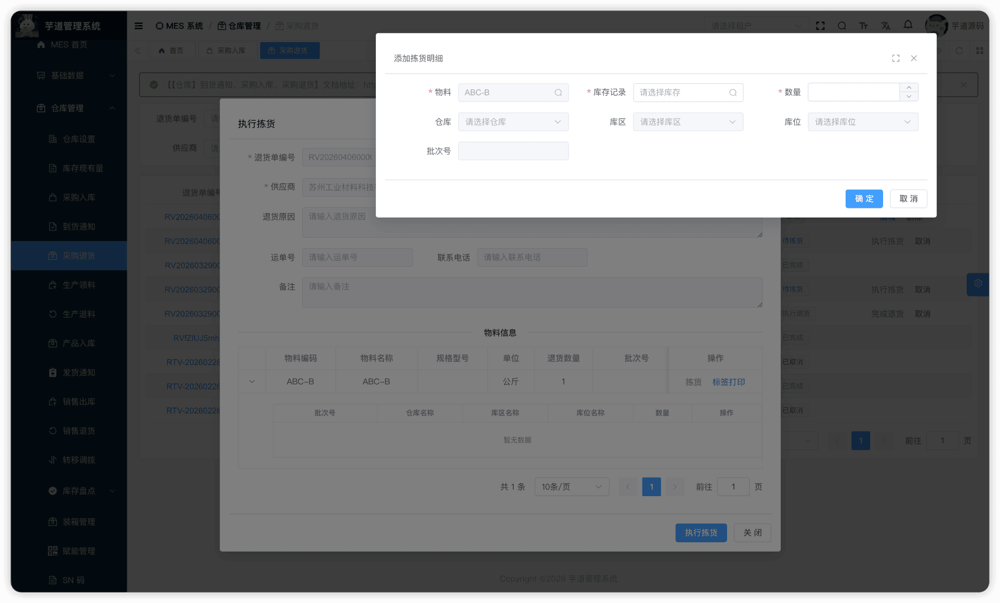 ★ **拣货明细**（拣货弹窗中）：由 `mes_wm_return_vendor_detail` 表存储，记录从哪个库位拣货。由 MesWmReturnVendorDetailController 提供接口。
mes_wm_return_vendor_detail 表结构 CREATE TABLE `mes_wm_return_vendor_detail` (
`id` bigint NOT NULL AUTO_INCREMENT COMMENT '编号',
`line_id` bigint NOT NULL COMMENT '行ID',
`return_id` bigint NOT NULL COMMENT '退货单ID',
`material_stock_id` bigint DEFAULT NULL COMMENT '库存记录ID',
`item_id` bigint NOT NULL COMMENT '物料ID',
`quantity` decimal(12,2) NOT NULL DEFAULT '0.00' COMMENT '退货数量',
`batch_id` bigint DEFAULT NULL COMMENT '批次ID',
`batch_code` varchar(255) DEFAULT '' COMMENT '批次号',
`warehouse_id` bigint DEFAULT NULL COMMENT '仓库ID',
`location_id` bigint DEFAULT NULL COMMENT '库区ID',
`area_id` bigint DEFAULT NULL COMMENT '库位ID',
`remark` varchar(500) DEFAULT NULL COMMENT '备注',
PRIMARY KEY (`id`)
) ENGINE=InnoDB COMMENT='MES 供应商退货明细';
① `line_id` 关联退货行 `mes_wm_return_vendor_line` 的 `id` 字段。`return_id` 关联主表 `mes_wm_return_vendor` 的 `id` 字段（冗余字段，便于按退货单查询所有明细）。
② `material_stock_id` 关联 `mes_wm_material_stock` 表的 `id` 字段，标识从哪个库存记录中扣减库存。拣货时需要从现有库存中选择。
③ `item_id` 为物料编号，从退货行继承。`quantity` 为拣货数量。`batch_id`、`batch_code` 为批次信息，从退货行继承。
④ `warehouse_id`、`location_id`、`area_id` 指定拣货的仓库/库区/库位位置。
#### # 完成退货
在「待执行退货」状态下，点击【完成退货】按钮。系统通过 MesWmReturnVendorServiceImpl 的 `finishReturnVendor` 方法产生库存事务（OUT 出库），扣减库存台账。
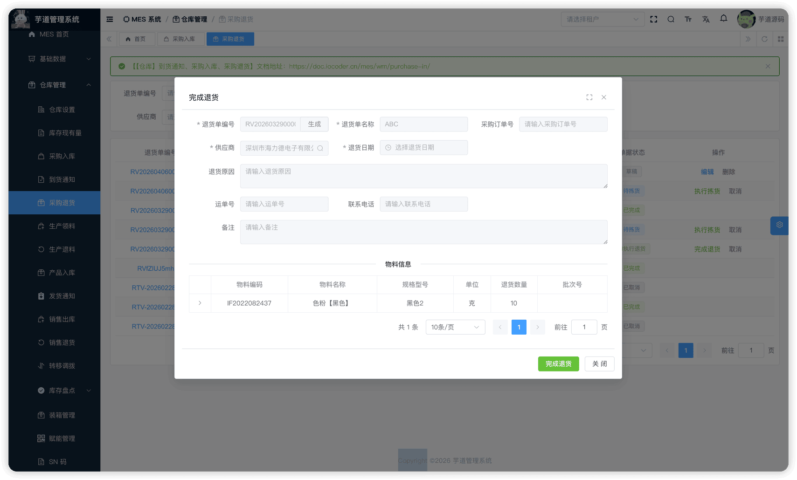 
#### # 取消
在列表页点击【取消】按钮（已完成和已取消状态不允许取消，其他状态均可取消），需二次确认。取消后不可恢复。
## # 4. 采购收货链路总览
端到端业务流程
供应商到货 → 到货通知(草稿) → 提交
│
┌──需检验──→ 待质检 → IQC检验 → 待入库
│
└──不需检验──→ 待入库
│
└→ 采购入库(草稿) → 提交 → 待上架 → 上架 → 待执行入库 → 执行入库 → 已完成
│
└→ 到货通知 → 已完成
│
┌────────────────────────────────────────────────
│
退货流程   ← 供应商退货(草稿) → 提交 → 待拣货 → 拣货 → 待执行退货 → 执行退货 → 已完成
- **到货通知**是采购入库的前置环节，通过 `notice_id` 关联。
- **IQC 来料检验**是可选环节，由到货行的 `iqc_check_flag` 控制。
- **采购入库**执行入库时，通过库存事务引擎写入 `IN` 类型事务，更新库存台账。
- **供应商退货**执行退货时，通过库存事务引擎写入 `OUT` 类型事务，扣减库存台账。
.pageB img{width:80px!important;}
.wwads-horizontal .wwads-text, .wwads-content .wwads-text{line-height:1;}
[【仓库】批次管理、库存现有量、库存事务](/mes/wm/stock/) [【仓库】生产领料、生产退料、物料消耗](/mes/wm/issue-return/) 
←
[【仓库】批次管理、库存现有量、库存事务](/mes/wm/stock/) [【仓库】生产领料、生产退料、物料消耗](/mes/wm/issue-return/)→
 
Theme by
[Vdoing](https://github.com/xugaoyi/vuepress-theme-vdoing) 
| Copyright © 2019-2026
芋道源码 | MIT License   
- 跟随系统
- 浅色模式
- 深色模式
- 阅读模式
× 
.windowRB{ padding: 0;}
.windowRB .wwads-img{margin-top: 10px;}
.windowRB .wwads-content{margin: 0 10px 10px 10px;}
.custom-html-window-rb .close-but{
display: none;
}