# 【仓库】发货通知、销售出库、销售退货

销售出库模块，由 `yudao-module-mes` 后端模块的 `wm.salesnotice`、`wm.productsales`、`wm.returnsales` 包实现，覆盖产品从发货通知、出厂质检、拣货出库到销售退货入库的**完整销售出库链路**。
本文涉及三个子模块：
- **发货通知**：记录客户的发货需求信息，是销售出库的前置环节。
- **销售出库**：将发货通知中的产品从仓库拣货出库，采用**行+明细**的双层结构——行表记录出库物料和数量，明细表记录从哪个库位拣货。支持 OQC 出货检验流程。
- **销售退货**：客户退回的产品重新入库，同样采用行+明细的双层结构。支持 RQC 退料检验流程。
本文涉及表如下图所示：
 
## # 1. 发货通知
发货通知，由 MesWmSalesNoticeController 提供接口。
### # 1.1 表结构
省略 creator/create_time/updater/update_time/deleted/tenant_id 等通用字段
CREATE TABLE `mes_wm_sales_notice` (
`id` bigint NOT NULL AUTO_INCREMENT COMMENT '编号',
`code` varchar(64) NOT NULL COMMENT '通知单编码',
`name` varchar(255) NOT NULL COMMENT '通知单名称',
`sales_order_code` varchar(64) DEFAULT NULL COMMENT '销售订单编号',
`client_id` bigint DEFAULT NULL COMMENT '客户ID',
`sales_date` date DEFAULT NULL COMMENT '发货日期',
`recipient_name` varchar(64) DEFAULT NULL COMMENT '收货人',
`recipient_telephone` varchar(20) DEFAULT NULL COMMENT '联系方式',
`recipient_address` varchar(500) DEFAULT NULL COMMENT '收货地址',
`status` tinyint NOT NULL DEFAULT '0' COMMENT '状态',
`remark` varchar(500) DEFAULT NULL COMMENT '备注',
PRIMARY KEY (`id`)
) ENGINE=InnoDB COMMENT='MES 发货通知单';
① `client_id` 关联 `mes_md_client` 表的 `id` 字段，DDL 允许为空但**保存接口要求必填**。`sales_date` 为发货日期（`date` 类型），同样 DDL 允许为空但保存接口要求必填。
② `status` 为发货通知单状态，枚举 MesWmSalesNoticeStatusEnum：
| 状态值 | 枚举 | 说明 | 可执行操作 |
| --- | --- | --- | --- |
| 0 | `PREPARE` | 草稿 | 编辑、提交、删除 |
| 3 | `APPROVED` | 待出库 | —（等待销售出库单关联） |
状态流转说明
创建 ──→ 草稿(0) ──提交──→ 待出库(3)
- **创建**（`createSalesNotice`）：创建发货通知单，初始状态为草稿。
- **提交**（`submitSalesNotice`）：校验发货行不能为空，状态变为「待出库」。提交后不可再修改。
该表包含一个子表：
- `mes_wm_sales_notice_line`（发货通知行）：在新增/编辑弹窗中维护，记录发货物料、数量和批次信息。
### # 1.2 管理后台
对应 [MES 系统 -> 仓库管理 -> 发货通知] 菜单，对应 `yudao-ui-admin-vue3` 项目的 `@/views/mes/wm/salesnotice` 目录。
#### # 列表
支持按通知单编码、名称、销售订单编号、客户等条件搜索。
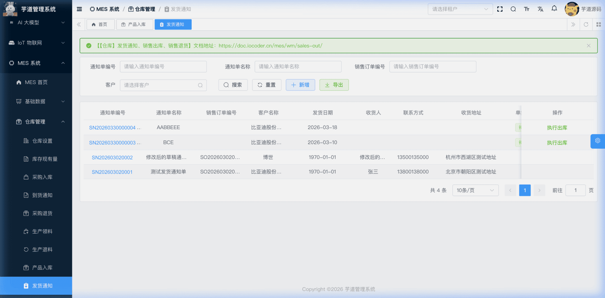 
#### # 新增
点击【新增】按钮，弹出发货通知新增表单。主要填写通知单编码（可自动生成）、通知单名称、客户（必填）、销售订单编号、发货日期、收货人/联系方式/收货地址。**新建成功后弹窗保持打开，自动切换为编辑模式**，下方展示发货行区域可继续维护。
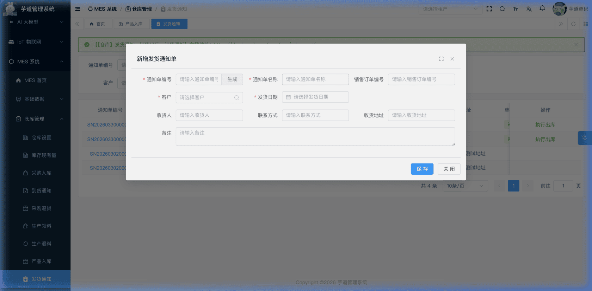 
#### # 修改
在列表的操作列点击【编辑】按钮（仅草稿状态显示），弹出发货通知修改表单。表单下方通过 `el-divider` 分隔展示**发货行**列表（只有保存后、`formData.id` 不为空时才渲染发货行区域）。点击列表中的通知单编码链接则进入**查看**模式（`formType = 'detail'`），只读展示主表信息和发货行列表，不可编辑。
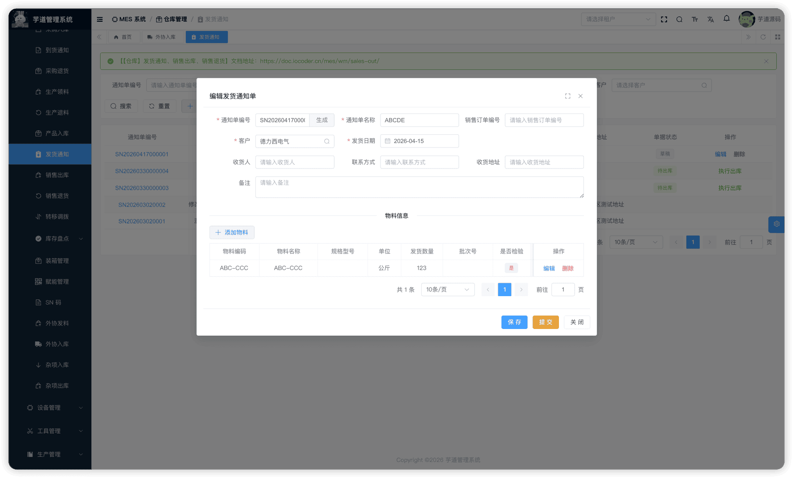 ★ **发货行**（编辑弹窗下方）：由 `mes_wm_sales_notice_line` 表存储，记录发货物料、数量、批次及 OQC 检验标识。由 MesWmSalesNoticeLineController 提供接口。
mes_wm_sales_notice_line 表结构 CREATE TABLE `mes_wm_sales_notice_line` (
`id` bigint NOT NULL AUTO_INCREMENT COMMENT '编号',
`notice_id` bigint NOT NULL COMMENT '发货通知单编号',
`item_id` bigint NOT NULL COMMENT '物料编号',
`quantity` decimal(12,2) NOT NULL COMMENT '发货数量',
`batch_id` bigint DEFAULT NULL COMMENT '批次编号',
`batch_code` varchar(64) DEFAULT NULL COMMENT '批次号',
`oqc_check_flag` bit(1) NOT NULL DEFAULT b'1' COMMENT '是否需要出货检验',
`remark` varchar(500) DEFAULT NULL COMMENT '备注',
PRIMARY KEY (`id`)
) ENGINE=InnoDB COMMENT='MES 发货通知单行';
① `notice_id` 关联主表 `mes_wm_sales_notice` 的 `id` 字段。
② `item_id` 关联 `mes_md_item` 表的 `id` 字段，标识发货的物料。`quantity` 为发货数量。
③ `batch_id`、`batch_code` 关联批次管理。
④ `oqc_check_flag` 标识该行物料是否需要出货检验（OQC），**新增时由用户填写**，默认为 `true`（需要检验）。该标识会传递到销售出库单行，在出库单提交时决定是否进入 OQC 检验流程。
#### # 提交
在编辑弹窗中点击【提交】按钮（仅草稿状态且 `formData.id` 不为空时显示）。**提交后主表不可再修改**。
## # 2. 销售出库
销售出库，由 MesWmProductSalesController 提供接口。
### # 2.1 表结构
省略 creator/create_time/updater/update_time/deleted/tenant_id 等通用字段
CREATE TABLE `mes_wm_product_sales` (
`id` bigint NOT NULL AUTO_INCREMENT COMMENT '编号',
`code` varchar(50) NOT NULL COMMENT '出库单编码',
`name` varchar(100) NOT NULL COMMENT '出库单名称',
`client_id` bigint NOT NULL COMMENT '客户ID',
`sales_order_code` varchar(50) DEFAULT NULL COMMENT '销售订单编号',
`notice_id` bigint DEFAULT NULL COMMENT '发货通知单ID',
`sales_date` datetime NOT NULL COMMENT '出库日期',
`contact_name` varchar(50) DEFAULT NULL COMMENT '联系人',
`contact_telephone` varchar(20) DEFAULT NULL COMMENT '联系电话',
`contact_address` varchar(500) DEFAULT NULL COMMENT '收货地址',
`carrier` varchar(100) DEFAULT NULL COMMENT '承运商',
`shipping_number` varchar(50) DEFAULT NULL COMMENT '运输单号',
`status` tinyint NOT NULL DEFAULT '0' COMMENT '状态',
`remark` varchar(500) DEFAULT NULL COMMENT '备注',
PRIMARY KEY (`id`)
) ENGINE=InnoDB COMMENT='MES 销售出库单';
① `client_id` 关联 `mes_md_client` 表的 `id` 字段（必填）。`notice_id` 关联 `mes_wm_sales_notice` 表的 `id` 字段（选填，级联带出客户等信息）。创建时校验发货通知单必须为「待出库」状态且客户一致。
② `carrier` 为承运商，`shipping_number` 为运输单号，**在「待填写运单」状态下由用户填写**。
③ `status` 为出库单状态，枚举 MesWmProductSalesStatusEnum：
| 状态值 | 枚举 | 说明 | 可执行操作 |
| --- | --- | --- | --- |
| 0 | `PREPARE` | 草稿 | 编辑、提交、删除 |
| 1 | `CONFIRMED` | 待检测 | 执行质检（跳转至质量管理模块）、取消 |
| 2 | `APPROVING` | 待拣货 | 执行拣货、取消 |
| 10 | `SHIPPING` | 待填写运单 | 填写运单、取消 |
| 3 | `APPROVED` | 待执行出库 | 执行出库、取消 |
| 4 | `FINISHED` | 已完成 | — |
| 5 | `CANCELED` | 已取消 | — |
状态流转说明
创建 ──→ 草稿(0) ──提交──→ 待检测(1) ──确认检验──→ 待拣货(2) ──拣货──→ 待填写运单(10) ──填写运单──→ 待执行出库(3) ──执行出库──→ 已完成(4)
│                                                                                         │
└──不需检验─────────────────→ 待拣货(2)                                                       └──取消──→ 已取消(5)
- **创建**（`createProductSales`）：创建销售出库单，初始状态为草稿。
- **提交**（`submitProductSales`）：校验出库行不能为空且每行数量 > 0。根据行的 `oqcCheckFlag` 决定状态： 若任意行为 `true`（需 OQC 检验），状态变为「待检测」，同时将需检验行的 `qualityStatus` 初始化为「待检验」；
- 若所有行为 `false`（不需检验），状态直接变为「待拣货」。
**OQC 完成回调**（`confirmProductSales`）：OQC 检验完成后由系统自动调用。若所有需检验行都通过，状态从「待检测」变为「待拣货」；若任一行不合格，**直接取消整张出库单**（`cancelProductSales`）。 **拣货**（`stockProductSales`）：在「待拣货」状态下，为每个出库行添加拣货明细（指定库存记录、仓库/库区/库位和拣货数量），校验每行都有拣货明细后，状态变为「待填写运单」。 **填写运单**（`shippingProductSales`）：填写承运商和运输单号，状态变为「待执行出库」。 **执行出库**（`finishProductSales`）：产生库存事务（OUT 出库），扣减库存台账（`mes_wm_material_stock`）。 **取消**（`cancelProductSales`）：已完成和已取消状态不允许取消，其他状态均可取消。  
该表包含两个子表：
- `mes_wm_product_sales_line`（销售出库行）：在新增/编辑弹窗中维护，记录出库物料和数量。
- `mes_wm_product_sales_detail`（销售出库明细）：在拣货操作中维护，记录从哪个库位拣货。
### # 2.2 管理后台
对应 [MES 系统 -> 仓库管理 -> 销售出库] 菜单，对应 `yudao-ui-admin-vue3` 项目的 `@/views/mes/wm/productsales` 目录。
#### # 列表
支持按出库单编码、名称、销售订单编号、客户、出库日期、状态等条件搜索。
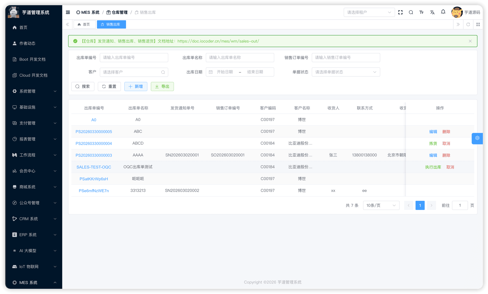 
#### # 新增
点击【新增】按钮，弹出销售出库新增表单。主要填写出库单编码（可自动生成）、出库单名称、发货通知单（选填，级联带出客户等信息）、客户（必填）、销售订单编号、出库日期。**新建成功后弹窗保持打开，自动切换为编辑模式**，下方展示出库行区域可继续维护。
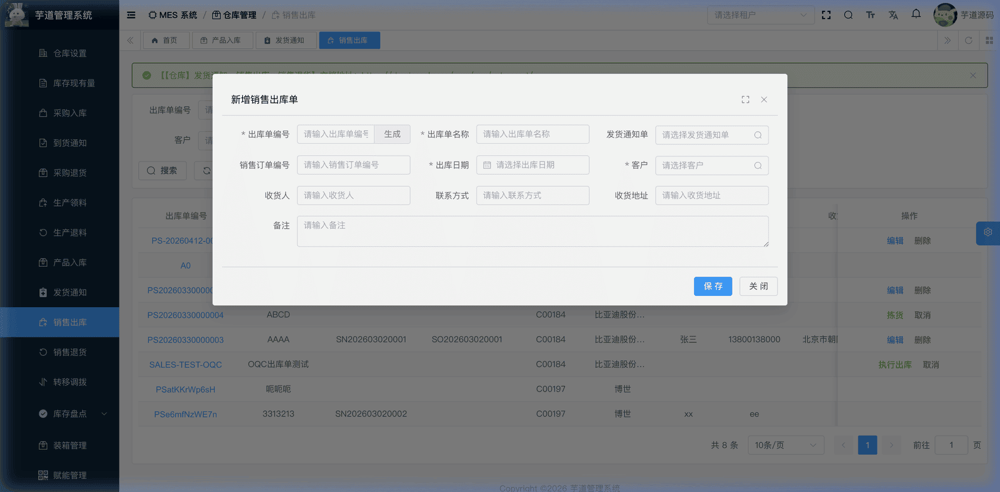 
#### # 修改
在列表的操作列点击【编辑】按钮（仅草稿状态显示），弹出销售出库修改表单。表单下方通过 `el-divider` 分隔展示**出库行**列表（只有保存后、`formData.id` 不为空时才渲染出库行区域）。点击列表中的出库单编码链接则进入**查看**模式（`formType = 'detail'`），只读展示主表信息和出库行/明细列表，不可编辑。
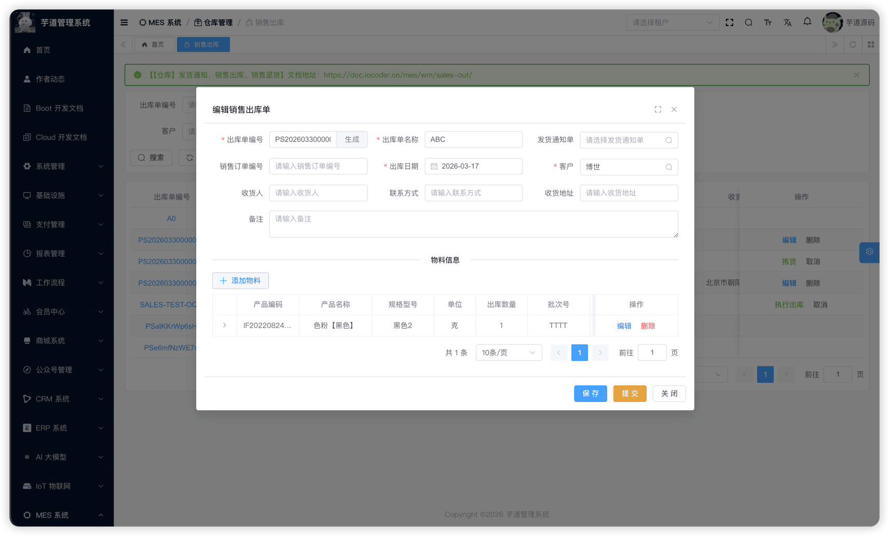 ★ **出库行**（编辑弹窗下方）：由 `mes_wm_product_sales_line` 表存储，记录出库物料、数量、批次及 OQC 检验信息。由 MesWmProductSalesLineController 提供接口。
关联发货通知单时的出库行约束
当销售出库单通过 `notice_id` 关联了发货通知单后，出库行**受源通知行约束**，不是自由录入。具体校验逻辑见 MesWmProductSalesLineServiceImpl 的 `validateSalesNoticeLine` 方法：
- 出库行**必须**关联 `notice_line_id`（发货通知单行 ID）；
- `item_id`（物料）必须与源通知行一致；
- `quantity`（数量）必须与源通知行一致；
- `batch_code`（批次号）必须与源通知行一致（如果源通知行有批次号）；
- `oqc_check_flag`（OQC 检验标识）必须与源通知行一致。
反之，如果出库单**未关联**发货通知单，则出库行不允许填写 `notice_line_id`。
mes_wm_product_sales_line 表结构 CREATE TABLE `mes_wm_product_sales_line` (
`id` bigint NOT NULL AUTO_INCREMENT COMMENT '编号',
`sales_id` bigint NOT NULL COMMENT '出库单ID',
`notice_line_id` bigint DEFAULT NULL COMMENT '发货通知单行ID',
`item_id` bigint NOT NULL COMMENT '物料ID',
`quantity` decimal(20,6) NOT NULL COMMENT '出库数量',
`batch_id` bigint DEFAULT NULL COMMENT '批次ID',
`batch_code` varchar(64) DEFAULT NULL COMMENT '批次号',
`material_stock_id` bigint DEFAULT NULL COMMENT '库存记录ID',
`oqc_check_flag` tinyint(1) DEFAULT NULL COMMENT '是否需要出货检验',
`oqc_id` bigint DEFAULT NULL COMMENT '出货检验单ID',
`quality_status` int DEFAULT NULL COMMENT '质量状态',
`remark` varchar(500) DEFAULT NULL COMMENT '备注',
PRIMARY KEY (`id`)
) ENGINE=InnoDB COMMENT='MES 销售出库单行';
① `sales_id` 关联主表 `mes_wm_product_sales` 的 `id` 字段。`notice_line_id` 关联 `mes_wm_sales_notice_line`，用于追溯该出库行源自哪个发货通知行。
② `item_id` 为物料编号，`quantity` 为出库数量。
③ `batch_id`、`batch_code` 关联批次管理。`material_stock_id` 关联 `mes_wm_material_stock`。
④ `oqc_check_flag` 标识该行是否需要 OQC 出货检验，**新增时由用户填写**（可从发货通知行继承）。提交出库单时，系统根据此标识决定状态：
- 若任意行为 `true`（需检验），主表状态变为「待检测」；
- 若所有行为 `false`（不需检验），主表状态直接变为「待拣货」。
⑤ `oqc_id` 关联 `mes_qc_oqc` 表的 `id` 字段，标识关联的出货检验单。`quality_status` 为质量状态，枚举 MesWmQualityStatusEnum（0=待检验，1=合格，2=不合格）。**两者均在 OQC 完成后由系统通过回调自动回写**——回调方法为 MesWmProductSalesLineServiceImpl 的 `updateProductSalesLineWhenOqcFinish`，同时回写 `oqcId` 和 `qualityStatus`。
#### # 提交
在编辑弹窗中点击【提交】按钮（仅草稿状态时显示）。**提交后主表不可再修改**。
#### # 执行质检
在「待检测」状态下，点击【执行质检】按钮，系统提示前往「质量管理 - 待检任务」进行出货检验操作。OQC 完成后系统通过 MesWmProductSalesLineServiceImpl 的 `updateProductSalesLineWhenOqcFinish` 方法**自动回写并流转**——所有行通过则状态变为「待拣货」，任一行不合格则取消出库单。详见 [《【质量】出货检验 OQC》](/mes/qc/oqc/)。
#### # 拣货
在「待拣货」状态下，点击【执行拣货】按钮，为每个出库行添加拣货明细。从库存清单中选择要出货的物资，指定拣货数量。支持从多个库位拣货。
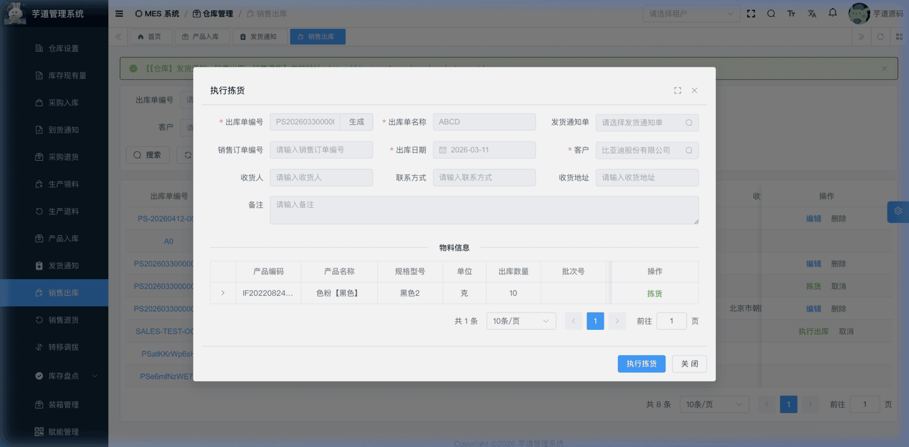 ★ **拣货明细**（拣货弹窗中）：由 `mes_wm_product_sales_detail` 表存储，记录从哪个库位拣货。由 MesWmProductSalesDetailController 提供接口。
mes_wm_product_sales_detail 表结构 CREATE TABLE `mes_wm_product_sales_detail` (
`id` bigint NOT NULL AUTO_INCREMENT COMMENT '编号',
`line_id` bigint NOT NULL COMMENT '出库单行ID',
`sales_id` bigint NOT NULL COMMENT '出库单ID',
`material_stock_id` bigint DEFAULT NULL COMMENT '库存记录ID',
`item_id` bigint NOT NULL COMMENT '物料ID',
`quantity` decimal(20,6) NOT NULL COMMENT '拣货数量',
`batch_id` bigint DEFAULT NULL COMMENT '批次ID',
`batch_code` varchar(64) DEFAULT NULL COMMENT '批次号',
`warehouse_id` bigint NOT NULL COMMENT '仓库ID',
`location_id` bigint DEFAULT NULL COMMENT '库区ID',
`area_id` bigint DEFAULT NULL COMMENT '库位ID',
`remark` varchar(500) DEFAULT NULL COMMENT '备注',
PRIMARY KEY (`id`)
) ENGINE=InnoDB COMMENT='MES 销售出库明细';
① `line_id` 关联出库行 `mes_wm_product_sales_line` 的 `id` 字段。`sales_id` 关联主表 `mes_wm_product_sales` 的 `id` 字段（冗余字段，便于按出库单查询所有明细）。
② `material_stock_id` 关联 `mes_wm_material_stock` 表的 `id` 字段，标识从哪个库存记录中扣减库存。拣货时需要从现有库存中选择。
③ `item_id` 为物料编号，从出库行继承。`quantity` 为拣货数量。`batch_id`、`batch_code` 为批次信息，从出库行继承。
④ `warehouse_id`、`location_id`、`area_id` 指定拣货的仓库/库区/库位位置。
#### # 填写运单
在「待填写运单」状态下，点击【填写运单】按钮，填写承运商和运输单号。系统通过 MesWmProductSalesServiceImpl 的 `shippingProductSales` 方法将状态变为「待执行出库」。
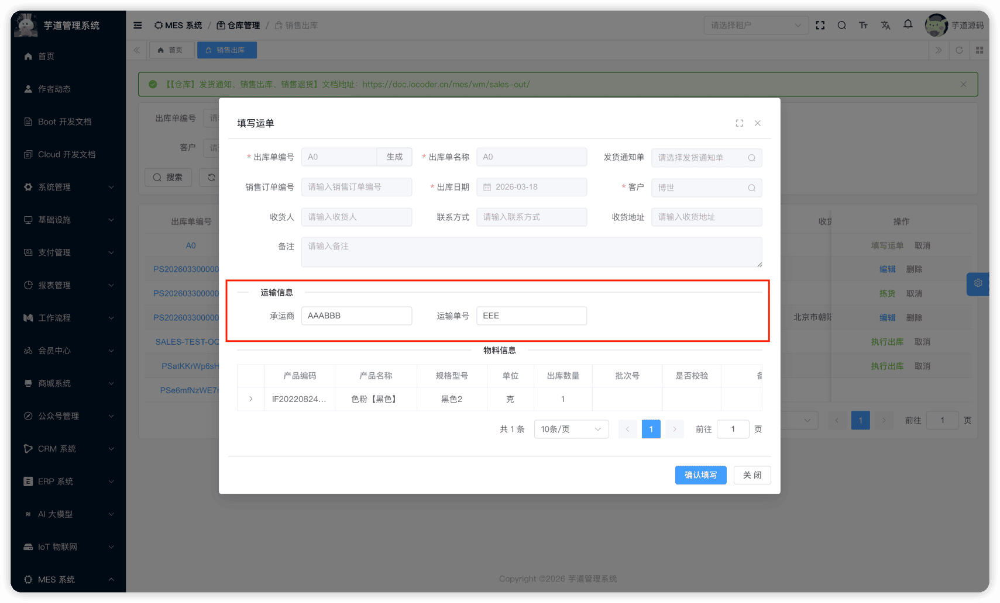 
#### # 执行出库
在「待执行出库」状态下，点击【执行出库】按钮。系统通过 MesWmProductSalesServiceImpl 的 `finishProductSales` 方法产生库存事务（OUT 出库），扣减库存台账。
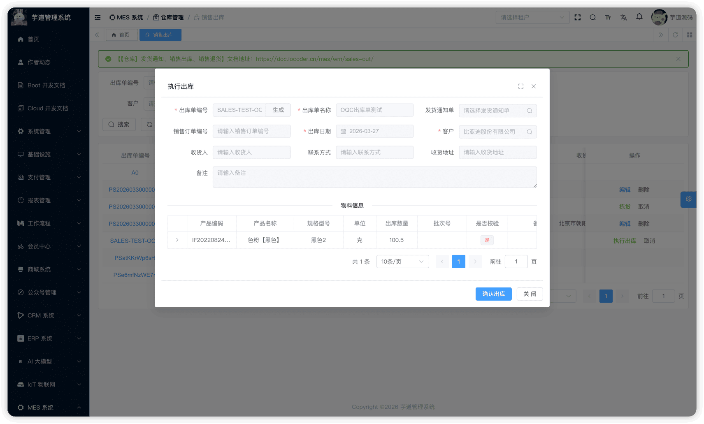 
#### # 取消
在列表页点击【取消】按钮（已完成和已取消状态不允许取消，其他状态均可取消），需二次确认。取消后不可恢复。
## # 3. 销售退货
销售退货，由 MesWmReturnSalesController 提供接口。
### # 3.1 表结构
省略 creator/create_time/updater/update_time/deleted/tenant_id 等通用字段
CREATE TABLE `mes_wm_return_sales` (
`id` bigint NOT NULL AUTO_INCREMENT COMMENT '编号',
`code` varchar(64) NOT NULL COMMENT '退货单编号',
`name` varchar(255) NOT NULL COMMENT '退货单名称',
`sales_order_code` varchar(64) DEFAULT NULL COMMENT '销售订单编号',
`client_id` bigint DEFAULT NULL COMMENT '客户ID',
`return_date` datetime DEFAULT NULL COMMENT '退货日期',
`return_reason` varchar(500) DEFAULT NULL COMMENT '退货原因',
`status` int DEFAULT '0' COMMENT '状态',
`remark` varchar(500) DEFAULT '' COMMENT '备注',
PRIMARY KEY (`id`)
) ENGINE=InnoDB COMMENT='MES 销售退货单';
① `client_id` 关联 `mes_md_client` 表的 `id` 字段，DDL 允许为空但**保存接口要求必填**。
② `status` 为退货单状态，枚举 MesWmReturnSalesStatusEnum：
| 状态值 | 枚举 | 说明 | 可执行操作 |
| --- | --- | --- | --- |
| 0 | `PREPARE` | 草稿 | 编辑、提交、删除 |
| 1 | `CONFIRMED` | 待检验 | 执行检验、取消 |
| 2 | `APPROVING` | 待执行 | 执行退货、取消 |
| 3 | `APPROVED` | 待上架 | 执行上架、取消 |
| 4 | `FINISHED` | 已完成 | — |
| 5 | `CANCELED` | 已取消 | — |
状态流转说明
创建 ──→ 草稿(0) ──提交──→ 待检验(1) ──检验完成──→ 待执行(2) ──执行退货──→ 待上架(3) ──上架──→ 已完成(4)
│                                                                  │
└──不需检验─────────────→ 待执行(2)                                      └──取消──→ 已取消(5)
- **创建**（`createReturnSales`）：创建销售退货单，初始状态为草稿。
- **提交**（`submitReturnSales`）：校验退货行不能为空。根据行的 `qualityStatus` 决定状态： 若任意行为「待检验」状态，主表状态变为「待检验」；
- 若无待检验行，状态直接变为「待执行」。
**执行退货**（`finishReturnSales`）：校验退货行不为空，状态从「待执行」变为「待上架」。 **上架**（`stockReturnSales`）：校验每行的上架明细数量之和不小于退货数量后，产生库存事务（IN 入库），增加库存台账（`mes_wm_material_stock`）。 **取消**（`cancelReturnSales`）：已完成和已取消状态不允许取消，其他状态均可取消。  
该表包含两个子表：
- `mes_wm_return_sales_line`（销售退货行）：在新增/编辑弹窗中维护，记录退货物料和数量。
- `mes_wm_return_sales_detail`（销售退货明细）：在上架操作中维护，记录退货物料上架到哪个库位。
### # 3.2 管理后台
对应 [MES 系统 -> 仓库管理 -> 销售退货] 菜单，对应 `yudao-ui-admin-vue3` 项目的 `@/views/mes/wm/returnsales` 目录。
#### # 列表
支持按退货单编码、名称、销售订单号、客户、状态等条件搜索。
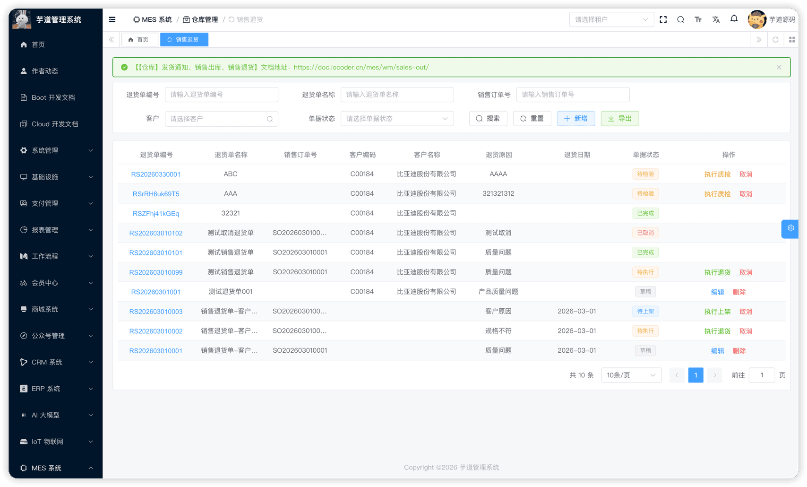 
#### # 新增
点击【新增】按钮，弹出销售退货新增表单。主要填写退货单编码（可自动生成）、退货单名称、客户（必填）、销售订单编号、退货日期、退货原因。**新建成功后弹窗保持打开，自动切换为编辑模式**，下方展示退货行区域可继续维护。
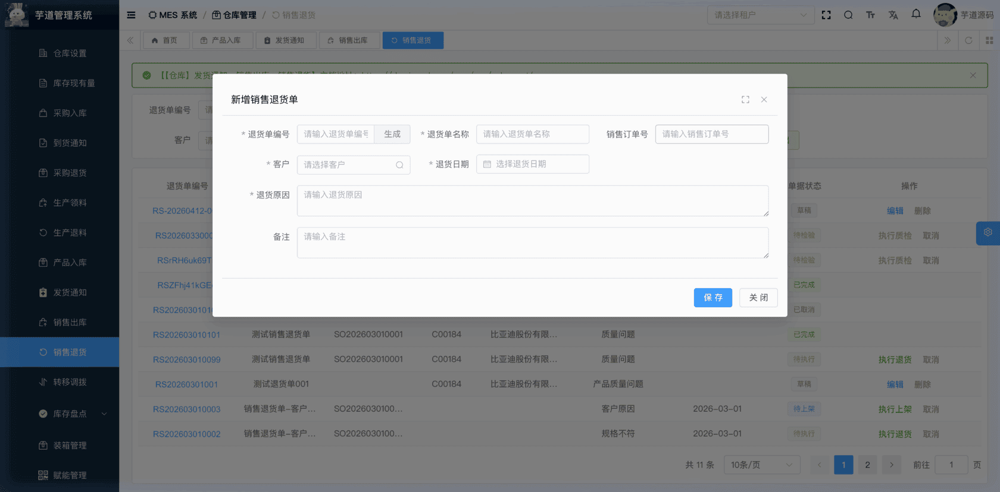 
#### # 修改
在列表的操作列点击【编辑】按钮（仅草稿状态显示），弹出销售退货修改表单。表单下方通过 `el-divider` 分隔展示**退货行**列表（只有保存后、`formData.id` 不为空时才渲染退货行区域）。点击列表中的退货单编码链接则进入**查看**模式（`formType = 'detail'`），只读展示主表信息和退货行/明细列表，不可编辑。
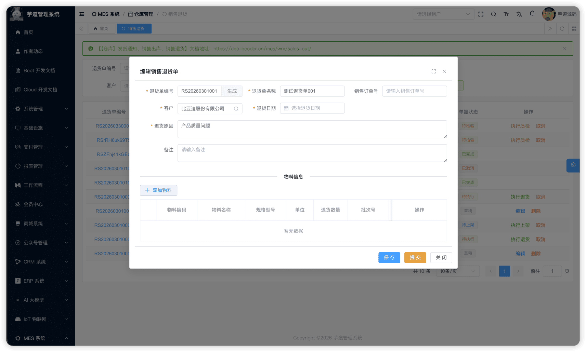 ★ **退货行**（编辑弹窗下方）：由 `mes_wm_return_sales_line` 表存储，记录退货物料、数量及 RQC 检验信息。由 MesWmReturnSalesLineController 提供接口。添加退货行时可选择任意物料/产品（不限制为原销售出库物料），以增强适用性。
mes_wm_return_sales_line 表结构 CREATE TABLE `mes_wm_return_sales_line` (
`id` bigint NOT NULL AUTO_INCREMENT COMMENT '编号',
`return_id` bigint NOT NULL COMMENT '退货单ID',
`item_id` bigint NOT NULL COMMENT '物料ID',
`quantity` decimal(12,2) NOT NULL DEFAULT 0.00 COMMENT '退货数量',
`batch_id` bigint DEFAULT NULL COMMENT '批次ID',
`batch_code` varchar(255) DEFAULT NULL COMMENT '批次号',
`rqc_check_flag` bit(1) DEFAULT b'0' COMMENT '是否需要退料检验',
`rqc_id` bigint DEFAULT NULL COMMENT '退料检验单ID',
`quality_status` int DEFAULT NULL COMMENT '质量状态',
`remark` varchar(500) DEFAULT '' COMMENT '备注',
PRIMARY KEY (`id`)
) ENGINE=InnoDB COMMENT='MES 销售退货单行';
① `return_id` 关联主表 `mes_wm_return_sales` 的 `id` 字段。
② `item_id` 为退货物料，`quantity` 为退货数量。
③ `batch_id`、`batch_code` 关联批次管理。
④ `rqc_check_flag` 标识该行是否需要退料检验（RQC），**新增时由用户填写**。提交退货单时，系统根据行的 `qualityStatus` 决定状态：
- 若任意行为「待检验」状态，主表状态变为「待检验」；
- 若无待检验行，主表状态直接变为「待执行」。
⑤ `rqc_id` 关联 `mes_qc_rqc` 表的 `id` 字段，标识关联的退料检验单。`quality_status` 为质量状态，枚举 MesWmQualityStatusEnum（0=待检验，1=合格，2=不合格）。RQC 完成后由系统通过回调自动**回写 `quality_status`**——回调方法为 MesWmReturnSalesLineServiceImpl 的 `updateReturnSalesLineWhenRqcFinish`，根据检验结果：
- **全部合格**：将原行 `quality_status` 更新为「合格」；
- **全部不合格**：将原行 `quality_status` 更新为「不合格」；
- **部分合格**：将原行数量更新为合格品数量、状态更新为「合格」，同时**拆分出一行新的不合格品行**。
注意：`rqc_id` 由拆分行从源行继承，不会被回调方法主动回写到原行。
#### # 提交
在编辑弹窗中点击【提交】按钮（仅草稿状态且 `id` 不为空时显示）。**提交后主表不可再修改**。
#### # 执行检验
在「待检验」状态下，点击【执行检验】按钮，系统提示前往「质量管理 - 待检任务」进行退料检验操作。RQC 完成后状态变为「待执行」。详见 [《【质量】退料检验 RQC》](/mes/qc/rqc/)。
#### # 执行退货
在「待执行」状态下，点击【执行退货】按钮。系统通过 MesWmReturnSalesServiceImpl 的 `finishReturnSales` 方法将状态变为「待上架」。
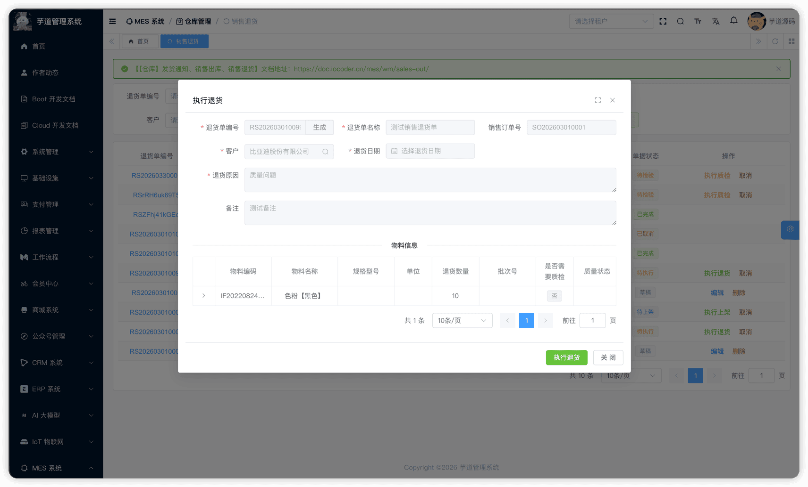 
#### # 上架
在「待上架」状态下，点击【执行上架】按钮，为每个退货行添加上架明细，指定仓库/库区/库位和上架数量。支持同一物料分配到多个库位。
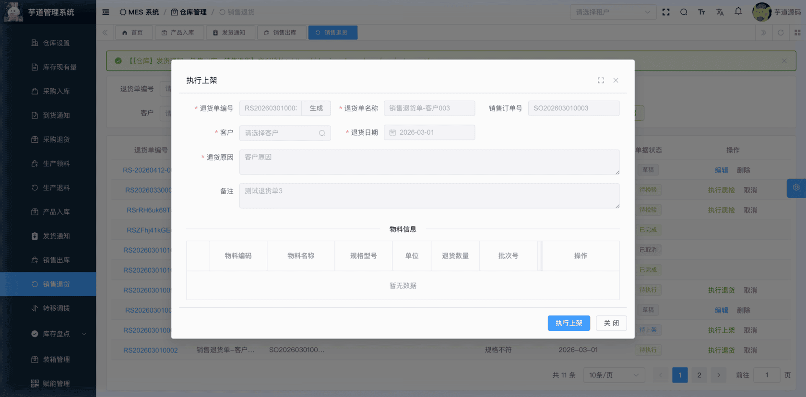 ★ **上架明细**（上架弹窗中）：由 `mes_wm_return_sales_detail` 表存储，记录退货物料上架到哪个库位。由 MesWmReturnSalesDetailController 提供接口。
mes_wm_return_sales_detail 表结构 CREATE TABLE `mes_wm_return_sales_detail` (
`id` bigint NOT NULL AUTO_INCREMENT COMMENT '编号',
`line_id` bigint NOT NULL COMMENT '行ID',
`return_id` bigint NOT NULL COMMENT '退货单ID',
`item_id` bigint NOT NULL COMMENT '物料ID',
`quantity` decimal(12,2) NOT NULL DEFAULT 0.00 COMMENT '上架数量',
`batch_id` bigint DEFAULT NULL COMMENT '批次ID',
`batch_code` varchar(255) DEFAULT NULL COMMENT '批次号',
`warehouse_id` bigint DEFAULT NULL COMMENT '仓库ID',
`location_id` bigint DEFAULT NULL COMMENT '库区ID',
`area_id` bigint DEFAULT NULL COMMENT '库位ID',
`remark` varchar(500) DEFAULT '' COMMENT '备注',
PRIMARY KEY (`id`)
) ENGINE=InnoDB COMMENT='MES 销售退货明细';
① `line_id` 关联退货行 `mes_wm_return_sales_line` 的 `id` 字段。`return_id` 关联主表 `mes_wm_return_sales` 的 `id` 字段（冗余字段，便于按退货单查询所有明细）。
② `item_id` 为物料编号，从退货行继承。`quantity` 为上架数量。所有明细的 `quantity` 之和必须不小于退货行的 `quantity`。
③ `batch_id`、`batch_code` 为批次信息，从退货行继承。
④ `warehouse_id`、`location_id`、`area_id` 分别关联仓库、库区、库位，指定具体上架位置。
#### # 完成上架
系统校验所有行的上架数量后，通过 MesWmReturnSalesServiceImpl 的 `stockReturnSales` 方法产生库存事务（IN 入库），增加库存台账，状态变为「已完成」。
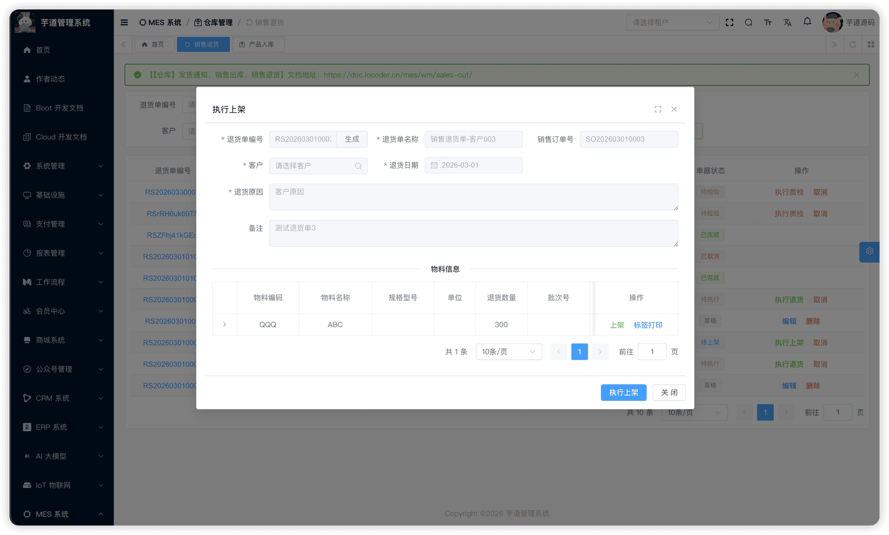 
#### # 取消
在列表页点击【取消】按钮（已完成和已取消状态不允许取消，其他状态均可取消），需二次确认。取消后不可恢复。
## # 4. 销售出库链路总览
端到端业务流程
客户下单 → 发货通知(草稿) → 提交 → 待出库
│
└→ 销售出库(草稿) → 提交 ──需 OQC──→ 待检测 → 检验完成 → 待拣货
│                            │
└──不需 OQC─────────────────→ 待拣货 → 拣货 → 待填写运单 → 填写运单 → 待执行出库 → 执行出库 → 已完成
│
┌─────────────────────────────────────────────────────────────────────────────────────────────────────────
│
退货流程   ← 销售退货(草稿) → 提交 ──需 RQC──→ 待检验 → 检验完成 → 待执行
│                            │
└──不需 RQC─────────────────→ 待执行 → 执行退货 → 待上架 → 上架 → 已完成
- **发货通知**是销售出库的前置环节，通过 `notice_id` 关联。
- **OQC 出货检验**是可选环节，由出库行的 `oqc_check_flag` 控制。
- **销售出库**执行出库时，通过库存事务引擎写入 `OUT` 类型事务，扣减库存台账。
- **销售退货**执行上架时，通过库存事务引擎写入 `IN` 类型事务，增加库存台账。
- **RQC 退料检验**是可选环节，由退货行的 `rqc_check_flag` 控制。
.pageB img{width:80px!important;}
.wwads-horizontal .wwads-text, .wwads-content .wwads-text{line-height:1;}
[【仓库】产品产出、产品入库](/mes/wm/product-in/) [【仓库】外协发料、外协入库](/mes/wm/outsource/) 
←
[【仓库】产品产出、产品入库](/mes/wm/product-in/) [【仓库】外协发料、外协入库](/mes/wm/outsource/)→
 
Theme by
[Vdoing](https://github.com/xugaoyi/vuepress-theme-vdoing) 
| Copyright © 2019-2026
芋道源码 | MIT License   
- 跟随系统
- 浅色模式
- 深色模式
- 阅读模式
× 
.windowRB{ padding: 0;}
.windowRB .wwads-img{margin-top: 10px;}
.windowRB .wwads-content{margin: 0 10px 10px 10px;}
.custom-html-window-rb .close-but{
display: none;
}