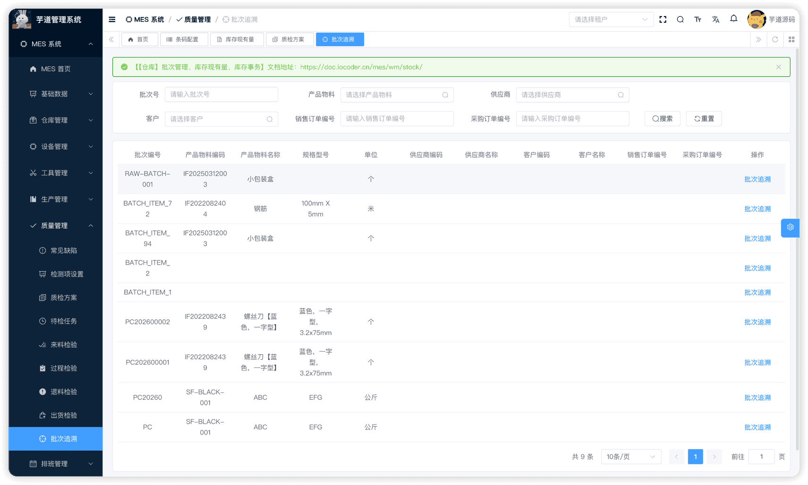
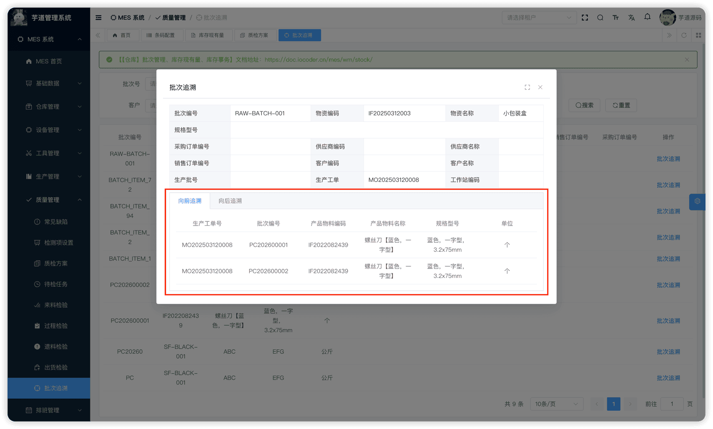
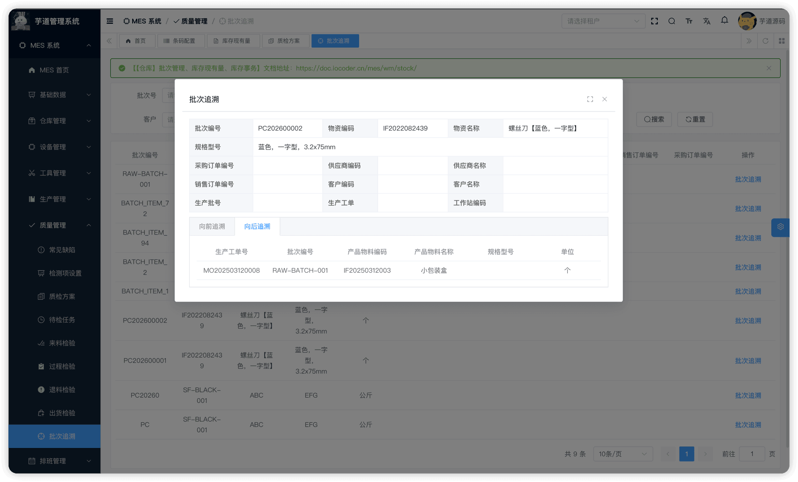
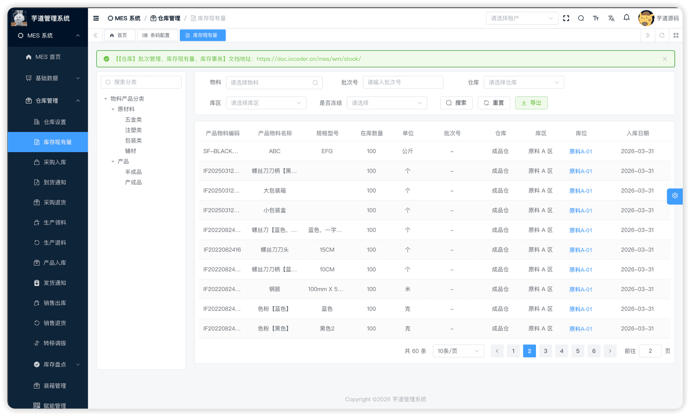

# 【仓库】批次管理、库存现有量、库存事务

库存核心模块，由 `yudao-module-mes` 后端模块的 `wm.batch`、`wm.materialstock`、`wm.transaction` 包实现，构成仓储管理的**数据引擎层**，为所有出入库单据提供批次追溯、库存增减和事务流水记录能力。
本文涉及三个子模块：
- **批次管理**：为启用批次管理的物料生成唯一的批次编码，记录批次的生产日期、有效期、供应商、生产工单等多维追溯信息。批次编码由编码规则自动生成，批次属性由物料级别的「批次配置」动态控制哪些字段必填。
- **库存现有量**：即库存台账，按 `物料 + 仓库 + 库区 + 库位 + 批次` 五维组合键聚合当前在库数量。不允许手工维护，由库存事务引擎自动增减。
- **库存事务**：记录每一笔库存增减事件的流水日志。所有出入库单据（采购入库、生产领料、销售出库、调拨等）完成时，都通过统一的事务服务写入流水并同步更新库存台账。事务流水只读，不允许人工维护。
本文涉及表如下图所示：
 
## # 1. 批次管理
批次管理，由 MesWmBatchController 提供接口。
### # 1.1 表结构
省略 creator/create_time/updater/update_time/deleted/tenant_id 等通用字段
CREATE TABLE `mes_wm_batch` (
`id` bigint NOT NULL AUTO_INCREMENT COMMENT '批次ID',
`code` varchar(64) NOT NULL COMMENT '批次编码',
`item_id` bigint NOT NULL COMMENT '物料ID',
`produce_date` datetime DEFAULT NULL COMMENT '生产日期',
`expire_date` datetime DEFAULT NULL COMMENT '有效期',
`receipt_date` datetime DEFAULT NULL COMMENT '入库日期',
`vendor_id` bigint DEFAULT NULL COMMENT '供应商ID',
`client_id` bigint DEFAULT NULL COMMENT '客户ID',
`sales_order_code` varchar(64) DEFAULT NULL COMMENT '销售订单编号',
`purchase_order_code` varchar(64) DEFAULT NULL COMMENT '采购订单编号',
`work_order_id` bigint DEFAULT NULL COMMENT '生产工单ID',
`task_id` bigint DEFAULT NULL COMMENT '生产任务ID',
`workstation_id` bigint DEFAULT NULL COMMENT '工作站ID',
`tool_id` bigint DEFAULT NULL COMMENT '工具ID',
`mold_id` bigint DEFAULT NULL COMMENT '模具ID',
`lot_number` varchar(128) DEFAULT NULL COMMENT '生产批号',
`quality_status` int DEFAULT NULL COMMENT '质量状态',
`remark` varchar(500) DEFAULT NULL COMMENT '备注',
PRIMARY KEY (`id`)
) ENGINE=InnoDB COMMENT='MES 批次管理';
① `item_id` 关联 `mes_md_item` 表的 `id` 字段（必填），标识该批次对应的物料，详见 [《【基础】物料产品、分类、计量单位》](/mes/md/product/)。
② 日期维度字段：`produce_date`（生产日期）、`expire_date`（有效期）、`receipt_date`（入库日期），`lot_number`（生产批号），用于质量追溯和保质期管理。
③ 供应链维度字段：`vendor_id`（供应商）、`client_id`（客户）、`sales_order_code`（销售订单编号）、`purchase_order_code`（采购订单编号），用于供应链追溯。
④ 生产维度字段：`work_order_id`（生产工单）、`task_id`（生产任务）、`workstation_id`（工作站）、`tool_id`（工具）、`mold_id`（模具），用于生产追溯。
⑤ `quality_status` 为质量状态，对应字典 `mes_wm_quality_status`，枚举 MesWmQualityStatusEnum（0=待检验，1=合格，2=不合格）。
批次配置驱动的动态必填
批次表的字段非常多，但实际使用时**并非所有字段都必填**。哪些字段必填由物料级别的「批次配置」（`mes_md_item_batch_config`）控制。
例如某物料配置了 `produce_date_flag = true`、`vendor_flag = true`，则创建该物料的批次时，生产日期和供应商为必填，其他字段可选。
调用 MesWmBatchServiceImpl 的 `getOrGenerateBatchCode` 方法时，系统会：
1. 检查物料是否启用批次管理（`batch_flag`），未开启则直接返回 null。
1. 读取物料批次配置，根据各 flag 校验必填字段。
1. 通过组合键查询是否已存在匹配的批次，存在则复用；不存在则自动生成新编码并创建，最后为新批次自动生成条码。
这确保了批次的**唯一性**和**可追溯性**，同时避免了重复创建。
### # 1.2 管理后台
当前前端无独立批次管理列表页；批次详情通过 `BatchForm.vue` 弹窗查看（在库存现有量页面点击批次号链接即可打开）。后端 MesWmBatchController 提供详情查询（`get`）、分页查询（`page`）和正反向追溯查询（`forward-list`/`backward-list`）接口；**批次新增由业务单据调用 `getOrGenerateBatchCode` 自动生成，不提供人工新增/修改/删除入口**。
#### # 批次追溯
批次追溯功能的独立菜单在 [MES 系统 -> 质量管理 -> 批次追溯]，对应 `@/views/mes/qc/batchtrace` 目录。通过 MesWmBatchServiceImpl 的 `getForwardBatchList` 和 `getBackwardBatchList` 方法，递归查询关联批次链（最大递归深度 20 层，防止极端场景性能问题）。
 选中一条批次记录后，可查看正向追溯和反向追溯结果：
- **正向追溯**（查询下游）：查询当前批次的物料被哪些工单消耗，最终产出了哪些批次的产品。追溯路径：领料明细 → 领料单 → 报工记录 → 生产入库单 → 生产入库行。
- **反向追溯**（查询上游）：查询当前批次的产品在生产过程中使用了哪些批次的原料。追溯路径：生产入库明细 → 生产入库单 → 领料单 → 领料明细。
例如：追溯产品批次 `B2024001`，正向追溯可查到它被用于生产了哪些下游成品批次；反向追溯可查到生产它时消耗了哪些原料批次，从而实现质量问题的全链路定位。
  
## # 2. 库存现有量
库存现有量（库存台账），由 MesWmMaterialStockController 提供接口。
### # 2.1 表结构
省略 creator/create_time/updater/update_time/deleted/tenant_id 等通用字段
CREATE TABLE `mes_wm_material_stock` (
`id` bigint NOT NULL AUTO_INCREMENT COMMENT '编号',
`quantity` decimal(14,4) NOT NULL DEFAULT '0.0000' COMMENT '在库数量',
`receipt_time` datetime DEFAULT NULL COMMENT '入库时间',
`vendor_id` bigint DEFAULT NULL COMMENT '供应商编号',
`item_type_id` bigint DEFAULT NULL COMMENT '物料分类编号',
`item_id` bigint NOT NULL COMMENT '物料编号',
`batch_id` bigint DEFAULT NULL COMMENT '批次编号',
`batch_code` varchar(64) DEFAULT NULL COMMENT '批次号',
`warehouse_id` bigint NOT NULL COMMENT '仓库编号',
`location_id` bigint DEFAULT NULL COMMENT '库区编号',
`area_id` bigint DEFAULT NULL COMMENT '库位编号',
`frozen` bit(1) DEFAULT b'0' COMMENT '是否冻结',
PRIMARY KEY (`id`)
) ENGINE=InnoDB COMMENT='MES 库存台账';
① `quantity` 为当前在库数量。该字段**只能通过库存事务引擎更新**，不允许手工修改。更新时采用 CAS（Compare and Set）机制防止并发竞争，并可选择是否允许负库存。
② `item_type_id` 关联 `mes_md_item_type` 表的 `id` 字段（冗余字段）；`item_id` 关联 `mes_md_item` 表的 `id` 字段。
③ `batch_id` 关联 `mes_wm_batch` 表的 `id` 字段；`batch_code` 冗余批次编码，方便查询展示。
④ `warehouse_id`、`location_id`、`area_id` 分别关联仓库、库区、库位表，构成库存的空间维度，详见 [《【仓库】仓库与库区库位、条码赋码、SN码》](/mes/wm/warehouse-setup/)。
⑤ `frozen` 为冻结标识。冻结后该库存记录的出入库操作将被阻止。支持单条冻结和批量冻结。
库存记录的唯一键
库存台账以 `item_id + warehouse_id + location_id + area_id + batch_id` 五维组合作为唯一键。同一物料在同一库位下、同一批次的库存只有一条记录。
通过 MesWmMaterialStockServiceImpl 的 `getOrCreateMaterialStock` 方法确保：
1. 存在匹配记录，则直接返回已有记录。
1. 不存在，则创建新记录（初始数量为 0）。
### # 2.2 管理后台
对应 [MES 系统 -> 仓库管理 -> 库存现有量] 菜单，对应 `yudao-ui-admin-vue3` 项目的 `@/views/mes/wm/materialstock` 目录。
#### # 列表
页面左侧为物料分类树，右侧为库存列表。当前页面暴露的搜索条件为：**物料、批次号、仓库、库区、是否冻结**。列表展示物料编码/名称/规格、在库数量、单位、批次号（可点击打开批次详情弹窗）、仓库/库区/库位（可点击打开库位详情弹窗）、入库日期、冻结状态等信息。
后端分页接口（`MesWmMaterialStockPageReqVO`）已预留 `vendorId`（供应商）、`areaId`（库位）、`virtualFilter`（虚拟仓过滤）等筛选参数，但当前前端页面未暴露这些筛选项。
 
#### # 冻结/解冻
通过列表行内的冻结开关（`el-switch`），调用 MesWmMaterialStockController 的 `updateMaterialStockFrozen` 方法，可对单条库存记录执行冻结/解冻操作。冻结后该库存记录的所有出入库事务将被阻止（校验在库存事务服务中执行）。
### # 2.3 库位混放规则
入库事务执行前，系统会调用 MesWmMaterialStockServiceImpl 的 `checkAreaMixingRule` 方法校验库位的混放策略：
| 配置项 | 校验规则 |
| --- | --- |
| `allow_item_mixing = false` | 同一库位不允许存放不同物料 |
| `allow_batch_mixing = false` | 同一库位不允许存放不同批次 |
例如：采购入库上架时，库位 A-01-01 已存放物料「螺丝 M6」且配置了 `allow_item_mixing = false`，此时尝试将物料「螺母 M6」上架到该库位，系统会拒绝并提示混放校验失败。
## # 3. 库存事务
库存事务流水，通过 MesWmTransactionServiceImpl 提供服务能力，**暂无独立的 Controller 和前端菜单页面**。
当前仅有后端写流水能力，暂无独立查询页面/接口；事务记录由各业务单据执行时自动生成。
核心设计理念
MesWmTransactionServiceImpl 是整个 WMS 模块的**核心引擎**。所有出入库单据（采购入库、生产领料、销售出库、调拨、产品产出、物料消耗等）都通过调用 `createTransaction` 方法来完成库存变更，而非直接操作库存台账。已预留 `ADJUST_IN`/`ADJUST_OUT` 事务类型用于盘盈/盘亏，盘点模块是否接入需以后续实现为准。
每次调用 `createTransaction` 会：
1. 校验事务合法性。
1. 获取或创建库存记录（`mes_wm_material_stock`），更新库存数量。
1. 插入事务流水记录（`mes_wm_transaction`）。
这保证了**库存一致性**和**完整的审计追踪**。
### # 3.1 表结构
省略 creator/create_time/updater/update_time/deleted/tenant_id 等通用字段
CREATE TABLE `mes_wm_transaction` (
`id` bigint NOT NULL AUTO_INCREMENT COMMENT '编号',
`type` int NOT NULL COMMENT '事务类型',
`quantity` decimal(14,4) NOT NULL COMMENT '本次变动数量',
`biz_type` int DEFAULT NULL COMMENT '业务类型',
`biz_id` bigint DEFAULT NULL COMMENT '来源业务主单ID',
`biz_code` varchar(64) DEFAULT NULL COMMENT '来源业务单号',
`biz_line_id` bigint DEFAULT NULL COMMENT '来源业务行ID',
`material_stock_id` bigint DEFAULT NULL COMMENT '库存记录ID',
`related_transaction_id` bigint DEFAULT NULL COMMENT '关联事务ID',
`item_id` bigint NOT NULL COMMENT '物料ID',
`batch_id` bigint DEFAULT NULL COMMENT '批次ID',
`batch_code` varchar(64) DEFAULT NULL COMMENT '批次号',
`warehouse_id` bigint NOT NULL COMMENT '仓库ID',
`location_id` bigint DEFAULT NULL COMMENT '库区 ID',
`area_id` bigint DEFAULT NULL COMMENT '库位 ID',
`transaction_time` datetime DEFAULT NULL COMMENT '事务发生时间',
`erp_time` datetime DEFAULT NULL COMMENT 'ERP 账期',
`receipt_time` datetime DEFAULT NULL COMMENT '入库时间',
PRIMARY KEY (`id`)
) ENGINE=InnoDB COMMENT='MES 库存事务流水';
① `type` 为事务类型，枚举 MesWmTransactionTypeEnum：
| 类型值 | 枚举 | 说明 | 数量方向 |
| --- | --- | --- | --- |
| 1 | `IN` | 入库 | 正数 |
| 2 | `OUT` | 出库 | 负数 |
| 3 | `MOVE_OUT` | 调拨移出 | 负数 |
| 4 | `MOVE_IN` | 调拨移入 | 正数 |
| 5 | `ADJUST_IN` | 盘盈 | 正数 |
| 6 | `ADJUST_OUT` | 盘亏 | 负数 |
② `quantity` 为本次变动数量。**正数表示入库，负数表示出库**。系统会强制校验数量的正负号与事务类型方向一致。
③ `biz_type` 为业务类型，对应 MesBizTypeConstants 中的常量，标识触发该事务的来源业务。例如：采购入库（110）、生产领料（115）、销售出库（118）、调拨出库/入库（111/112）等。完整常量定义详见代码中的 MesBizTypeConstants 类。
④ `biz_id`、`biz_code` 为来源业务主单的 ID 和单号，`biz_line_id` 为来源业务行 ID，用于追溯事务的来源。
⑤ `material_stock_id` 关联 `mes_wm_material_stock` 表的 `id` 字段，标识该事务影响的库存记录。
⑥ `related_transaction_id` 用于关联成对事务，如调拨场景下的移出事务和移入事务互相关联。
⑦ `item_id`、`batch_id`、`batch_code`、`warehouse_id`、`location_id`、`area_id` 为物料和库存位置维度字段，与库存台账保持一致，便于事务流水独立查询。
⑧ `transaction_time` 为事务发生时间（系统自动记录），`erp_time` 为 ERP 账期（预留），`receipt_time` 为入库时间。
### # 3.2 事务处理流程
MesWmTransactionServiceImpl 的 `createTransaction` 方法是库存变更的核心入口，处理流程如下：
1. 基础校验
1.1 数量正负号与事务类型方向一致性
1.2 入库时：库位混放规则校验
2. 批次校验（入库时）
2.1 batchId / batchCode 互补
2.2 启用批次管理的物料，必须传递批次号
3. 获取或创建库存记录（mes_wm_material_stock）
4. 冻结校验（四层）
4.1 仓库（mes_wm_warehouse）冻结
4.2 库区（mes_wm_warehouse_location）冻结
4.3 库位（mes_wm_warehouse_area）冻结
4.4 库存记录（mes_wm_material_stock）冻结
5. 更新库存数量（mes_wm_material_stock，CAS 防并发）
6. 插入事务流水记录（mes_wm_transaction）
冻结校验四层机制
事务执行前，系统会逐层检查冻结状态，任一层冻结都会阻止事务执行。分为两类四层：
① **空间维度冻结**（影响范围从大到小）：
- 仓库冻结 → 该仓库下**所有**出入库操作被阻止
- 库区冻结 → 该库区下所有出入库操作被阻止
- 库位冻结 → 该库位的出入库操作被阻止
② **库存维度冻结**：
- 库存记录冻结 → 仅该 `物料 + 库位 + 批次` 组合的出入库被阻止
### # 3.3 管理后台
当前库存事务**暂无独立菜单页面和 Controller**，仅作为后端服务能力存在。各出入库模块执行时自动产生事务记录，事务流水只写不读（无查询接口）。
.pageB img{width:80px!important;}
.wwads-horizontal .wwads-text, .wwads-content .wwads-text{line-height:1;}
[【仓库】仓库与库区库位、条码赋码、SN码](/mes/wm/warehouse-setup/) [【仓库】到货通知、采购入库、采购退货](/mes/wm/purchase-in/) 
←
[【仓库】仓库与库区库位、条码赋码、SN码](/mes/wm/warehouse-setup/) [【仓库】到货通知、采购入库、采购退货](/mes/wm/purchase-in/)→
 
Theme by
[Vdoing](https://github.com/xugaoyi/vuepress-theme-vdoing) 
| Copyright © 2019-2026
芋道源码 | MIT License   
- 跟随系统
- 浅色模式
- 深色模式
- 阅读模式
× 
.windowRB{ padding: 0;}
.windowRB .wwads-img{margin-top: 10px;}
.windowRB .wwads-content{margin: 0 10px 10px 10px;}
.custom-html-window-rb .close-but{
display: none;
}