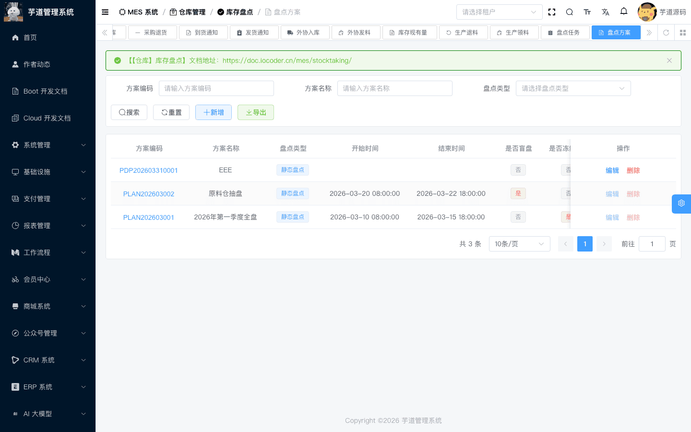
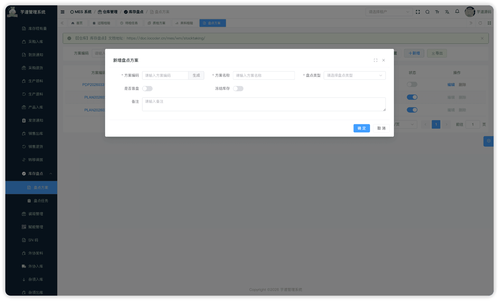
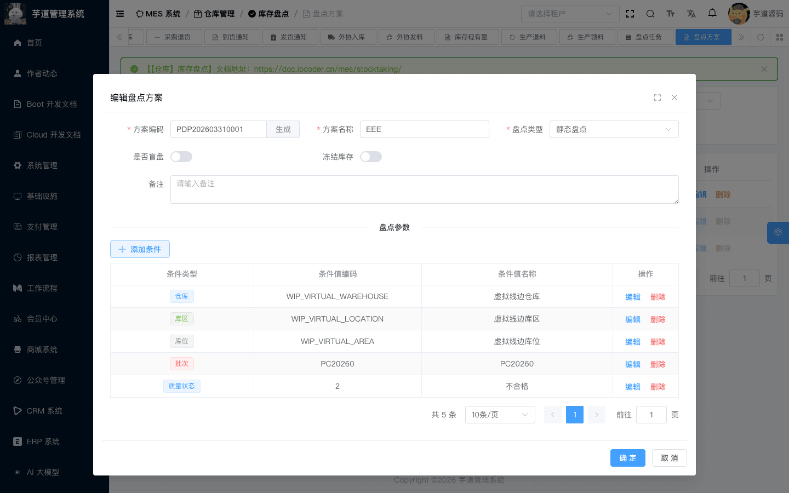
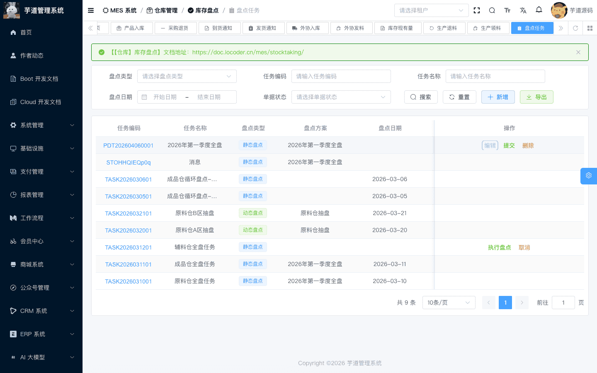
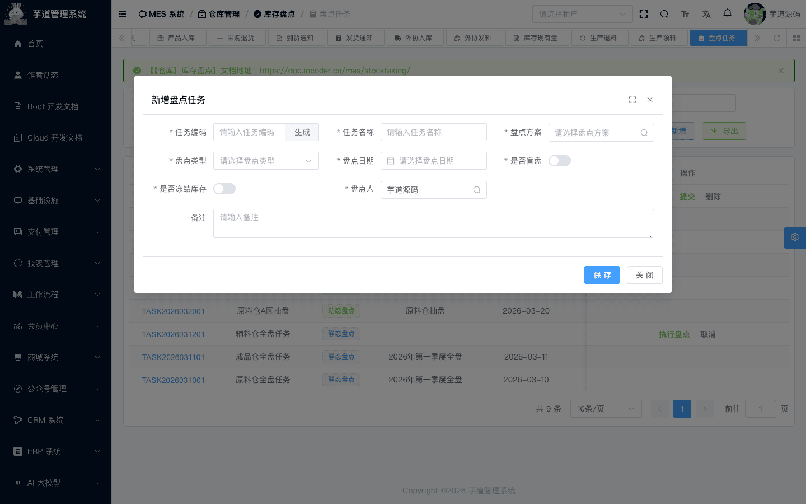
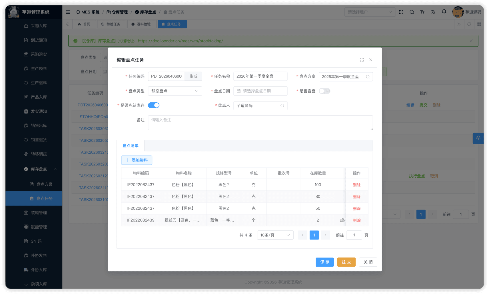
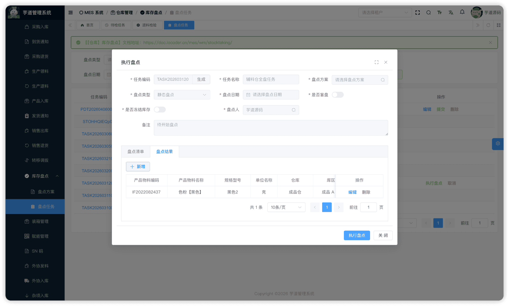

# 【仓库】库存盘点

库存盘点模块，由 `yudao-module-mes` 后端模块的 `wm.stocktaking` 包实现，覆盖仓库物料的**实物盘点**场景——通过创建盘点方案和盘点任务，将系统账面库存与实际库存进行核对，识别盘盈/盘亏差异。
本文涉及两个子模块：
- **盘点方案**：定义盘点范围（按仓库/库区/库位/物料/批次/质量状态维度筛选），作为盘点任务的模板。
- **盘点任务**：基于盘点方案（必选）生成实际盘点清单；提交后进入「审批中」状态，实盘数量通过**盘点结果接口**录入，系统在写入结果时同步回写盘点行的 `taking_quantity` 和盈亏状态。
本文涉及表如下图所示：
 
## # 1. 盘点方案
盘点方案，由 MesWmStockTakingPlanController 提供接口。盘点方案是盘点任务的**模板**，定义「盘什么」。
### # 1.1 表结构
省略 creator/create_time/updater/update_time/deleted/tenant_id 等通用字段
CREATE TABLE `mes_wm_stock_taking_plan` (
`id` bigint NOT NULL AUTO_INCREMENT COMMENT '编号',
`code` varchar(64) NOT NULL COMMENT '方案编码',
`name` varchar(128) NOT NULL COMMENT '方案名称',
`type` tinyint NOT NULL COMMENT '盘点类型',
`start_time` datetime DEFAULT NULL COMMENT '计划开始时间',
`end_time` datetime DEFAULT NULL COMMENT '计划结束时间',
`blind_flag` bit(1) NOT NULL DEFAULT b'0' COMMENT '是否盲盘',
`frozen` bit(1) DEFAULT b'0' COMMENT '是否冻结库存',
`status` tinyint NOT NULL DEFAULT '0' COMMENT '状态',
`remark` varchar(500) DEFAULT NULL COMMENT '备注',
PRIMARY KEY (`id`)
) ENGINE=InnoDB COMMENT='MES 盘点方案';
① `type` 为盘点类型，枚举 MesWmStockTakingTypeEnum（1=静态盘点，2=动态盘点）。动态盘点时需填写 `start_time`、`end_time`（有效时间窗口），非动态盘点时系统自动清空时间字段。
② `blind_flag` 标识是否盲盘。**盲盘模式下**，当前前端实现为直接**隐藏「盘点清单」Tab**（即 `blindFlag=false` 时才显示清单 Tab，`true` 时隐藏），盘点人无法看到系统账面数量和清单行。`frozen` 标识是否在盘点期间冻结库存，**冻结后相关库存不可被其他出入库单据消耗**。
③ `status` 使用通用状态 CommonStatusEnum（0=开启，1=关闭）。关闭状态下可编辑和删除，**开启后方可被盘点任务引用**。开启时校验方案参数不能为空。
该表包含一个子表：
- `mes_wm_stock_taking_plan_param`（方案参数）：在编辑页面中维护，定义盘点范围的筛选条件。
### # 1.2 管理后台
对应 [MES 系统 -> 仓库管理 -> 盘点方案] 菜单，对应 `yudao-ui-admin-vue3` 项目的 `@/views/mes/wm/stocktaking/plan` 目录。盘点方案页面由 `index.vue`（列表）、StockTakingPlanForm.vue（表单弹窗）和 StockTakingPlanParamList.vue（方案参数子组件）组成。
#### # 列表
支持按方案编码、名称、盘点类型等条件搜索。
 
#### # 新增
点击【新增】按钮，弹出盘点方案新增表单。主要填写方案编码（可自动生成）、方案名称、盘点类型、是否盲盘、是否冻结库存、时间范围（动态盘点时填写）。新增时仅维护主表字段；**保存后自动切换为编辑模式，表单下方才会出现方案参数区域**（前端 StockTakingPlanParamList.vue 组件仅在 `(formType === 'update' || formType === 'detail') && formData.id` 时渲染）。
 
#### # 修改
点击编码链接或【编辑】按钮，弹出修改表单。表单下方展示子表数据：
 ★ **方案参数**（编辑页面下方）：由 `mes_wm_stock_taking_plan_param` 表存储，定义盘点范围的筛选条件。由 MesWmStockTakingPlanParamController 提供接口。
mes_wm_stock_taking_plan_param 表结构 CREATE TABLE `mes_wm_stock_taking_plan_param` (
`id` bigint NOT NULL AUTO_INCREMENT COMMENT '编号',
`plan_id` bigint NOT NULL COMMENT '方案ID',
`type` smallint NOT NULL COMMENT '参数类型',
`value_id` bigint NOT NULL COMMENT '参数值ID',
`value_code` varchar(64) NOT NULL COMMENT '参数值编码',
`value_name` varchar(128) NOT NULL COMMENT '参数值名称',
`remark` varchar(500) DEFAULT NULL COMMENT '备注',
PRIMARY KEY (`id`)
) ENGINE=InnoDB COMMENT='MES 盘点方案参数';
① `plan_id` 关联主表 `mes_wm_stock_taking_plan` 的 `id` 字段。
② `type` 为参数类型，枚举 MesWmStockTakingPlanParamTypeEnum（WAREHOUSE=仓库，LOCATION=库区，AREA=库位，ITEM=物料，BATCH=批次，QUALITY_STATUS=质量状态），决定盘点范围按哪个维度筛选。
③ `value_id`、`value_code`、`value_name` 为参数值，分别存储选择的仓库/库区/物料等的 ID、编码、名称。一个方案可以有多个参数，**不同类型参数取交集**。
注意：当前实现中每种参数类型**仅取第一个值**（通过 `CollUtil.findOne` 匹配），即使配置了多个同类型参数也只使用第一条。此外，`QUALITY_STATUS` 虽在枚举中定义，当前生成清单逻辑未使用该维度。
#### # 开启/关闭
在列表页点击状态开关。**开启时校验方案参数不能为空**，开启后方案不可编辑和删除，可被盘点任务引用。
## # 2. 盘点任务
盘点任务，由 MesWmStockTakingTaskController 提供接口。盘点任务是实际执行盘点的载体，关联盘点方案并生成盘点清单。
### # 2.1 表结构
省略 creator/create_time/updater/update_time/deleted/tenant_id 等通用字段
CREATE TABLE `mes_wm_stock_taking_task` (
`id` bigint NOT NULL AUTO_INCREMENT COMMENT '编号',
`code` varchar(64) NOT NULL COMMENT '任务编码',
`name` varchar(128) NOT NULL COMMENT '任务名称',
`taking_date` datetime NOT NULL COMMENT '盘点日期',
`type` tinyint NOT NULL COMMENT '盘点类型',
`user_id` bigint DEFAULT NULL COMMENT '盘点人编号',
`plan_id` bigint NOT NULL COMMENT '盘点方案ID',
`blind_flag` bit(1) NOT NULL DEFAULT b'0' COMMENT '是否盲盘',
`frozen` bit(1) DEFAULT b'0' COMMENT '是否冻结库存',
`start_time` datetime DEFAULT NULL COMMENT '开始时间',
`end_time` datetime DEFAULT NULL COMMENT '结束时间',
`status` tinyint NOT NULL DEFAULT '0' COMMENT '状态',
`remark` varchar(500) DEFAULT NULL COMMENT '备注',
PRIMARY KEY (`id`)
) ENGINE=InnoDB COMMENT='MES 盘点任务';
① `plan_id` 关联 `mes_wm_stock_taking_plan` 表的 `id` 字段（**必填**，`NOT NULL`），标识基于哪个盘点方案创建。创建/编辑时校验方案需为「开启」状态（通过 `validateStockTakingPlanEnabled` 校验），且后端 `MesWmStockTakingTaskSaveReqVO` 使用 `@NotNull` 注解强制必填。关联方案后，系统根据方案参数**自动生成盘点清单行**。
② `user_id` 关联系统用户表，标识盘点人（必填）。`type`、`blind_flag`、`frozen`、`start_time`、`end_time` 可从方案继承或手动填写。
③ `status` 为盘点任务状态，枚举 MesWmStockTakingTaskStatusEnum：
| 状态值 | 枚举 | 说明 | 可执行操作 |
| --- | --- | --- | --- |
| 0 | `PREPARE` | 草稿 | 编辑、提交、删除 |
| 2 | `APPROVING` | 审批中 | 执行盘点（录入结果）、取消 |
| 4 | `FINISHED` | 已完成 | — |
| 5 | `CANCELED` | 已取消 | — |
状态流转说明
创建 ──→ 草稿(0) ──提交──→ 审批中(2) ──录入结果─→─执行盘点──→ 已完成(4)
│
└──取消──→ 已取消(5)
- **创建**（`createStockTakingTask`）：创建盘点任务，初始状态为草稿。系统根据关联方案的参数**自动查询库存台账并生成盘点清单行**（若库存台账无匹配记录则抛出异常）。
- **提交**（`submitStockTakingTask`）：校验盘点清单行不能为空。状态变为「审批中」。若 `frozen=true`，同时**冻结相关库存**。
- **录入实盘**：提交后，在「执行盘点」弹窗的「盘点结果」Tab 中，通过新增/编辑操作录入实盘数量。系统在写入结果时，**同步回写盘点清单行**的 `taking_quantity` 和盈亏状态（通过 `updateStockTakingTaskLineTakingQuantity`）。
- **执行盘点**（`finishStockTakingTask`）：录入结果完成后，点击弹窗底部【执行盘点】按钮。状态变为「已完成」。若 `frozen=true`，同时**解除库存冻结**。
- **取消**（`cancelStockTakingTask`）：已完成和已取消状态不允许取消。若 `frozen=true`，同时**解除库存冻结**。
该表包含两个子表：
- `mes_wm_stock_taking_task_line`（盘点清单行）：根据方案自动生成或手工添加，记录待盘点的物料及系统账面数量。
- `mes_wm_stock_taking_task_result`（盘点结果）：在「审批中」状态下，通过「执行盘点」弹窗录入实盘数量，写入结果时同步回写清单行的盘点数量和盈亏状态。
### # 2.2 管理后台
对应 [MES 系统 -> 仓库管理 -> 盘点任务] 菜单，对应 `yudao-ui-admin-vue3` 项目的 `@/views/mes/wm/stocktaking/task` 目录。盘点任务页面由 `index.vue`（列表）、StockTakingForm.vue（表单弹窗）、StockTakingTaskLineList.vue（盘点清单行子组件）和 StockTakingTaskResultList.vue（盘点结果子组件）组成。
#### # 列表
支持按任务编码、名称、盘点类型、盘点日期、状态等条件搜索。
 
#### # 新增
点击【新增】按钮，弹出盘点任务新增表单。主要填写任务编码（可自动生成）、任务名称、**盘点方案（必填，且必须选择已启用方案）**、盘点人（必填）、盘点类型、盘点日期、是否盲盘、是否冻结库存。选择盘点方案后，系统自动填充盘点类型、是否盲盘、是否冻结等字段。新建成功后弹窗自动切换为编辑模式，在表单下方展示盘点清单。
 
#### # 修改
点击编码链接或【编辑】按钮（仅草稿状态可编辑），弹出盘点任务修改表单。表单下方通过 `el-tabs` 展示子表数据，包含：
- **盘点清单** Tab（仅 `blindFlag=false` 非盲盘时显示）：由 StockTakingTaskLineList.vue 组件渲染，展示盘点清单行列表。
- **盘点结果** Tab（仅非草稿状态或执行盘点模式时显示）：由 StockTakingTaskResultList.vue 组件渲染，展示盘点结果列表。
 ★ **盘点清单行**（编辑弹窗下方）：由 `mes_wm_stock_taking_task_line` 表存储，记录待盘点的物料、库位和系统账面数量。由 MesWmStockTakingTaskLineController 提供接口。
mes_wm_stock_taking_task_line 表结构 CREATE TABLE `mes_wm_stock_taking_task_line` (
`id` bigint NOT NULL AUTO_INCREMENT COMMENT '编号',
`task_id` bigint NOT NULL COMMENT '盘点任务ID',
`material_stock_id` bigint DEFAULT NULL COMMENT '库存记录ID',
`item_id` bigint NOT NULL COMMENT '物料ID',
`batch_id` bigint DEFAULT NULL COMMENT '批次ID',
`batch_code` varchar(50) DEFAULT NULL COMMENT '批次编码',
`quantity` decimal(24,6) NOT NULL DEFAULT '0.000000' COMMENT '账面数量',
`taking_quantity` decimal(24,6) DEFAULT NULL COMMENT '盘点数量（实盘数量）',
`warehouse_id` bigint NOT NULL COMMENT '仓库ID',
`location_id` bigint DEFAULT NULL COMMENT '库区ID',
`area_id` bigint DEFAULT NULL COMMENT '库位ID',
`status` tinyint NOT NULL COMMENT '盘点状态',
`remark` varchar(500) DEFAULT NULL COMMENT '备注',
PRIMARY KEY (`id`)
) ENGINE=InnoDB COMMENT='MES 盘点任务行';
① `task_id` 关联主表 `mes_wm_stock_taking_task` 的 `id` 字段。
② `material_stock_id` 关联 `mes_wm_material_stock`，标识对应的库存记录。`item_id` 关联 `mes_md_item` 表的 `id` 字段，标识待盘点物料。
③ `batch_id`、`batch_code` 关联批次信息。
④ `quantity` 为在库数量/系统账面数量（**创建时根据库存台账自动填充**，数据库字段为 `NOT NULL DEFAULT 0.000000`）。`taking_quantity` 为盘点数量/实盘数量（**通过盘点结果接口录入时由 `updateStockTakingTaskLineTakingQuantity` 回写**）。自动生成的清单行会初始化为 0，数据库字段本身允许为空。
⑤ `warehouse_id`、`location_id`、`area_id` 标识待盘点物料所在的仓库/库区/库位。
⑥ `status` 为盘点状态，枚举 MesWmStockTakingTaskLineStatusEnum（1=正常，2=盘盈，3=盘亏）。**系统在盘点结果回写时根据实盘数量与账面数量对比自动计算**（通过 `calculateLineStatus` 方法）：
- `taking_quantity` = `quantity` -> 正常(1)
- `taking_quantity` > `quantity` -> 盘盈(2)
- `taking_quantity` 盘亏(3)
注意：清单行创建时默认状态为**盘亏**（`LOSS`），待盘点结果写入后才更新为实际值。
#### # 提交
在编辑弹窗中点击【提交】按钮（仅草稿状态下显示）。校验盘点清单行不能为空。提交后进入「审批中」状态，若启用冻结，同时**冻结相关库存记录**。
#### # 执行盘点
在「审批中」状态下，列表页显示【执行盘点】按钮。点击后弹出标题为「执行盘点」的弹窗（`formType='execute'`），头部表单只读，默认切到「盘点结果」Tab。
在「盘点结果」Tab 中，可通过【新增】【编辑】【删除】按钮维护盘点结果。新增时可选择已有盘点清单行，系统自动回填物料、批次、仓库/库区/库位等字段，盘点人只需录入实盘数量。
录入完成后，点击弹窗底部【执行盘点】按钮，系统通过 MesWmStockTakingTaskServiceImpl 的 `finishStockTakingTask` 方法将状态变为「已完成」。若启用冻结，同时**解除库存冻结**。
 ★ **盘点结果**（执行盘点弹窗「盘点结果」Tab 中）：由 `mes_wm_stock_taking_task_result` 表存储，记录每个物料行的实盘数量。由 MesWmStockTakingTaskResultController 提供接口。
mes_wm_stock_taking_task_result 表结构 CREATE TABLE `mes_wm_stock_taking_task_result` (
`id` bigint NOT NULL AUTO_INCREMENT COMMENT '编号',
`task_id` bigint NOT NULL COMMENT '盘点任务ID',
`line_id` bigint DEFAULT NULL COMMENT '盘点行ID',
`material_stock_id` bigint DEFAULT NULL COMMENT '库存记录ID',
`item_id` bigint NOT NULL COMMENT '物料ID',
`batch_id` bigint DEFAULT NULL COMMENT '批次ID',
`batch_code` varchar(64) DEFAULT NULL COMMENT '批次号',
`warehouse_id` bigint NOT NULL COMMENT '仓库ID',
`location_id` bigint DEFAULT NULL COMMENT '库区ID',
`area_id` bigint DEFAULT NULL COMMENT '库位ID',
`quantity` decimal(10,2) NOT NULL COMMENT '差异数量',
`taking_quantity` decimal(10,2) NOT NULL COMMENT '盘点数量',
`remark` varchar(500) DEFAULT NULL COMMENT '备注',
PRIMARY KEY (`id`)
) ENGINE=InnoDB COMMENT='MES 盘点结果';
① `task_id` 关联主表（冗余字段）。`line_id` 关联盘点清单行 `mes_wm_stock_taking_task_line` 的 `id` 字段（`DEFAULT NULL`，创建结果时若未指定 `lineId`，系统会基于 `taskId + itemId + areaId` 查找已有清单行，或自动创建新的清单行）。
② `material_stock_id`、`item_id` 为盘点物料和库存记录。`batch_id`、`batch_code` 关联批次信息。
③ `warehouse_id`、`location_id`、`area_id` 标识物料所在的仓库/库区/库位，从盘点清单行继承。
④ `quantity` 的数据库注释当前写为“差异数量”，但服务实现中实际写入的是清单行的账面数量，若无对应清单行则写入 0；`taking_quantity` 为盘点数量/实盘数量（`NOT NULL`，由盘点人提交）。写入结果时系统同步更新清单行的 `taking_quantity` 和盈亏状态。
#### # 取消
在列表页点击【取消】按钮（已完成和已取消状态不允许取消，其他状态均可取消），需二次确认。若启用冻结，同时**解除库存冻结**。取消后不可恢复。
## # 3. 盘点业务流程总览
端到端业务流程
盘点方案：定义盘点范围（仓库/库区/物料/批次等维度筛选）
|
| 引用（必选已启用方案）
v
盘点任务：创建 --> 自动生成清单行（从库存台账匹配） --> 提交（冻结库存）
|
| 「执行盘点」弹窗录入实盘数量
v
盘点结果：写入结果时回写清单行 -> 正常 / 盘盈 / 盘亏
|
| 执行盘点（解除冻结）
v
后续处理：盘盈 -> 通过「其他入库」调增库存
盘亏 -> 通过「其他出库」调减库存
- **盘点方案**定义盘点范围，通过参数组合实现灵活筛选（不同类型取交集，同类型当前仅取第一个值）。
- **盘点任务**必须关联已启用方案，创建时自动生成清单行。提交后进入「审批中」状态，在「执行盘点」弹窗中录入实盘数量，系统在写入结果时同步回写清单行的盘点数量和盈亏状态。录入完毕后点击【执行盘点】完成任务。
- **盲盘模式**：当前前端 `blindFlag=true` 时隐藏整个「盘点清单」Tab（通过 `v-if="!formData.blindFlag"` 判断），盘点人无法看到系统账面数量和清单行。
- **库存冻结**确保盘点期间库存不被其他业务变动，保证盘点结果准确性。
- **差异处理**：盘点模块本身不直接修改库存，盘盈/盘亏需通过「其他入库」或「其他出库」（详见 [《【仓库】其他入库、其他出库》](/mes/wm/misc/)）进行库存调整。
.pageB img{width:80px!important;}
.wwads-horizontal .wwads-text, .wwads-content .wwads-text{line-height:1;}
[【仓库】调拨单、装箱管理](/mes/wm/transfer/) [【质量】检测项设置、常见缺陷](/mes/qc/base/) 
←
[【仓库】调拨单、装箱管理](/mes/wm/transfer/) [【质量】检测项设置、常见缺陷](/mes/qc/base/)→
 
Theme by
[Vdoing](https://github.com/xugaoyi/vuepress-theme-vdoing) 
| Copyright © 2019-2026
芋道源码 | MIT License   
- 跟随系统
- 浅色模式
- 深色模式
- 阅读模式
× 
.windowRB{ padding: 0;}
.windowRB .wwads-img{margin-top: 10px;}
.windowRB .wwads-content{margin: 0 10px 10px 10px;}
.custom-html-window-rb .close-but{
display: none;
}