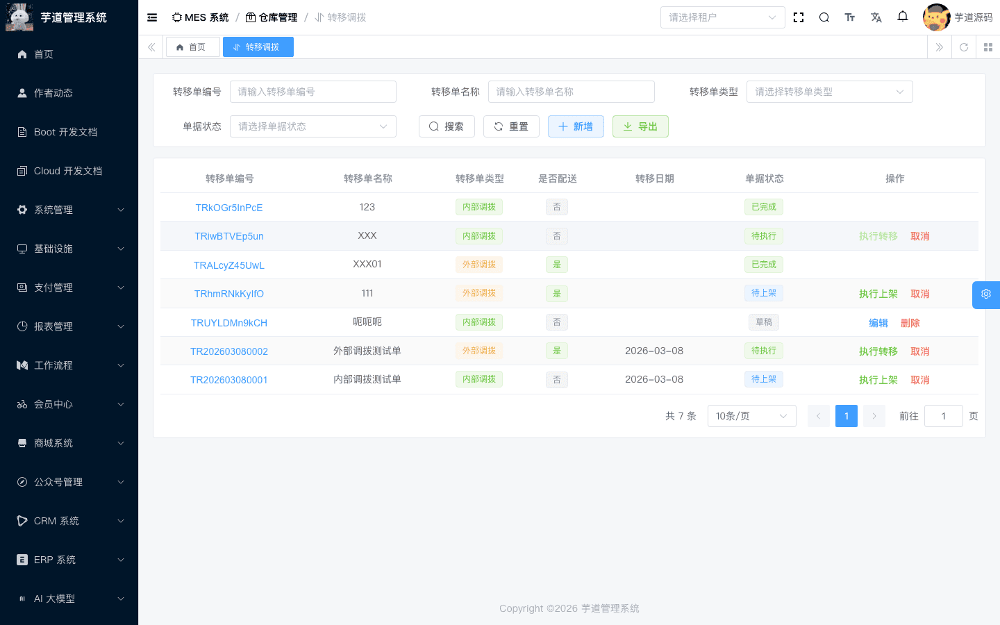
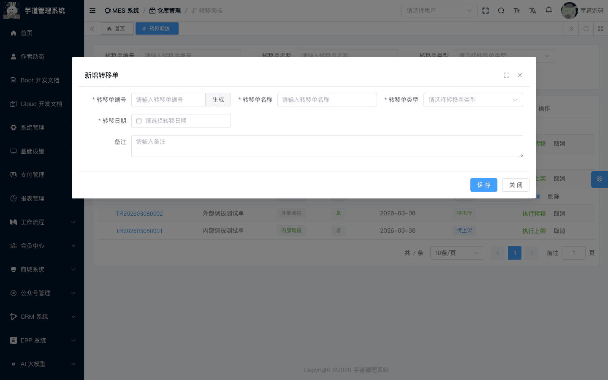
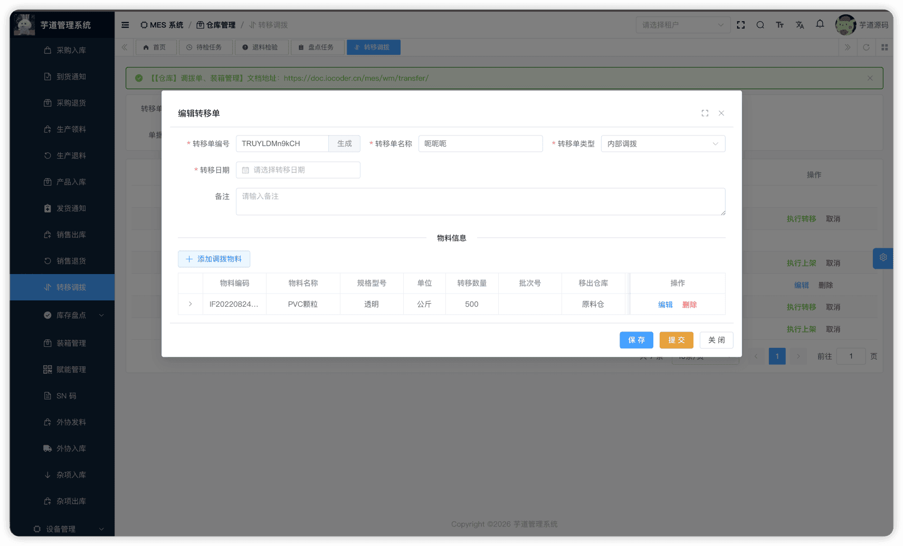
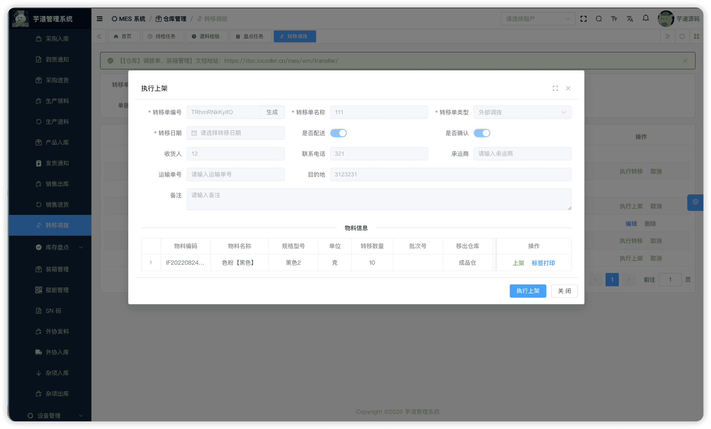
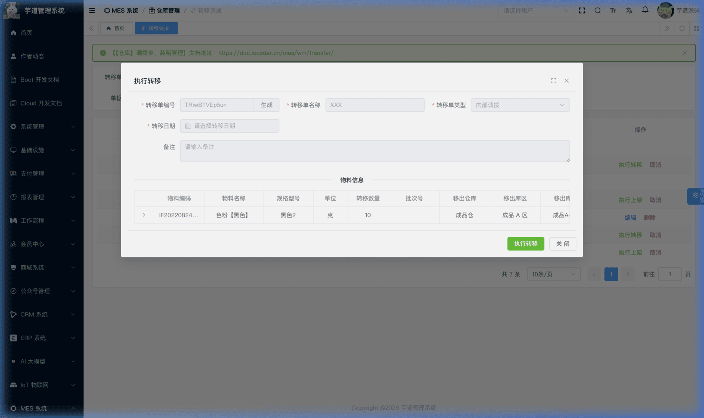
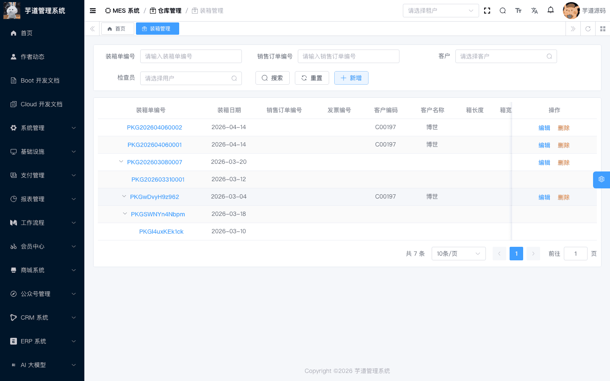
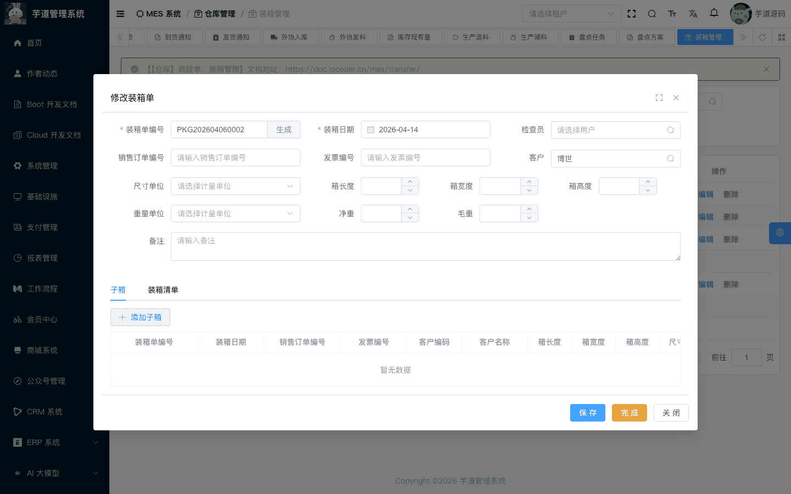
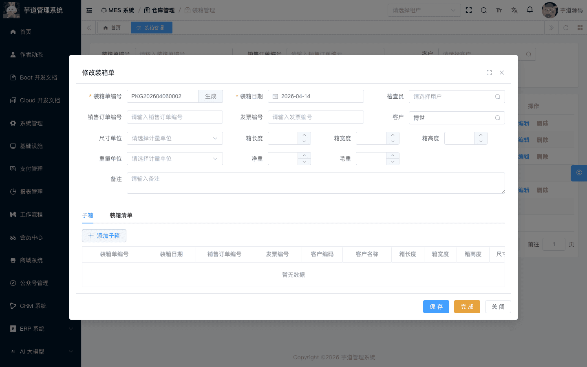

# 【仓库】调拨单、装箱管理

调拨与装箱模块，由 `yudao-module-mes` 后端模块的 `wm.transfer`、`wm.packages` 包实现。
本文涉及两个子模块：
- **调拨单**：在仓库/库位之间转移物料，支持内部调拨和外部配送。行表记录来源库位，明细表记录目标库位，执行时产生 MOVE_OUT + MOVE_IN 成对库存事务。
- **装箱管理**：将成品或物料装入箱子，支持多级嵌套（子箱→父箱）。通常用于销售发货前的包装环节。
本文涉及表如下图所示：
 
## # 1. 调拨单
调拨单，由 MesWmTransferController 提供接口。
### # 1.1 表结构
省略 creator/create_time/updater/update_time/deleted/tenant_id 等通用字段
CREATE TABLE `mes_wm_transfer` (
`id` bigint NOT NULL AUTO_INCREMENT COMMENT '编号',
`code` varchar(64) NOT NULL COMMENT '调拨单编码',
`name` varchar(255) DEFAULT NULL COMMENT '调拨单名称',
`type` tinyint DEFAULT NULL COMMENT '调拨类型',
`delivery_flag` bit(1) DEFAULT NULL COMMENT '是否需要配送',
`recipient_name` varchar(64) DEFAULT NULL COMMENT '收货人',
`recipient_telephone` varchar(30) DEFAULT NULL COMMENT '收货人电话',
`destination_address` varchar(255) DEFAULT NULL COMMENT '收货地址',
`carrier` varchar(100) DEFAULT NULL COMMENT '承运商',
`shipping_number` varchar(100) DEFAULT NULL COMMENT '运单号',
`confirm_flag` bit(1) DEFAULT NULL COMMENT '是否已确认收货',
`transfer_date` datetime DEFAULT NULL COMMENT '调拨日期',
`status` tinyint NOT NULL DEFAULT '0' COMMENT '状态',
`remark` varchar(500) DEFAULT NULL COMMENT '备注',
PRIMARY KEY (`id`)
) ENGINE=InnoDB COMMENT='MES 调拨单';
① `type` 为调拨类型，枚举 MesWmTransferTypeEnum（1=内部调拨，2=外部调拨）。
② `delivery_flag` 标识是否需要配送（外部调拨场景）。当启用配送时，提交后进入「待确认」状态（等待收货方确认收货），收货确认后才能继续上架。
`recipient_name`、`recipient_telephone`、`destination_address`、`carrier`、`shipping_number` 为配送相关的物流信息。`confirm_flag` 标识是否已确认收货，**提交时由系统初始化为 `false`，确认收货操作时由系统更新为 `true`**。
③ `status` 为调拨单状态，枚举 MesWmTransferStatusEnum：
| 状态值 | 枚举 | 说明 | 可执行操作 |
| --- | --- | --- | --- |
| 0 | `PREPARE` | 草稿 | 编辑、提交、删除 |
| 1 | `UNCONFIRMED` | 待确认 | 确认收货、取消 |
| 2 | `APPROVING` | 待上架 | 执行上架、取消 |
| 3 | `APPROVED` | 待执行 | 执行转移、取消 |
| 4 | `FINISHED` | 已完成 | — |
| 5 | `CANCELED` | 已取消 | — |
状态流转说明
┌─── 需配送 ───→ 待确认(1) ──确认收货──┐
创建 ──→ 草稿(0) ──提交──┤                                  ├──→ 待上架(2) ──上架──→ 待执行(3) ──执行转移──→ 已完成(4)
└─── 不需配送 ──────────────────────┘                                        │
└──取消──→ 已取消(5)
- **创建**（`createTransfer`）：创建调拨单，初始状态为草稿。
- **提交**（`submitTransfer`）：校验调拨行不能为空。根据 `deliveryFlag` 决定后续状态： 若启用配送（`deliveryFlag=true`），状态变为「待确认」，同时**冻结来源库存**（调用 `updateMaterialStockFrozen` 防止物料被其他单据消耗）；
- 若不需配送，状态直接变为「待上架」。
**确认收货**（`confirmTransfer`）：仅「待确认」状态可操作，标记 `confirmFlag=true`，状态变为「待上架」。 **上架**（`stockTransfer`）：校验每行的上架明细数量之和等于行调拨数量后，状态变为「待执行」。 **执行转移**（`finishTransfer`）：遍历所有明细，每条明细产生一对库存事务：MOVE_OUT（从源库位扣减）+ MOVE_IN（向目标库位增加）。配送模式下同时**解除来源库存冻结**。 **取消**（`cancelTransfer`）：已完成和已取消状态不允许取消。配送模式下取消时同时**解除来源库存冻结**。  
该表包含两个子表：
- `mes_wm_transfer_line`（调拨行）：在新增/编辑弹窗中维护，记录调拨物料、数量和**来源库位**。
- `mes_wm_transfer_detail`（调拨明细）：在上架操作中维护，记录调拨物料的**目标库位**。
### # 1.2 管理后台
对应 [MES 系统 -> 仓库管理 -> 调拨单] 菜单，对应 `yudao-ui-admin-vue3` 项目的 `@/views/mes/wm/transfer` 目录。
#### # 列表
支持按调拨单编码、名称、调拨类型、状态等条件搜索。
 
#### # 新增
点击【新增】按钮，弹出调拨单新增表单。主要填写调拨单编码（可自动生成）、调拨单名称、调拨类型、是否需要配送（启用后展示物流信息字段）、调拨日期。新建成功后弹窗自动切换为编辑模式，在表单下方展示调拨行列表。
 
#### # 修改
点击编码链接进入详情，点击【编辑】按钮进入修改（仅草稿状态显示编辑按钮）。表单下方通过 `el-divider` 分隔展示**调拨行**列表。
 ★ **调拨行**（编辑弹窗下方）：由 `mes_wm_transfer_line` 表存储，记录调拨物料、数量和来源库位。由 MesWmTransferLineController 提供接口。
mes_wm_transfer_line 表结构 CREATE TABLE `mes_wm_transfer_line` (
`id` bigint NOT NULL AUTO_INCREMENT COMMENT '编号',
`transfer_id` bigint NOT NULL COMMENT '调拨单ID',
`item_id` bigint NOT NULL COMMENT '物料ID',
`quantity` decimal(14,2) NOT NULL COMMENT '调拨数量',
`material_stock_id` bigint NOT NULL COMMENT '库存记录ID',
`batch_id` bigint DEFAULT NULL COMMENT '批次ID',
`from_warehouse_id` bigint NOT NULL COMMENT '来源仓库ID',
`from_location_id` bigint NOT NULL COMMENT '来源库区ID',
`from_area_id` bigint NOT NULL COMMENT '来源库位ID',
`remark` varchar(500) DEFAULT NULL COMMENT '备注',
PRIMARY KEY (`id`)
) ENGINE=InnoDB COMMENT='MES 调拨单行';
① `transfer_id` 关联主表 `mes_wm_transfer` 的 `id` 字段。
② `item_id` 关联 `mes_md_item` 表的 `id` 字段，标识调拨物料。`quantity` 为调拨数量。
③ `material_stock_id` 在当前实现中为必填，用户需先选择库存台账，系统再回填物料、批次及来源仓库/库区/库位；`batch_id` 可随所选库存带出，为空则表示该库存无批次。
④ `from_warehouse_id`、`from_location_id`、`from_area_id` 指定调出的**来源**仓库/库区/库位。
#### # 提交
在编辑弹窗中点击【提交】按钮（仅草稿状态下显示）。系统会先检查表单是否有修改（脏检查），有修改则先保存再提交。**提交后主表不可再修改**。
启用配送模式时，提交同时**冻结来源库存**（将 `mes_wm_material_stock` 的 `frozen` 标记为 `true`），防止调拨期间物料被其他单据消耗。
#### # 确认收货
在「待确认」状态下（仅配送模式），点击【确认收货】按钮。确认后 `confirmFlag` 更新为 `true`，状态变为「待上架」。
#### # 上架
在「待上架」状态下，点击【执行上架】按钮，为每个调拨行添加上架明细，指定**目标**仓库/库区/库位和上架数量。
 ★ **调拨明细**（上架弹窗中）：由 `mes_wm_transfer_detail` 表存储，记录物料调往哪个目标库位。由 MesWmTransferDetailController 提供接口。
mes_wm_transfer_detail 表结构 CREATE TABLE `mes_wm_transfer_detail` (
`id` bigint NOT NULL AUTO_INCREMENT COMMENT '编号',
`line_id` bigint NOT NULL COMMENT '调拨行ID',
`transfer_id` bigint NOT NULL COMMENT '调拨单ID',
`item_id` bigint NOT NULL COMMENT '物料ID',
`quantity` decimal(14,2) NOT NULL COMMENT '上架数量',
`batch_id` bigint DEFAULT NULL COMMENT '批次ID',
`to_warehouse_id` bigint NOT NULL COMMENT '目标仓库ID',
`to_location_id` bigint NOT NULL COMMENT '目标库区ID',
`to_area_id` bigint NOT NULL COMMENT '目标库位ID',
`remark` varchar(500) DEFAULT NULL COMMENT '备注',
PRIMARY KEY (`id`)
) ENGINE=InnoDB COMMENT='MES 调拨单明细';
① `line_id` 关联调拨行 `mes_wm_transfer_line` 的 `id` 字段。`transfer_id` 关联主表（冗余字段，便于按调拨单查询所有明细）。
② `item_id`、`quantity` 从调拨行继承。所有明细的 `quantity` 之和必须等于调拨行的 `quantity`。
③ `batch_id` 从调拨行继承。
④ `to_warehouse_id`、`to_location_id`、`to_area_id` 指定调入的**目标**仓库/库区/库位。
#### # 执行转移
 在「待执行」状态下，点击【执行转移】按钮。系统通过 MesWmTransferServiceImpl 的 `finishTransfer` 方法：
1. 遍历所有调拨明细，每条明细产生一对库存事务： - **MOVE_OUT**：从来源库位扣减库存（数量为负） - **MOVE_IN**：向目标库位增加库存（数量为正），并关联对应的 MOVE_OUT 事务（`relatedTransactionId`）
1. 配送模式下解除来源库存冻结
状态变为「已完成」。
#### # 取消
在列表页点击【取消】按钮（已完成和已取消状态不允许取消，其他状态均可取消），需二次确认。配送模式下取消同时**解除来源库存冻结**。取消后不可恢复。
## # 2. 装箱管理
装箱管理，由 MesWmPackageController 提供接口。用于将成品或物料装入箱子，通常在销售发货前进行包装。
### # 2.1 表结构
省略 creator/create_time/updater/update_time/deleted/tenant_id 等通用字段
CREATE TABLE `mes_wm_package` (
`id` bigint NOT NULL AUTO_INCREMENT COMMENT '编号',
`code` varchar(64) NOT NULL COMMENT '装箱单编码',
`parent_id` bigint NOT NULL DEFAULT '0' COMMENT '父箱ID',
`package_date` datetime NOT NULL COMMENT '装箱日期',
`sales_order_code` varchar(64) DEFAULT NULL COMMENT '销售订单编码',
`invoice_code` varchar(64) DEFAULT NULL COMMENT '发票编码',
`client_id` bigint DEFAULT NULL COMMENT '客户ID',
`length` decimal(12,2) DEFAULT NULL COMMENT '长',
`width` decimal(12,2) DEFAULT NULL COMMENT '宽',
`height` decimal(12,2) DEFAULT NULL COMMENT '高',
`size_unit_id` bigint DEFAULT NULL COMMENT '尺寸单位ID',
`net_weight` decimal(12,2) DEFAULT NULL COMMENT '净重',
`gross_weight` decimal(12,2) DEFAULT NULL COMMENT '毛重',
`weight_unit_id` bigint DEFAULT NULL COMMENT '重量单位ID',
`inspector_user_id` bigint DEFAULT NULL COMMENT '检验员',
`status` tinyint NOT NULL DEFAULT '0' COMMENT '状态',
`remark` varchar(500) DEFAULT NULL COMMENT '备注',
PRIMARY KEY (`id`)
) ENGINE=InnoDB COMMENT='MES 装箱单';
① `parent_id` 用于多级嵌套，默认值 `0` 表示顶级箱。子箱通过 `addChildPackage` 方法添加到父箱。添加时校验：子箱必须为「已完成」状态、不能重复挂载、不能形成环路。
② `sales_order_code`、`invoice_code`、`client_id` 为销售关联信息（选填），标识该装箱单关联的销售订单、发票和客户。
③ `length`、`width`、`height`、`size_unit_id`、`net_weight`、`gross_weight`、`weight_unit_id` 为箱体的尺寸和重量信息。
④ `status` 为装箱单状态，枚举 MesWmPackageStatusEnum（0=草稿，4=已完成）。草稿状态下可编辑、添加装箱行和子箱；完成后不可修改，可作为子箱被添加到父箱中。
该表包含一个子表：
- `mes_wm_package_line`（装箱行）：在编辑弹窗中维护，记录装入箱子的物料和数量。
### # 2.2 管理后台
对应 [MES 系统 -> 仓库管理 -> 装箱管理] 菜单，对应 `yudao-ui-admin-vue3` 项目的 `@/views/mes/wm/packages` 目录。
#### # 列表
支持按装箱单编码、销售订单编号、客户、检查员等条件搜索。
 
#### # 新增
点击【新增】按钮，弹出装箱单新增表单。主要填写装箱单编码（可自动生成）、装箱日期、销售订单编码、客户、尺寸重量信息等。保存时系统自动生成对应的条形码/二维码。**新增首次保存前不显示子表区域**，保存成功后弹窗自动切换为编辑模式，底部出现 `el-tabs` 展示**子箱**和**装箱清单**两个 Tab 页。
 
#### # 修改
点击编码链接进入详情，点击【编辑】按钮进入修改（仅草稿状态显示编辑按钮）。表单下方通过 `el-tabs` 展示两个 Tab 页（子箱 + 装箱清单）：
 ★ **装箱行**（编辑弹窗下方）：由 `mes_wm_package_line` 表存储，记录装入箱子的物料和数量。由 MesWmPackageLineController 提供接口。
mes_wm_package_line 表结构 CREATE TABLE `mes_wm_package_line` (
`id` bigint NOT NULL AUTO_INCREMENT COMMENT '编号',
`package_id` bigint NOT NULL COMMENT '装箱单ID',
`item_id` bigint NOT NULL COMMENT '物料ID',
`quantity` decimal(12,2) NOT NULL COMMENT '装箱数量',
`material_stock_id` bigint DEFAULT NULL COMMENT '库存记录ID',
`work_order_id` bigint NOT NULL COMMENT '工单ID',
`expire_date` date DEFAULT NULL COMMENT '有效期',
`remark` varchar(500) DEFAULT NULL COMMENT '备注',
PRIMARY KEY (`id`)
) ENGINE=InnoDB COMMENT='MES 装箱单行';
① `package_id` 关联主表 `mes_wm_package` 的 `id` 字段。
② `item_id` 关联 `mes_md_item` 表的 `id` 字段，标识装入箱子的物料。`quantity` 为装箱数量。
③ `work_order_id` 为必填，且只能选择已确认的生产工单，用于追溯该物料来源；`material_stock_id` 为选填；`expire_date` 为有效期信息。
#### # 完成
在编辑弹窗中点击【完成】按钮（仅草稿状态）。完成后装箱单不可修改，**可作为子箱被添加到其他父箱中**。
#### # 子箱管理
在草稿状态的装箱单中，可通过【添加子箱】将其他**已完成**的装箱单作为子箱嵌套进来（支持无限层级），通过【移除子箱】取消关联。添加子箱后，装箱清单中会自动列出当前箱子所包含的所有产品。系统校验不允许自引用和环路。
## # 3. 调拨与出入库的区别
核心区别
| 维度 | 调拨 | 出库/入库 |
| --- | --- | --- |
| **库存事务** | 一对 MOVE_OUT + MOVE_IN（库存转移） | 单笔 OUT 或 IN（库存增减） |
| **库位信息** | 行表记录来源库位，明细记录目标库位 | 行表或明细只记录一个方向的库位 |
| **库存总量** | 不变（从 A 移到 B） | 变化（增加或减少） |
| **配送模式** | 支持（含库存冻结、确认收货环节） | 不支持 |
| **适用场景** | 仓库间移货、跨厂区配送 | 采购/生产/销售/外协等业务出入库 |
.pageB img{width:80px!important;}
.wwads-horizontal .wwads-text, .wwads-content .wwads-text{line-height:1;}
[【仓库】其他入库、其他出库](/mes/wm/misc/) [【仓库】库存盘点](/mes/wm/stocktaking/) 
←
[【仓库】其他入库、其他出库](/mes/wm/misc/) [【仓库】库存盘点](/mes/wm/stocktaking/)→
 
Theme by
[Vdoing](https://github.com/xugaoyi/vuepress-theme-vdoing) 
| Copyright © 2019-2026
芋道源码 | MIT License   
- 跟随系统
- 浅色模式
- 深色模式
- 阅读模式
× 
.windowRB{ padding: 0;}
.windowRB .wwads-img{margin-top: 10px;}
.windowRB .wwads-content{margin: 0 10px 10px 10px;}
.custom-html-window-rb .close-but{
display: none;
}