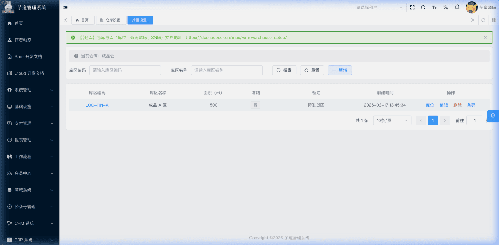
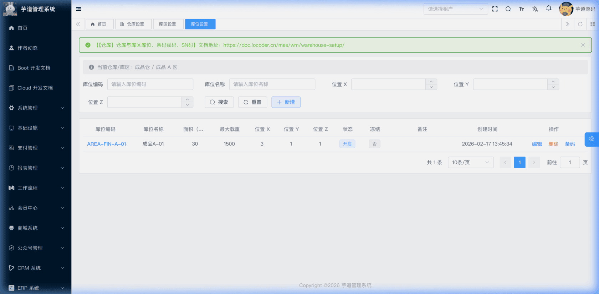
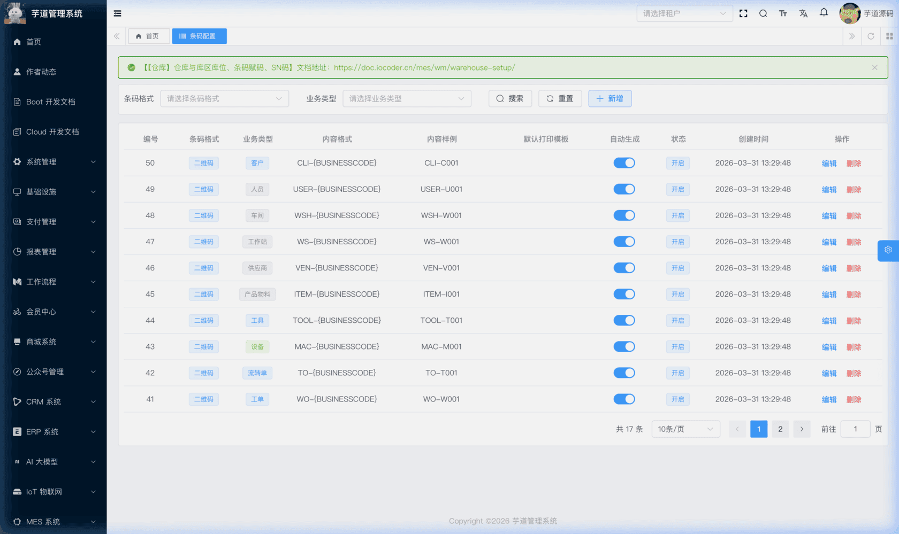
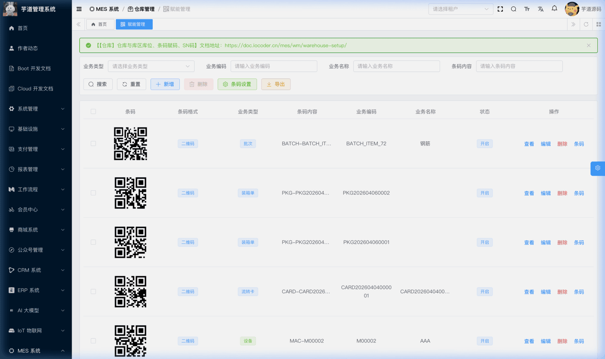
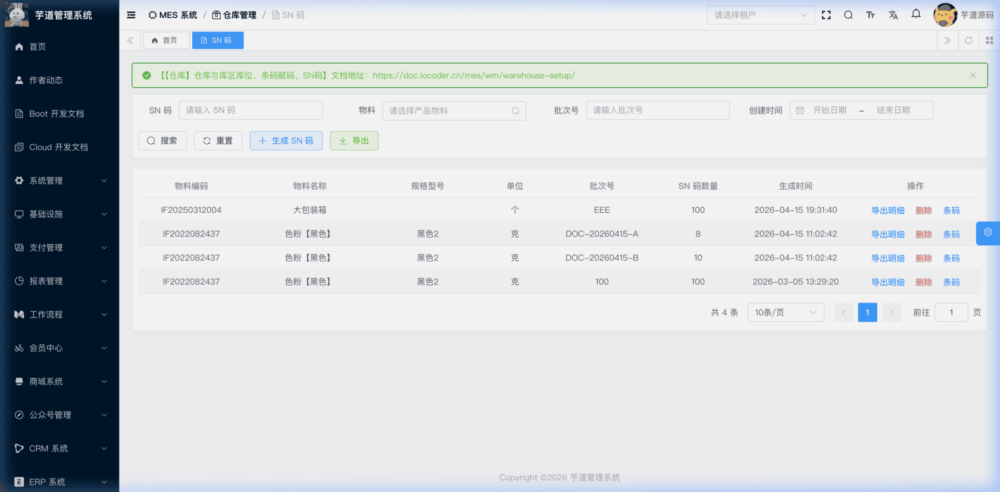
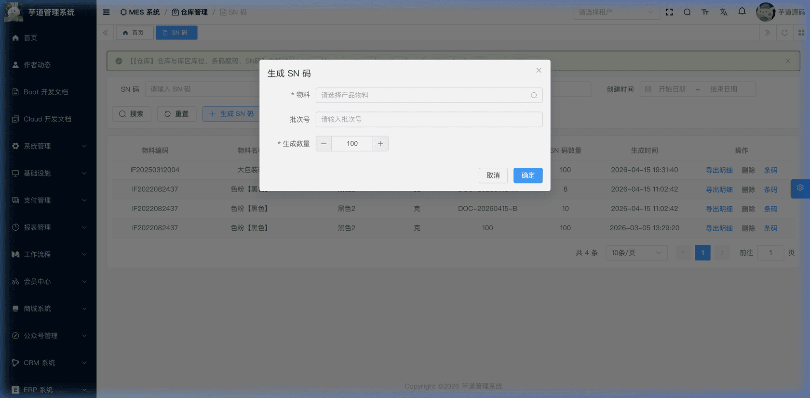

# 【仓库】仓库与库区库位、条码赋码、SN码

仓库基础设置模块，由 `yudao-module-mes` 后端模块的 `wm.warehouse`、`wm.barcode`、`wm.sn` 包实现，是仓储管理的**基础设施层**，为所有出入库单据和库存管理提供底层支撑。
本文涉及三个子模块：
- **仓库与库区库位**：建立 `仓库 → 库区 → 库位` 的三级空间层次结构。出入库单据通常在单据头指定仓库，具体的库区和库位根据业务场景选填。系统还内置了一个**虚拟线边库**（首次访问时自动初始化），用于生产领料场景的在制品管理。
- **条码赋码**：为仓库、库位、物料、工单等各类业务对象生成条码（二维码/条形码），支持通过配置模板自动或手动赋码，前端根据条码内容渲染条码图片。
- **SN 码**：为产品物料生成唯一的序列号（Serial Number），按批次方式批量生成，支持分组管理和导出。
本文涉及表如下图所示：
 
## # 1. 仓库与库区库位
仓库与库区库位构成 MES 仓储管理的三级空间层次，分别由 MesWmWarehouseController、MesWmWarehouseLocationController、MesWmWarehouseAreaController 提供接口。
仓库三级层次结构
仓库（Warehouse）
└── 库区（Location）
└── 库位（Area）
- **仓库**：最高级别的空间划分，代表一个物理仓库，如"成品仓"、"原材料仓"。
- **库区**：仓库内的功能区域划分，如"A 区"、"B 区"。
- **库位**：最小的存储单元，对应一个具体的货架/货位，如"A-01-01"。
出入库单据通常在单据头指定**仓库**，具体的**库区**和**库位**根据业务场景选填（部分单据行的 SaveReqVO 并不包含这些字段，校验逻辑也允许为空）。
如果工厂在管理过程中并未细分库区、库位，可约定每个仓库仅维护一个通用库区，每个库区仅维护一个通用库位即可。
### # 1.1 仓库表结构
省略 creator/create_time/updater/update_time/deleted/tenant_id 等通用字段
CREATE TABLE `mes_wm_warehouse` (
`id` bigint NOT NULL AUTO_INCREMENT COMMENT '编号',
`code` varchar(64) NOT NULL COMMENT '仓库编码',
`name` varchar(255) NOT NULL COMMENT '仓库名称',
`address` varchar(255) DEFAULT NULL COMMENT '仓库地址',
`area` decimal(14,2) DEFAULT NULL COMMENT '面积',
`charge_user_id` bigint DEFAULT NULL COMMENT '负责人用户编号',
`frozen` tinyint(1) NOT NULL DEFAULT '0' COMMENT '是否冻结',
`remark` varchar(500) DEFAULT NULL COMMENT '备注',
PRIMARY KEY (`id`)
) ENGINE=InnoDB COMMENT='MES 仓库';
① `charge_user_id` 关联 `system_users` 表的 `id` 字段，标识仓库负责人。
② `frozen` 为冻结标识。冻结后该仓库下的所有出入库操作将受到限制。
虚拟线边库
系统内置一个编码为 `WIP_VIRTUAL_WAREHOUSE` 的**虚拟线边库**，在首次按虚拟编码取数时由 MesWmWarehouseServiceImpl 的 `getWarehouseByCode` 方法自动初始化创建，无需 SQL 脚本。
**业务背景**：在线边库模式下，物料从总仓库发放到车间，但未被工序消耗前，这部分物料属于在制品（WIP）。虚拟线边库在不增加物理库位管理复杂度的前提下，防止生产报工被负库存阻塞。
虚拟线边库同时配套虚拟库区（`WIP_VIRTUAL_LOCATION`）和虚拟库位（`WIP_VIRTUAL_AREA`），构成完整的三级层次。 创建时会级联初始化：MesWmWarehouseAreaServiceImpl 的 `getWarehouseAreaByCode` → MesWmWarehouseLocationServiceImpl 的 `getWarehouseLocationByCode` → MesWmWarehouseServiceImpl 的 `getWarehouseByCode`，确保仓库、库区、库位三级结构同时就绪。
### # 1.2 库区表结构
省略 creator/create_time/updater/update_time/deleted/tenant_id 等通用字段
CREATE TABLE `mes_wm_warehouse_location` (
`id` bigint NOT NULL AUTO_INCREMENT COMMENT '编号',
`code` varchar(64) NOT NULL COMMENT '库区编码',
`name` varchar(255) NOT NULL COMMENT '库区名称',
`warehouse_id` bigint NOT NULL COMMENT '仓库编号',
`area` decimal(14,2) DEFAULT NULL COMMENT '面积',
`frozen` tinyint(1) NOT NULL DEFAULT '0' COMMENT '是否冻结',
`remark` varchar(500) DEFAULT NULL COMMENT '备注',
PRIMARY KEY (`id`)
) ENGINE=InnoDB COMMENT='MES 库区';
① `warehouse_id` 关联 `mes_wm_warehouse` 表的 `id` 字段，标识该库区所属的仓库。库区是仓库的下级层次。
② `frozen` 为冻结标识。冻结后该库区下的所有出入库操作将受到限制。
### # 1.3 库位表结构
省略 creator/create_time/updater/update_time/deleted/tenant_id 等通用字段
CREATE TABLE `mes_wm_warehouse_area` (
`id` bigint NOT NULL AUTO_INCREMENT COMMENT '编号',
`code` varchar(64) NOT NULL COMMENT '库位编码',
`name` varchar(255) NOT NULL COMMENT '库位名称',
`location_id` bigint NOT NULL COMMENT '库区编号',
`area` decimal(14,2) DEFAULT NULL COMMENT '面积',
`max_load` decimal(14,2) DEFAULT NULL COMMENT '最大载重',
`position_x` int DEFAULT NULL COMMENT '位置 X',
`position_y` int DEFAULT NULL COMMENT '位置 Y',
`position_z` int DEFAULT NULL COMMENT '位置 Z',
`status` tinyint NOT NULL DEFAULT '0' COMMENT '状态',
`frozen` tinyint(1) NOT NULL DEFAULT '0' COMMENT '是否冻结',
`allow_item_mixing` tinyint(1) NOT NULL DEFAULT '1' COMMENT '是否允许物料混放',
`allow_batch_mixing` tinyint(1) NOT NULL DEFAULT '1' COMMENT '是否允许批次混放',
`remark` varchar(500) DEFAULT NULL COMMENT '备注',
PRIMARY KEY (`id`)
) ENGINE=InnoDB COMMENT='MES 库位';
① `location_id` 关联 `mes_wm_warehouse_location` 表的 `id` 字段，标识该库位所属的库区。库位是库区的下级层次。
② `status` 为库位状态，对应 CommonStatusEnum 枚举。
③ `frozen` 为冻结标识。冻结后该库位的出入库操作将受到限制。
④ `allow_item_mixing` 为是否允许物料混放。关闭时同一个库位只能存放同一种物料。
⑤ `allow_batch_mixing` 为是否允许批次混放。关闭时同一库位只能存放同一批次的物料。
### # 1.4 管理后台
仓库设置对应 [MES 系统 -> 仓库管理 -> 仓库设置] 菜单，库区和库位页面分别由仓库列表和库区列表的操作列按钮逐级下钻进入（非左侧独立菜单项）。前端对应 `yudao-ui-admin-vue3` 项目的 `@/views/mes/wm/warehouse` 目录。
#### # 仓库列表
支持按仓库编码、仓库名称等条件搜索。列表展示仓库编码、名称、地址、面积、负责人、冻结状态等信息。新增/修改时填写仓库编码、名称、地址、面积、负责人、是否冻结等。
 
#### # 库区列表
库区页面由仓库列表的操作列【库区】按钮进入，自动定位到当前仓库。支持按库区编码、库区名称等条件搜索。列表展示库区编码、名称、面积、冻结状态等信息。新增/修改时所属仓库由上级上下文自动关联。
 
#### # 库位列表
库位页面由库区列表的操作列【库位】按钮进入，自动定位到当前仓库/库区。支持按库位编码、库位名称、位置 X/Y/Z 等条件搜索。列表展示库位编码、名称、面积、最大载重、位置坐标、状态、冻结标识等信息。新增/修改时所属仓库和库区由上级上下文自动关联，并可设置是否允许物料混放、批次混放。
 
## # 2. 条码赋码
条码赋码由**条码配置**和**条码清单**两部分组成。条码配置定义各业务类型的条码生成规则，条码清单存储实际生成的每一条条码记录。分别由 MesWmBarcodeConfigController 和 MesWmBarcodeController 提供接口。
### # 2.1 条码配置表结构
省略 creator/create_time/updater/update_time/deleted/tenant_id 等通用字段
CREATE TABLE `mes_wm_barcode_config` (
`id` bigint NOT NULL AUTO_INCREMENT COMMENT '编号',
`format` tinyint NOT NULL COMMENT '条码格式',
`biz_type` smallint NOT NULL COMMENT '业务类型',
`content_format` varchar(255) NOT NULL COMMENT '内容格式模板',
`content_example` varchar(255) DEFAULT NULL COMMENT '内容样例',
`auto_generate_flag` bit(1) NOT NULL DEFAULT b'1' COMMENT '是否自动生成',
`default_template` varchar(255) DEFAULT NULL COMMENT '默认打印模板',
`status` tinyint NOT NULL DEFAULT '0' COMMENT '状态',
`remark` varchar(500) DEFAULT NULL COMMENT '备注',
PRIMARY KEY (`id`)
) ENGINE=InnoDB COMMENT='MES 条码配置';
① `format` 为条码格式，枚举 BarcodeFormatEnum（1=二维码 QR_CODE，2=EAN13，3=CODE39，4=UPC-A）。
② `biz_type` 为业务类型，枚举 BarcodeBizTypeEnum，定义了可以赋码的业务对象。
同一租户下同一 `biz_type` 只能有一条条码配置（通过 MesWmBarcodeConfigServiceImpl 的 `validateBarcodeConfigBizTypeUnique` 方法在创建和修改时做唯一性校验，数据库同时有唯一索引保证）。涵盖仓库、库区、库位、物料、工单、设备、供应商、客户、工作站等多种业务对象。
③ `content_format` 为内容格式模板，支持 `{BUSINESSCODE}` 占位符。生成条码内容时，系统将 `{BUSINESSCODE}` 替换为实际的业务编码。例如配置 `ITEM-{BUSINESSCODE}`，当物料编码为 `M001` 时，生成的条码内容为 `ITEM-M001`。
④ `auto_generate_flag` 为是否自动生成，默认开启。开启后，当创建相应业务对象（如创建物料）时，系统会自动调用 `autoGenerateBarcode` 方法生成条码记录，无需手动操作。
⑤ `default_template` 为默认打印模板（预留字段，暂未使用）。
⑥ `status` 为启用状态，对应 CommonStatusEnum 枚举。
### # 2.2 条码清单表结构
省略 creator/create_time/updater/update_time/deleted/tenant_id 等通用字段
CREATE TABLE `mes_wm_barcode` (
`id` bigint NOT NULL AUTO_INCREMENT COMMENT '编号',
`config_id` bigint DEFAULT NULL COMMENT '条码配置编号',
`format` tinyint NOT NULL COMMENT '条码格式',
`biz_type` smallint NOT NULL COMMENT '业务类型',
`biz_id` bigint NOT NULL COMMENT '业务编号',
`biz_code` varchar(64) DEFAULT NULL COMMENT '业务编码',
`biz_name` varchar(255) DEFAULT NULL COMMENT '业务名称',
`content` varchar(255) NOT NULL COMMENT '条码内容',
`status` tinyint NOT NULL DEFAULT '0' COMMENT '状态',
`remark` varchar(500) DEFAULT NULL COMMENT '备注',
PRIMARY KEY (`id`)
) ENGINE=InnoDB COMMENT='MES 条码清单';
① `config_id` 关联 `mes_wm_barcode_config` 表的 `id` 字段，标识生成该条码所使用的配置。创建时自动根据 `biz_type` 匹配对应的条码配置。
② `format` 为条码格式，从条码配置中自动带入。前端根据此字段决定渲染二维码还是条形码。
③ `biz_type`、`biz_id`、`biz_code`、`biz_name` 为关联的业务对象标识。同一 `biz_type + biz_id` 组合唯一，同一 `content` 也全局唯一（均通过 MesWmBarcodeServiceImpl 的 `validateBarcodeUnique` 和 `generateAndValidateContent` 方法在常规流程下由 Service 层校验）。
④ `content` 为条码内容，核心字段。前端根据此内容生成条码图片。如果前端未传递，系统会根据条码配置的 `content_format` 模板和 `biz_code` 自动生成。
⑤ `status` 为启用状态，对应 CommonStatusEnum 枚举。
### # 2.3 管理后台
条码清单对应 [MES 系统 -> 仓库管理 -> 赋能管理] 菜单，条码配置是一个**隐藏路由**（`visible=0`），通过赋能管理页面工具栏的【条码设置】按钮 `push({ name: 'MesWmBarcodeConfig' })` 进入，左侧菜单不单独展示。
前端分别对应 `yudao-ui-admin-vue3` 项目的 `@/views/mes/wm/barcode`（条码清单）和 `@/views/mes/wm/barcode/config`（条码配置）目录。
#### # 条码配置列表
展示所有条码配置，包含条码格式、业务类型、内容格式模板、内容样例、是否自动生成、启用状态等。
 
#### # 条码清单列表
支持按业务类型、业务编码、业务名称、条码内容等条件搜索。列表展示条码格式、业务类型、条码内容、业务编码/名称、状态等信息。
 
#### # 生成条码内容
通过 MesWmBarcodeController 的 `generateBarcodeContent` 方法，传入业务类型（`bizType`）和业务编码（`bizCode`），系统使用对应配置的内容格式模板生成条码内容字符串，前端表单在选择业务对象后自动调用该接口。
例如：`bizType=600`（物料）、`bizCode=M001`，若配置模板为 `ITEM-{BUSINESSCODE}`，则返回 `ITEM-M001`。
## # 3. SN 码
SN 码（Serial Number，序列号），由 MesWmSnController 提供接口。
### # 3.1 表结构
省略 creator/create_time/updater/update_time/deleted/tenant_id 等通用字段
CREATE TABLE `mes_wm_sn` (
`id` bigint NOT NULL AUTO_INCREMENT COMMENT '编号',
`uuid` varchar(64) DEFAULT NULL COMMENT '批次 UUID',
`code` varchar(64) NOT NULL COMMENT 'SN 码',
`item_id` bigint NOT NULL COMMENT '物料编号',
`batch_code` varchar(100) DEFAULT NULL COMMENT '批次号',
`work_order_id` bigint DEFAULT NULL COMMENT '生产工单编号',
PRIMARY KEY (`id`)
) ENGINE=InnoDB COMMENT='MES SN 码';
① `uuid` 为批次 UUID，标记同一批次生成的 SN 码。每次调用生成接口时，系统自动生成一个 UUID 作为批次标识，方便按批次管理（分组展示、按批次导出、按批次删除）。
② `code` 为 SN 码，唯一标识一个产品个体。由编码规则自动生成。
③ `item_id` 关联 `mes_md_item` 表的 `id` 字段（必填），标识该 SN 码对应的产品物料，详见 [《【基础】物料产品、分类、计量单位》](/mes/md/product/)。
④ `batch_code` 为批次号（选填），可关联批次管理。
⑤ `work_order_id` 关联 `mes_pro_work_order` 表的 `id` 字段（选填），标识该 SN 码关联的生产工单。目前仅作为信息标识存储，暂未在业务流程中引用。
### # 3.2 管理后台
对应 [MES 系统 -> 仓库管理 -> SN 码] 菜单，对应 `yudao-ui-admin-vue3` 项目的 `@/views/mes/wm/sn` 目录。
#### # 列表（分组视图）
SN 码列表采用**分组视图**展示，以批次 UUID 为维度聚合显示。每条分组记录展示：物料编码/名称/规格、单位、批次号、SN 数量、生成时间。支持按 SN 码、物料、批次号、创建时间等条件搜索。
操作列提供：导出明细（导出该批次所有 SN 码的 Excel）、删除（按批次 UUID 批量删除）。
 
#### # 生成 SN 码
点击【生成 SN 码】按钮，弹出生成表单，填写物料（必填）、批次号（选填）、生成数量（1~1000）。
系统在一次事务中批量生成指定数量的 SN 码，所有码共享同一个批次 UUID。每条 SN 码通过编码规则自动生成唯一编号。
 
#### # 批量删除
按批次 UUID 删除同批次的所有 SN 码。
.pageB img{width:80px!important;}
.wwads-horizontal .wwads-text, .wwads-content .wwads-text{line-height:1;}
[【生产】工作记录](/mes/pro/work-record/) [【仓库】批次管理、库存现有量、库存事务](/mes/wm/stock/) 
←
[【生产】工作记录](/mes/pro/work-record/) [【仓库】批次管理、库存现有量、库存事务](/mes/wm/stock/)→
 
Theme by
[Vdoing](https://github.com/xugaoyi/vuepress-theme-vdoing) 
| Copyright © 2019-2026
芋道源码 | MIT License   
- 跟随系统
- 浅色模式
- 深色模式
- 阅读模式
× 
.windowRB{ padding: 0;}
.windowRB .wwads-img{margin-top: 10px;}
.windowRB .wwads-content{margin: 0 10px 10px 10px;}
.custom-html-window-rb .close-but{
display: none;
}