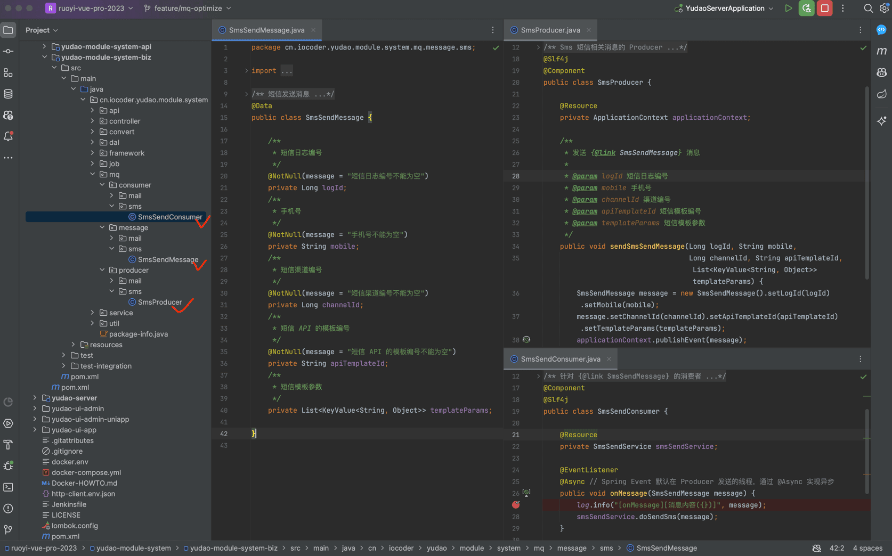

# 消息队列（内存）

## # 1. Spring Event
[`yudao-spring-boot-starter-mq` (opens new window)](https://github.com/YunaiV/ruoyi-vue-pro/blob/master/yudao-framework/yudao-spring-boot-starter-mq/) 技术组件，提供了 Redis、RocketMQ、RabbitMQ、Kafka 分布式消息队列的封装。
考虑到部分同学的项目对消息队列的要求不高，又不想引入额外部署的消息队列，所以**默认**使用 Spring Event 实现【内存】级别的消息队列。
疑问：为什么默认不使用 Redis 作为消息队列？
这确实是一种选择，但是想要使用 Redis 实现可靠的消息队列，必须使用 Redis 5.0 版本的 Stream 特性。
这样一方面对 Redis 要求的版本比较高，另一方面大多数同学对 Redis Stream 基本不了解，生产经验不足。
如果你对 Spring Event 不太了解，可以看看 [《芋道 Spring Boot 事件机制 Event 入门》 (opens new window)](https://www.iocoder.cn/Spring-Boot/Event/?yudao) 文档。
## # 2. 使用示例
以【短信发送】举例子，我们来看看 Spring Event 的使用。如下图所示：
图片纠错：最新版本不区分 yudao-module-bpm-api 和 yudao-module-bpm-biz 子模块，代码直接合并到 yudao-module-bpm 模块的 src 目录下，更适合单体项目
 
### # 2.1 Message 消息
在 `message` 包下，新建 SmsSendMessage 类，短信发送消息。代码如下：
@Data
public class SmsSendMessage {
/**
* 短信日志编号
*/
@NotNull(message = "短信日志编号不能为空")
private Long logId;
/**
* 手机号
*/
@NotNull(message = "手机号不能为空")
private String mobile;
/**
* 短信渠道编号
*/
@NotNull(message = "短信渠道编号不能为空")
private Long channelId;
/**
* 短信 API 的模板编号
*/
@NotNull(message = "短信 API 的模板编号不能为空")
private String apiTemplateId;
/**
* 短信模板参数
*/
private List> templateParams;
}
### # 2.2 SmsProducer 生产者
在 `producer` 包下，新建 SmsProducer 类，Sms 短信相关消息的生产者。代码如下：
@Slf4j
@Component
public class SmsProducer {
@Resource
private ApplicationContext applicationContext;
/**
* 发送 {@link SmsSendMessage} 消息
*
* @param logId 短信日志编号
* @param mobile 手机号
* @param channelId 渠道编号
* @param apiTemplateId 短信模板编号
* @param templateParams 短信模板参数
*/
public void sendSmsSendMessage(Long logId, String mobile,
Long channelId, String apiTemplateId, List> templateParams) {
SmsSendMessage message = new SmsSendMessage().setLogId(logId).setMobile(mobile);
message.setChannelId(channelId).setApiTemplateId(apiTemplateId).setTemplateParams(templateParams);
applicationContext.publishEvent(message);
}
}
### # 2.3 SmsSendConsumer 消费者
在 `consumer` 包下，新建 SmsSendConsumer 类，SmsSendMessage 的消费者。代码如下：
@Component
@Slf4j
public class SmsSendConsumer {
@Resource
private SmsSendService smsSendService;
@EventListener
@Async // Spring Event 默认在 Producer 发送的线程，通过 @Async 实现异步
public void onMessage(SmsSendMessage message) {
log.info("[onMessage][消息内容({})]", message);
smsSendService.doSendSms(message);
}
}
### # 2.4 简单测试
① Debug 启动后端项目，可以在 SmsProducer 和 SmsSendConsumer 上面打上断点，稍微调试下。
② 打开 `SmsTemplateController.http` 文件，使用 IDEA httpclient 发起请求，发送短信。如下图所示：
图片纠错：最新版本不区分 yudao-module-bpm-api 和 yudao-module-bpm-biz 子模块，代码直接合并到 yudao-module-bpm 模块的 src 目录下，更适合单体项目
 如果 IDEA 控制台看到 `[onMessage][消息内容` 日志内容，说明消息的发送和消费成功。
.pageB img{width:80px!important;}
.wwads-horizontal .wwads-text, .wwads-content .wwads-text{line-height:1;}
[定时任务](/job/) [消息队列（Redis）](/message-queue/redis/) 
←
[定时任务](/job/) [消息队列（Redis）](/message-queue/redis/)→
 
Theme by
[Vdoing](https://github.com/xugaoyi/vuepress-theme-vdoing) 
| Copyright © 2019-2026
芋道源码 | MIT License   
- 跟随系统
- 浅色模式
- 深色模式
- 阅读模式
× 
.windowRB{ padding: 0;}
.windowRB .wwads-img{margin-top: 10px;}
.windowRB .wwads-content{margin: 0 10px 10px 10px;}
.custom-html-window-rb .close-but{
display: none;
}