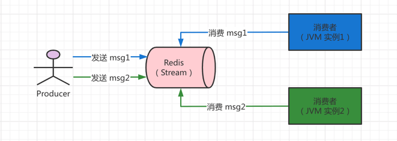
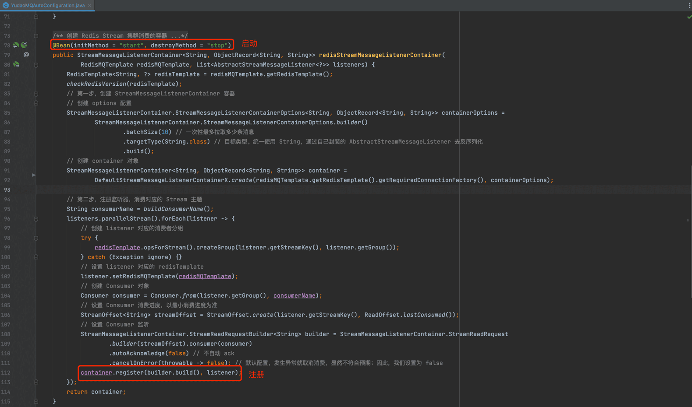
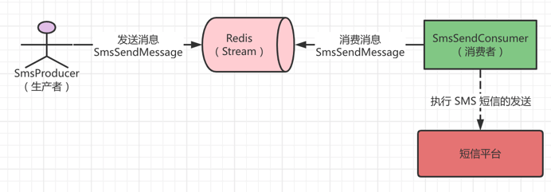
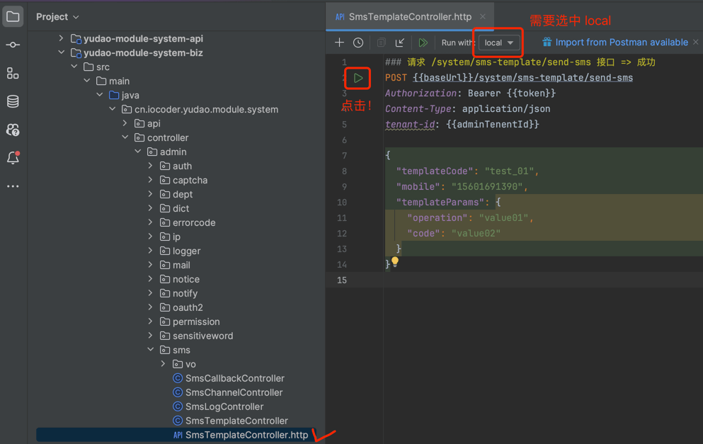
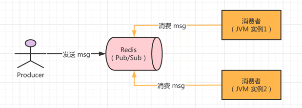
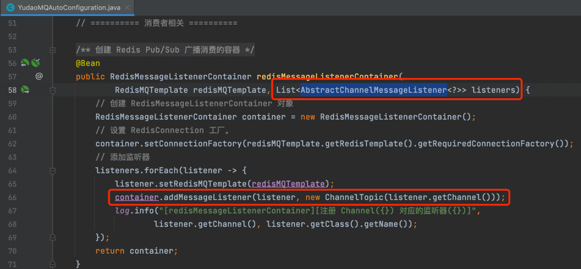

# 消息队列（Redis）

[`yudao-spring-boot-starter-mq` (opens new window)](https://github.com/YunaiV/ruoyi-vue-pro/blob/master/yudao-framework/yudao-spring-boot-starter-mq/) 技术组件，基于 Redis 实现分布式消息队列：
- 使用 [Stream (opens new window)](http://www.redis.cn/topics/streams-intro.html) 特性，提供【集群】消费的能力。
- 使用 [Pub/Sub (opens new window)](http://www.redis.cn/topics/pubsub.html) 特性，提供【广播】消费的能力。
疑问：什么是【广播】消费？什么是【集群】消费？
参见[《阿里云 —— 集群消费和广播消费 》 (opens new window)](https://help.aliyun.com/zh/apsaramq-for-rocketmq/cloud-message-queue-rocketmq-4-x-series/developer-reference/clustering-consumption-and-broadcasting-consumption)文档
## # 1. 集群消费
集群消费，是指消息发送到 Redis 时，有且只会被一个消费者（应用 JVM 实例）收到，然后消费成功。如下图所示：
 友情提示：
如果你需要使用到【集群】消费，必须使用 Redis 5.0.0 以上版本，因为 Stream 特性是在该版本之后才引入噢！
### # 1.1 使用场景
集群消费在项目中的使用场景，主要是提供可靠的、可堆积的异步任务的能力。例如说：
- 短信模块，使用它[异步 (opens new window)](https://github.com/YunaiV/ruoyi-vue-pro/blob/master/yudao-module-system/src/main/java/cn/iocoder/yudao/module/system/mq/consumer/sms/SmsSendConsumer.java)发送短信。
- 邮件模块，使用它[异步 (opens new window)](https://github.com/YunaiV/ruoyi-vue-pro/blob/master/yudao-module-system/src/main/java/cn/iocoder/yudao/module/system/mq/consumer/mail/MailSendConsumer.java)发送邮件。
相比 [《开发指南 —— 异步任务》](/async-task) 来说，Spring Async 在 JVM 实例重启时，会导致未执行完的任务丢失。而集群消费，因为消息是存储在 Redis 中，所以不会存在该问题。
### # 1.2 实现源码
集群消费基于 Redis Stream 实现：
- 实现 AbstractRedisStreamMessage 抽象类，定义【集群】消息。
- 使用 RedisMQTemplate 的 `#send(message)` 方法，发送消息。
- 实现 AbstractRedisStreamMessageListener 接口，消费消息。
最终使用 YudaoRedisMQAutoConfiguration 配置类，扫描所有的 AbstractRedisStreamMessageListener 监听器，初始化对应的消费者。如下图所示：
 
### # 1.3 实战案例
以【短信发送】举例子，改造使用 Redis 作为消息队列，同时也是讲解集群消费的使用。如下图所示：
 
#### # 1.3.0 引入依赖
在 `yudao-module-system` 模块中，引入 `yudao-spring-boot-starter-mq` 技术组件。如下所示：
cn.iocoder.boot
yudao-spring-boot-starter-mq
#### # 1.3.1 Message 消息
在 `message` 包下，修改 SmsSendMessage 类，短信发送消息。代码如下：
@Data
public class SmsSendMessage extends AbstractRedisStreamMessage { // 重点：需要继承 AbstractRedisStreamMessage 类
/**
* 短信日志编号
*/
@NotNull(message = "短信日志编号不能为空")
private Long logId;
/**
* 手机号
*/
@NotNull(message = "手机号不能为空")
private String mobile;
/**
* 短信渠道编号
*/
@NotNull(message = "短信渠道编号不能为空")
private Long channelId;
/**
* 短信 API 的模板编号
*/
@NotNull(message = "短信 API 的模板编号不能为空")
private String apiTemplateId;
/**
* 短信模板参数
*/
private List> templateParams;
}
#### # 1.3.2 SmsProducer 生产者
在 `producer` 包下，修改 SmsProducer 类，Sms 短信相关消息的生产者。代码如下：
@Slf4j
@Component
public class SmsProducer {
@Resource
private RedisMQTemplate redisMQTemplate; // 重点：注入 RedisMQTemplate 对象
/**
* 发送 {@link SmsSendMessage} 消息
*
* @param logId 短信日志编号
* @param mobile 手机号
* @param channelId 渠道编号
* @param apiTemplateId 短信模板编号
* @param templateParams 短信模板参数
*/
public void sendSmsSendMessage(Long logId, String mobile,
Long channelId, String apiTemplateId, List> templateParams) {
SmsSendMessage message = new SmsSendMessage().setLogId(logId).setMobile(mobile);
message.setChannelId(channelId).setApiTemplateId(apiTemplateId).setTemplateParams(templateParams);
redisMQTemplate.send(message); // 重点：使用 RedisMQTemplate 发送消息
}
}
#### # 1.3.3 SmsSendConsumer 消费者
在 `consumer` 包下，修改 SmsSendConsumer 类，SmsSendMessage 的消费者。代码如下：
@Component
@Slf4j
public class SmsSendConsumer extends AbstractRedisStreamMessageListener { // 重点：继承 AbstractRedisStreamMessageListener 类，并填写对应的 Message 类
@Resource
private SmsSendService smsSendService;
@Override // 重点：实现 onMessage 方法
public void onMessage(SmsSendMessage message) {
log.info("[onMessage][消息内容({})]", message);
smsSendService.doSendSms(message);
}
}
#### # 1.3.4 简单测试
① Debug 启动后端项目，可以在 SmsProducer 和 SmsSendConsumer 上面打上断点，稍微调试下。
② 打开 `SmsTemplateController.http` 文件，使用 IDEA httpclient 发起请求，发送短信。如下图所示：
图片纠错：最新版本不区分 yudao-module-bpm-api 和 yudao-module-bpm-biz 子模块，代码直接合并到 yudao-module-bpm 模块的 src 目录下，更适合单体项目
 如果 IDEA 控制台看到 `[onMessage][消息内容` 日志内容，说明消息的发送和消费成功。
## # 2. 广播消费
广播消费，是指消息发送到 Redis 时，所有消费者（应用 JVM 实例）收到，然后消费成功。如下图所示：
 
### # 2.1 使用场景
例如说，在应用中，缓存了数据字典等配置表在内存中，可以通过 Redis 广播消费，实现每个应用节点都消费消息，刷新本地内存的缓存。
又例如说，我们基于 WebSocket 实现了 IM 聊天，在我们给用户主动发送消息时，因为我们不知道用户连接的是哪个提供 WebSocket 的应用，所以可以通过 Redis 广播消费。每个应用判断当前用户是否是和自己提供的 WebSocket 服务连接，如果是，则推送消息给用户。
### # 2.2 实现源码
广播消费基于 Redis Pub/Sub 实现：
- 实现 AbstractChannelMessage 抽象类，定义【广播】消息。
- 使用 RedisMQTemplate 的 `#send(message)` 方法，发送消息。
- 实现 AbstractRedisChannelMessageListener 接口，消费消息。
最终使用 YudaoRedisMQAutoConfiguration 配置类，扫描所有的 AbstractRedisChannelMessageListener 监听器，初始化对应的消费者。如下图所示：
 
### # 2.3 实战案例
参见 [《开发指南 —— 本地缓存》](/local-cache)
## # 666. 社区贡献相关
- [《Pull Request：实现重试消费、坏消息（死信）逻辑》 (opens new window)](https://github.com/YunaiV/ruoyi-vue-pro/pull/922)
.pageB img{width:80px!important;}
.wwads-horizontal .wwads-text, .wwads-content .wwads-text{line-height:1;}
[消息队列（内存）](/message-queue/event/) [消息队列（RocketMQ）](/message-queue/rocketmq/) 
←
[消息队列（内存）](/message-queue/event/) [消息队列（RocketMQ）](/message-queue/rocketmq/)→
 
Theme by
[Vdoing](https://github.com/xugaoyi/vuepress-theme-vdoing) 
| Copyright © 2019-2026
芋道源码 | MIT License   
- 跟随系统
- 浅色模式
- 深色模式
- 阅读模式
× 
.windowRB{ padding: 0;}
.windowRB .wwads-img{margin-top: 10px;}
.windowRB .wwads-content{margin: 0 10px 10px 10px;}
.custom-html-window-rb .close-but{
display: none;
}