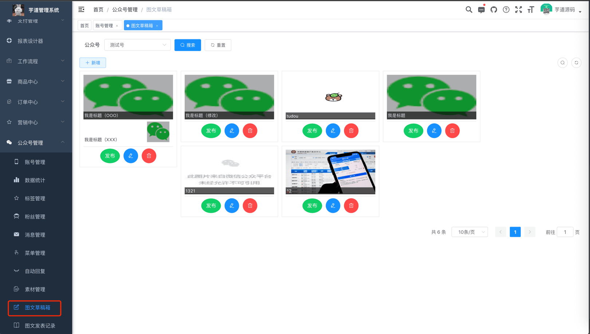
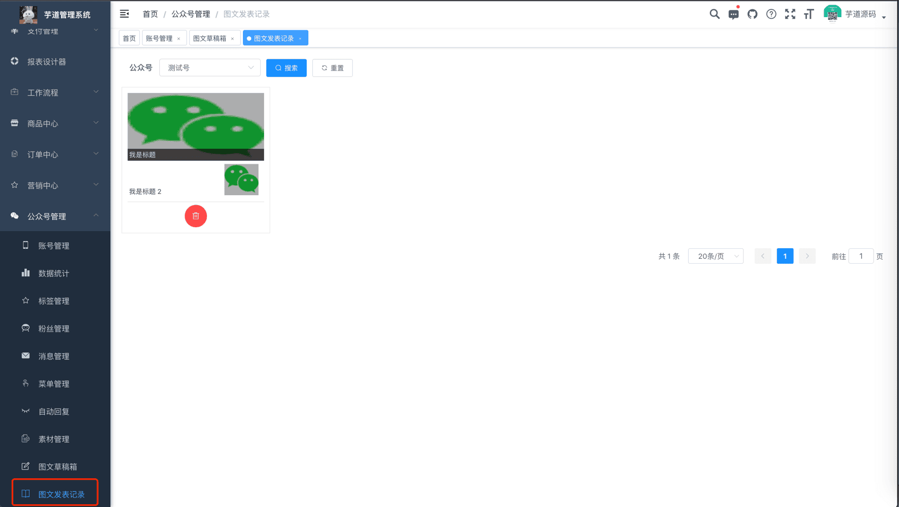

# 公众号图文

本章节，讲解公众号图文的相关内容，包括两部分：
① 在 [公众号管理 -> 图文草稿箱] 菜单中，创建一个图文草稿。如下图所示：
 ② 点击【发布】按钮，将图文草稿发布到公众号，成为一个图文记录，展示在 [公众号管理 -> 图文发表记录] 菜单中。如下图所示：
 
## # 1. 表结构
暂无，全部基于微信公众号提供的 API 接口。
- 图文草稿箱：[《微信公众号官方文档 —— 草稿箱》 (opens new window)](https://developers.weixin.qq.com/doc/offiaccount/Draft_Box/Add_draft.html)
- 图文发表记录：[《微信公众号官方文档 —— 发布能力》 (opens new window)](https://developers.weixin.qq.com/doc/offiaccount/Publish/Publish.html)
## # 2. 图文草稿箱界面
- 前端：[/@views/mp/draft (opens new window)](https://github.com/yudaocode/yudao-ui-admin-vue2/blob/master/src/views/mp/draft/index.vue)
- 后端：[MpDraftController (opens new window)](https://github.com/YunaiV/ruoyi-vue-pro/blob/master/yudao-module-mp/src/main/java/cn/iocoder/yudao/module/mp/controller/admin/news/MpDraftController.java)
## # 3. 图文发表记录界面
- 前端：[/@views/mp/freePublish (opens new window)](https://github.com/yudaocode/yudao-ui-admin-vue2/blob/master/src/views/mp/freePublish/index.vue)
- 后端：[MpFreePublishController (opens new window)](https://github.com/YunaiV/ruoyi-vue-pro/blob/master/yudao-module-mp/src/main/java/cn/iocoder/yudao/module/mp/controller/admin/news/MpFreePublishController.java)
.pageB img{width:80px!important;}
.wwads-horizontal .wwads-text, .wwads-content .wwads-text{line-height:1;}
[公众号素材](/mp/material/) [公众号统计](/mp/statistics/) 
←
[公众号素材](/mp/material/) [公众号统计](/mp/statistics/)→
 
Theme by
[Vdoing](https://github.com/xugaoyi/vuepress-theme-vdoing) 
| Copyright © 2019-2026
芋道源码 | MIT License   
- 跟随系统
- 浅色模式
- 深色模式
- 阅读模式
× 
.windowRB{ padding: 0;}
.windowRB .wwads-img{margin-top: 10px;}
.windowRB .wwads-content{margin: 0 10px 10px 10px;}
.custom-html-window-rb .close-but{
display: none;
}