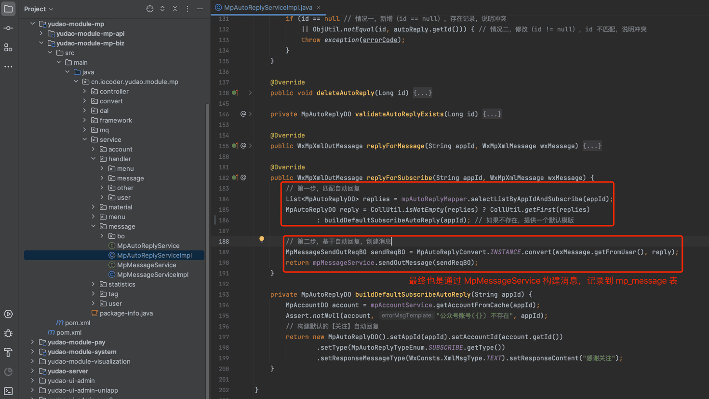
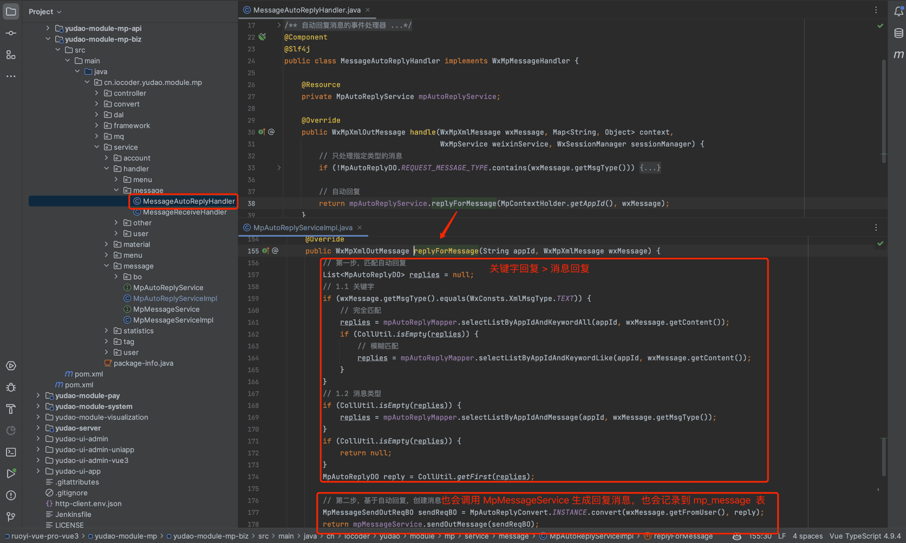

# 自动回复

本章节，讲解自动回复的相关内容，对应 [公众号管理 -> 自动回复] 菜单。如下图所示：
 在用户关注、发送消息时，公众号可以自动回复消息给用户。
## # 1. 表结构
自动回复对应 `mp_auto_reply` 表，结构如下图所示：
 `type` 字段：回复类型，
- 1 - 关注回复：用户关注公众号时
- 3 - 关键字回复：消息类型为文本时，匹配到关键字
- 2 - 消息回复：没有匹配到关键字时，根据消息类型
## # 2. 自动回复界面
- 前端：[/@views/mp/autoReply (opens new window)](https://github.com/yudaocode/yudao-ui-admin-vue2/blob/master/src/views/mp/autoReply/index.vue)
- 后端：[MpAutoReplyController (opens new window)](https://github.com/YunaiV/ruoyi-vue-pro/blob/master/yudao-module-mp/src/main/java/cn/iocoder/yudao/module/mp/controller/admin/message/MpAutoReplyController.java)
## # 3. 关注回复
用户关注公众号时，被动回复用户消息，由 [MpAutoReplyServiceImpl (opens new window)](https://github.com/YunaiV/ruoyi-vue-pro/blob/master/yudao-module-mp/src/main/java/cn/iocoder/yudao/module/mp/service/message/MpAutoReplyServiceImpl.java#L181-L200) 的 `replyForSubscribe` 方法来生成回复内容。如下图所示：
图片纠错：最新版本不区分 yudao-module-mp-api 和 yudao-module-mp-biz 子模块，代码直接合并到 yudao-module-mp 模块的 src 目录下，更适合单体项目
 
## # 4. 消息回复 & 关键字回复
用户发送消息给公众号时，自动回复消息给用户，分为两种情况：
- 关键字回复：消息类型为文本时，匹配到关键字，自动回复消息
- 消息回复：没有匹配到关键字时，根据消息类型，自动回复消息
这两种情况，由 [MessageAutoReplyHandler (opens new window)](https://github.com/YunaiV/ruoyi-vue-pro/blob/master/yudao-module-mp/src/main/java/cn/iocoder/yudao/module/mp/service/handler/message/MessageAutoReplyHandler.java) 调用 [MpAutoReplyServiceImpl (opens new window)](https://github.com/YunaiV/ruoyi-vue-pro/blob/master/yudao-module-mp/src/main/java/cn/iocoder/yudao/module/mp/service/message/MpAutoReplyServiceImpl.java#L154-L179) 的 `replyForMessage` 方法来生成回复内容。如下图所示：
图片纠错：最新版本不区分 yudao-module-mp-api 和 yudao-module-mp-biz 子模块，代码直接合并到 yudao-module-mp 模块的 src 目录下，更适合单体项目
 
.pageB img{width:80px!important;}
.wwads-horizontal .wwads-text, .wwads-content .wwads-text{line-height:1;}
[模版消息](/mp/message-template/) [公众号菜单](/mp/menu/) 
←
[模版消息](/mp/message-template/) [公众号菜单](/mp/menu/)→
 
Theme by
[Vdoing](https://github.com/xugaoyi/vuepress-theme-vdoing) 
| Copyright © 2019-2026
芋道源码 | MIT License   
- 跟随系统
- 浅色模式
- 深色模式
- 阅读模式
× 
.windowRB{ padding: 0;}
.windowRB .wwads-img{margin-top: 10px;}
.windowRB .wwads-content{margin: 0 10px 10px 10px;}
.custom-html-window-rb .close-but{
display: none;
}