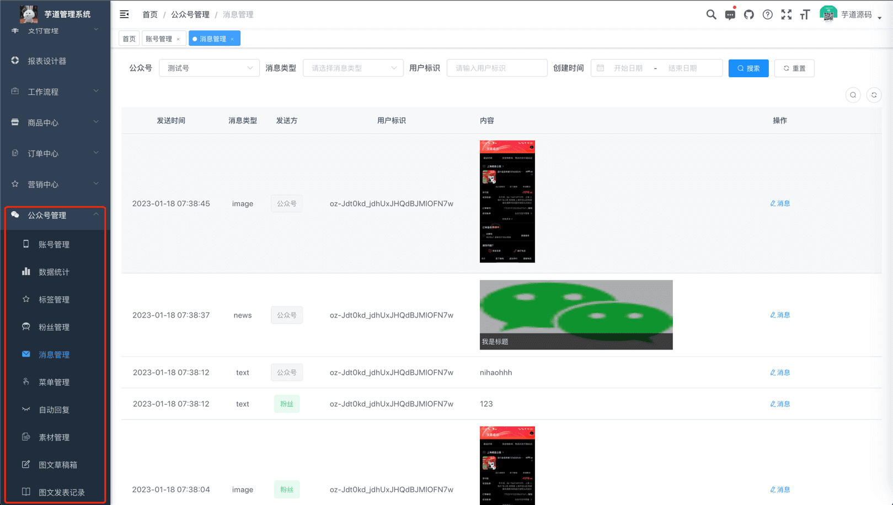
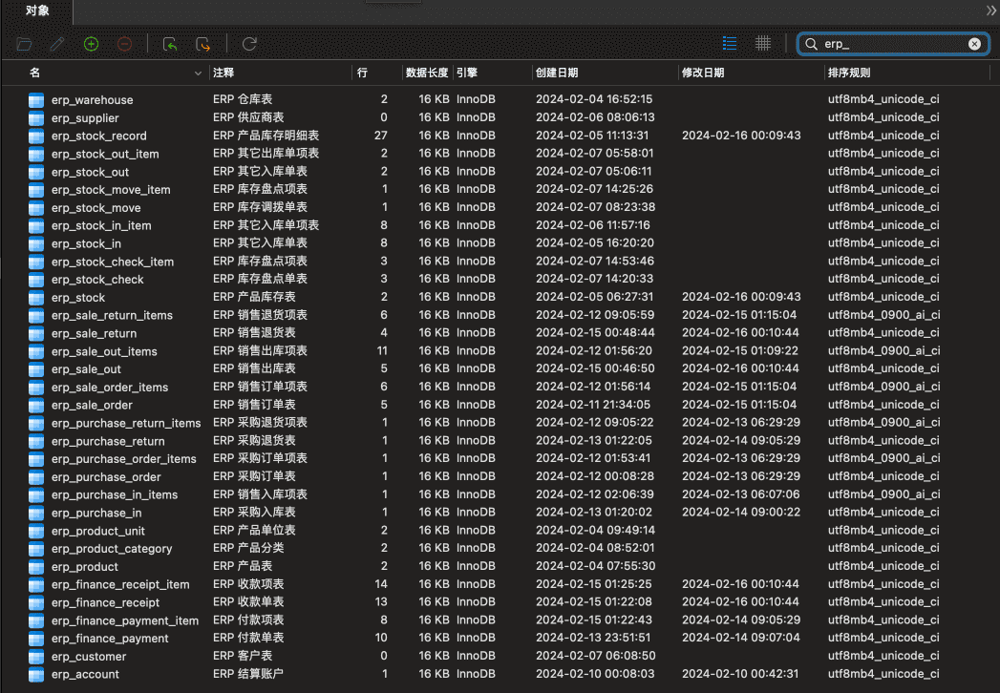

# 功能开启

[微信公众号](https://developers.weixin.qq.com/doc/offiaccount/Getting_Started/Overview.html)的功能，由 [`yudao-module-mp`](https://github.com/YunaiV/ruoyi-vue-pro/blob/master/yudao-module-mp/) 模块实现，对应前端代码为 [`@/views/mp`](https://github.com/yudaocode/yudao-ui-admin-vue3/tree/master/src/views/mp) 目录。
主要包括如下 10 个功能（菜单）：
 功能 描述 账号管理 配置接入的微信公众号，可支持多个公众号 数据统计 统计公众号的用户增减、累计用户、消息概况、接口分析等数据 粉丝管理 查看已关注、取关的粉丝列表，可对粉丝进行同步、打标签等操作 消息管理 查看粉丝发送的消息列表，可主动回复粉丝消息 模版消息 配置和发送模版消息，用于向粉丝推送通知类消息 自动回复 自动回复粉丝发送的消息，支持关注回复、消息回复、关键字回复 标签管理 对公众号的标签进行创建、查询、修改、删除等操作 菜单管理 自定义公众号的菜单，也可以从公众号同步菜单 素材管理 管理公众号的图片、语音、视频等素材，支持在线播放语音、视频 图文草稿箱 新增常用的图文素材到草稿箱，可发布到公众号 图文发表记录 查看已发布成功的图文素材，支持删除操作 考虑到编译速度，默认 `yudao-module-mp` 模块是关闭的，需要手动开启。步骤如下：
- 第一步，开启 `yudao-module-mp` 模块
- 第二步，导入公众号的 SQL 数据库脚本
- 第三步，重启后端项目，确认功能是否生效
## # 1. 第一步，开启模块
① 修改根目录的 [`pom.xml`](https://github.com/YunaiV/ruoyi-vue-pro/blob/master/pom.xml) 文件，取消 `yudao-module-mp` 模块的注释。如下图所示：
 ② 修改 `yudao-server` 目录的 [`pom.xml`](https://github.com/YunaiV/ruoyi-vue-pro/blob/master/yudao-server/pom.xml) 文件，引入 `yudao-module-mp` 模块。如下图所示：
 ③ 点击 IDEA 右上角的【Reload All Maven Projects】，刷新 Maven 依赖。如下图所示：
 
## # 2. 第二步，导入 SQL
点击 [`mp-2024-01-05.sql.zip`](https://t.zsxq.com/15fQYbLxU) 下载附件，解压出 SQL 文件，然后导入到数据库中。 如下图所示：
友情提示：↑↑↑ mp.sql 是可以点击下载的！ ↑↑↑
重要说明：该 SQL 仅芋道星球成员可使用和商用，否则视为侵权（索赔 100 万，永久追溯）【下载即视为同意】。
 以 `mp_` 作为前缀的表，就是公众号模块的表。
## # 3. 第三步，重启项目
重启后端项目，然后访问前端的公众号菜单，确认功能是否生效。如下图所示：
 至此，我们就成功开启了公众号的功能 🙂
.pageB img{width:80px!important;}
.wwads-horizontal .wwads-text, .wwads-content .wwads-text{line-height:1;}
[功能开启](/im/build/) [公众号接入](/mp/account/) 
←
[功能开启](/im/build/) [公众号接入](/mp/account/)→
 
Theme by
[Vdoing](https://github.com/xugaoyi/vuepress-theme-vdoing) 
| Copyright © 2019-2026
芋道源码 | MIT License   
- 跟随系统
- 浅色模式
- 深色模式
- 阅读模式
× 
.windowRB{ padding: 0;}
.windowRB .wwads-img{margin-top: 10px;}
.windowRB .wwads-content{margin: 0 10px 10px 10px;}
.custom-html-window-rb .close-but{
display: none;
}