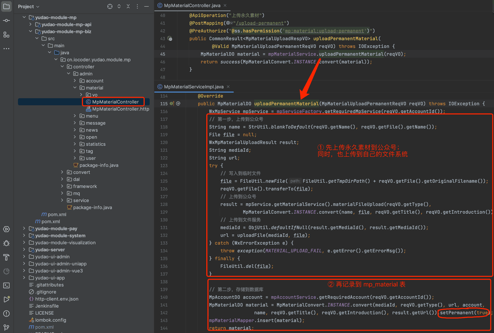
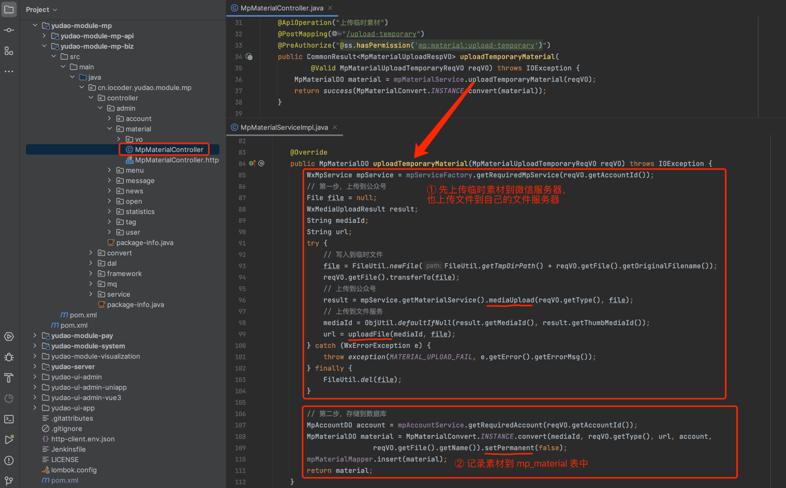
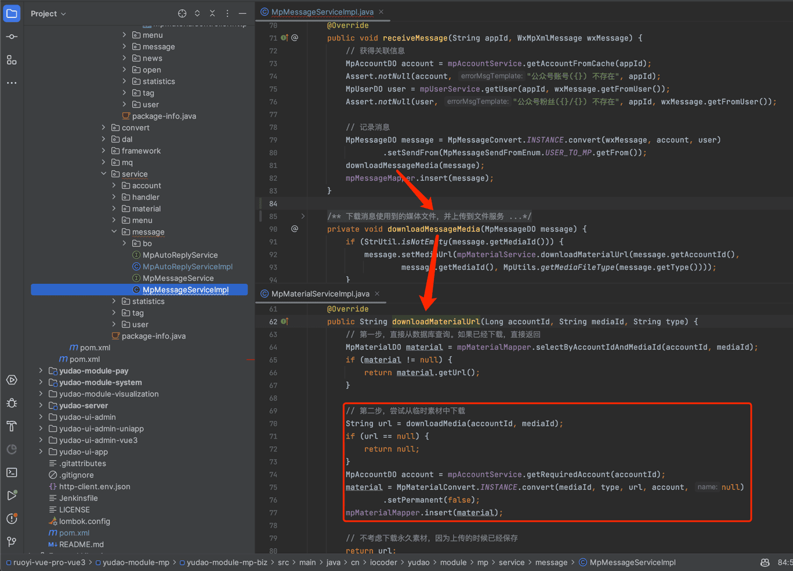

# 公众号素材

本章节，讲解公众号素材的相关内容，包括图片、语音、视频素材，不包括图文素材。对应 [公众号管理 -> 素材管理] 菜单，如下图所示：
 在配置公众号的自动回复、菜单的自动回复、主动给用户发送消息时，都可以使用素材。
## # 1. 表结构
公众号素材对应 `mp_material` 表，结构如下图所示：
 ① `type` 字段：素材类型。对应微信的素材类型，包括 `image` 图片、`voice` 语音、`video` 视频。
② `media_id` 字段：素材的媒体编号，对应微信公众号的 media_id。
③ `permanent` 字段：是否永久。`true` 代表 [永久素材](https://developers.weixin.qq.com/doc/offiaccount/Asset_Management/Adding_Permanent_Assets.html)，`false` 代表 [临时素材](https://developers.weixin.qq.com/doc/offiaccount/Asset_Management/New_temporary_materials.html)。
④ `mp_url` 字段：公众号存储素材的 URL 地址，有且仅有永久素材才有。
⑤ `url` 字段：存储在自己文件服务器上的 URL 地址，解决临时素材只在微信服务器上保存 3 天的问题，也解决图片素材的 `mp_url` 无法在自己管理后台显示的问题。
## # 2. 素材管理界面
- 前端：[/@views/mp/material](https://github.com/yudaocode/yudao-ui-admin-vue2/blob/master/src/views/mp/material/index.vue)
- 后端：[MpMaterialController](https://github.com/YunaiV/ruoyi-vue-pro/blob/master/yudao-module-mp/src/main/java/cn/iocoder/yudao/module/mp/controller/admin/material/MpMaterialController.java)
## # 3. 永久素材
对应 [《微信公众号官方文档 —— 永久素材》](https://developers.weixin.qq.com/doc/offiaccount/Asset_Management/Adding_Permanent_Assets.html) 文档。
[MpMaterialController](https://github.com/YunaiV/ruoyi-vue-pro/blob/master/yudao-module-mp/src/main/java/cn/iocoder/yudao/module/mp/controller/admin/material/MpMaterialController.java#L40-L47) 的 `uploadPermanentMaterial` 方法对应的接口，实现了上传【永久】素材到公众号。如下图所示：
图片纠错：最新版本不区分 yudao-module-mp-api 和 yudao-module-mp-biz 子模块，代码直接合并到 yudao-module-mp 模块的 src 目录下，更适合单体项目
 
## # 4. 临时素材
对应 [《微信公众号官方文档 —— 临时素材》](https://developers.weixin.qq.com/doc/offiaccount/Asset_Management/New_temporary_materials.html) 文档。
① 来源一：主动发送客服消息给用户时，如果是图片、语音、视频素材，需要先上传到微信服务器，获得到 `media_id` 后，才能发送给用户。
此时，可调用 [MpMaterialController](https://github.com/YunaiV/ruoyi-vue-pro/blob/master/yudao-module-mp/src/main/java/cn/iocoder/yudao/module/mp/controller/admin/material/MpMaterialController.java#L31-L38) 的 `uploadTemporaryMaterial` 方法对应的接口，实现了上传【临时】素材到公众号。如下图所示：
图片纠错：最新版本不区分 yudao-module-mp-api 和 yudao-module-mp-biz 子模块，代码直接合并到 yudao-module-mp 模块的 src 目录下，更适合单体项目
 ② 来源二：在接收到用户消息时，如果是图片、语音、视频素材，需要先下载到自己的文件服务器上，避免超过 3 天后无法访问的问题。如下图所示：
图片纠错：最新版本不区分 yudao-module-mp-api 和 yudao-module-mp-biz 子模块，代码直接合并到 yudao-module-mp 模块的 src 目录下，更适合单体项目
 
.pageB img{width:80px!important;}
.wwads-horizontal .wwads-text, .wwads-content .wwads-text{line-height:1;}
[公众号菜单](/mp/menu/) [公众号图文](/mp/article/) 
←
[公众号菜单](/mp/menu/) [公众号图文](/mp/article/)→
 
Theme by
[Vdoing](https://github.com/xugaoyi/vuepress-theme-vdoing) 
| Copyright © 2019-2026
芋道源码 | MIT License   
- 跟随系统
- 浅色模式
- 深色模式
- 阅读模式
× 
.windowRB{ padding: 0;}
.windowRB .wwads-img{margin-top: 10px;}
.windowRB .wwads-content{margin: 0 10px 10px 10px;}
.custom-html-window-rb .close-but{
display: none;
}