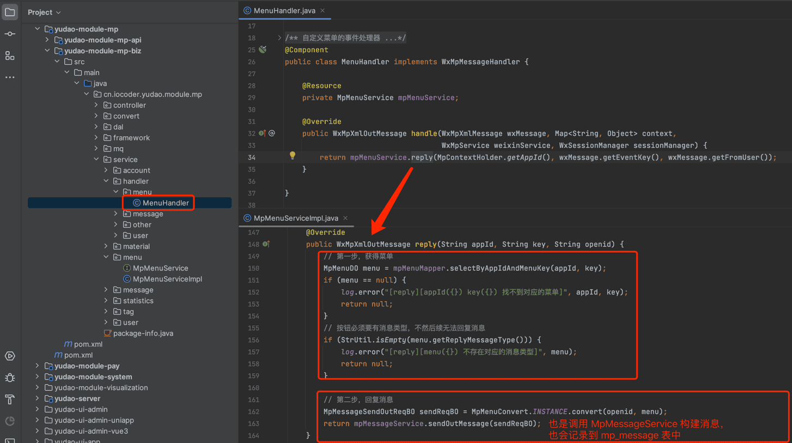

# 公众号菜单

本章节，讲解公众号菜单的相关内容，对应 [公众号管理 -> 菜单管理] 菜单，对应 [《微信公众号官方文档 —— 自定义菜单》](https://developers.weixin.qq.com/doc/offiaccount/Custom_Menus/Creating_Custom-Defined_Menu.html) 文档。如下图所示：
 
## # 1. 表结构
公众号菜单对应 `mp_menu` 表，结构如下图所示：
 `type` 字段：按钮类型。如果类型为 `CLICK` 点击回复时，可进行文本、图片、语音、视频、图文、音乐消息。
## # 2. 菜单管理界面
- 前端：[/@views/mp/menu](https://github.com/yudaocode/yudao-ui-admin-vue2/blob/master/src/views/mp/menu/index.vue)
- 后端：[MpMenuController](https://github.com/YunaiV/ruoyi-vue-pro/blob/master/yudao-module-mp/src/main/java/cn/iocoder/yudao/module/mp/controller/admin/menu/MpMenuController.java)
## # 3. 点击回复
用户点击菜单按钮时，会接收事件消息，进而被 [MenuHandler](https://github.com/YunaiV/ruoyi-vue-pro/blob/master/yudao-module-mp/src/main/java/cn/iocoder/yudao/module/mp/service/handler/menu/MenuHandler.java) 处理。如果类型为 `CLICK` 点击回复时，自动回复对应的消息。如下图所示：
图片纠错：最新版本不区分 yudao-module-mp-api 和 yudao-module-mp-biz 子模块，代码直接合并到 yudao-module-mp 模块的 src 目录下，更适合单体项目
 
.pageB img{width:80px!important;}
.wwads-horizontal .wwads-text, .wwads-content .wwads-text{line-height:1;}
[自动回复](/mp/auto-reply/) [公众号素材](/mp/material/) 
←
[自动回复](/mp/auto-reply/) [公众号素材](/mp/material/)→
 
Theme by
[Vdoing](https://github.com/xugaoyi/vuepress-theme-vdoing) 
| Copyright © 2019-2026
芋道源码 | MIT License   
- 跟随系统
- 浅色模式
- 深色模式
- 阅读模式
× 
.windowRB{ padding: 0;}
.windowRB .wwads-img{margin-top: 10px;}
.windowRB .wwads-content{margin: 0 10px 10px 10px;}
.custom-html-window-rb .close-but{
display: none;
}