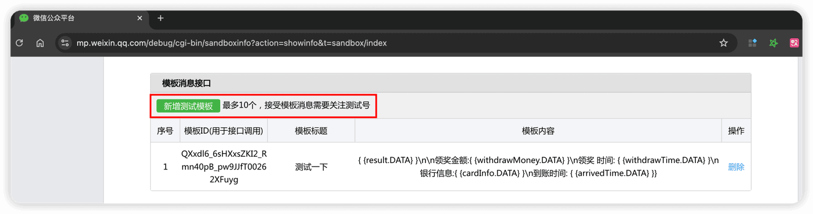
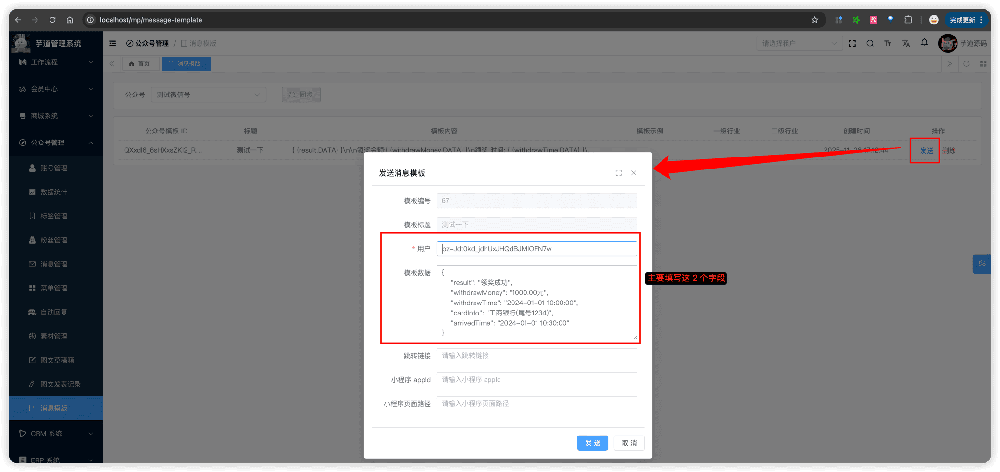

# 模版消息

本章节，讲解模版消息的相关内容，支持对模版进行同步、删除、发送等操作，对应 [《微信公众号官方文档 —— 模板消息》](https://developers.weixin.qq.com/doc/service/guide/product/template_message/Template_Message_Interface.html) 文档。
 
## # 1. 表结构
公众号粉丝对应 `mp_message_template` 表，结构如下图所示：
 
## # 2. 模版管理界面
- 前端：[/@views/mp/messageTemplate](https://github.com/yudaocode/yudao-ui-admin-vue3/blob/master/src/views/mp/messageTemplate/index.vue)
- 后端：[MpMessageTemplateController](https://github.com/YunaiV/ruoyi-vue-pro/blob/master/yudao-module-mp/src/main/java/cn/iocoder/yudao/module/mp/controller/admin/message/MpMessageTemplateController.java)
## # 3. 同步模版
点击模版消息界面的【同步】按钮，可以从公众号同步所有的模版信息，存储到 `mp_message_template` 表中。
对应后端的 [MpMessageTemplateServiceImpl](https://github.com/YunaiV/ruoyi-vue-pro/blob/master/yudao-module-mp/src/main/java/cn/iocoder/yudao/module/mp/service/message/MpMessageTemplateServiceImpl.java#L94-L133) 的 `syncMessageTemplate` 方法。
## # 4. 发送模版消息
① 在微信公众号平台中，点击【新增测试模版】按钮，新增一个测试模版消息，如下图所示：
 ② 点击模版消息界面的【发送】按钮，弹出发送模版消息对话框，如下图所示：
 对应后端的 [MpMessageTemplateServiceImpl](https://github.com/YunaiV/ruoyi-vue-pro/blob/master/yudao-module-mp/src/main/java/cn/iocoder/yudao/module/mp/service/message/MpMessageTemplateServiceImpl.java#L135-L151) 的 `sendMessageTempalte` 方法。
.pageB img{width:80px!important;}
.wwads-horizontal .wwads-text, .wwads-content .wwads-text{line-height:1;}
[公众号消息](/mp/message/) [自动回复](/mp/auto-reply/) 
←
[公众号消息](/mp/message/) [自动回复](/mp/auto-reply/)→
 
Theme by
[Vdoing](https://github.com/xugaoyi/vuepress-theme-vdoing) 
| Copyright © 2019-2026
芋道源码 | MIT License   
- 跟随系统
- 浅色模式
- 深色模式
- 阅读模式
× 
.windowRB{ padding: 0;}
.windowRB .wwads-img{margin-top: 10px;}
.windowRB .wwads-content{margin: 0 10px 10px 10px;}
.custom-html-window-rb .close-but{
display: none;
}