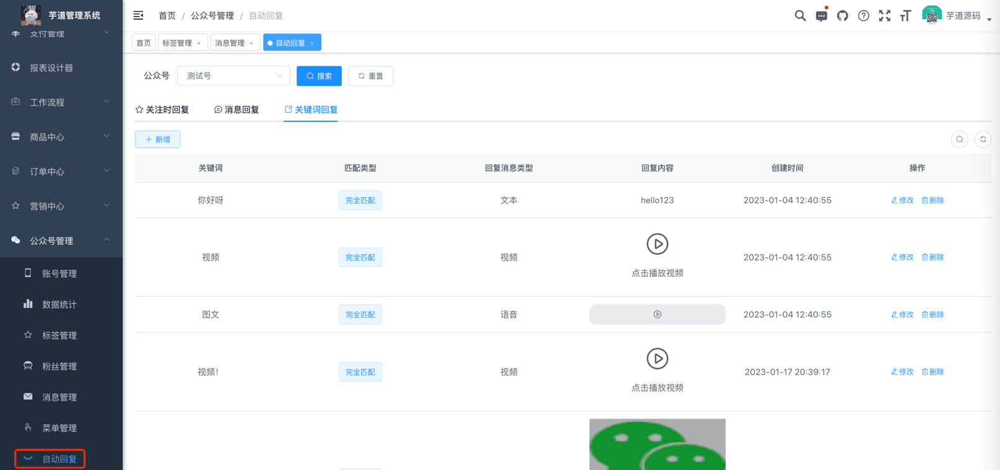
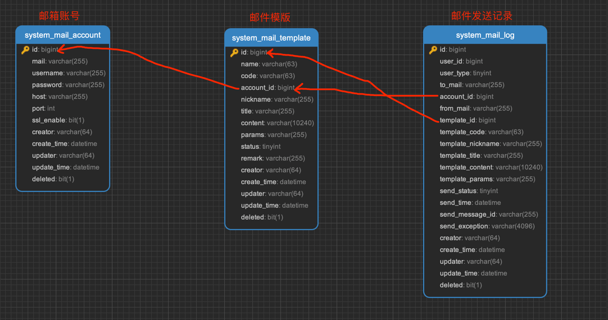
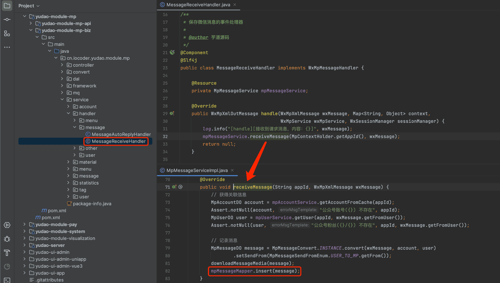
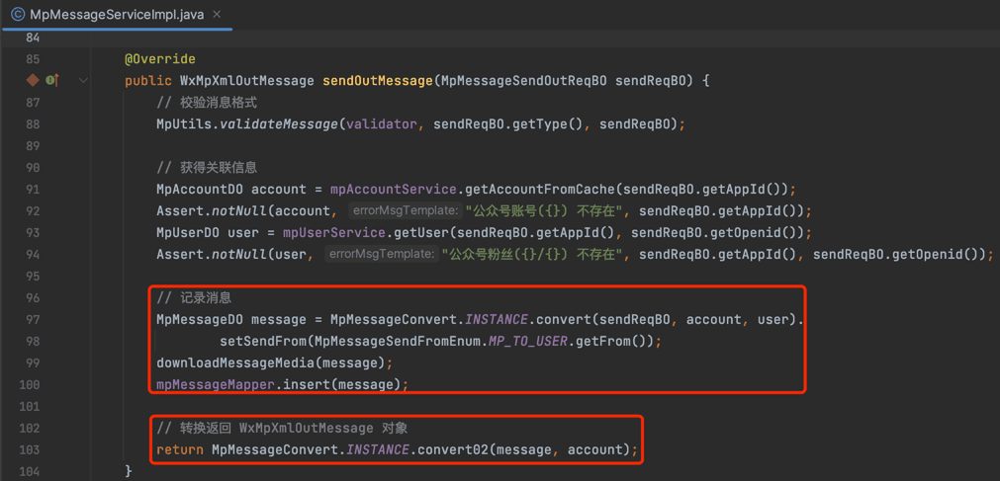
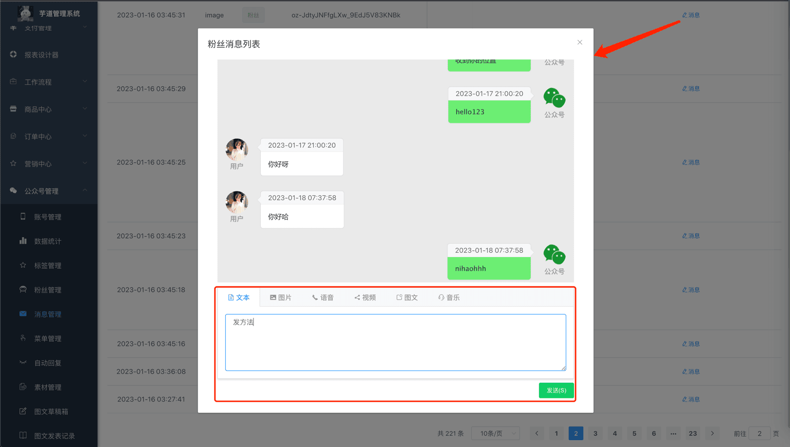
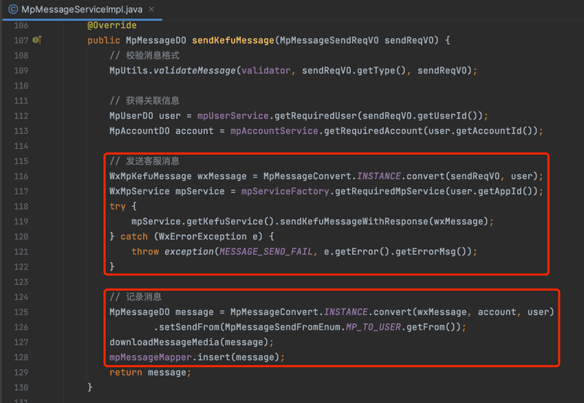

# 公众号消息

本章节，讲解公众号消息的相关内容，对应 [公众号管理 -> 消息管理] 菜单。如下图所示：
 
## # 1. 表结构
公众号消息对应 `mp_message` 表，结构如下图所示：
 ① `type` 字段：消息类型，包括文本、图片、语音、视频、小视频、图文、音乐、地理位置、链接、事件等类型，对应 `mp_message_type` 字典。
② `send_from` 字段：消息发送方，分成两类：
- 【接收】用户发送给公众号：[接收普通消息](https://developers.weixin.qq.com/doc/offiaccount/Message_Management/Receiving_standard_messages.html)、[接收事件推送](https://developers.weixin.qq.com/doc/offiaccount/Message_Management/Receiving_event_pushes.html)
- 【发送】公众号发给用户：[被动回复用户消息](https://developers.weixin.qq.com/doc/offiaccount/Message_Management/Passive_user_reply_message.html)、[客服消息](https://developers.weixin.qq.com/doc/offiaccount/Message_Management/Service_Center_messages.html)
## # 2. 消息管理界面
- 前端：[/@views/mp/message](https://github.com/yudaocode/yudao-ui-admin-vue2/blob/master/src/views/mp/message/index.vue)
- 后端：[MpMessageController](https://github.com/YunaiV/ruoyi-vue-pro/blob/master/yudao-module-mp/src/main/java/cn/iocoder/yudao/module/mp/controller/admin/message/MpMessageController.java)
## # 3.【接收】
### # 3.1 接收普通消息
对应 [《微信公众号官方文档 —— 接收普通消息》](https://developers.weixin.qq.com/doc/offiaccount/Message_Management/Receiving_standard_messages.html) 文档。
当用户向公众账号发消息时，会被 [MessageReceiveHandler](https://github.com/YunaiV/ruoyi-vue-pro/blob/master/yudao-module-mp/src/main/java/cn/iocoder/yudao/module/mp/service/handler/message/MessageReceiveHandler.java) 处理，记录到 `mp_message` 表，消息类型为文本、图片、语音、视频、小视频、地理位置、链接。如下图所示：
 
### # 3.2 接收事件消息
对应 [《微信公众号官方文档 —— 接收事件推送》](https://developers.weixin.qq.com/doc/offiaccount/Message_Management/Receiving_event_pushes.html) 文档。
在用户和公众号产交互的过程中，会被 [MessageReceiveHandler](https://github.com/YunaiV/ruoyi-vue-pro/blob/master/yudao-module-mp/src/main/java/cn/iocoder/yudao/module/mp/service/handler/message/MessageReceiveHandler.java) 处理，记录到 `mp_message` 表，消息类型仅为事件。
## # 4.【发送】
### # 4.1 被动回复用户消息
对应 [《微信公众号官方文档 —— 被动回复用户消息》](https://developers.weixin.qq.com/doc/offiaccount/Message_Management/Passive_user_reply_message.html) 文档。
在被动回复用户消息时，统一由 [MpMessageServiceImpl](https://github.com/YunaiV/ruoyi-vue-pro/blob/master/yudao-module-mp/src/main/java/cn/iocoder/yudao/module/mp/service/message/MpMessageServiceImpl.java#L85-L104) 的 `sendOutMessage` 方法来构建回复消息，也会记录到 `mp_message` 表，消息类型为文本、图片、语音、视频、音乐、图文。如下图所示：
图片纠错：最新版本不区分 yudao-module-mp-api 和 yudao-module-mp-biz 子模块，代码直接合并到 yudao-module-mp 模块的 src 目录下，更适合单体项目
 
### # 4.2 主动发送客服消息
对应 [《微信公众号官方文档 —— 客服消息》](https://developers.weixin.qq.com/doc/offiaccount/Message_Management/Service_Center_messages.html) 文档。
点击消息管理界面的【消息】按钮，可以主动发送客服消息给用户。如下图所示：
 主动发送客服消息，统一由 [MpMessageServiceImpl](https://github.com/YunaiV/ruoyi-vue-pro/blob/master/yudao-module-mp/src/main/java/cn/iocoder/yudao/module/mp/service/message/MpMessageServiceImpl.java#L106-L130) 的 `sendKefuMessage` 方法来构建客服消息，也会记录到 `mp_message` 表，消息类型为文本、图片、语音、视频、音乐、图文。如下图所示：
图片纠错：最新版本不区分 yudao-module-mp-api 和 yudao-module-mp-biz 子模块，代码直接合并到 yudao-module-mp 模块的 src 目录下，更适合单体项目
 
.pageB img{width:80px!important;}
.wwads-horizontal .wwads-text, .wwads-content .wwads-text{line-height:1;}
[公众号标签](/mp/tag/) [模版消息](/mp/message-template/) 
←
[公众号标签](/mp/tag/) [模版消息](/mp/message-template/)→
 
Theme by
[Vdoing](https://github.com/xugaoyi/vuepress-theme-vdoing) 
| Copyright © 2019-2026
芋道源码 | MIT License   
- 跟随系统
- 浅色模式
- 深色模式
- 阅读模式
× 
.windowRB{ padding: 0;}
.windowRB .wwads-img{margin-top: 10px;}
.windowRB .wwads-content{margin: 0 10px 10px 10px;}
.custom-html-window-rb .close-but{
display: none;
}