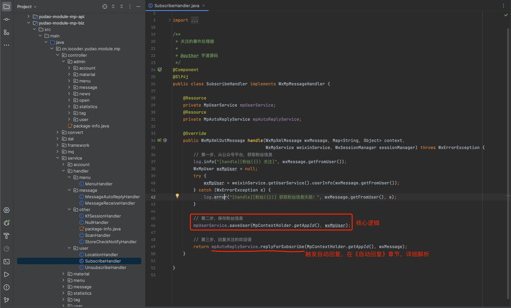
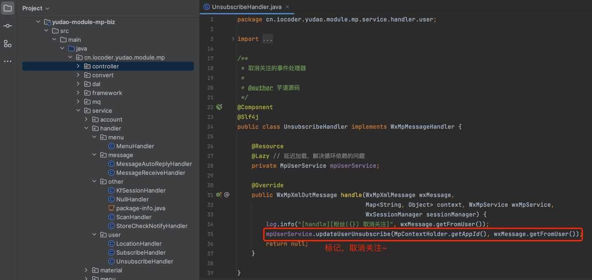

# 公众号粉丝

本章节，讲解公众号粉丝的相关内容，包括关注、取消关注等等，对应 [《微信公众号官方文档 —— 获取用户列表》 (opens new window)](https://developers.weixin.qq.com/doc/offiaccount/User_Management/Getting_a_User_List.html) 文档。
 
## # 1. 表结构
公众号粉丝对应 `mp_user` 表，结构如下图所示：
 注意，自 2021-12-27 开始，公众号接口不再返回头像和昵称，只能通过微信公众号的网页登录获取。因此，表中的 `avatar` 和 `nickname` 字段，往往是空的。
## # 2. 粉丝管理界面
- 前端：[/@views/mp/user (opens new window)](https://github.com/yudaocode/yudao-ui-admin-vue2/blob/master/src/views/mp/user/index.vue)
- 后端：[MpUserController (opens new window)](https://github.com/YunaiV/ruoyi-vue-pro/blob/master/yudao-module-mp/src/main/java/cn/iocoder/yudao/module/mp/controller/admin/user/MpUserController.java)
## # 3. 同步粉丝
点击粉丝管理界面的【同步】按钮，可以 **异步** 从公众号同步所有的粉丝信息，存储到 `mp_user` 表中。如果你的粉丝较多，可能需要等待一段时间。
对应后端的 [MpUserServiceImpl (opens new window)](https://github.com/YunaiV/ruoyi-vue-pro/blob/master/yudao-module-mp/src/main/java/cn/iocoder/yudao/module/mp/service/user/MpUserServiceImpl.java#L95-L161) 的 `syncUser` 方法。
## # 4. 关注 SubscribeHandler
用户关注公众号时，会触发 [SubscribeHandler (opens new window)](https://github.com/YunaiV/ruoyi-vue-pro/blob/master/yudao-module-mp/src/main/java/cn/iocoder/yudao/module/mp/service/handler/user/SubscribeHandler.java) 处理器，新增或修改 `mp_user` 粉丝信息。
图片纠错：最新版本不区分 yudao-module-mp-api 和 yudao-module-mp-biz 子模块，代码直接合并到 yudao-module-mp 模块的 src 目录下，更适合单体项目
 
## # 5. 取关 UnsubscribeHandler
用户取消关注公众号时，会触发 [UnsubscribeHandler (opens new window)](https://github.com/YunaiV/ruoyi-vue-pro/blob/master/yudao-module-mp/src/main/java/cn/iocoder/yudao/module/mp/service/handler/user/UnsubscribeHandler.java) 处理器，标记 `mp_user` 粉丝信息为取消关注，设置 `subscribe_status` 字段为 0。
图片纠错：最新版本不区分 yudao-module-mp-api 和 yudao-module-mp-biz 子模块，代码直接合并到 yudao-module-mp 模块的 src 目录下，更适合单体项目
 
.pageB img{width:80px!important;}
.wwads-horizontal .wwads-text, .wwads-content .wwads-text{line-height:1;}
[公众号接入](/mp/account/) [公众号标签](/mp/tag/) 
←
[公众号接入](/mp/account/) [公众号标签](/mp/tag/)→
 
Theme by
[Vdoing](https://github.com/xugaoyi/vuepress-theme-vdoing) 
| Copyright © 2019-2026
芋道源码 | MIT License   
- 跟随系统
- 浅色模式
- 深色模式
- 阅读模式
× 
.windowRB{ padding: 0;}
.windowRB .wwads-img{margin-top: 10px;}
.windowRB .wwads-content{margin: 0 10px 10px 10px;}
.custom-html-window-rb .close-but{
display: none;
}