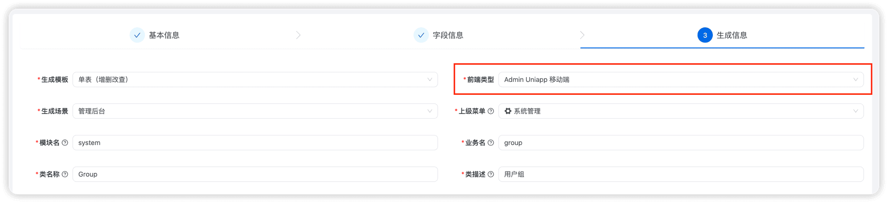
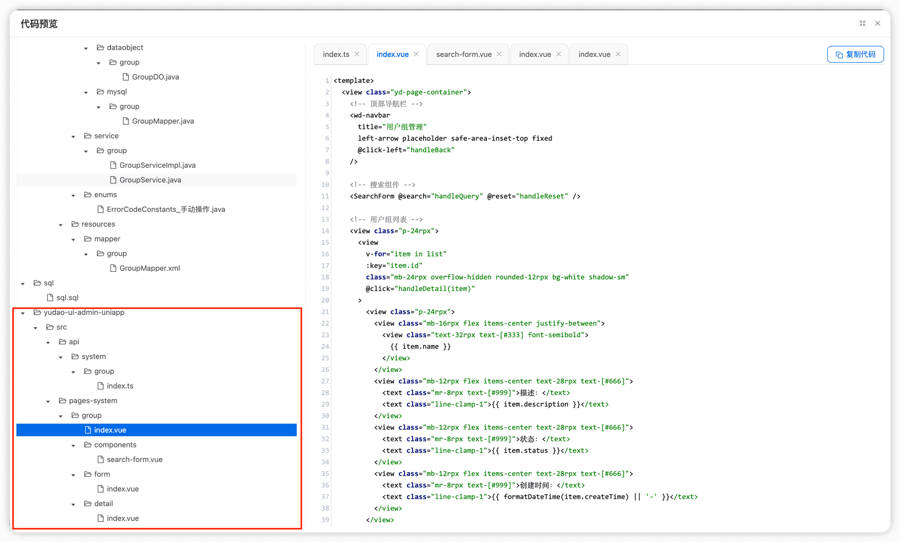
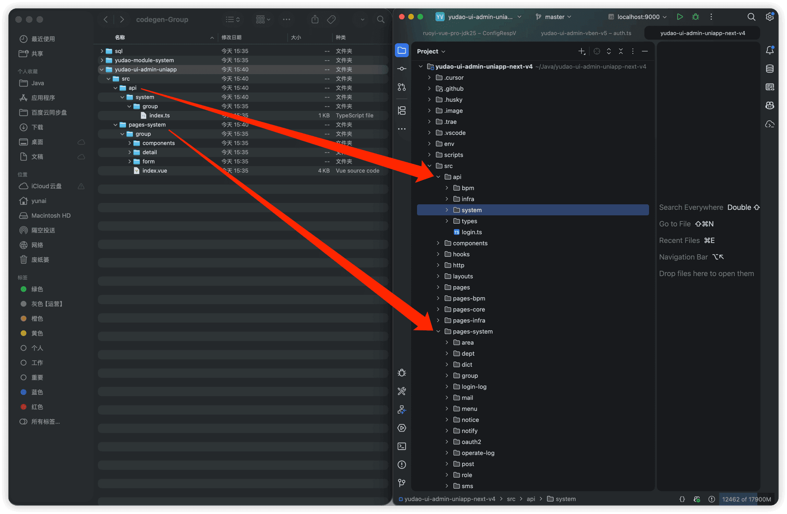
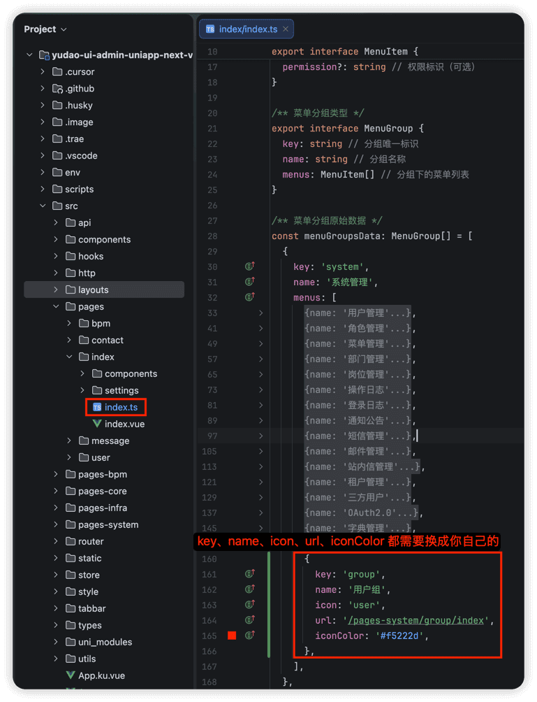

# 代码生成（移动端）

友情提示：
本文接 [《代码生成【单表】》](/new-feature/)，请务必先阅读。因为重复的内容，本文会不再赘述！
在 [《代码生成【单表】》](/new-feature/) 文章中，我们已经基于代码生成器，在 `yudao-module-system` 模块中，开发一个【**用户组**】的功能。
现在，我们将在 [yudao-ui-admin-uniapp](https://github.com/yudaocode/yudao-ui-admin-uniapp) 项目中，生成移动端的【用户组】功能。
## # 1. 数据库表结构设计（前文已操作）
设计用户组的数据库表名为 `system_group`，其建表语句如下：
CREATE TABLE `system_group` (
`id` bigint NOT NULL AUTO_INCREMENT COMMENT '编号',
`name` varchar(255) COLLATE utf8mb4_unicode_ci NOT NULL COMMENT '名字',
`description` varchar(512) COLLATE utf8mb4_unicode_ci DEFAULT NULL COMMENT '描述',
`status` tinyint NOT NULL COMMENT '状态',
`creator` varchar(64) CHARACTER SET utf8mb4 COLLATE utf8mb4_unicode_ci DEFAULT '' COMMENT '创建者',
`create_time` datetime NOT NULL DEFAULT CURRENT_TIMESTAMP COMMENT '创建时间',
`updater` varchar(64) CHARACTER SET utf8mb4 COLLATE utf8mb4_unicode_ci DEFAULT '' COMMENT '更新者',
`update_time` datetime NOT NULL DEFAULT CURRENT_TIMESTAMP ON UPDATE CURRENT_TIMESTAMP COMMENT '更新时间',
`deleted` bit(1) NOT NULL DEFAULT b'0' COMMENT '是否删除',
`tenant_id` bigint NOT NULL DEFAULT '0' COMMENT '租户编号',
PRIMARY KEY (`id`) USING BTREE
) ENGINE=InnoDB DEFAULT CHARSET=utf8mb4 COLLATE=utf8mb4_unicode_ci COMMENT='用户组';
## # 2. 代码生成
### # 2.1 导入表（前文已操作）
点击 [基础设施 -> 代码生成] 菜单，点击 [基于 DB 导入] 按钮，选择 `system_group` 表，后点击 [确认] 按钮。
### # 2.2 编辑配置
点击 `system_group` 所在行的 [编辑] 按钮，修改生成配置。后操作如下：
 
- 将【生成模版】设置为【Admin Uniapp 移动端】。🔥最最关键的步骤！
### # 2.3 预览代码
点击 `system_group` 所在行的 [预览] 按钮，在线预览生成的代码，检查是否符合预期。
 
### # 2.3 生成代码
点击 `system_group` 所在行的 [生成] 按钮，生成代码。
# # 3. 代码运行
① 和 [《代码生成【单表】》](/new-feature/) 的「3. 代码运行」一致，就不重复赘述。
 ② 参考 [《前端手册 Admin Uniapp —— 菜单路由》](/admin-uniapp/route) 文档，在 `src/pages/index/index.ts` 的 增加【用户组】菜单。代码如下：
       {
key: 'group',
name: '用户组',
icon: 'user',
url: '/pages-system/group/index',
iconColor: '#f5222d',
},
最终效果如下图：
列表 新增   
.pageB img{width:80px!important;}
.wwads-horizontal .wwads-text, .wwads-content .wwads-text{line-height:1;}
[代码生成（树表）](/new-feature/tree/) [功能权限](/resource-permission/) 
←
[代码生成（树表）](/new-feature/tree/) [功能权限](/resource-permission/)→
 
Theme by
[Vdoing](https://github.com/xugaoyi/vuepress-theme-vdoing) 
| Copyright © 2019-2026
芋道源码 | MIT License   
- 跟随系统
- 浅色模式
- 深色模式
- 阅读模式
× 
.windowRB{ padding: 0;}
.windowRB .wwads-img{margin-top: 10px;}
.windowRB .wwads-content{margin: 0 10px 10px 10px;}
.custom-html-window-rb .close-but{
display: none;
}